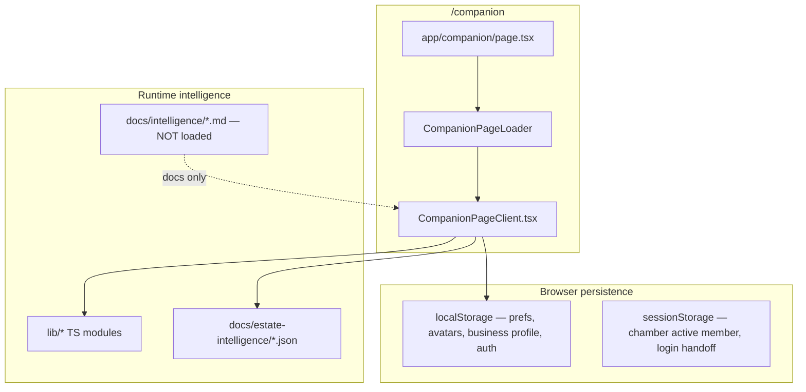
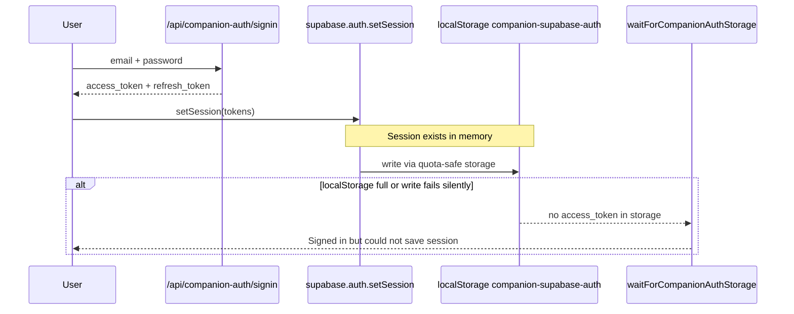

# 002 — Visible Spark Estate™ Companion Experience Implementation Audit

**Audit date:** 2026-07-11  
**Mode:** Read-only — no code, routes, prompts, components, or data were modified to produce this document.  
**Audited tree:** `c:\Users\Shari\spark-ecosystem-v4\companion-app`  
**Primary user route:** `/companion` (single-page shell; most features are internal `AppSection` / overlay state, not separate Next.js routes)

---

## Repository & deployment verification

| Check | Result |
|-------|--------|
| **Active repository (audit target)** | `c:\Users\Shari\spark-ecosystem-v4\companion-app` |
| **Git remote** | `https://github.com/ShariLHudson/adhd-business-companion-vs3.git` |
| **Active branch** | `deploy/companion-app-v3` |
| **Current local commit** | `17c6e8a` — *docs: ingest approved intelligence libraries under docs/intelligence* |
| **Current origin commit (`deploy/companion-app-v3`)** | `17c6e8a` (local and origin in sync; 0 ahead / 0 behind) |
| **Origin `main` commit** | `a8f12d2` — *Fix circular import breaking estate-collection prerender.* |
| **`9dc09da` on `origin/main`?** | **No** — `9dc09da` exists only on `deploy/companion-app-v3` (and descendants `c64230a`, `17c6e8a`) |
| **`9dc09da` on `origin/deploy/companion-app-v3`?** | **Yes** — third commit back from HEAD |
| **Production URL (per `VERCEL.md`)** | `https://ecosystem.visualsparkstudios.com` |
| **Production branch (per `VERCEL.md`)** | `main` on `adhd-business-companion-vs3` |
| **Is production running `9dc09da` or newer?** | **No, if Vercel follows `main`.** `origin/main` is `a8f12d2`, which predates `9dc09da`, Journal Gazebo fixes, intelligence ingest, and all deploy-branch work since that milestone. |
| **Current preview deployment commit (inferred)** | Vercel Preview builds from branch pushes; latest push on `deploy/companion-app-v3` is **`17c6e8a`**. Exact Preview SHA not verifiable here (no `gh`/Vercel CLI access). |
| **Current production deployment commit (inferred)** | **`a8f12d2` or last manual Production promote** — site serves Spark Studio Companions login at `/companion/login` (verified live), but that UI exists on `main` before `9dc09da`. Production is **not** running deploy-branch HEAD. |
| **Uncommitted user-facing changes locally** | **Yes** — session persistence recovery (login error #12): `CompanionAuthProvider.tsx`, `companionLoginTransition.ts`, `companionStorageRecovery.ts`, `companionClient.ts` (+ tests). Not committed; not on origin; not deployed. |
| **Other uncommitted / untracked** | `test.pdf` (modified), `.audit-data.json`, `.tmp-approved-upload/` (173 files), `public/audio/Welcome to the Spark Estates.m4a.bak` — not user-facing except audio backup. |

**Repo topology note:** The Cursor workspace folder `adhd-business-companion - vs3` points at a **different remote** (`adhd-business-companion-vs2`) and is **not** the active companion-app tree audited here. Production deploys from **`adhd-business-companion-vs3`** per `VERCEL.md`.

**Approved intelligence (`docs/intelligence/`) runtime rule:** **Zero** `.ts`/`.tsx` files import or load `docs/intelligence/*.md` at runtime. Ingested libraries are canonical for architecture and agents only until wired. Runtime intelligence today lives in `lib/*` TypeScript modules and JSON libraries under `docs/estate-intelligence/`.

---

## Cross-cutting architecture

| Layer | Role |
|-------|------|
| `CompanionPageClient.tsx` | ~20k-line orchestrator: sections, estate rooms, chat, auth gate, Welcome Home, Discovery Key host |
| `buildSparkCompanionHint.ts` | Chat hint stack (constitution hint **not** wired per gap analysis B1) |
| `docs/intelligence/` | 173 approved Markdown files (ingested at `17c6e8a`); **documentation only** at runtime |
| `localStorage` | All member data client-side; auth key `companion-supabase-auth` |

---

## 1. Shari greeting

| Field | Detail |
|-------|--------|
| **Current route** | `/companion` — `activeSection === "home"` and `welcomeHomePrimary === true` |
| **Current React component(s)** | `CompanionPageClient.tsx` → `WelcomeHomePage` (`WelcomeHomeFirstLaunch.tsx`) → `WelcomeHomeFrostedChatPanel.tsx` → greeting line. Alternate (mutually exclusive): `CompanionHomeCard.tsx` when `homeCalm` path active. |
| **Current data source** | `evaluateWelcomeHomeExperience()` → `resolveWelcomeHomeDailyGreeting()` / `resolveWelcomeHomeChatPrompt(evaluateArrivalIntelligence())`. Signals: `getPrefs()`, `getCompanionAuthIntelligence()`, `getHomeVisitCount()`, `getRecognitionStore()`, `getLastActivity()`. |
| **Current runtime prompt / instruction** | **Display:** static TS copy (not LLM). **On chat send:** `welcomeHomeConciergeHintForChat()` + `shariCompanionHintForChat()` via `estateConversationPipeline.ts` → `/api/companion-chat`. |
| **Current capability / action handler** | `handleSend()` in `CompanionPageClient.tsx`; `finishWelcomeHomeIntro()`, `returnToWelcomeHomeLobby()`, `requestWelcomeHomeReplay()` (Profile). |
| **Approved intelligence loaded?** | **No.** CONV-051, ADHD-003, FEI patterns exist in `docs/intelligence/` only. Runtime uses `lib/arrivalIntelligence/`, `lib/arrivalGreetingIntelligence/`, `lib/welcomeHome/`. |
| **Docs only?** | Partial — greeting **works**; CONV-051 first-launch conversation pattern and `sparkEstateWelcomeHomeHintForChat` are **unwired**. |
| **Older implementation still active?** | **Yes** — `CompanionHomeCard` / `homeCalm` path is an older home greeting UI; excluded when `welcomeHomePrimary` is true. |
| **Local but not deployed?** | Deploy-branch behavior matches local audited tree at `17c6e8a`. `origin/main` may lack latest Welcome Home refinements after `a8f12d2`. |
| **Files to change** | `app/companion/CompanionPageClient.tsx`, `components/companion/WelcomeHomeFrostedChatPanel.tsx`, `lib/welcomeHome/dailyGreeting.ts`, `lib/arrivalGreetingIntelligence/composeArrivalGreeting.ts`, `lib/welcomeHome/estateConcierge.ts`, `lib/estateIntelligence/estateConversationPipeline.ts` |
| **Dependencies** | Arrival intelligence graph, auth intelligence, recognition store, companion chat API |
| **Risks** | Two home modes (`welcomeHomePrimary` vs `homeCalm`) confuse QA; unwired `sparkEstateDailyCompanionExperience` duplicates greeting logic. |
| **Recommended order** | **Phase 2** — after login fix and daily three suggestions wiring (greeting improves once daily engine supplies context). |

---

## 2. Welcome Home experience

| Field | Detail |
|-------|--------|
| **Current route** | `/companion` — mode inside `welcomeHomePrimary`, not a separate URL |
| **Current React component(s)** | `WelcomeHomeFirstLaunch.tsx` (phases: `intro` → `pause` → `chat`), `WelcomeHomeIntroDevPanel.tsx`, `WelcomeHomeFrostedChatPanel.tsx`, `CompanionLoginBackground` on login only |
| **Current data source** | `hasSeenWelcomeIntro()` / `markWelcomeIntroSeen()` — `lib/welcomeHome/firstLaunchPersistence.ts` (`companion-welcome-home-first-launch-v1`). Audio: `WELCOME_HOME_AUDIO_PROFILE` in `lib/welcomeAudio/profiles.ts`. Cinematic: `lib/welcomeRoom/arrival.ts`. |
| **Current runtime prompt / instruction** | Pre-recorded founder welcome audio (not LLM). Post-intro chat uses concierge hint stack. Design script in `docs/WELCOME_HOME_FLOW.md` — **not loaded at runtime**. |
| **Current capability / action handler** | `finishWelcomeHomeIntro()` — **wired**. `completeWelcomeHomeFirstLaunch(choice)` — **defined but never called**. `WELCOME_HOME_INVITATIONS` (know / tour / surprise) — **exported, never rendered**. |
| **Approved intelligence loaded?** | **No.** CONV-051, ADHD-003 in `docs/intelligence/` only. |
| **Docs only?** | **Partial.** Cinematic intro + chat reveal = implemented. Three post-intro choice cards = **docs + dead code only**. |
| **Older implementation still active?** | `WelcomeRoomInvitation.tsx` exists but is **not mounted** anywhere. |
| **Local but not deployed?** | Same as §1 relative to `main` vs `deploy/companion-app-v3`. |
| **Files to change** | `WelcomeHomeFirstLaunch.tsx`, `CompanionPageClient.tsx` (call `completeWelcomeHomeFirstLaunch`), `lib/welcomeHome/content.ts`, `welcome-home-first-launch.css` |
| **Dependencies** | Welcome audio session, dolly/arrival hooks, prefs persistence |
| **Risks** | First-time users see cinematic but miss intended three-choice fork; auto-skip for `loginCount > 1` may skip intro unexpectedly. |
| **Recommended order** | **Phase 3** — wire `completeWelcomeHomeFirstLaunch()` + render `WELCOME_HOME_INVITATIONS` (gap B3). |

---

## 3. Daily three suggestions

| Field | Detail |
|-------|--------|
| **Current route** | **None rendered.** Intended home: `/companion` return visit. |
| **Current React component(s)** | **None** for CONV-013 three-bucket UI. Closest: free-text `HomeChatInputFooter` on Welcome Home. |
| **Current data source** | Engine scaffold: `lib/estate/sparkEstateDailyCompanionExperience.ts` (7 focus options, localStorage `spark-estate-daily-session-v1`) — **not imported by `CompanionPageClient`**. |
| **Current runtime prompt / instruction** | `sparkEstateDailyCompanionHint()` — **defined, never called**. `buildSparkCompanionHint.ts` has no daily-three block. |
| **Current capability / action handler** | `buildSparkEstateDailyCompanionReply()`, `parseSparkEstateDailyFocusChoice()` — lib-only, no UI handlers. |
| **Approved intelligence loaded?** | **No.** CONV-013, `090_DAILY_EXPERIENCE_STANDARD.md`, PHASE24 spec — all docs-only. |
| **Docs only?** | **Yes** for the three named suggestions (*Continue Your Momentum*, *Support Today*, *Grow Our Relationship*). |
| **Older implementation still active?** | `WELCOME_HOME_INVITATIONS` (different three choices) — also unwired. `welcomeHome/dailyGreeting.ts` — single rotating line only. |
| **Local but not deployed?** | Engine exists on deploy branch; never wired on any deployed branch. |
| **Files to change** | `CompanionPageClient.tsx`, new `DailyEngagementSuggestions.tsx` (or equivalent), `sparkEstateDailyCompanionExperience.ts`, `buildSparkCompanionHint.ts`, `lib/conversationIntelligence/orchestrator.ts` |
| **Dependencies** | Chamber memory, estate memory, member profile, onboarding first-7-days trim |
| **Risks** | Shipping without CONV-013 bucket mapping will feel generic; conflating with Welcome Home invitations confuses product language. |
| **Recommended order** | **Phase 4** — highest visible daily impact after login + Welcome Home choices (gap B2). |

---

## 4. Discovery Key™ icon

| Field | Detail |
|-------|--------|
| **Current route** | `/companion` — visible when `showDiscoveryKeyHost` (immersive estate room, not Welcome Home lobby) |
| **Current React component(s)** | `DiscoveryKeyHost.tsx` → `DiscoveryKey/DiscoveryKey.tsx` — mounted from `CompanionPageClient.tsx` ~L19658–19941 |
| **Current data source** | `docs/estate-intelligence/discovery-library.json`, `room-placement-library.json`, `discovery-prerequisites.json` via `lib/estateDiscovery/*`. Member context from estate memory visit counts. |
| **Current runtime prompt / instruction** | Selection engine only; no LLM at icon render. `companionResponse` from JSON injected on primary tap. |
| **Current capability / action handler** | `handleKeyClick`, `evaluateDiscoveryKeySession()`, `selectNextDiscovery()`, `onCompanionResponse`, `onNavigateSection` in `DiscoveryKeyHost.tsx` |
| **Approved intelligence loaded?** | **JSON libraries yes.** CONV-019 / constitution markdown — **no**. |
| **Docs only?** | **Partial.** Icon + placement logic implemented; **canonical image asset missing** (`/images/discovery-key.png` not in `public/`). `discoveryKeyDelayMs` in welcome experience plan — **no consumer** on Welcome Home. |
| **Older implementation still active?** | Conversation-only discovery via `resolveHelpDiscoveryQuery.ts` / semantic intent — parallel path without icon. |
| **Local but not deployed?** | Implemented on deploy branch; asset gap affects all environments. |
| **Files to change** | `public/images/discovery-key.png`, `DiscoveryKeyHost.tsx`, `CompanionPageClient.tsx`, `lib/estateImmersiveLayout.ts` (if key should appear on Welcome Home) |
| **Dependencies** | Discovery CMS repository, progressive discovery curriculum, estate immersive layout |
| **Risks** | Missing PNG breaks icon visibility; key hidden on Welcome Home per `isEstateImmersiveRoom()` when `welcomeHomePrimary`. |
| **Recommended order** | **Phase 5** — add asset first (quick win), then Welcome Home delayed reveal if spec requires. |

---

## 5. Discovery Key™ note or scroll interaction

| Field | Detail |
|-------|--------|
| **Current route** | `/companion` — modal overlay from Discovery Key click (immersive rooms) |
| **Current React component(s)** | `DiscoveryNote/DiscoveryNote.tsx`, `discovery-note.css`, `discoveryNotePresentation.ts` |
| **Current data source** | `toDiscoveryNoteData(selection)` from `discovery-library.json` fields |
| **Current runtime prompt / instruction** | Static JSON copy in note; `companionResponse` → chat on primary action |
| **Current capability / action handler** | Primary action, Save for Later, Close; 5-minute silent-ignore timer; unlock animation (`discovery-note-unfold`) |
| **Approved intelligence loaded?** | **JSON yes.** Markdown intelligence — **no**. |
| **Docs only?** | **No** — interaction implemented as CSS-scroll modal (not separate parchment component). |
| **Older implementation still active?** | Chat-only `formatDiscoveryNoteResponse()` in `discoveryLibraryBridge.ts` — alternate entry without icon. |
| **Local but not deployed?** | Same as §4. |
| **Files to change** | `DiscoveryNote.tsx`, `DiscoveryKeyHost.tsx` (only if UX spec differs from modal scroll) |
| **Dependencies** | Same as §4 |
| **Risks** | Low — works when icon is reachable; blocked when user never reaches immersive room. |
| **Recommended order** | **Phase 5** (bundled with §4). |

---

## 6. My Business Estate™ / profile experience

| Field | Detail |
|-------|--------|
| **Current route** | `/companion` — `AppSection: business-profile`; estate room `my-estate` via `?overlay=profile` or menu `my-profile` |
| **Current React component(s)** | **Form:** `BusinessProfilePanel.tsx` (7-step wizard). **Room shell:** `SparkEstateShell.tsx` / `ProfileEstateRoomExperience.tsx` (chat-only, no form). **Orphan:** `ProfilePanel.tsx` (**not imported**). |
| **Current data source** | `localStorage` `companion-business-profile-v1` (`companionStore.ts`). Parallel: `sparkEstateMemberProfileEngine.ts` (`spark-estate-member-profile-v1`) — **separate store, no UI**. |
| **Current runtime prompt / instruction** | No dedicated coach. `businessContextSummary()` → `/api/companion-chat`. Workspace header: *"What should we capture about your business?"* |
| **Current capability / action handler** | `BusinessProfilePanel` persist/next/skip; `openProfileEstateRoomFromMenu()`; `onOpenAvatars` prop on panel — **never passed** from `CompanionPageClient`. |
| **Approved intelligence loaded?** | **No.** CONV-038 in `docs/intelligence/` only. Registry: `estateIntelligence/registrations/planned.ts` — `status: "planned"`. |
| **Docs only?** | **Partial.** Wizard + context injection = implemented. CONV-038 conversation-first multi-session builder = **docs only**. Trademark **My Business Estate™** appears **nowhere in UI** (shows "Business Profile" / "My Estate"). |
| **Older implementation still active?** | `ProfilePanel.tsx` hub — dead. `my-estate` room is immersive chat, not profile editor. |
| **Local but not deployed?** | On deploy branch; `ProfilePanel` orphan on all branches. |
| **Files to change** | `BusinessProfilePanel.tsx`, `CompanionPageClient.tsx`, `ProfilePanel.tsx` (wire or remove), `companionStore.ts`, `sparkEstateMemberProfileEngine.ts` (unify), `workspaceMode.ts` (trademark labels) |
| **Dependencies** | Chat API context, voice fields, phase1 onboarding |
| **Risks** | Two profile stores diverge; users edit business profile in wizard but "My Estate" room shows only chat. |
| **Recommended order** | **Phase 7** — after daily experience and People I Help polish. |

---

## 7. People I Help™

| Field | Detail |
|-------|--------|
| **Current route** | `/companion` — `AppSection: client-avatars` (split workspace beside chat). No `?section=client-avatars` URL handler in `CompanionUrlNavigation.tsx`. |
| **Current React component(s)** | `IdealClientBuilder.tsx`, `AudienceDropdownField.tsx`, `WorkspaceAreaWorksGuide` |
| **Current data source** | `localStorage` `companion-ideal-clients-v1`; active avatar in prefs. **Client-only, no Supabase sync.** |
| **Current runtime prompt / instruction** | `clientAvatarCoach.ts` (split coach), `builderKickoff.ts`, `workspaceChatPurity.ts` opener. AI expand: `/api/avatar-research` (gpt-4o-mini). |
| **Current capability / action handler** | `startClientAvatarBuilderKickoff()`, `processClientAvatarCoachTurn()`, save/setPrimary/delete/duplicate avatar, continuity resume, Create handoff. Completion menu items 3–4 — **text only, no routing**. |
| **Approved intelligence loaded?** | **No.** CONV-039 in `docs/intelligence/` only. Capability registry: `client_avatar` — `partial`. |
| **Docs only?** | **Partial.** Builder + coach + API = **substantially implemented**. ™ naming and CONV-039 "explain how profiles improve marketing/Chamber/writing" = **not systematically injected**. |
| **Older implementation still active?** | Business profile step 4 points to avatars but `onOpenAvatars` unwired. |
| **Local but not deployed?** | On deploy branch. |
| **Files to change** | `IdealClientBuilder.tsx`, `clientAvatarCoach.ts`, `CompanionPageClient.tsx`, `workspaceMode.ts`, `companionCapabilityRegistry.ts`, `estateIntelligence/registrations/planned.ts` |
| **Dependencies** | Avatar research API, business context summary, continuity manifest, cross-workspace handoff |
| **Risks** | Low relative to other gaps — most complete builder in the audit. |
| **Recommended order** | **Phase 6** — wire completion actions + trademark rename (visible polish). |

---

## 8. Chamber Member entry points and routing

| Field | Detail |
|-------|--------|
| **Current route** | `/companion` — sections `chamber-of-momentum`, `chamber-project-entry`. Deep link intent: `/companion?section=chamber-of-momentum` — **not in `GROW_SECTION_IDS`** (`CompanionUrlNavigation.tsx`). |
| **Current React component(s)** | `ChamberOfMomentumRoomPanel.tsx`, `ChamberMemberGallery.tsx`, `ChamberActiveMemberCard.tsx`, `ChamberMemberConversationBar.tsx`, `ChamberProjectEntryPanel.tsx`, etc. |
| **Current data source** | `chamberMemberRegistry.ts` (24 static members). Active member: `sessionStorage` `spark-chamber-active-member-v1`. Journey: `chamberMemberJourney.ts`, `chamberOfMomentumMemory.ts`. |
| **Current runtime prompt / instruction** | `chamberMemberHintForChat()` when member active. Activation opener from registry. |
| **Current capability / action handler** | `openChamberOfMomentumCore()`, `inviteChamberMemberCore()`, `routeChamberSectionCore()`, `routeChamberMomentumIntentCore()` in `CompanionPageClient.tsx`. |
| **Approved intelligence loaded?** | **No.** CHAM-000–002, CONV-016 in `docs/intelligence/` only. Runtime uses `lib/chamber/*`. |
| **Docs only?** | **Partial.** Gallery + activation + chat persona = implemented. CONV-016 Shari→member handoff UX = partial. URL deep link = **broken gap**. |
| **Older implementation still active?** | Legacy sidebar nav entries may still reference chamber paths alongside estate menu. |
| **Local but not deployed?** | Chamber gallery work largely in `9dc09da` — **not on `origin/main`**. |
| **Files to change** | `CompanionUrlNavigation.tsx`, `CompanionPageClient.tsx`, `chamberMemberRegistry.ts`, `chamberOfMomentumRouting.ts` |
| **Dependencies** | Estate navigation, frictionless action layer, spark feature registry |
| **Risks** | Spark Note links to chamber section fail on cold load; production on `main` may lack latest chamber UI entirely. |
| **Recommended order** | **Phase 8** — fix URL handler first (one-line set add + test). |

---

## 9. Boardroom invitation and entry flow

| Field | Detail |
|-------|--------|
| **Current route** | No `/boardroom`. Alias `round-table` / `boardroom` → `AppSection: projects` via `lib/estate/directory/shell.ts`. |
| **Current React component(s)** | Generic `EstateRoomInvitationPanel.tsx` — **no Boardroom-specific panel**. `handleEstateRoomInvitationSelect()` in `CompanionPageClient.tsx`. |
| **Current data source** | `canonicalEstatePlaces.ts` (`round-table`, `arrivalBehavior: "object-invitation"`). **No** `round-table` entry in `estateRoomInvitationCatalog.ts`. |
| **Current runtime prompt / instruction** | Generic estate memory hints; no BOARD-specific prompt module. |
| **Current capability / action handler** | `runDirectEstateRoomNavigation()`, `frictionlessAction.immediateEstatePlaceNavigate`, menu `goals-projects` → `projects`. |
| **Approved intelligence loaded?** | **No.** BOARD-000 in `docs/intelligence/` only. |
| **Docs only?** | **Mostly yes.** BOARD-000 defines event-based "convene the board" — **not implemented**. Navigation alias to `projects` is a **degraded stub**. |
| **Older implementation still active?** | `projects` workspace is generic goals/projects — not advisory board UX. |
| **Local but not deployed?** | N/A — feature not built. |
| **Files to change** | `estateRoomInvitationCatalog.ts`, new Boardroom panel/component, `canonicalEstatePlaces.ts`, `frictionlessActionLayer.ts`, `estateArrivalExperience.ts` |
| **Dependencies** | Estate invitation system, multi-perspective coaching registry |
| **Risks** | Users saying "boardroom" land in generic projects — mismatched expectation. |
| **Recommended order** | **Phase 10** — after core daily loop and chamber routing stable. |

---

## 10. Return / Soft Landing™ experience

| Field | Detail |
|-------|--------|
| **Current route** | No dedicated route. Return UX on `/companion` home, resume cards, in-conversation restoration. |
| **Current React component(s)** | `IdentityBar.tsx` (`welcomeBack`), `FromYesterdayFocusCard`, `TodayPanel.tsx`, `JournalGazeboReturnNoteCard.tsx`, `ArrivalLivingRoomExperience` |
| **Current data source** | `homeResumeItem.ts`, `continuityManifest.ts`, `returnExperience.ts`, `estateRestoration/engine.ts`, `evaluateWelcomeHomeExperience.ts` |
| **Current runtime prompt / instruction** | `journeyReturnHintForChat()`, `estateMemoryHintForChat()`, restoration hints in `frictionlessActionLayer.ts`. `sparkEstateWelcomeHome/principles.ts` forbids guilt/streak copy. |
| **Current capability / action handler** | `resumeHomeItem()`, `handleCompanionContinueOption()`, `evaluateRestorationOpportunity()`, `resumeReceiptForContinuityType()` |
| **Approved intelligence loaded?** | **No.** ADHD-027 (Return Plan™), CONV-029 in `docs/intelligence/` only. |
| **Docs only?** | **Partial.** Welcome-back + resume-one-item + restoration = implemented. **Soft Landing™** and **Return Plan™** as named products = **docs only** (zero code references except sample data string). |
| **Older implementation still active?** | Multiple parallel return signals (continuity manifest, journey return, restoration engine) — not unified under one product name. |
| **Local but not deployed?** | Partial features on deploy branch; Return Plan not built anywhere. |
| **Files to change** | `returnExperience.ts`, `continuityRecovery.ts`, `CompanionPageClient.tsx`, new Return Plan module |
| **Dependencies** | Welcome home evaluation, estate memory, recovery intelligence types |
| **Risks** | Fragmented return UX; users may not see coherent "soft landing" despite underlying pieces. |
| **Recommended order** | **Phase 9** — unify under CONV-013 return visit + ADHD-027 triad after daily suggestions ship. |

---

## 11. My Rhythms™ visibility in the daily experience

| Field | Detail |
|-------|--------|
| **Current route** | **None.** No `AppSection` or `/my-rhythms`. |
| **Current React component(s)** | **None branded My Rhythms.** Substitutes: `RemindersPanel.tsx`, `PlanDaySuggestionsReminder.tsx`, `TodayPanel.tsx`, `plan-my-day` section. |
| **Current data source** | `reminderStore.ts` (`companion-reminder-intake-v1`). Invisible model: `companionAdaptiveUserEngine.ts`. |
| **Current runtime prompt / instruction** | CONV-040, ADHD-017 in `docs/intelligence/` only. `companionPrompt.ts` mentions adaptive rhythms abstractly. |
| **Current capability / action handler** | `openPlanMyDayCore()`, reminder CRUD, frictionless route to `plan-my-day`. |
| **Approved intelligence loaded?** | **No.** |
| **Docs only?** | **Yes** for My Rhythms™ as a branded daily surface. Reminders/plan-my-day are partial substitutes. |
| **Older implementation still active?** | Plan My Day and reminders predate Rhythms product spec. |
| **Local but not deployed?** | N/A — not built. |
| **Files to change** | New `myRhythms` module + panel, `companionUi.ts`, `CompanionPageClient.tsx`, `TodayPanel.tsx` or home integration |
| **Dependencies** | `planMyDay/*`, `reminderIntelligence.ts`, `companionAdaptiveUserEngine.ts` |
| **Risks** | Building rhythms as renamed reminders without ADHD-017 flexible-window semantics will miss spec. |
| **Recommended order** | **Phase 11** — after daily three suggestions and return flow. |

---

## 12. Login / session persistence error

| Field | Detail |
|-------|--------|
| **Current route** | `/companion/login` → `app/companion/login/page.tsx` → `CompanionSignInExperience.tsx` |
| **Current React component(s)** | `CompanionSignInForm.tsx`, `CompanionAuthProvider.tsx`, `CompanionSignInExperience.tsx`, `CompanionAuthGate.tsx` |
| **Current data source** | Server: `/api/companion-auth/signin` (Supabase `signInWithPassword`). Client: `supabase.auth.setSession()` → `localStorage` key `companion-supabase-auth` via `createQuotaSafeStorage()`. |
| **Current runtime prompt / instruction** | Error string (origin): `CompanionAuthProvider.tsx` L178–183, L192–197: *"Signed in, but this browser could not save your session. Free some storage or try another browser."* Redirect guard: `CompanionSignInExperience.tsx` L62–64: *"Almost there — your browser did not save the session…"* |
| **Current capability / action handler** | `signInDirect()` → `waitForCompanionAuthStorage(5000)` in `companionLoginTransition.ts`. Recovery: `prepareStorageForAuthSession()`, `reclaimAggressiveCompanionStorage()`, `retryPersistInMemorySession()`. |
| **Approved intelligence loaded?** | N/A |
| **Docs only?** | N/A — fully implemented detection; recovery **improved locally, uncommitted**. |
| **Older implementation still active?** | **Deployed code** uses stricter localStorage-only wait (fails when quota exceeded). **Local uncommitted fix** adds preemptive reclaim + in-memory retry + aggressive trim. |
| **Local but not deployed?** | **Yes** — session fix is the primary uncommitted user-facing change. |
| **Files to change** | `CompanionAuthProvider.tsx`, `companionLoginTransition.ts`, `companionStorageRecovery.ts`, `companionClient.ts`, `CompanionSignInExperience.tsx` |
| **Dependencies** | Supabase browser client, companion localStorage volume (conversation, intelligence caches, estate analytics) |
| **Risks** | Until fix is committed and deployed, users with full `localStorage` cannot enter despite valid credentials. Hard navigation `window.location.replace("/companion")` **requires** persisted session. |

### Why the browser reports this error

**Root cause:** Supabase authentication **succeeds** (server returns tokens; `setSession` populates in-memory session). The app then **blocks progress** until `localStorage` key `companion-supabase-auth` contains a verifiable `access_token` within 5 seconds. If the browser quota is exhausted, private mode restricts storage, or `safeLocalStorageSet` fails silently, the user sees this error even though credentials were valid.

**Contributing factors in this codebase:**
1. Large companion `localStorage` footprint (conversation history, momentum, intelligence caches, estate analytics, brain dumps).
2. `createQuotaSafeStorage` swallows `QuotaExceededError` to protect the React tree — failure is silent until the wait times out.
3. Post-login navigation uses `window.location.replace("/companion")` — a full reload that **requires** persisted session.

**Local uncommitted fix (not yet on origin):** preemptive `prepareStorageForAuthSession()` before `setSession`, auth-priority writes, `retryPersistInMemorySession()`, expanded trimmable keys, aggressive reclaim for auth key only.

---

## Recommended implementation order (full sequence)

| Phase | Item | Rationale |
|-------|------|-----------|
| **0** | Commit + deploy session persistence fix (#12) | **Blocks all other experiences** — user cannot reach home |
| **1** | Promote `deploy/companion-app-v3` → Production (or merge to `main`) | Production on `a8f12d2` lacks `9dc09da` Journal Gazebo, chamber gallery, scenes, soundscapes |
| **2** | Wire CONV-013 daily three suggestions (#3) | Largest visible daily gap; unlocks return visit feel |
| **3** | Wire Welcome Home three choices (#2) — `completeWelcomeHomeFirstLaunch` + `WELCOME_HOME_INVITATIONS` | First-launch fork documented but dead |
| **4** | Add `discovery-key.png` + optional Welcome Home delayed reveal (#4–5) | Quick visual win in estate rooms |
| **5** | Fix chamber URL deep link (#8) | One-set change, unblocks Spark Note links |
| **6** | People I Help completion routing + ™ labels (#7) | Highest-completion builder; polish pass |
| **7** | My Business Estate coach + wire `ProfilePanel` (#6) | Unify profile entry; CONV-038 |
| **8** | Unify Return / Soft Landing under CONV-013 return + ADHD-027 (#10) | Coherent re-entry narrative |
| **9** | Constitution + daily hint wiring (gap B1) | Governance on every chat turn |
| **10** | Boardroom event flow per BOARD-000 (#9) | New surface; depends on stable estate navigation |
| **11** | My Rhythms™ surface (#11) | New module; depends on daily rhythm from #3 |

---

## Summary sections (required)

### 1. What is documented only

- **CONV-013** daily three suggestions (*Continue Your Momentum*, *Support Today*, *Grow Our Relationship*)
- **Welcome Home three invitations** (`WELCOME_HOME_INVITATIONS`) — defined in code but never rendered; function `completeWelcomeHomeFirstLaunch()` never called
- **Soft Landing™** and **Return Plan™** (ADHD-027) as named product flows
- **My Rhythms™** as a branded daily surface (CONV-040, ADHD-017)
- **My Business Estate™** / **People I Help™** trademarks and CONV-038/039 conversation-first patterns (partial code exists under legacy names)
- **BOARD-000** advisory board "convene the board" event flow
- **All 173 `docs/intelligence/*.md` files** — ingested at `17c6e8a`, not loaded at runtime
- **`sparkEstateWelcomeHomeHintForChat`**, **`sparkEstateDailyCompanionHint`** — defined, not wired
- **`WelcomeRoomInvitation`** component — built, not mounted
- **`ProfilePanel`** — built, not imported

### 2. What is partially implemented

- **Shari greeting** — static + arrival intelligence works; daily companion and constitution hints not wired
- **Welcome Home** — cinematic intro works; post-intro choice fork missing
- **Discovery Key** — engine + note modal work in immersive rooms; asset missing; hidden on Welcome Home
- **My Business Estate** — wizard + context injection; no coach; room shell is chat-only; orphan `ProfilePanel`
- **People I Help** — builder + coach + API; completion actions and ™ naming incomplete
- **Chamber Members** — gallery + activation + chat persona; URL deep link broken; CONV-016 handoff partial
- **Boardroom** — alias routes to generic `projects`; no invitation catalog or board event
- **Return experience** — resume cards, restoration, journey hints exist; not unified as Soft Landing™
- **Login** — auth works server-side; storage persistence fails under quota (fix local, uncommitted)

### 3. What is implemented but not routed

- `completeWelcomeHomeFirstLaunch()` and `WELCOME_HOME_INVITATIONS`
- `ProfilePanel.tsx` (hub to business profile + avatars)
- `WelcomeRoomInvitation.tsx`
- `sparkEstateDailyCompanionExperience` engine (no UI import)
- Chamber deep link `?section=chamber-of-momentum` (not in `GROW_SECTION_IDS`)
- `BusinessProfilePanel.onOpenAvatars` handler (prop never passed)

### 4. What is implemented but not deployed

- **`9dc09da` and newer** (Journal Gazebo, estate rooms, Cartographer Studio, scenes, soundscapes, recognition scaffolding) — on `deploy/companion-app-v3`, **not on `origin/main`**
- **`c64230a`, `17c6e8a`** — audit docs and intelligence ingest — deploy branch only
- **Session persistence recovery** — local uncommitted changes only
- **Chamber gallery refinements** from `9dc09da` — absent from production if `main` is deployed

### 5. What is broken

| Issue | Severity |
|-------|----------|
| **Login session persistence** under localStorage quota | **Critical** — blocks entry (user-reported) |
| **Production branch lag** — `main` at `a8f12d2` vs deploy at `17c6e8a` | **High** — production missing weeks of deploy work |
| **Discovery Key image** `/images/discovery-key.png` missing | **Medium** — icon may not render |
| **Chamber URL deep link** | **Medium** — cold-load links fail |
| **Boardroom** routes to generic projects | **Medium** — expectation mismatch |
| **Two home greeting modes** (`welcomeHomePrimary` vs `homeCalm`) | **Low** — QA confusion |

### 6. Smallest build sequence that will make the app visibly feel different

1. **Ship login storage fix** (commit + deploy) — user can actually enter.
2. **Merge or promote `deploy/companion-app-v3` to production** — Journal Gazebo, chamber gallery, estate room visuals go live.
3. **Render three daily suggestion chips on Welcome Home return** — wire `sparkEstateDailyCompanionExperience` to CONV-013 buckets (even with static labels first).
4. **Render Welcome Home three invitation cards** after first cinematic — wire existing `WELCOME_HOME_INVITATIONS` + `completeWelcomeHomeFirstLaunch`.
5. **Add `public/images/discovery-key.png`** — Discovery Key becomes visible in estate rooms.

These five steps require no new product invention — they activate code and assets that already exist or are one wiring pass away.

---

**Stop for review.** No repository files were modified to create this audit except this document.
