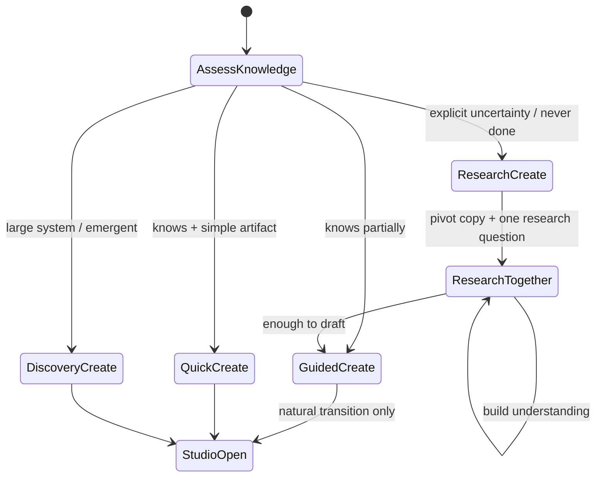

# Adaptive Creation Intelligence

**Date:** 2026-07-05  
**Status:** **Binding architecture** — no implementation until reviewed  
**Foundational principle:** **THE RELATIONSHIP OWNS THE WORK.**

**New creation principle:** Spark should **never make the member feel inadequate** because they do not know something. Spark is not only documenting knowledge — Spark **helps create knowledge**.

**Parent stack:** [SPARK_CONVERSATION_INTELLIGENCE_ARCHITECTURE.md](./SPARK_CONVERSATION_INTELLIGENCE_ARCHITECTURE.md) · Layer 6b — within Creation Guidance  
**Sibling:** [CREATION_GUIDANCE_INTELLIGENCE.md](./CREATION_GUIDANCE_INTELLIGENCE.md) · [ESTATE_CREATION_EXPERIENCE.md](./ESTATE_CREATION_EXPERIENCE.md) · [estate/UNIVERSAL_CREATION_FRAMEWORK.md](./estate/UNIVERSAL_CREATION_FRAMEWORK.md)

Research Create is a **sub-step** of Creation Guidance (`research_create`) — not a separate intake system.

---

## Executive summary

**Root cause:** Creation Intelligence assumes the member **already possesses** the process, steps, or expertise being documented. When the member says *"I don't know,"* Spark often **continues the same interview** — asking for steps, stages, or structure the member has explicitly said they cannot provide.

This is **not an SOP bug.** It is a **mode-selection failure** across Creating Together.

**Fix:** Introduce **Research Create** as a fourth creation pattern. When uncertainty is detected, Spark **immediately reconsiders interview strategy**, pivots to research partnership, and **does not open a Studio** until enough understanding exists to draft meaningfully.

---

## Four creation patterns (binding)

| Pattern | When | Member experience | Studio timing |
|---------|------|-------------------|---------------|
| **Quick Create** | Member knows what they want; short artifact | Few questions → draft | Early, when slots filled |
| **Guided Create** | Member has partial knowledge; needs structure | 3–5 questions → build together | When enough context for scaffold |
| **Discovery Create** | Large system; outcome emerges over time | Long arc; confidence-driven | When draft **structure** exists |
| **Research Create** | Member **does not know** the process yet | Learn together → then build | **After** research phase — never first |

Member-facing name for all four: **Creating Together.**  
Pattern names are **internal only** — never shown as modes or menus.



---

## 1. When Research Create activates

Research Create activates when **any** of the following is true:

### 1.1 Explicit uncertainty (member turn)

Member says they **cannot answer** the current question class — especially questions about **steps, process, structure, or expertise they lack**.

### 1.2 Implicit uncertainty (signals)

- First message combines create intent with learning language (*"create an SOP but I've never done email automations"*)
- Answer to a **knowledge-seeking** slot is empty, deflecting, or help-seeking
- Repeated *"I don't know"* on the **same slot** after uncertainty menu
- Member asks Spark to teach, research, or figure it out **during** a create interview

### 1.3 Question-class rule (internal)

Before asking any discovery question, Creation Intelligence asks:

> **Does the member know the answer to this?**

| Question class | Examples | If member lacks knowledge |
|----------------|----------|---------------------------|
| **Context** | Who is this for? What platform? | Still ask — member usually knows |
| **Goal** | What is this about? What outcome? | Ask — rephrase simply |
| **Process / steps** | What steps? First step? Stages? | **Research Create** — do not ask |
| **Expertise** | How does X work? Best practice? | **Research Create** |
| **Structure** | Modules, funnel stages, workflow | **Research Create** unless member already outlined |

### 1.4 Mode switch is immediate

On activation, Spark **does not** continue the current interview queue. It:

1. Acknowledges the pivot warmly  
2. Names the shift (*learn together first, then document*)  
3. Asks **one** research-oriented question  
4. Sets session `creationPattern: "research_create"` (proposed)

---

## 2. Detection phrases

### 2.1 Primary triggers (high confidence)

```
I don't know
I don't know because
I've never done this
I've never created one
I'm not sure
I'm not sure how
I need help figuring it out
I don't know the steps
I don't know how to do it
Can you teach me?
I need to learn it first
I don't know where to start
I need you to help me figure this out
Help me understand how
What even is
I've never set this up
I wouldn't know where to begin
```

### 2.2 Secondary triggers (combine with create context)

```
never done · not sure what to include · don't have a process yet
need to research · figure out together · you tell me
what would you recommend · how does this usually work
I don't know the platform · haven't figured out the workflow
```

### 2.3 Regex baseline (implementation — extend, do not rely on alone)

Current partial coverage: `UNCERTAINTY_RE` in `lib/universalCreation/orchestrator.ts`  
Current partial coverage: `isHelpSeekingAnswer()` in `lib/builderContentSync.ts`  
Current partial coverage: `KNOWLEDGE_RE` in `lib/sparkCompanion/sparkDecisionEngine/friction.ts`

**Binding rule:** Detection must run **before** the next discovery question is chosen — in Creation Intelligence layer, not only in one adapter.

### 2.4 Anti-patterns (do NOT treat as uncertainty)

- *"I don't know yet — ask me tomorrow"* → pause, not research mode  
- *"I'm not sure which **option** you meant"* → pending choice repair  
- *"Not sure if this is good enough"* → review / permission, not research  

---

## 3. How Spark changes behavior

### 3.1 Immediate pivot copy (Shari test)

**Bad (current failure):**

> What steps should be included?

**Good:**

> Perfect — that changes how we'll approach this.  
> Instead of documenting an existing process, let's learn it together first.  
> Once we understand the workflow, I'll build the SOP as we go so you won't have to rewrite anything later.

Then **one** research question — e.g. *"What email platform are you using?"* — not *"What steps should we include?"*

### 3.2 Internal behavior changes

| Normal create interview | Research Create |
|-------------------------|-----------------|
| Fill discovery slots from member answers | Fill **understanding** from research + dialogue |
| Advance `questionIndex` linearly | Advance **research phase** state machine |
| Open Studio when confidence threshold met | Open Studio only after `researchComplete` gate |
| Uncertainty menu → same queue resumes | Uncertainty → **mode switch**, skip process questions |
| Ask for steps / stages / modules | **Spark proposes** draft structure from research |
| `suppressRelationship: true` on all UC turns | Relationship voice **on** during research |

### 3.3 Spark's internal monologue (every creation turn)

```
1. What artifact are we creating?
2. Does the member KNOW the content needed — or need partnership?
3. If partnership → Research Create (now)
4. If documenting → which pattern (Quick / Guided / Discovery)?
5. Is the NEXT question answerable by this member?
6. If NO → do not ask it — research or rephrase
```

### 3.4 Relationship principle

> *"That's perfectly okay. We'll figure it out together."*

Never: repeat the same question · imply they should already know · open Studio to force structure · stack numbered menus without pivot copy.

---

## 4. Question strategy

### 4.1 Research Create question types (allowed)

| Type | Purpose | Example |
|------|---------|---------|
| **Anchor** | Something member likely knows | Platform, tool, audience, goal |
| **Constraint** | Boundaries | Budget, time, team size |
| **Starting point** | Where they are today | *"Have you sent any automations manually yet?"* |
| **Research offer** | Permission to investigate | *"Want me to look up how others set this up on Mailchimp?"* |
| **Teach-back** | Confirm understanding | *"So far I've got X → Y — does that match your world?"* |

### 4.2 Forbidden during Research Create

- What steps should be included?  
- What is the first step? / What happens next?  
- List the stages / modules / phases (until research produces a draft)  
- Any question the member **already said they cannot answer**

### 4.3 One question per turn (Spec 106)

Unchanged. Research Create is **not** a license for essays or multi-part interviews.

### 4.4 Slot model extension (proposed)

```typescript
type CreationPattern =
  | "quick_create"
  | "guided_create"
  | "discovery_create"
  | "research_create";

type ResearchCreatePhase =
  | "understand_goal"
  | "identify_unknowns"
  | "research_together"
  | "build_understanding"
  | "ready_to_draft";

type ConversationSessionCreation = {
  creationPattern: CreationPattern;
  researchPhase?: ResearchCreatePhase;
  memberKnowledgeLevel: "knows" | "partial" | "unknown"; // drives mode
  skippedQuestionIds: string[];  // process questions bypassed
  researchFindings?: string[];   // invisible prep; cite naturally
  understandingSummary?: string; // before Studio open
};
```

---

## 5. Studio timing

### 5.1 Rule

**Research happens in conversation first.** Studio opens only when Spark can say, with honesty:

> *"I think we understand the process well enough now. Let's start building the SOP together."*

### 5.2 Gates before Studio (Research Create)

| Gate | Requirement |
|------|-------------|
| **Goal clear** | What artifact + for whom |
| **Unknowns named** | What member doesn't know — acknowledged |
| **Minimum understanding** | Spark can outline a **provisional** process (even if draft) |
| **Permission** | Spec 106 — *"Want to see a first draft?"* |
| **Same session id** | ConversationSession hydrates Studio — no re-interview |

### 5.3 Transition sequence

```
Research Create (chat only)
    ↓
understandingSummary stored on session
    ↓
Estate Intelligence → Place (e.g. Working Conference Room)
    ↓
Studio Registry → process (inside place)
    ↓
One Shari line — zero repeated questions
    ↓
Studio shows draft scaffold from research — member refines
```

### 5.4 Never

- Open Create / Process Studio on first create intent when `memberKnowledgeLevel === "unknown"`  
- `followUpForItemType()` re-interview after research  
- `blankScaffoldForType()` after rich research session  

---

## 6. Examples

### 6.1 SOP + VA + email automations (canonical regression)

| Turn | Member | Spark (Research Create) |
|------|--------|-------------------------|
| 1 | I need to create an SOP for my VA. | Warm ack + one context question: *"What is the SOP about?"* |
| 2 | Creating email automations. | Anchor question: *"What email platform are you using?"* — **not** steps |
| 3 | I don't know because I don't know how to do it either. | **Pivot** — learn together first; one research question |
| 4 | Mailchimp. | Research together — brief findings + teach-back |
| … | … | Build understanding in chat |
| n | (enough) | *"I think we understand this well enough. Let's build the SOP together."* → Studio inside place |

### 6.2 Business plan — never written one

| Signal | Mode |
|--------|------|
| *"Help me create a business plan — I've never done one"* | Research Create from turn 1 |
| First question | *"What's the business — in a sentence?"* not *"What's your five-year financial projection?"* |

### 6.3 Marketing funnel — knows offer, not stages

| Signal | Mode |
|--------|------|
| Knows offer + audience | Guided Create |
| *"I don't know what stages I need"* on stages question | Switch to Research Create for **stages slot only** — then resume Guided |

### 6.4 Course outline — Discovery + Research blend

Large arc → **Discovery Create** default.  
If member lacks subject expertise → **Research Create** subprocess for module design — still one question per turn.

### 6.5 Automation / AI workflow

Member wants SOP for Zapier flow they don't understand → Research Create until Spark maps trigger → actions → handoffs → **then** document.

---

## 7. Decision tree

```
Member: create intent
        │
        ▼
┌───────────────────┐
│ Load Conversation │
│ Session + answers │
└─────────┬─────────┘
          ▼
┌───────────────────────────────────────┐
│ Uncertainty / never-done signal?      │
│ OR current slot = process/expertise?  │
└─────────┬─────────────────────────────┘
          │
     YES  │  NO
          ▼                    ▼
┌─────────────────┐   ┌──────────────────────┐
│ RESEARCH CREATE │   │ Artifact size /      │
│ pivot if not    │   │ known slots?         │
│ already in mode │   └──────────┬───────────┘
└────────┬────────┘              │
         │              ┌────────┼────────┐
         │              ▼        ▼        ▼
         │           Quick    Guided   Discovery
         │           Create   Create   Create
         ▼
┌─────────────────┐
│ Research phase  │
│ machine         │
└────────┬────────┘
         │
         ▼
   Enough understanding?
         │
    NO   │   YES
         ▼        ▼
   One more    Permission →
   research Q   draft / Studio
                (same session)
```

**Hard stop:** If `memberKnowledgeLevel === "unknown"` and next queued question ∈ `PROCESS_QUESTION_IDS` → **do not ask** — enter or continue Research Create.

---

## 8. Edge cases

| Case | Behavior |
|------|----------|
| Uncertainty on **context** question (*"not sure who it's for"*) | Clarify with examples — stay Guided; not full Research Create |
| Member picks *"1. research"* from old uncertainty menu | Enter Research Create; parse menu choice — don't store `"1"` as answer |
| Member knows steps but not tools | Guided — skip only unknowable slots |
| Member pastes link / doc mid-research | Treat as finding; update understanding; don't restart interview |
| Switch from Research → Quick mid-flight | Rare; only if member suddenly provides full content |
| Parallel `estate-discovery-session-v1` | **Retire** for create — one session spine |
| LLM paraphrases steps question despite hint | Response gate blocks repeat; localReply authoritative when in creation router |
| *"Skip"* / *"you decide"* | Not content — Spark proposes provisional structure (permission before draft) |
| Emotional distress + create | Support first (Spec 114); Research Create only after calm |

---

## 9. Domain applicability

Research Create applies whenever the member needs **Spark's expertise before documentation**:

| Domain | Typical unknowable slots | Research focus |
|--------|-------------------------|----------------|
| **SOPs** | Steps, triggers, tools, done criteria | Map workflow from tools + goals |
| **Projects** | Phases, dependencies, scope | Break down outcome → milestones |
| **Business plans** | Market, financials, strategy | Teach structure; research benchmarks |
| **Courses** | Modules, progression, assessments | Learning design partnership |
| **Marketing** | Funnel stages, messaging, channels | Research audience + patterns |
| **Automations** | Triggers, actions, error handling | Platform-specific best practices |
| **AI workflows** | Prompt chains, guardrails, eval | Research patterns; co-design |
| **Proposals** | Scope, pricing, timeline | Clarify offer; research comps |
| **Checklists / processes** | Steps | Same as SOP |
| **Workshops** | Agenda, activities | Outcome-first design |

---

## Current implementation audit

### Root cause summary

| Failure | Why |
|---------|-----|
| Re-asks steps after *"I don't know"* | Uncertainty shows **menu** but does not **switch mode** or skip slot |
| Menu choice treated as slot answer | `advanceUniversalCreation` applies any non-uncertainty reply to current question |
| Parallel question registries | UC profiles, create workflow, estate discovery, LLM hints — not coordinated |
| Studio opens before understanding | `resolveImmediateCreateAction` + `followUpForItemType` assume documentation |
| Process questions in profiles | SOP workflow asks *first step* / *what happens next* unconditionally |

### Files · functions · routing

| Location | Assumes member knows process | Notes |
|----------|------------------------------|-------|
| `lib/universalCreation/orchestrator.ts` | `advanceUniversalCreation`, `nextQuestion`, `applyAnswer` | `UNCERTAINTY_RE` → menu only; linear queue continues |
| `lib/universalCreation/documentCreationProfiles.ts` | SOP: failure/steps-adjacent slots; checklist: steps question | No `memberKnowledgeLevel` |
| `lib/universalCreation/phases.ts` | `formatUncertaintyMenu` | Offers research but **no mode switch** |
| `lib/createWorkflow.ts` | SOP: `first-step`, `next`, `complete` prompts | **No** uncertainty handling |
| `lib/createSectionDiscovery.ts` | Maps `first-step` → `steps` section | Assumes capturable answers |
| `lib/builderContentSync.ts` | `isHelpSeekingAnswer` | Used in builder — **not** wired to UC orchestrator |
| `lib/createExplorationMode.ts` | `isCreateExplorationRequest` | Exploration vs capture — **not** Research Create lifecycle |
| `lib/estateBrain/discoveryMode.ts` | `advanceDiscoverySession` | **No** uncertainty branch; opens create when complete |
| `lib/estateBrain/discoveryRegistry.ts` | `create_sop` questions | Audience/size only — then jumps to create open |
| `lib/createExperience/createExperienceRouting.ts` | `followUpForItemType` | Re-interview on Studio open |
| `lib/createInitialization.ts` | `blankScaffoldForType` | Empty doc after discovery |
| `lib/frictionlessActionLayer.ts` | `tryUniversalCreationFlow` | `suppressRelationship: true`; routes UC turns |
| `lib/frictionlessActionLayer.ts` | `clearUniversalCreationSession` on handoff | Loses research context |
| `app/companion/CompanionPageClient.tsx` | Create builder discovery phase | `discoveryQuestionsForState` — parallel interview |
| `lib/facilitatedCreation/facilitationBlueprint.ts` | Section facilitation prompts | Assumes member can answer |
| `lib/sparkConversationFlowEngine/types.ts` | `"I don't know"` → `clarify` mode | Should escalate to **research** when create active |
| `lib/sparkCompanion/sparkDecisionEngine/friction.ts` | `KNOWLEDGE_RE` | Not connected to creation router |
| `docs/ESTATE_CREATION_EXPERIENCE.md` §4.4 | Guided SOP example lists *"main steps"* | Design doc **encouraged** the failure |

### Prompts / hints (partial)

| Hint | Issue |
|------|-------|
| `universalCreationHint` — *"If uncertain → teach, recommend, examples, or research"* | Advisory only; LLM may ignore |
| `builderContentSync` hint — help-seeking not content | Create panel path only |
| `guidedCreationHint` | Assumes collaborative **documentation**, not **learning first** |

### What already helps (reuse)

| Asset | Reuse as |
|-------|----------|
| `formatUncertaintyMenu` | Pivot copy seed — replace menu-with-numbers with Research Create transition |
| `isHelpSeekingAnswer` | Central `detectMemberKnowledgeGap()` |
| `isCreateExplorationRequest` | Research-phase turn classification |
| `researchIntelligence.ts` | Background research during Research Create |
| `sparkConversationFlowEngine` stuck choices | Align `research_this` with Research Create phase |
| Checklist profile question | *"figure them out together"* — model for other types |

---

## Safest implementation path

**Architecture first — already complete with this document.**  
Implementation: **small commits**, **feature flag**, **no prompt-only fixes**.

### Phase 0 — Types + detection only (no member-visible change)

1. Add `CreationPattern`, `ResearchCreatePhase`, `memberKnowledgeLevel` to proposed ConversationSession types  
2. Add `lib/creationIntelligence/detectKnowledgeGap.ts` — unified regex + slot class  
3. Unit tests for canonical SOP regression transcript  

**Commit:** `docs+types: Research Create detection contract`

### Phase 1 — Mode switch in UC adapter (highest ROI)

1. In `advanceUniversalCreation`: if uncertainty OR process-slot + gap → set `research_create`, return pivot copy + one anchor question  
2. Skip `PROCESS_QUESTION_IDS` while in research mode  
3. Parse uncertainty menu selections → research branch (don't `applyAnswer`)  

**Commit:** `fix(creation): pivot to Research Create on knowledge gap`  
**Flag:** `creation.researchCreateEnabled`

### Phase 2 — createWorkflow alignment

1. Wire `isHelpSeekingAnswer` in create builder discovery advance  
2. SOP: defer `first-step` / `next` until research complete flag  

**Commit:** `fix(create-workflow): respect help-seeking during SOP discovery`

### Phase 3 — Studio gate

1. Block `resolveImmediateCreateAction` when `researchPhase !== ready_to_draft`  
2. Replace `followUpForItemType` with session-aware continuation line  

**Commit:** `fix(handoff): no Studio open during Research Create`

### Phase 4 — Orchestrator integration (when Conversation Session spine lands)

1. Move pattern selection to Creation Intelligence layer ([SPARK_CONVERSATION_INTELLIGENCE_ARCHITECTURE.md § Layer 6](./SPARK_CONVERSATION_INTELLIGENCE_ARCHITECTURE.md))  
2. UC + createWorkflow become adapters reading/writing session  

**Commit:** `refactor(creation): pattern selection in Creation Intelligence`

### Phase 5 — Response gate

1. Block assistant text that repeats last question after uncertainty  
2. CT-11 scenario: SOP + *I don't know how*  

**Commit:** `fix(creation): anti-repeat gate for process questions`

### Regression risk controls

- Feature flag per phase  
- Do **not** change email Quick Create paths in Phase 1  
- Golden transcript test before merge  
- Observation Mode: log failures; Rule of Three before prompt changes  

---

## Conflicts with binding architecture

| Binding doc | Update needed |
|-------------|---------------|
| [ESTATE_CREATION_EXPERIENCE.md §4.2](./ESTATE_CREATION_EXPERIENCE.md) | Add Research Create row |
| [estate/UNIVERSAL_CREATION_FRAMEWORK.md](./estate/UNIVERSAL_CREATION_FRAMEWORK.md) | Uncertainty rule → Research Create lifecycle |
| [SPARK_CONVERSATION_INTELLIGENCE_ARCHITECTURE.md § Layer 6](./SPARK_CONVERSATION_INTELLIGENCE_ARCHITECTURE.md) | `memberKnowledgeLevel` + pattern selection |
| [CONVERSATION_SESSION_ARCHITECTURE.md](./CONVERSATION_SESSION_ARCHITECTURE.md) | Session fields for research phase |

---

## Redesign before coding (checklist)

- [ ] Unified `detectMemberKnowledgeGap()` — one detector, all adapters  
- [ ] `PROCESS_QUESTION_IDS` registry per artifact type  
- [ ] Research Create phase machine on ConversationSession  
- [ ] Uncertainty menu → mode switch, not loop  
- [ ] Studio open gated on `researchComplete` or `memberKnowledgeLevel !== "unknown"`  
- [ ] Remove Guided SOP example that asks for steps before knowledge check  

---

*If the member says "I don't know," Spark hears: "We get to figure this out together." That is Creating Together.*
