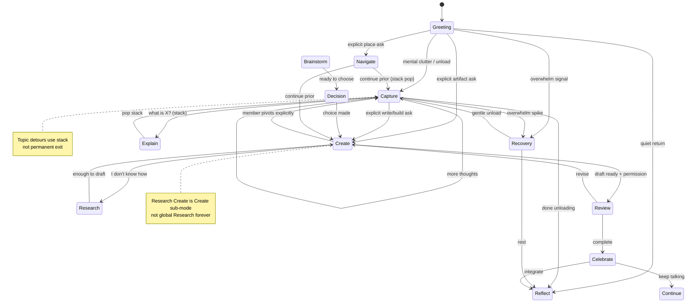

# Conversation Mode Intelligence

**Date:** 2026-07-06  
**Status:** **Binding architecture** — no implementation until reviewed  
**Foundational principle:** **THE RELATIONSHIP OWNS THE WORK.**

Spark must understand the member's **current conversation mode** before choosing a feature, workflow, or Studio.

**This is not:** a bug fix · Estate Knowledge · Conversation Session implementation · UI redesign · prompt tweak in one router.

**This is:** a foundational intelligence layer — **mode persistence across turns** — so Spark stops treating every new sentence as a possible new workflow.

**Parent stack:** [SPARK_CONVERSATION_INTELLIGENCE_ARCHITECTURE.md](./SPARK_CONVERSATION_INTELLIGENCE_ARCHITECTURE.md)  
**Session owner:** [CONVERSATION_SESSION_ARCHITECTURE.md](./CONVERSATION_SESSION_ARCHITECTURE.md)  
**Sibling (Create path):** [CREATION_GUIDANCE_INTELLIGENCE.md](./CREATION_GUIDANCE_INTELLIGENCE.md) · [ADAPTIVE_CREATION_INTELLIGENCE.md](./ADAPTIVE_CREATION_INTELLIGENCE.md)  
**Flow engine (turn tactics):** Spec 114 · Spec 107 state machine

**Out of scope (this document):** Estate Knowledge Registry wiring · Studio Readiness gates · Creating Together panel · Member Journey

---

## Executive summary

### The problem

Today Spark runs **parallel per-sentence classifiers** — intent regex, artifact detection, workflow pending, create fast path, discovery mode — with **no durable member mode**. A single line like *"Make appointment for doctor"* can be misread as **Create** because it mentions an actionable item, even when the member is mid-**Capture**.

The member experience: Spark **restarts**, **changes workflows unexpectedly**, and **loses intention** — even when each individual classifier was "correct" in isolation.

### The fix

Introduce **Conversation Mode Intelligence™**:

> Before deciding *"What feature should I use?"*, Spark asks *"What mode is this member in?"*

Modes **persist** until there is **clear evidence** the member wants to change. **Changing topic does not automatically change mode.**

### Binding rule

| Rule | Meaning |
|------|---------|
| **Mode before feature** | Feature routing, Studio open, and workflow start are **subordinate** to `currentConversationMode` |
| **Topic ≠ mode** | A detour question (e.g. *"What is Clear My Mind?"*) does **not** cancel Capture |
| **Stack, don't replace** | Brief **Explain** or **Learn** during Capture uses a **temporary mode stack** — then **returns** to Capture |
| **Session owns mode** | `currentConversationMode` lives on **Conversation Session** — not frictionless layer, not React state alone |
| **Evidence to switch** | Mode change requires explicit member signal or high-confidence mode-shift detection — never a single keyword |

---

## Layer model (how mode relates to existing specs)

```
Member turn
    ↓
Conversation Mode Intelligence     ← NEW — "What mode is the member in?"
    ↓
Conversation Priority Engine       ← defers to mode; clears stale pendings safely
    ↓
Conversation Session spine         ← owns currentConversationMode + modeStack
    ↓
Spark Conversation Flow Engine     ← Spec 114 — tactical turn mode (answer, coach, …)
    ↓
Conversation State Machine         ← Spec 107 — listening → permission → review
    ↓
Feature / Studio / Estate routing  ← only when mode allows
```

| Concept | Scope | Example |
|---------|-------|---------|
| **Conversation Mode** | Multi-turn member activity | Capture, Create, Reflect |
| **Mode stack** | Temporary overlay | Explain during Capture → pop back |
| **Creation sub-mode** | Inside Create only | Quick · Guided · Discovery · Research Create |
| **Flow mode** (Spec 114) | Single turn tactic | coach, clarify, research |
| **Conversation stage** (Spec 107) | Internal dialogue phase | listening, permission, review |

**Conversation Mode** is **coarser and stickier** than Flow mode. Flow mode may vary every turn; Conversation Mode should not.

---

## Core question (every turn)

```text
1. What mode is this member in?          ← Conversation Mode Intelligence
2. Is this turn a mode shift or a detour? ← stack vs switch
3. What does this mode allow?             ← forbidden transitions gate
4. What feature should I use?             ← only after 1–3
```

---

## Conversation modes (binding definitions)

Each mode defines: **Purpose** · **Allowed transitions** · **Forbidden transitions** · **Example conversations** · **Expected behavior**

Legend for transitions:

- **→** permanent switch (updates `currentConversationMode`)
- **⇢** temporary stack (pushes `modeStack`; pop when detour complete)
- **↺** return (pop stack or resume prior mode)

---

### 1. Greeting

**Purpose:** Arrival, warmth, orientation — one thoughtful question. Not a feature menu.

| Allowed | Forbidden |
|---------|-----------|
| → Capture, Reflect, Recovery, Navigate, Learn, Explain ⇢ | → Create, Review (without permission path) |
| → any mode on clear member signal | Starting workflows, Estate tours, capability catalogs |

**Examples**

- *"Hi Spark"* → warm greeting + one open question  
- *"I'm back"* → glad you're here; no day-count; offer what would help  

**Expected behavior:** Short. No dashboard. No *"What would you like to work on today?"* menu. Passes Relationship Constitution arrival copy.

---

### 2. Capture

**Purpose:** Unload thoughts continuously — brain dump, mental clutter, "so many things on my mind." **Capture ≠ organize ≠ create.**

| Allowed | Forbidden |
|---------|-----------|
| ⇢ Explain, Learn (brief detours) | → Create on actionable phrases alone |
| → Reflect when member signals done capturing | Opening Studio, SOP workflow, project create |
| → Recovery if overwhelm spikes | Restarting discovery, blank documents |
| ↺ from Explain/Learn back to Capture | Treating calendar items as "write an SOP" |

**Examples**

- *"I have so many things on my mind…"* → stay in Capture; invite one thought at a time  
- *"Make appointment for doctor"* → **still Capture** — record the thought; do not switch to Create  
- *"What do I do now?"* (after explaining a place) → **still Capture** — gentle next capture prompt  

**Expected behavior:** Quiet capture surface (Clear My Mind atmosphere when appropriate). No interview. No artifact scaffold. Hidden organize only with permission later.

---

### 3. Explain

**Purpose:** Answer *what is X?* / *how does Y work?* — estate places, features, concepts. **Information in service of the member's ongoing intention.**

| Allowed | Forbidden |
|---------|-----------|
| ↺ return to prior mode on completion | Replacing prior mode permanently for one FAQ |
| ⇢ Learn if member wants depth | Opening unrelated Studio |
| → Navigate if member asks to go there after explanation | Starting Create because feature was named |

**Examples**

- During Capture: *"What is Clear My Mind?"* → explain briefly → **immediately return to Capture**  
- *"What's the Library for?"* → place explanation → *"Want to keep unloading thoughts?"* if Capture was active  

**Expected behavior:** Short, Shari-voice explanation. Explicit or implicit **return cue** when stacked on another mode.

---

### 4. Learn

**Purpose:** Teach a concept the member does not know — process, framework, vocabulary. Deeper than Explain; may span several turns.

| Allowed | Forbidden |
|---------|-----------|
| → Create when member asks to apply learning | Fake certainty; lecture mode |
| → Research when member needs external facts | Abandoning Create/Capture without signal |
| ↺ to prior mode when lesson complete | Visual Thinking menus during pure Learn |

**Examples**

- *"What's an SOP?"* → teach → offer to create one **only if member asks**  
- During Create: *"I don't know what sections go in a proposal"* → Learn within Create context  

**Expected behavior:** Match Spec 114 **teach** flow. One idea at a time. Permission before drafts.

---

### 5. Research

**Purpose:** Gather facts together — market, options, examples, "what do others do?" Distinct from Learn (concept) and Create (artifact).

| Allowed | Forbidden |
|---------|-----------|
| → Create when enough to draft | Opening blank Studio first |
| → Decide when options are ready | Endless research without synthesis |
| ⇢ Explain for definitions mid-research | Losing research summary on mode pop |

**Examples**

- *"Find out what coaches charge for intensives"* → Research → summarize → offer next step  
- Create + *"I don't know how"* → **Research Create** (see Adaptive Creation Intelligence)  

**Expected behavior:** In-panel findings when shown; permission before surfacing long research. Session stores `researchState`.

---

### 6. Create

**Purpose:** **Creating Together** — build an artifact with the member. Sub-modes: Quick · Guided · Discovery · Research Create.

| Allowed | Forbidden |
|---------|-----------|
| → Research / Learn inside Create | Capture-style brain dump treated as create |
| → Review when draft ready | Blank scaffold on weak signal |
| → Reflect / Celebrate on completion | Restart discovery after answered slots |
| ↺ pause → Capture/Reflect if member pauses | Universal Creation fast path bypassing mode |

**Examples**

- *"Can you help me write an SOP?"* → **switch to Create** (explicit artifact ask)  
- *"I don't know how"* (inside Create) → **Research Create** immediately — not more interview  

**Expected behavior:** Studio Readiness gates apply. Permission before review. Session owns artifact stack.

---

### 7. Review

**Purpose:** Member examines prepared work — draft primary, chat fades (Spec 109). Editing, approving, saving.

| Allowed | Forbidden |
|---------|-----------|
| → Create (revise), Reflect, Celebrate | New unrelated Create mid-review |
| → Complete / Continue | Re-opening discovery from zero |

**Examples**

- *"Show me the draft"* → Review state  
- *"Change the opening paragraph"* → stay Review / Create revise loop  

**Expected behavior:** Spec 107 permission → review path. Certainty before completion (Spec 113).

---

### 8. Reflect

**Purpose:** Integration, journaling, quiet processing — not productivity. Restoration places.

| Allowed | Forbidden |
|---------|-----------|
| → Capture if thoughts surface | Tool bombardment |
| → Recovery | Urgent task lists |
| ⇢ Explain | Forced Create |

**Examples**

- *"Let me sit with that for a minute"* → Reflect; minimal prompts  
- After completion: *"What am I taking away?"* → Reflect  

**Expected behavior:** Low choice count. Silence valid.

---

### 9. Navigate

**Purpose:** Move in the Estate — go to a place, change atmosphere. **Conversation travels** (Spec 108).

| Allowed | Forbidden |
|---------|-----------|
| ↺ return conversation to prior mode after move | *"Opening the Conservatory…"* software copy |
| → Capture/Create/Reflect in new place | Menu ordinals without pending choice contract |

**Examples**

- *"Take me somewhere quiet"* → Navigate invitation (Yes · Stay · Map)  
- During Capture: *"Can we go to the sunroom?"* → Navigate ⇢ then Capture continues  

**Expected behavior:** Optional environment. Never auto-move. Place language, not feature language.

---

### 10. Brainstorm

**Purpose:** Generate options, possibilities, angles — **not** deciding yet, **not** drafting yet.

| Allowed | Forbidden |
|---------|-----------|
| → Decide, Create, Capture | Premature single recommendation |
| ⇢ Research | Locking first idea as final |

**Examples**

- *"Throw out some newsletter ideas"* → Brainstorm list → ask which direction  
- Stuck protocol choice *brainstorm together* (Spec 114) → Brainstorm  

**Expected behavior:** Max 3–5 numbered options. Member picks; Spark does not choose for them.

---

### 11. Decision

**Purpose:** Choose between options — Decision Compass, tradeoffs, one decision at a time.

| Allowed | Forbidden |
|---------|-----------|
| → Create (execute decision), Reflect | Analysis paralysis — endless options |
| → Navigate if place helps | Shame or pressure language |

**Examples**

- *"Should I launch now or wait?"* → Decision  
- *"Help me pick between these three offers"* → Decision  

**Expected behavior:** Spec 106 one question. Member owns outcome (T-008).

---

### 12. Celebrate

**Purpose:** Quiet acknowledgment of transformation — not streaks, not confetti.

| Allowed | Forbidden |
|---------|-----------|
| → Reflect, Continue, Capture | Exaggerated praise, gamification |
| → Navigate (Bell, Accomplishments) with permission | Spark celebrating itself |

**Examples**

- *"I finished the onboarding SOP"* → warm acknowledgment → one optional next step  

**Expected behavior:** Spec 110 completion tone. Member hero principle.

---

### 13. Recovery

**Purpose:** Overwhelm, burnout, shame, long absence — restore clarity before productivity (T-007).

| Allowed | Forbidden |
|---------|-----------|
| → Capture (gentle), Reflect, Navigate (restoration place) | Task lists, "you're behind" |
| ⇢ Explain | Create fast path |

**Examples**

- *"Everything is too much"* → Recovery → one small stabilizing step  
- *"I haven't been here in weeks"* → glad you're here; no surveillance  

**Expected behavior:** Recovery before productivity. Fewer choices. `priorityEngine` emotional support wins — but **mode** stays Recovery until member stabilizes.

---

## Mode persistence rules

### What counts as "clear evidence" to switch mode

| Signal type | Example | Action |
|-------------|---------|--------|
| **Explicit mode ask** | *"Help me write an SOP"* | → Create |
| **Explicit done** | *"That's everything in my head"* | Capture → Reflect or Continue |
| **Explicit new activity** | *"Let's research pricing"* | → Research |
| **Weak actionable phrase** | *"Doctor appointment Tuesday"* | **Stay Capture** — not Create |
| **FAQ detour** | *"What is Clear My Mind?"* | ⇢ Explain → ↺ Capture |
| **Bare affirmation** | *"Yes"* | Continue **current mode** + pending contract |

### Topic change ≠ mode change (binding)

```text
Member in Capture
    → asks "What is Clear My Mind?"
        → Explain (stacked)
            → answer
                → pop stack
                    → Capture continues
```

**Forbidden:** Clearing Capture session, opening Create, or running `isSimpleCreateRequest` because the FAQ mentioned a feature name.

---

## Conversation Session ownership

### New session fields (proposed)

```typescript
export type ConversationMode =
  | "greeting"
  | "capture"
  | "explain"
  | "learn"
  | "research"
  | "create"
  | "review"
  | "reflect"
  | "navigate"
  | "brainstorm"
  | "decision"
  | "celebrate"
  | "recovery";

export type ConversationModeFrame = {
  mode: ConversationMode;
  enteredAt: string;
  reason: string;           // dev / audit only
  returnPrompt?: string;    // optional Shari cue when stacked
};

// On ConversationSession (extends types.ts):
currentConversationMode: ConversationMode;
modeStack: ConversationModeFrame[];   // top = active overlay
modeLockedUntil?: string;             // optional — prevent flip-flop
lastModeShiftEvidence?: string;       // audit trail
```

**Ownership rule:** Only `lib/conversationSession/` mutates mode. Adapters **read** mode and **propose** shifts through `proposeConversationModeShift()` — never write directly.

### Relationship to existing session fields

| Existing field | After mode intelligence |
|----------------|-------------------------|
| `currentIntent` | **Narrow** — artifact/topic string inside Create; not global mode |
| `currentStage` (Spec 107) | Unchanged — phase within a turn |
| `creationMode` | Sub-mode of **Create** only |
| `researchState` | Sub-state of **Research** / Research Create |
| `activeArtifact` | Non-null usually implies **Create** or **Review** |

---

## State diagram



---

## Transition table (selected)

| From | Member signal | To | Stack? |
|------|---------------|-----|--------|
| Greeting | overload / many thoughts | Capture | no |
| Capture | *"What is Clear My Mind?"* | Explain | **yes** |
| Explain | answer complete | Capture | **pop** |
| Capture | *"What do I do now?"* (after FAQ) | Capture | no |
| Capture | *"Make appointment for doctor"* | Capture | no |
| Capture | *"Can you help me write an SOP?"* | Create | no |
| Create | *"I don't know how"* | Research Create | sub-mode |
| Any | overwhelm | Recovery | no (priority) |
| Capture | *"Take me to the library"* | Navigate | yes |
| Navigate | arrived + prior Capture | Capture | pop |
| Create | *"yes"* (draft offer) | Review | no |
| Review | *"looks good"* | Celebrate / Complete | no |

---

## Golden regression test — CM-001 (binding)

**Test id:** `CM-001-capture-with-explain-detour`  
**Source:** Live transcript (2026-07-06) — first Conversation Mode golden standard.

### Transcript

| Turn | Member | Expected mode | Expected behavior |
|------|--------|---------------|-------------------|
| 1 | *"I have so many things on my mind…"* | **Capture** | Acknowledge; invite one thought; no menus; no Create |
| 2 | *"What is Clear My Mind?"* | **Explain** (stacked on Capture) | Brief explanation of continuous capture; not a tour |
| 3 | *(Spark explains)* | Explain → **↺ Capture** | Return cue: continue unloading; no workflow restart |
| 4 | *"What do I do now?"* | **Capture** | Next capture prompt — not Create, not Estate menu |
| 5 | *"Make appointment for doctor."* | **Capture** | Record thought; **do not** open Create / calendar workflow |
| 6 | *"Can you help me write an SOP?"* | **Create** | Mode shift — begin Creating Together; permission path |
| 7 | *"I don't know how."* | **Research Create** | Pivot immediately; no repeated interview questions |

### Pass criteria (Spec 119 aligned)

| Gate | Requirement |
|------|-------------|
| Conversation Quality | No restart; intention preserved across 7 turns |
| Hospitality | No shame; no software voice |
| Cognitive load | One clear next step per turn |
| Relief | Member feels lighter after turn 1 and 5 |
| Spark Question | Companion — not application switching |
| Shari over-the-shoulder | Would Shari stay in capture through turn 5? |

### Fail patterns (must not happen)

- Turn 5 opens SOP / project / reminder workflow  
- Turn 2 clears Capture session  
- Turn 4 offers feature grid or *"What would you like to work on?"*  
- Turn 7 asks for SOP sections member already said they don't know  
- Any turn: blank Studio scaffold without permission  

---

## Audit — what overrides mode today

These systems **classify each sentence independently** and can **override** an implicit member mode. All must **consult** `currentConversationMode` after implementation.

### P0 — Per-turn workflow hijack (highest risk)

| Location | Mechanism | Override risk |
|----------|-----------|---------------|
| `lib/frictionlessActionLayer.ts` | `resolveFrictionlessActionImpl` — 20+ sequential `try*Flow` handlers | Any turn can match Create, Discovery, Estate, Visual Thinking |
| `lib/frictionlessActionLayer.ts` | `isSimpleCreateRequest` + fast path **before** restoration flows (≈ L3062) | Actionable phrases in Capture → Create |
| `lib/createExperience/createExperienceRouting.ts` | `detectRegistryArtifact`, `resolveImmediateCreateAction` | "Appointment", "email", "plan" → artifact |
| `lib/universalCreation/orchestrator.ts` | `detectUniversalDocumentType`, session phase | Parallel create session ignores Capture |
| `lib/universalCreation/createFastPath.ts` | Simple create regex | Short requests → blank artifact |
| `lib/estateBrain/discoveryMode.ts` | `tryDiscoveryFlow` | Parallel discovery interview |
| `lib/conversationIntelligence/priorityEngine.ts` | `isCreateTopicUserTurn`, `stalePendingsToClearOnTopicShift` | Topic shift clears pendings but **does not restore mode** |
| `app/companion/CompanionPageClient.tsx` | Duplicate create fast path, UC continuation, React state | UI layer re-decides mode per turn |

### P1 — Pending / acceptance override

| Location | Mechanism | Override risk |
|----------|-----------|---------------|
| `lib/frictionlessActionLayer.ts` | `tryFrictionlessYesContinuation`, `loadFrictionlessPending` | "Yes" binds to stale offer |
| `lib/pendingChoice/manager.ts` | `spark:pending-choice:v1`, ordinals | Menu selection unrelated to Capture |
| `lib/pendingAcceptanceAuthority.ts` | Bare acceptance binding | Wrong workflow continuation |
| `lib/conversationWorkflowContinuation.ts` | Ephemeral `ConversationWorkflow` | Lost on refresh; competes with mode |
| `lib/companionOutcomeThread.ts` | `workflowKind`, `activeFeature` | Outcome thread ≠ mode; drifts |
| `lib/pendingAction.ts` | Unified pending resolver | Tool/workspace offers without mode gate |

### P2 — Intent / artifact signals

| Location | Mechanism | Override risk |
|----------|-----------|---------------|
| `lib/intentAwareConversation/*` | Implied need routing | `tryImpliedNeedFlow` |
| `lib/artifactRegistry` | `detectRegistryArtifact` | Keyword → artifact kind |
| `lib/createPendingAction.ts` | `inferCreateItemTypeFromText` | Item type from phrase |
| `lib/visualStructureRouting.ts` | Visual thinking early flow | Structure phrases → visual menu |
| `lib/estate/*` navigation matchers | Hard navigation intent | Navigate without stack pop contract |
| `lib/sparkKnowledge/estateGuide.ts` | FAQ responses | Can derail if not stacked Explain |

### P3 — Parallel session stores (mode ambiguity)

| Store | Key | Problem |
|-------|-----|---------|
| Universal Creation | `universal-creation-session-v1` | Implies Create mode always |
| Estate Discovery | `estate-discovery-session-v1` | Implies Discovery / Create |
| Create workflow record | `companion-create-workflow-record-v1` | Second create phase model |
| Frictionless pending | `companion-frictionless-pending-v1` | Offer memory without mode |
| Outcome thread | `companion-outcome-thread-v1` | Goal without mode |
| Conversation Session | `companion-conversation-session-v1` | **No `currentConversationMode` yet** |

### Orchestration gap

| Document | Gap |
|----------|-----|
| `SPARK_CONVERSATION_INTELLIGENCE_ARCHITECTURE.md` | Pipeline defined; **mode layer missing** between Priority Engine and routers |
| Spec 114 Flow Engine | Turn tactics only — **not sticky mode** |
| Spec 107 State Machine | Dialogue phase — **not member activity mode** |

---

## Implementation plan

**Principle:** Mode intelligence **gates** existing routers — minimal rewrite first; no new member-facing UI.

### Phase 0 — Spec + tests (this document)

- [x] Architecture, modes, transition table, CM-001 golden test  
- [ ] Review approval  
- [ ] Add `docs/conversation-tests/cm-01-conversation-mode-capture.md` scorecard clone  

### Phase 1 — Session fields + API

- Add `ConversationMode`, `modeStack`, `currentConversationMode` to `lib/conversationSession/types.ts`  
- `getConversationMode()`, `proposeModeShift()`, `pushModeStack()`, `popModeStack()` in store  
- Dev panel field: current mode + stack (Ctrl+Shift+D / founder diagnostics)  
- **No routing changes** — log-only dual-write

### Phase 2 — Mode classifier (read-only)

- `lib/conversationModeIntelligence/classifyTurn.ts`  
  - Input: user text, session mode, last assistant, pendings  
  - Output: `{ stay | shift | stack, proposedMode, evidence }`  
- Unit tests for CM-001 transcript expectations (classification only)

### Phase 3 — Gate frictionless layer

- Top of `resolveFrictionlessActionImpl`: load session mode  
- If **Capture**: skip `isSimpleCreateRequest` fast path unless explicit create ask  
- If **Explain** stacked: route to explain handler; auto-pop on reply  
- Wire `priorityEngine` to respect mode before clearing pendings  

### Phase 4 — Gate CompanionPageClient

- Single mode shift hook after priority verdict  
- Remove duplicate create fast path when mode ≠ Create  
- CM-001 E2E conversation test (headless or vitest integration)

### Phase 5 — Adapters + cleanup

- UC / Discovery / Create adapters propose mode shifts through session API  
- Deprecate `workflowKind` as mode proxy in outcome thread  
- Audit log: mode shifts in conversation learning log (Observation Mode)

---

## Migration

| Step | Action |
|------|--------|
| 1 | Ship Phase 1 session fields — default `greeting` → infer from first turn |
| 2 | Run classifier in shadow mode (log proposed vs actual router) |
| 3 | Enable Capture gate (fixes CM-001 class bugs) |
| 4 | Enable mode stack for Explain/Learn detours |
| 5 | Research Create sub-mode binding inside Create |
| 6 | Remove shadow; CM-001 required in CI |

**Rollback:** `NEXT_PUBLIC_CONVERSATION_MODE_INTELLIGENCE=0` — mirrors session spine flag pattern.

---

## Tests

### Unit

| Test file | Covers |
|-----------|--------|
| `lib/conversationModeIntelligence/classifyTurn.test.ts` | Mode shift vs stay vs stack |
| `lib/conversationSession/conversationMode.test.ts` | Stack push/pop persistence |
| `lib/conversationModeIntelligence/forbiddenTransitions.test.ts` | Capture → Create blocked |

### Integration

| Test | Covers |
|------|--------|
| `CM-001` golden transcript | Full 7-turn mode sequence |
| Capture + FAQ detour | Explain stack returns |
| Create + "I don't know how" | Research Create sub-mode |

### Regression cases (add to Conversation Regression Audit)

| Id | Scenario | Expected mode |
|----|----------|---------------|
| CM-001 | Live capture transcript | (golden) |
| CM-002 | Capture + "remind me to call mom" | Capture — not reminder workflow |
| CM-003 | Create + estate FAQ | Explain stack → Create |
| CM-004 | Recovery + "write my newsletter" | Recovery first — no Create until stable |
| CM-005 | Review + "actually brain dump" | Shift Capture — pause artifact |
| CM-006 | Navigate mid-Capture | Stack Navigate → pop Capture |
| CM-007 | Bare "yes" in Capture | Stay Capture |

---

## Success criteria

Spark completes **CM-001** naturally:

- No workflow restart mid-capture  
- FAQ does not cancel Capture  
- Actionable phrase does not open Create  
- Explicit SOP ask switches to Create  
- *"I don't know how"* triggers Research Create — not interview loop  

**Member feels:** Spark remembered what we were doing.

---

## References

- [CONVERSATION_REGRESSION_AUDIT.md](./CONVERSATION_REGRESSION_AUDIT.md)  
- [SPARK_CONVERSATION_BUG_REVERSE_ENGINEERING.md](./SPARK_CONVERSATION_BUG_REVERSE_ENGINEERING.md)  
- [ADAPTIVE_CREATION_INTELLIGENCE.md](./ADAPTIVE_CREATION_INTELLIGENCE.md) — Research Create  
- Spec 106 Guardrails · Spec 107 State Machine · Spec 114 Flow Engine  
- [THE_FRIEND_WE_ALL_DESERVE.md](./THE_FRIEND_WE_ALL_DESERVE.md) — voice gate  

---

## Approval gate

| Question | Required |
|----------|----------|
| Does mode persistence reduce cognitive load? | yes |
| Does Capture survive FAQ detours? | yes |
| Does Conversation Session own `currentConversationMode`? | yes |
| Is CM-001 the first golden test? | yes |
| Implementation blocked until approved? | **yes — awaiting review** |
