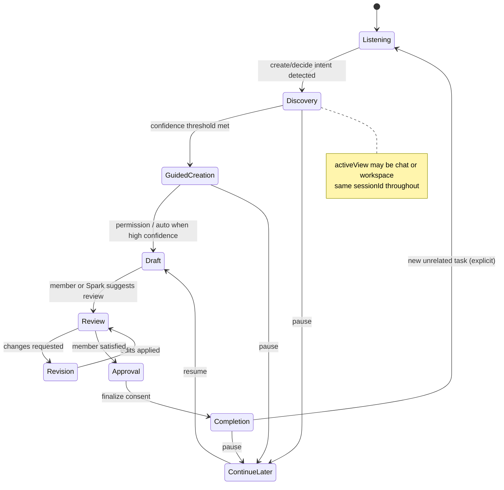

# Conversation Session Architecture

**Date:** 2026-07-05  
**Status:** **Binding architecture** — no implementation until reviewed  
**Foundational principle:** **THE RELATIONSHIP OWNS THE WORK.**

The conversation is only one expression of the relationship. The relationship remembers, notices, celebrates, learns, and continues. Everything else — chat, Estate places, Studios, artifacts — is how that relationship becomes visible.

**Related audits:** Conversation Regression Audit · Universal Creation continuity audit · `docs/SPARK_CONVERSATION_ARCHITECTURE_FREEZE.md`

**Parent orchestration:** [SPARK_CONVERSATION_INTELLIGENCE_ARCHITECTURE.md](./SPARK_CONVERSATION_INTELLIGENCE_ARCHITECTURE.md) — master pipeline; this document is the **memory spine** in the stack.

**Sibling authorities:** [CONVERSATION_MODE_INTELLIGENCE.md](./CONVERSATION_MODE_INTELLIGENCE.md) · [CREATION_GUIDANCE_INTELLIGENCE.md](./CREATION_GUIDANCE_INTELLIGENCE.md) · [ESTATE_CREATION_EXPERIENCE.md](./ESTATE_CREATION_EXPERIENCE.md) · [MEMBER_JOURNEY_ARCHITECTURE.md](./MEMBER_JOURNEY_ARCHITECTURE.md)

**Architecture index:** [docs/README.md](./README.md)

---

## Binding decisions (2026-07-05)

| Decision | Rule |
|----------|------|
| **Relationship owns work** | Conversation Session serves the relationship — not the reverse |
| **One active relationship** | Never more than one active relationship; one Conversation Session spine |
| **Many artifacts** | Proposal, email, map, project — each may pause, resume, or finish; relationship continues |
| **Creating Together** | Member-facing name for all creation; Universal Creation / Facilitated Creation / workflows are implementation only |
| **Research Create** | Fourth creation pattern when member lacks process knowledge — [ADAPTIVE_CREATION_INTELLIGENCE.md](./ADAPTIVE_CREATION_INTELLIGENCE.md) |
| **Places + Studios** | Physical Estate Place is primary experience; Studio opens **inside** the place (see ESTATE_CREATION_EXPERIENCE §3) |
| **Member Journey** | Longitudinal life in the Estate — separate from session state ([MEMBER_JOURNEY_ARCHITECTURE.md](./MEMBER_JOURNEY_ARCHITECTURE.md)) |
| **Creation Guidance fields** | Session **persists** `creationGuidance` (step · structure · draft); [Creation Guidance Intelligence](./CREATION_GUIDANCE_INTELLIGENCE.md) **decides** when to ask · act · draft · review · complete |

---

## Ownership boundary — Session vs Creation Guidance

| Conversation Session **owns** | Creation Guidance Intelligence **owns** |
|------------------------------|----------------------------------------|
| Session memory · persistence · `sessionId` | When Spark **asks** (gate questions only) |
| `currentConversationMode` (with Mode Intelligence) | When Spark **acts** · **drafts** · **reviews** · **completes** |
| `creationGuidance` fields (step · structure · draft · review state) | Lifecycle logic · gate evaluator · step transitions |
| Artifact stack · answered gate questions | **Not** routing · Estate recs · Studio open |

Creation Guidance **reads and patches** session fields — it does not replace the session store.

---

## Executive summary

Members experience **repeated questions, blank documents, and lost momentum** not because Spark “forgets,” but because **multiple session systems run in parallel without a mandatory handoff contract** — and because **implementation stores** were mistaken for **relationship ownership**.

This document defines **one Conversation Session** as the **active task spine of the one active relationship**. It tracks what is **active**, **paused**, and **finished** across artifacts. Workspaces and Studios are **views** over that session; they render and edit; they do not restart discovery or split the relationship.

**Member-facing creation is always:** *Creating Together.*

---

## 1. Current architecture

### 1.1 How a creation turn flows today (simplified)

```
User message
    │
    ├─► frictionlessActionLayer (parallel routers)
    │       ├─ estate Discovery Mode ──► estate-discovery-session-v1
    │       ├─ Universal Creation ──────► universal-creation-session-v1
    │       ├─ pending choice ──────────► spark:pending-choice:v1
    │       └─ on "ready" ──────────────► clearUniversalCreationSession()
    │                                       └─► resolveImmediateCreateAction() → blank artifact
    │
    ├─► CompanionPageClient React state (messages, workspacePanel, pendingAcceptance, …)
    │
    └─► Workspace open
            ├─ companion-create-session-v1 (genSeed, creationContext)
            ├─ companion-create-workflow-record-v1 (collectedAnswers, draft)
            └─ followUpForItemType() → re-asks discovery in chat
```

**There is no single owner.** Each layer assumes it may start fresh.

---

### 1.2 Session and store inventory

| Store / session | Storage key / location | What it owns | Who writes | Who reads | Survives refresh? |
|-----------------|----------------------|--------------|------------|-----------|---------------------|
| **Chat transcript** | `companion-conversation-v1` (`lib/companionStore.ts`) | Message list only (`role`, `content`) | `CompanionPageClient` on message change | Chat render, API context | Yes (localStorage) |
| **Universal Creation** | `universal-creation-session-v1` (`lib/universalCreation/orchestrator.ts`) | `documentType`, `phase`, `confidence`, `answers`, `questionIndex`, `originalUserText`, `draftContent`, `pendingEnhancements` | UC orchestrator via frictionless layer | UC turn resolver, frictionless hints | Yes |
| **Estate Discovery Mode** | `estate-discovery-session-v1` (`lib/estateBrain/discoveryMode.ts`) | Parallel discovery for SOP/focus/business/research topics: `topic`, `answers`, `confidence`, `questionIndex` | `tryDiscoveryFlow` in frictionless layer | Discovery turn resolver | Yes |
| **Create workspace session** | `companion-create-session-v1` (`lib/createSessionStore.ts`) | `genSeed` (type, brief, draft), `creationContext`, `workspaceDetail`, `savedArtifact` | Create panel open / draft save | `restoreCreateSession`, workspace hydration | Yes |
| **Create workflow record** | `companion-create-workflow-record-v1` (`lib/createWorkflowRecordStore.ts`) | **Second copy:** `itemType`, `collectedAnswers`, `draftContent`, `currentPhase`, full `workflowState` | Create builder chat + panel | Auto-resume on Create open | Yes |
| **Create saved-for-later** | `companion-create-workflow-saved-v1` | Explicit bookmark of workflow record | Member action | Resume menu | Yes |
| **Frictionless pending** | `companion-frictionless-pending-v1` (`lib/frictionlessActionLayer.ts`) | `target`, `artifactType`, `initialPrompt`, `offerSummary`, `offeredAtTurn` — **not answers** | Offer paths in frictionless layer | Affirmation handler → `resolvedArtifactFromCreatePending` | Yes |
| **Pending choice** | `spark:pending-choice:v1` (`lib/pendingChoice/manager.ts`) | Estate menu ordinal choices, `activeIntent`, `activeWorkflow` | Estate menus, concierge | `resolvePendingChoiceTurn` | sessionStorage |
| **Outcome thread** | `companion-outcome-thread-v1` (`lib/companionOutcomeThread.ts`) | `currentGoal`, `pendingQuestion`, `activeFeature`, `workflowKind` | Routing patches | Acceptance + continuation | Yes |
| **Conversation workflow** | React state in `CompanionPageClient` | Short-lived workflow continuation (`ConversationWorkflow`) | `conversationWorkflowContinuation.ts` | Yes/sure handlers | **No** |
| **Pending acceptance** | React state | `PendingAcceptanceRecord` — what “yes” refers to | Offer surfaces | `pendingAcceptanceAuthority.ts` | **No** |
| **Pending action (unified)** | Computed, not always persisted | Workspace/tool/export offers | `pendingAction.ts` resolver | Acceptance routing | Partial |
| **Create open authority** | React + ephemeral payloads | Consent gates, `PendingCreateOpenPayload` | Create open paths | `evaluateCreateOpen` | **No** |
| **Facilitated creation** | In-memory (`lib/facilitatedCreation/sessionStore.ts`) | `artifactType`, `sectionAnswers`, facilitation phase | Facilitated flow | Workspace gate | **No** |
| **Guided create session** | Derived from workflow | Template field values | Create builder | Guided field prompts | Via workflow record |
| **Active artifact** | `spark-artifact-state-v1` (`lib/artifactState/store.ts`) | Artifact metadata for “what Shari is working on” | Artifact pipeline | Hidden work / save hooks | Yes |
| **Decision Compass** | `companion-decision-compass-session-v1` + authority layer | Decision, options, steps, answers, exploration | Compass panel + chat | `openDecisionCompass` | Yes |
| **Strategy apply** | `companion-strategy-apply-v1` | Strategy Q&A, generated plan | Strategy coach | Strategy workspace | Yes |
| **Workspace SOP session** | `companion-workspace-session-v1` | Project/workshop step state | Goals/projects workspace | SOP resume | Yes |
| **Visual focus / mind map** | `companion-visual-focus-maps-v1` | Map documents, lifecycle, pending open | Visual thinking studio | Map open queue | Yes |
| **Project continuity** | `companion-project-continue-v1` | Selected project + panel view | Project workspace | Continue work | Yes |
| **Estate memory** | `spark:estate:memory:v1` (sessionStorage) | Emotional history, journey, room visits, digest | Estate navigation | Arrival intelligence | Browser session |
| **Adaptive estate prefs** | `estate-adaptive-intelligence-v1` | Prefill signals for discovery | Adaptive intelligence | UC/discovery prefill | Yes |
| **Companion session MVP** | In-memory (`lib/intelligence-layer/companionSession.ts`) | `sessionId`, idle timer (30 min) | `initCompanionSession` | Trust/analytics hooks | **No** |
| **Last activity / recent work** | `companion-last-activity-v1`, `companion-recent-work-v1` | Resume pointers (section, title) | Navigation | “Continue where I left off” | Yes |
| **Business Brain / profile** | `companion-brain-state-v1`, `companion-business-profile-v1`, etc. | Long-term memory, not turn state | Memory engines | Recall in prompts | Yes |

**React UI state (not persisted)** also acts as implicit session owners: `workspacePanel`, `activeSection`, `creationContext`, `workspaceDetail`, `decisionCompassPrefill`, `messages` (until saved to companion-conversation-v1).

---

### 1.3 Who owns what today (creation path)

| Concern | Current owner | Problem |
|---------|---------------|---------|
| **Current intent** (“write an SOP for onboarding”) | Split: UC `originalUserText`, outcome thread, frictionless `context`, chat messages | No canonical field |
| **Document type** | UC `documentType`, create `genSeed.type`, workflow `itemType`, pending `artifactType` | Can disagree after handoff |
| **Discovery answers** | UC `answers`, workflow `collectedAnswers`, discovery mode `answers` | **Never copied to Create on open** |
| **Phase** (discovery → draft → review) | UC `phase`, workflow `currentPhase`, create builder phase | Three phase models |
| **Draft content** | UC `draftContent`, create `genSeed.draft`, workflow `draftContent` | Last writer wins; often blank scaffold |
| **Pending questions** | UC `questionIndex`, workflow `currentQuestionId`, chat last assistant message | Continuation gated by **regex** (`CREATION_MARKER_RE` in orchestrator vs broader `createFlowContext.ts`) |
| **“Yes” / “Continue” meaning** | frictionless pending, pending acceptance, conversation workflow, pending choice | Four acceptance systems |
| **Room / place** | Estate memory, React `directEstateVisit`, `activeSection` | Atmosphere only — not wired to creation session |
| **Emotional state** | Estate memory, frictionless input | Not linked to creation phase |
| **Momentum** | Outcome thread, last activity | Resume opens **workspace**, not **conversation task** |

---

### 1.4 Documented failure points (from audits)

1. **Continuation gate mismatch** — `resolveUniversalCreationTurn` uses a **narrow** `CREATION_MARKER_RE` in `orchestrator.ts`. Broader markers live in `createFlowContext.ts` but are not used for turn advance → `startUniversalCreationTurn` restarts discovery.

2. **Premature UC clear** — On discovery `ready`, `tryUniversalCreationFlow` calls `clearUniversalCreationSession()` then `resolveImmediateCreateAction()` with a **blank scaffold** (`lib/frictionlessActionLayer.ts` ~1579).

3. **Frictionless “yes” bridge** — `resolvedArtifactFromCreatePending` builds artifact from `blankScaffoldForType`; pending stores `initialPrompt` only, not UC `answers` (`lib/createPendingAction.ts`).

4. **Create open ignores UC** — `completeImmediateCreateOpen` navigates and hydrates Create from create-session store, not UC session.

5. **Re-interview follow-ups** — `followUpForItemType()` in `createExperienceRouting.ts` asks “Who is it for?” after discovery already answered who (`createExperienceRouting.ts` ~45–71).

6. **Affirmation gaps** — `AFFIRMATION_RE` does not cover “let’s create it together”; generic yes can misfire or expire without a valid pending owner.

---

## 2. Proposed architecture

### 2.1 Core model

```
                    ┌─────────────────────────┐
                    │   Relationship          │  ← ONE active relationship
                    │   (owns the work)       │
                    └───────────┬─────────────┘
                                │
                    ┌───────────▼─────────────┐
                    │   ConversationSession    │  ← active task spine
                    │   + artifact stack         │     (active · paused · finished)
                    └───────────┬─────────────┘
                                │
          ┌─────────────────────┼─────────────────────┐
          │                     │                     │
          ▼                     ▼                     ▼
    Chat view          Studio inside            Member Journey
    (conversation)     Estate Place             (longitudinal)
          │                     │                     │
          └─────────────────────┴─────────────────────┘
                          same relationshipId
                          same discovery answers
                          same draft when active
```

**One active relationship.** One Conversation Session as its **current task spine**. Multiple **artifacts** may exist in `paused` or `finished` state; only one task is **active** at a time unless explicitly parallelized in a future version (v1: **never**).

**Creating Together** is the only member-visible creation experience. Implementation modules (`universalCreation`, `facilitatedCreation`, `createWorkflowRecord`) become **adapters** reading/writing the same session fields.

---

### 2.2 ConversationSession — canonical fields

```typescript
/** Proposed — not implemented */
type ConversationSession = {
  // Identity — relationship spine
  sessionId: string;
  relationshipId: string;          // ONE active relationship (v1: singleton per member)
  parentSessionId?: string;        // fork only for explicit "start something new"
  createdAt: string;
  updatedAt: string;
  lastActivityAt: string;

  // Task state within relationship
  taskStatus: "active" | "paused" | "finished";
  artifactStack: {
    artifactId: string;
    kind: ArtifactKind;
    status: "active" | "paused" | "finished";
    title?: string;
    pausedAt?: string;
  }[];

  // Intent & task (Creating Together — member-facing)
  primaryIntent: ConversationIntent;
  memberFacingMode: "creating_together";  // never: universal_creation | facilitated | workflow
  taskSummary: string;                 // one sentence Shari would say back
  originalUserText: string;
  desiredOutcome?: string;

  // Artifact
  artifactKind: ArtifactKind;          // email | sop | proposal | decision_map | sales_funnel | mind_map | document | …
  artifactId?: string;                 // link to saved artifact / map / compass session when materialized
  artifactTitle?: string;

  // Discovery & answers (never duplicated elsewhere)
  discoverySlots: Record<string, string>;   // canonical keys: what, why, who, success + plugin-specific
  discoveryConfidence: number;                // 0–100
  answeredQuestionIds: string[];              // ids permanently satisfied
  pendingQuestionId?: string | null;          // at most ONE open question
  pendingQuestionPrompt?: string;

  // Phase & momentum
  phase: ConversationPhase;
  phaseHistory: { phase: ConversationPhase; at: string }[];
  momentum: "building" | "paused" | "reviewing" | "complete";

  // Draft & structure
  draftContent?: string;
  outline?: string;
  outlineSections?: { id: string; title: string; body?: string }[];

  // Context
  audience?: string;
  purpose?: string;
  emotionalState?: string;           // snapshot, not long-term memory
  estatePlaceId?: string;            // physical Estate Place (Layer 1)
  studioId?: string;                 // Studio Registry id (Layer 2 — capability)
  activeView: ConversationView;       // chat | studio_surface | decision_map | …

  // Decisions & offers
  decisions: { id: string; label: string; value: string; at: string }[];
  lastOffer?: {
    kind: string;
    summary: string;
    offeredAtTurn: number;
    expiresAtTurn?: number;
  };

  // Sync metadata
  version: number;                   // optimistic concurrency
  sourceOfLastUpdate: "chat" | "workspace" | "system";
};
```

**ConversationPhase** (unified lifecycle — see §6):

`listening` → `discovery` → `guided_creation` → `draft` → `review` → `revision` → `approval` → `completion` → `continue_later`

Maps from today’s UC phases + create workflow phases + Spec 107 state machine — **one enum**, not three.

**ConversationView** — UI projection only:

`chat` | `create_panel` | `decision_compass` | `visual_focus` | `strategy_playbook` | `workspace_sop` | …

---

### 2.3 What should disappear (as independent owners)

| Current store | Fate |
|---------------|------|
| `universal-creation-session-v1` | **Merged** into ConversationSession discovery + phase fields |
| `estate-discovery-session-v1` | **Merged** — discovery becomes intent-specific slot filling on same session |
| `companion-create-workflow-record-v1` `collectedAnswers` / `currentPhase` | **Demoted** — workflow record holds panel UI state only; answers read from ConversationSession |
| `companion-create-session-v1` `genSeed.brief` | **Derived** from ConversationSession at render time |
| Frictionless pending for create | **Narrowed** — pending stores `sessionId` + offer kind, not parallel artifact context |
| Duplicate `CREATION_MARKER_RE` | **Removed** — continuation uses `pendingQuestionId` + session phase, not regex on assistant text |
| `followUpForItemType` re-interview lines | **Replaced** — handoff messages acknowledge known answers |
| Facilitated creation in-memory session | **Merged** — member-facing *Creating Together* only; adapter reads/writes ConversationSession |
| Separate UC clear on “ready” | **Removed** — phase advances; session persists through workspace open |

**What stays (different responsibility):**

| Store | Role after migration |
|-------|---------------------|
| `companion-conversation-v1` | Transcript only — display layer |
| `companion-create-session-v1` | **View cache** — panel layout, scroll, selection; optional denormalized draft for offline panel edit with sync back |
| `companion-create-workflow-record-v1` | Panel-specific builder state (template field UI), not discovery authority |
| Decision Compass / Visual Focus / Strategy stores | **Materialized artifacts** — linked by `artifactId`, seeded from ConversationSession on first open |
| Estate memory / Business Brain | Long-term memory — **read** for prefill, **never** replace session |
| Pending choice | Estate navigation menus only — not creation discovery |

---

### 2.4 Views vs owners

| Surface | Today | Proposed |
|---------|-------|----------|
| Frosted chat | Owns turn routing | **View** — reads/writes ConversationSession via session API |
| Create panel | Owns draft + discovery | **View** — edits `draftContent`, emits patches |
| Decision Compass | Owns decision session | **View** — `activeView: decision_map`; compass store syncs from session |
| Mind map / Visual Focus | Owns map documents | **View** — session carries intent; map store holds geometry |
| Estate room change | Resets routing context | **Ambient** — updates `estatePlaceId` only |
| “Yes” / “Continue” | Opens new workflow | **Continues** same `sessionId`, advances phase or accepts offer |

---

## 3. Workspace contract

Every workspace receives **`ConversationSession`** (or a read-only projection + patch API). Workspaces **must not** run independent discovery interviews.

### 3.1 Inbound contract (session → workspace)

When a workspace mounts or `activeView` switches:

1. **Subscribe** to session id (React context or event bus).
2. **Hydrate** UI from session fields — never from blank scaffold if `draftContent` or `discoverySlots` exist.
3. **Skip questions** whose ids appear in `answeredQuestionIds`.
4. **Display** `taskSummary` in workspace chrome if needed (member-facing copy from Shari, not “SOP module”).

```typescript
/** Proposed adapter — workspaces implement */
type WorkspaceSessionAdapter = {
  viewId: ConversationView;
  hydrate(session: ConversationSession): WorkspaceHydration;
  /** Returns patches only — never replaces whole session */
  onWorkspaceChange(patch: WorkspacePatch): SessionPatch;
};
```

### 3.2 Outbound contract (workspace → session)

Workspaces write back via **patches**, not separate stores:

| Member action | Session patch |
|---------------|---------------|
| Edit draft in panel | `{ draftContent, sourceOfLastUpdate: "workspace" }` |
| Complete template field | `{ discoverySlots[fieldId], answeredQuestionIds: [...] }` |
| Request review | `{ phase: "review", momentum: "reviewing" }` |
| Save for later | `{ phase: "continue_later", momentum: "paused" }` |
| Finalize | `{ phase: "completion", artifactId }` |

**Rules:**

- Patches are **merge** operations with `version` check.
- Chat turn processor **always** reads latest session before generating next question.
- Workspaces **never** call `clear*Session()` on sibling stores.

### 3.3 Synchronization

```
┌──────────────┐     patch      ┌─────────────────────┐
│  Chat router │ ◄────────────► │ ConversationSession │
└──────────────┘                │      Store          │
       ▲                        └──────────┬──────────┘
       │ subscribe                         │ subscribe
       │                                   │
┌──────┴───────┐                  ┌───────▼────────┐
│ SimpleChat   │                  │ CreatePanel    │
└──────────────┘                  │ DecisionCompass│
                                  └────────────────┘
```

- **Single write path:** `applyConversationSessionPatch(patch)`.
- **Event:** `CONVERSATION_SESSION_UPDATED` (mirrors `OUTCOME_THREAD_UPDATED` pattern).
- **Persistence:** `companion-conversation-session-v1` in localStorage; transcript stays separate.
- **Conflict:** Last-write-wins on draft text with merge for `discoverySlots`; log conflicts in dev panel only.

### 3.4 Question guard (never re-ask)

Before emitting any assistant question:

```typescript
function mayAskQuestion(session: ConversationSession, questionId: string): boolean {
  if (session.answeredQuestionIds.includes(questionId)) return false;
  if (session.discoverySlots[slotForQuestion(questionId)]?.trim()) return false;
  return true;
}
```

Workspace open hooks **must** call the same guard — not a separate checklist.

---

## 4. Conversation rules

These are **release gates** for the new architecture (align with Spec 106, 107, 110, 113).

1. **Momentum is sacred** — phase may advance; it may not reset without explicit member intent (“start over,” “something new”).

2. **Never ask a answered question** — if `discoverySlots.who` is set, no “Who is this for?” in chat or workspace.

3. **Never restart discovery on room change** — update `estatePlaceId`; same `sessionId`.

4. **Never restart discovery on workspace open** — set `activeView`; hydrate from session.

5. **Never restart on “Yes”** — resolve `lastOffer` or advance `pendingQuestionId`; do not call `startUniversalCreationTurn`.

6. **Never restart on “Continue” / “Let’s create it together”** — treat as phase advance or offer acceptance; register as continuation intents in one acceptance module.

7. **One pending question** — chat and workspace share `pendingQuestionId`.

8. **Permission before show** — review/finalize still require consent (Spec 106 Rule 5); session phase moves to `permission`, not a new session.

9. **Transcript ≠ state** — reloading messages must reload ConversationSession by `sessionId`, not infer from regex on last assistant message.

10. **Clear only on explicit exit** — `clearConversationSession()` only when member starts a new unrelated task or session idle-expires (configurable, default 24h for creation tasks).

---

## 5. Handoff rules

Handoff = **change `activeView` + optional materialize artifact** — never new discovery.

### 5.1 Common handoff sequence

```
1. Chat completes slot / phase threshold
2. applyConversationSessionPatch({ phase: "draft", activeView: "create_panel" })
3. Materialize artifact if needed (link artifactId)
4. Navigate UI (estate place, split layout)
5. Single Shari line — acknowledges known context, no re-interview
6. Workspace hydrates from session
```

### 5.2 Per-workspace handoffs

| Target | Trigger | activeView | Materialization | First workspace line (example) |
|--------|---------|------------|-----------------|-------------------------------|
| **Document** | Generic create / `document` type | `create_panel` | Blank or template body from `draftContent` | “Here’s what we shaped — want to adjust anything at the top?” |
| **Email** | `artifactKind: email` | `create_panel` | Email scaffold prefilled from slots | “I’ve got the recipient and main point — the draft is ready when you are.” |
| **SOP** | `artifactKind: sop` | `create_panel` | SOP template + audience from slots | “Onboarding SOP for your VA — section headers are in place from what you told me.” |
| **Decision Map** | Decide intent / Compass offer accepted | `decision_compass` | Seed compass from `discoverySlots` + `taskSummary` | “Let’s walk through the two paths you mentioned.” |
| **Proposal** | `artifactKind: proposal` | `create_panel` | Proposal scaffold | “Proposal for [who] — scope section reflects what you said success looks like.” |
| **Sales Funnel** | `artifactKind: sales_funnel` | `create_panel` or visual | Funnel scaffold / map link | “Funnel for [offer] — stages match the outcome you described.” |
| **Mind Map** | Visual thinking intent | `visual_focus` | Create or open map with `purpose` node from session | “Starting with [topic] at the center — we can branch from there.” |
| **Future workspaces** | Registry lookup | `{kind}_view` | Adapter in registry | Must implement `WorkspaceSessionAdapter` |

### 5.3 Affirmation handoff (“Yes” after “Want me to open…”)

```
lastOffer = { kind: "open_workspace", summary: "…", sessionId }
User: "yes"
→ load session by sessionId (NOT frictionless pending alone)
→ applyConversationSessionPatch({ activeView, phase: next })
→ open workspace with hydrate(session)
→ NO clearUniversalCreationSession()
→ NO blankScaffoldForType unless draftContent empty AND no discoverySlots
```

### 5.4 Return handoff (workspace → chat)

- Closing panel: `activeView: "chat"` — session persists.
- Member continues talking: chat router reads same session; may set `phase: "revision"`.
- **Never** wipe workflow record on panel close if session phase ≠ `completion`.

---

## 6. State diagram

### 6.1 Lifecycle (one ConversationSession throughout)



### 6.2 Phase × view matrix (examples)

| Phase | Typical activeView | Member sees |
|-------|-------------------|-------------|
| discovery | `chat` | Questions in frosted chat |
| guided_creation | `chat` or `create_panel` | Chat-led or split |
| draft | `create_panel` | Document/email/SOP editor |
| review | `create_panel` | Draft primary (Spec 109) |
| revision | `create_panel` | Edits + optional chat |
| completion | `chat` | Certainty + next step (Spec 113) |

---

## 7. Migration plan

**Constraint:** small commits, minimal regression risk, no big-bang rewrite.

### Phase 1 — Session spine (read-mostly, no behavior change)

**Goal:** Introduce ConversationSession **alongside** existing stores; dual-write UC → new session.

| Commit | Change |
|--------|--------|
| 1.1 | Add `lib/conversationSession/types.ts` + store (`companion-conversation-session-v1`) |
| 1.2 | Dual-write from UC save/clear paths |
| 1.3 | Dev panel: show UC session vs ConversationSession diff |
| 1.4 | Tests: patch merge, question guard |

**Risk:** Low — additive only.

### Phase 2 — Continuation unification (fix restarts without migrating workspaces)

**Goal:** Stop restarts from chat side.

| Commit | Change |
|--------|--------|
| 2.1 | Single `isCreateFlowContinuation()` using session phase + `pendingQuestionId`, replace narrow orchestrator regex |
| 2.2 | Affirmation router: resolve offer via `sessionId` on frictionless pending |
| 2.3 | Remove `clearUniversalCreationSession()` before `immediateCreateOpen` — advance phase instead |
| 2.4 | Expand affirmation patterns; thread through `pendingAcceptanceAuthority` |
| 2.5 | Replace `followUpForItemType` re-interviews with session-aware ack lines |

**Risk:** Medium — touches frictionless + UC orchestrator; CT-11 + creation smoke tests mandatory.

### Phase 3 — Create workspace reads session (bridge layer)

**Goal:** Opening Create hydrates from ConversationSession.

| Commit | Change |
|--------|--------|
| 3.1 | `buildCreateOpenFromConversationSession()` — maps slots → genSeed + draft |
| 3.2 | `completeImmediateCreateOpen` uses bridge; workflow record seeds `collectedAnswers` from session once |
| 3.3 | Create panel patches write back to session |
| 3.4 | Deprecate duplicate answers in workflow record (read-through adapter) |

**Risk:** Medium-high — Create panel regression surface; feature-flag `CONVERSATION_SESSION_CREATE_BRIDGE`.

### Phase 4 — Extend to other workspaces + retire legacy owners

**Goal:** Decision Compass, Visual Focus, Strategy use same session; remove UC store.

| Commit | Change |
|--------|--------|
| 4.1 | Compass adapter + seed from session |
| 4.2 | Visual Focus / mind map adapter |
| 4.3 | Merge estate discovery mode into session (`primaryIntent` switch) |
| 4.4 | Remove `universal-creation-session-v1` writes; read adapter for rollback window |
| 4.5 | Documentation + Observation Mode validation (Rule of Three) |

**Risk:** Higher — multi-workspace; ship behind flag per workspace.

---

## 8. Backward compatibility

During Phases 1–3, **legacy stores remain readable** via adapters:

```typescript
/** Proposed read order for Create open */
function resolveSessionForWorkspace(): ConversationSession {
  const canonical = loadConversationSession();
  if (canonical) return canonical;

  // Fallback adapters (temporary)
  const uc = loadUniversalCreationSession();
  if (uc) return migrateFromUniversalCreation(uc);
  const workflow = loadWorkflowRecord();
  if (workflow) return migrateFromWorkflowRecord(workflow);
  const create = loadCreateSession();
  if (create) return migrateFromCreateSession(create);

  return createEmptyConversationSession();
}
```

**Workspace-specific:**

| Workspace | Interim behavior |
|-----------|------------------|
| Create panel | Read ConversationSession; fall back to workflow record |
| UC chat turns | Dual-write until Phase 4 |
| Decision Compass | Keep compass store; optional `conversationSessionId` link field |
| Frictionless pending | Add optional `conversationSessionId`; old pending without id uses legacy path |

**Feature flags (recommended):**

- `CONVERSATION_SESSION_DUAL_WRITE`
- `CONVERSATION_SESSION_CREATE_BRIDGE`
- `CONVERSATION_SESSION_COMPASS_BRIDGE`

Rollback = disable flags; legacy stores untouched until Phase 4 cleanup.

---

## 9. Risks

| Risk | Impact | Mitigation |
|------|--------|------------|
| **Session blob too large** | localStorage quota | Store draft in artifact store; session holds refs + slots |
| **Concurrent chat + panel edits** | Lost draft text | Version field + merge strategy; panel debounce |
| **Migration bugs** | Wrong draft shown | Dual-write diff in dev panel; flag-gated rollout |
| **Over-unification** | Unrelated tasks merged | Explicit `startNewConversationSession()`; idle timeout |
| **Spec 107/106 conflict** | State machine duplication | Map ConversationPhase ↔ internal state machine; one direction |
| **Observation Mode Rule of Three** | Premature prompt changes | Architecture first; validate with CT-11 across 3+ conversations before prompt edits |
| **Performance** | Patch storm on keystroke | Workspace patches draft on debounce; not every keypress to chat router |
| **Estate memory confusion** | Session vs long-term memory | Session = this task; Brain = cross-task; document boundaries |
| **Pending choice regression** | Estate menus break | Keep pending choice separate; only unify **creation** continuations first |
| **Founder/dev tooling** | Hidden metrics depend on old keys | Update shadow metrics to read ConversationSession |

---

## 10. Recommendation

**Yes — this architecture is better than the current architecture** for the problem you defined: *one continuous conversation with Spark across rooms and workspaces.*

### Why it is better

1. **Matches the product promise** — Spec 105 (“conversation travels”), Spec 108 (room change ≠ software change), Spec 113 (certainty about what happened). Members should not re-explain after “yes.”

2. **Fixes root cause, not symptoms** — Individual fixes (regex expansion, affirmation lists, bridge one artifact type) treat symptoms. Dual session ownership **guarantees** drift; unification is the only durable fix.

3. **Decision Compass already proves the pattern** — `decisionCompassSessionAuthority.ts` was built because chat + panel diverged. Creation needs the same **authority layer**, generalized.

4. **Workspace contract is testable** — “Open SOP after discovery → no question already in `answeredQuestionIds`” is automatable; today’s regex continuation is not.

5. **Aligns with frozen conversation architecture** — Does not add new member-facing specs; consolidates implementation under existing Spec 107 phases and Spec 106 guardrails.

### Caveats (honest)

1. **Not a small change** — Phase 2–3 touch `CompanionPageClient`, frictionless layer, and Create — high regression surface. Phased migration is mandatory.

2. **Do not merge unrelated domains day one** — Estate navigation pending choices, Google Sheets intake, reminders should **not** move into ConversationSession initially. Scope Phase 1–3 to **creation + continuation** where audits proved pain.

3. **Transcript-only chat storage stays** — ConversationSession is **state**, not a replacement for messages. Both persist.

4. **Requires discipline** — New workspaces must implement `WorkspaceSessionAdapter` or they reintroduce the bug. Add a CI lint or checklist.

### What I would not do

- ❌ Keep patching UC regex while Create stays separate  
- ❌ Big-bang delete legacy stores in one PR  
- ❌ Put long-term Business Brain facts into session blob  
- ❌ Let workspaces call `startUniversalCreationTurn` on open  

### Success criteria (member-visible)

After Phase 3, this journey passes:

> “Help me write an SOP for onboarding my VA” → answer 3 discovery questions → “yes, let’s create it together” → Create opens with **prefilled context** → Spark says **nothing already answered** → member edits draft → closes panel → chat continues same thread → re-open resumes same draft.

---

## Appendix A — File map (implementation reference)

| Concern | Current files |
|---------|---------------|
| UC orchestration | `lib/universalCreation/orchestrator.ts`, `createFlowContext.ts`, `types.ts` |
| UC ↔ frictionless | `lib/frictionlessActionLayer.ts` (`tryUniversalCreationFlow`) |
| Create open | `lib/createExperience/createExperienceRouting.ts`, `lib/createOpenAuthority.ts` |
| Create persistence | `lib/createSessionStore.ts`, `lib/createWorkflowRecordStore.ts` |
| Yes-bridge | `lib/createPendingAction.ts`, `lib/pendingAcceptanceAuthority.ts` |
| Outcome thread | `lib/companionOutcomeThread.ts` |
| Discovery mode | `lib/estateBrain/discoveryMode.ts` |
| Compass authority (pattern to copy) | `lib/decisionCompassSessionAuthority.ts` |
| Main integration surface | `app/companion/CompanionPageClient.tsx` |

---

## Appendix B — Open questions for review

1. **Session idle timeout** — 30 min (companion session MVP) vs 24h for active creation tasks?
2. **Multiple concurrent tasks** — one active session or stack with “what were we working on?” picker?
3. **Server sync** — Phase 1 local-only OK, or plan Supabase session row now?
4. **Phase 2 first** — agree to ship continuation fixes behind flag before Create panel bridge?

---

*End of document. No code has been changed. Review and approve before implementation.*
