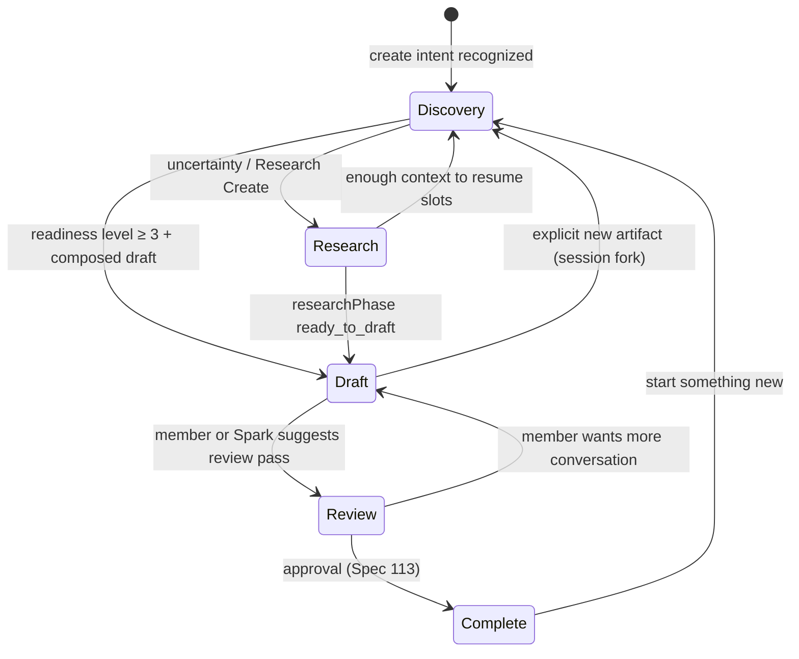

# Creating Together — Panel UX Redesign

**Date:** 2026-07-05  
**Status:** **Binding UX architecture** — no implementation until reviewed  
**Foundational principle:** **THE RELATIONSHIP OWNS THE WORK.**

**Member-facing name:** **Creating Together** — never *Create*, *Create panel*, *workflow*, or *document editor* in UI copy.  
**Internal routing** (`content-generator`, `AppSection`) may persist until migration — **members never see it**.

**Related:** [ESTATE_CREATION_EXPERIENCE.md](./ESTATE_CREATION_EXPERIENCE.md) · [STUDIO_READINESS_INTELLIGENCE.md](./STUDIO_READINESS_INTELLIGENCE.md) · [ADAPTIVE_CREATION_INTELLIGENCE.md](./ADAPTIVE_CREATION_INTELLIGENCE.md) · [CONVERSATION_SESSION_ARCHITECTURE.md](./CONVERSATION_SESSION_ARCHITECTURE.md) · Spec 104 · Spec 109

---

## Executive summary

The panel beside conversation is **not** a document editor, form, wizard, or workflow. It is the **visual representation of the conversation** — work the member and Spark already built together, quietly growing while chat stays primary.

| Old mental model | New mental model |
|------------------|------------------|
| "I'm filling out another form" | "We're building this together" |
| Open Create → blank template | Conversation creates; panel **reflects** |
| Type in panel fields | **Conversation is primary input** |
| Export buttons from the start | **Complete stage only** |
| "What would you like to change?" early | **Review stage only** |

**Core law:**

> The conversation creates the work.  
> The Studio simply makes the work visible.

---

## 1. Complete UX redesign

### 1.1 Foundational principle

Every meaningful piece of work begins as a conversation. The panel lets the member **watch that conversation become something they can keep forever** — not duplicate it in fields.

### 1.2 Design rules (binding)

| Rule | Meaning |
|------|---------|
| **Conversation primary** | Frosted chat ≥70% attention; panel is peripheral until Draft+ |
| **Panel reflects, rarely collects** | Member types in panel only when they **want** to |
| **Never empty** | If insufficient content → show understanding, not blank templates |
| **Progressive disclosure** | Five stages; controls appear when earned |
| **No workflow language** | No steps, modules, wizards, "launch", "open workspace" |
| **Relationship-first copy** | Spark narrates; panel shows status, not instructions |
| **Estate feel** | Warm, minimal, quiet, confident — not dashboard |

### 1.3 The five panel stages

| Stage | Panel role | Document visible? | Export / Save? |
|-------|------------|-------------------|----------------|
| **1 — Discovery** | Live understanding mirror | **No** | **No** |
| **2 — Research** | Learning together progress | **No** | **No** |
| **3 — Draft** | Live document (already populated) | **Yes** — read-first, edit optional | **No** |
| **4 — Review** | Collaborative review surface | **Yes** — Spark suggests, member chooses | **No** |
| **5 — Complete** | Finished artifact + actions | **Yes** | **Yes** — Save, Print, Export, Share, … |

**Alignment with Studio Readiness:** Stages 1–2 map to `studioReadinessLevel` 0–2; Stage 3 begins at level 3–4; open only when draft is meaningful ([STUDIO_READINESS_INTELLIGENCE.md](./STUDIO_READINESS_INTELLIGENCE.md)).

### 1.4 Always-on chrome (every stage)

**Header (top):**

```
Creating Together
{Artifact label — e.g. Standard Operating Procedure}
{Current stage — e.g. Research}
{One warm line — e.g. "Building understanding together."}
```

**Status bar:** Discovery → Research → Draft → Review → Complete (visual progress, not clickable steps).

**Never show in Stages 1–2:** blank SOP fields, Process Name, empty textareas, template headers, Edit/Save/Export menus.

---

## 2. Wireframes (each stage)

*Layout: Estate scene full bleed · frosted conversation centered · **Creating Together panel** as quiet right companion (Spec 109 split — panel never dominates).*

### Stage 1 — Discovery

```
┌─────────────────────────────────────────────────────────────────┐
│ Creating Together          Standard Operating Procedure         │
│ Discovery                   Building understanding together.    │
├─────────────────────────────────────────────────────────────────┤
│ ● Discovery ── ○ Research ── ○ Draft ── ○ Review ── ○ Complete │
├─────────────────────────────────────────────────────────────────┤
│ WHAT I UNDERSTAND SO FAR                                        │
│ ┌─────────────────────────────────────────────────────────────┐ │
│ │ ✓ Purpose     Onboard new VAs consistently                  │ │
│ │ ✓ Audience    Virtual assistants on my team                 │ │
│ │ ⚪ Goal        Still discovering…                            │ │
│ │ ⚪ Success     Still discovering…                            │ │
│ └─────────────────────────────────────────────────────────────┘ │
│                                                                 │
│ MISSING PIECES (quiet, not accusatory)                          │
│ · What does "done well" look like for this process?             │
│                                                                 │
│ SPARK'S OBSERVATIONS (optional, 1 line max)                     │
│ "You mentioned email — we can weave that in when it fits."      │
├─────────────────────────────────────────────────────────────────┤
│ Relationship: We're shaping this together in conversation.      │
└─────────────────────────────────────────────────────────────────┘
     [ Optional sidebar collapsed — no actions required ]
```

**Not shown:** Process Name field, Steps 1/2/3, Build Draft button, type pickers, templates.

---

### Stage 2 — Research

```
┌─────────────────────────────────────────────────────────────────┐
│ Creating Together          Standard Operating Procedure         │
│ Research                    We're learning this together.       │
├─────────────────────────────────────────────────────────────────┤
│ ○ Discovery ── ● Research ── ○ Draft ── ○ Review ── ○ Complete │
├─────────────────────────────────────────────────────────────────┤
│ RESEARCH PROGRESS                                               │
│ Questions we've answered                                        │
│ · What tools does your VA use today? → Gmail, Notion            │
│                                                                 │
│ Questions we're exploring                                       │
│ · What should happen before day one?                            │
│                                                                 │
│ HELPFUL DISCOVERIES                                             │
│ · Most teams document handoff in a shared checklist             │
│                                                                 │
│ WORKFLOW WE'RE BUILDING (emerging outline — not editable form)  │
│ 1. Access setup (draft)                                         │
│ 2. First-week expectations (exploring)                          │
│                                                                 │
│ RESEARCH NOTES (auto from chat — read only)                     │
│ "Member hasn't done this before — teaching before documenting." │
├─────────────────────────────────────────────────────────────────┤
│ [ sidebar ▸ ]  Suggested (never required):                      │
│                · Find best practices                            │
│                · Generate outline                               │
│                · Build flowchart (later)                        │
└─────────────────────────────────────────────────────────────────┘
```

**Member feeling:** *"We're learning this together."*

---

### Stage 3 — Draft

```
┌─────────────────────────────────────────────────────────────────┐
│ Creating Together          Standard Operating Procedure         │
│ Draft                       I'll keep updating this as we talk. │
├─────────────────────────────────────────────────────────────────┤
│ ○ Discovery ── ○ Research ── ● Draft ── ○ Review ── ○ Complete   │
├─────────────────────────────────────────────────────────────────┤
│ LIVE DOCUMENT (populated — not blank)                           │
│ ┌─────────────────────────────────────────────────────────────┐ │
│ │ VA Onboarding SOP                                           │ │
│ │ Purpose: … (from chat)                                      │ │
│ │ Audience: …                                                 │ │
│ │ ─────────────────                                           │ │
│ │ 1. Create accounts …                                        │ │
│ │ 2. Share SOP folder …                                       │ │
│ │ (updates automatically as conversation continues)           │ │
│ └─────────────────────────────────────────────────────────────┘ │
│                                                                 │
│ Quiet hint: Tap any section to edit — only if you want to.      │
├─────────────────────────────────────────────────────────────────┤
│ Live understanding (compact)                                    │
│ ✓ Purpose ✓ Audience ✓ Goal ✓ Outline started                  │
└─────────────────────────────────────────────────────────────────┘
```

**Rules:** Document opens **already containing** purpose, audience, known info, outline, working draft. Conversation patches draft — **no copy/paste, no duplicate entry**.

---

### Stage 4 — Review

```
┌─────────────────────────────────────────────────────────────────┐
│ Creating Together          Standard Operating Procedure         │
│ Review                      Let's make sure this feels right.   │
├─────────────────────────────────────────────────────────────────┤
│ ○ Discovery ── ○ Research ── ○ Draft ── ● Review ── ○ Complete  │
├─────────────────────────────────────────────────────────────────┤
│ DOCUMENT (primary)          │ SPARK'S REVIEW (collaborative)    │
│ ┌─────────────────────────┐ │ · Step 2 could be clearer         │
│ │ (same live draft)       │ │ · We may have missed backup access│ │
│ │                         │ │ · This section feels repetitive   │
│ └─────────────────────────┘ │                                   │
│                             │ "Would you like me to simplify    │
│                             │  the handoff section?"            │
│                             │ [ Yes, simplify ] [ Keep talking ]│
├─────────────────────────────────────────────────────────────────┤
│ REMOVED from early stages: "What would you like to change?"     │
│ Lives HERE only — when there is enough work to review.          │
└─────────────────────────────────────────────────────────────────┘
```

Review is **collaborative** — Spark proposes; member decides. Not an edit form interrogation.

---

### Stage 5 — Complete

```
┌─────────────────────────────────────────────────────────────────┐
│ Creating Together          Standard Operating Procedure         │
│ Complete                    This feels like a natural place.    │
├─────────────────────────────────────────────────────────────────┤
│ ● Discovery ── ● Research ── ● Draft ── ● Review ── ● Complete  │
├─────────────────────────────────────────────────────────────────┤
│ FINAL DOCUMENT (read-only default; edit if member asks)         │
│ ┌─────────────────────────────────────────────────────────────┐ │
│ │ (full draft)                                                │ │
│ └─────────────────────────────────────────────────────────────┘ │
│                                                                 │
│ WHAT WE BUILT TOGETHER (2 lines — Spec 113 certainty)         │
│ Saved to your work · You can ask anytime to find it again.       │
│                                                                 │
│ ACTIONS (first appearance of destructive/export chrome)         │
│ [ Save ] [ Save Blueprint ] [ Print ] [ PDF ] [ Word ]          │
│ [ Checklist Version ] [ Training Version ] [ Export ] [ Share ] │
│ [ Duplicate ]                                                   │
│                                                                 │
│ [ Keep talking ]  ← always available (Spec 110)                 │
└─────────────────────────────────────────────────────────────────┘
```

---

## 3. Component hierarchy

### 3.1 Target tree (member-facing shell)

```
CreatingTogetherPanel                    ← replaces ContentGeneratorPanel UX shell
├── CreatingTogetherHeader               ← artifact, stage, relationship line
├── CreatingTogetherStatusBar            ← 5-stage progress indicator
├── CreatingTogetherStageRouter          ← reads session.stage
│   ├── DiscoveryStageView               ← Stage 1
│   │   ├── LiveUnderstandingCard
│   │   ├── MissingPiecesList
│   │   └── SparkObservationLine (0–1)
│   ├── ResearchStageView                ← Stage 2
│   │   ├── ResearchProgressSections
│   │   ├── EmergingWorkflowOutline
│   │   └── ResearchNotesFeed
│   ├── DraftStageView                   ← Stage 3
│   │   ├── LiveDraftDocument            ← read-first; optional inline edit
│   │   └── CompactUnderstandingStrip
│   ├── ReviewStageView                  ← Stage 4
│   │   ├── LiveDraftDocument
│   │   └── CollaborativeReviewPanel     ← adapt CreateDraftReviewChat patterns
│   └── CompleteStageView                ← Stage 5
│       ├── FinalDocumentView
│       ├── CertaintySummary             ← Spec 113
│       └── CompletionActionsBar         ← ExportActions / save — gated here only
├── OptionalHelpSidebar                  ← collapsed default; suggested actions
└── (no CreateLauncherPanel at open)     ← launcher retired from arrival path
```

### 3.2 Data / logic layer (internal — not UI)

```
lib/creatingTogether/
├── types.ts                    CreatingTogetherStage, PanelViewModel
├── panelViewModel.ts           session → stage UI props (pure)
├── conversationSync.ts       chat turn → patch understanding + draft
├── stageTransitions.ts         rules for Discovery→Research→Draft→…
└── narrations.ts               Spark panel-adjacent lines (dev + optional hints)

lib/conversationSession/        ← Pass 2 spine (owner of all state)
├── sessionStore.ts
└── studioReadinessLevel        ← gates Draft visibility

lib/universalCreation/          ← discovery engine (adapter, not owner)
lib/createExperience/           ← routing after readiness gate
```

### 3.3 Retire / adapt / keep

| Current component | Disposition |
|-------------------|-------------|
| `ContentGeneratorPanel.tsx` | **Replace shell** with `CreatingTogetherPanel`; shrink to router |
| `CreateLauncherPanel.tsx` | **Retire** from member arrival — type from conversation only |
| `CreateWorkflowPanel.tsx` | **Retire** — panel questions duplicate chat |
| `CreateTypePicker.tsx` | **Retire** from panel — conversation classifies type |
| `CreateTemplatePanel.tsx` | **Retire** early template pickers |
| `CreateAddDetailPanel.tsx` | **Retire** — "add detail" lives in chat |
| `CreateWorkspaceV2Panel.tsx` | **Retire** section textareas in Discovery/Research |
| `CreateDiscoveryWorkspace.tsx` | **Adapt** → `DiscoveryStageView` + `LiveUnderstandingCard` |
| `DraftWorkspacePanel.tsx` | **Adapt** → `LiveDraftDocument` (Stage 3+) |
| `CreateDraftReviewChat.tsx` | **Adapt** → `CollaborativeReviewPanel` (Stage 4) |
| `DraftActionBar.tsx` | **Gate** → `CompleteStageView` only |
| `CreateOptionsMenu.tsx` | **Gate** → Complete + overflow only |
| `WorkspaceSopProgress.tsx` | **Replace** → `CreatingTogetherStatusBar` |
| `ExportActions.tsx` | **Stage 5 only** |
| `EmailGeneratorPanel.tsx` | **Merge** into Creating Together draft view per artifact plugin |

---

## 4. State transitions

### 4.1 Panel stage state machine



### 4.2 Transition rules (binding)

| From → To | Condition |
|-----------|-----------|
| → **Discovery** | `artifactType` known; `studioReadinessLevel` ≤ 1 |
| → **Research** | Research Create activated ([ADAPTIVE_CREATION_INTELLIGENCE.md](./ADAPTIVE_CREATION_INTELLIGENCE.md)) |
| → **Draft** | `studioReadinessLevel` ≥ 3 **and** `draftContent` has substantive body (not scaffold-only) |
| → **Review** | Permission + member signal or Spark suggestion after draft stable |
| → **Complete** | Member approves in Review (Spec 110 / 113) |

**Blocked:** Discovery → Draft if only `blankScaffoldForType` content exists.

### 4.3 Map from legacy `CreateWorkspacePhase`

| Legacy | New stage |
|--------|-----------|
| `gathering` | Discovery or Research |
| `ready` | Discovery (pre-draft) — **not** "ready to show empty editor" |
| `generating` | Draft (composing — show progress in panel, not spinner chrome) |
| `draft-ready` | Draft or Review |
| `error` | Same stage + recovery line in panel (Shari voice) |

### 4.4 Map from Universal Creation phases

| UC phase | Panel stage |
|----------|-------------|
| `discovery` | Discovery |
| `preparation` | Discovery → Draft transition (internal) |
| `guided_creation` | Draft |
| `enhancement` | Draft or Review |
| `review` / `revision` | Review |
| `approval` / `completion` | Complete |

---

## 5. Conversation synchronization

### 5.1 Single write path

```
Member message (chat)
    → Conversation Priority Engine (Pass 1)
    → Conversation Session (Pass 2 owner)
    → Universal Creation / Research adapters
    → draftComposer (async, non-blocking — Spec 118)
    → session.understanding + session.draftContent
    → panelViewModel(session) → React re-render
```

**Forbidden:** Panel field `onChange` → separate `createWorkflowRecord` discovery authority.

### 5.2 What updates automatically (every chat turn)

| Session field | Panel surface |
|---------------|---------------|
| `discoverySlots` / `answers` | Live understanding ✓/⚪ |
| `missingPieces[]` | Missing pieces list |
| `researchNotes[]` | Research notes |
| `emergingOutline[]` | Workflow we're building |
| `draftContent` | Live document (Stage 3+) |
| `reviewSuggestions[]` | Review panel (Stage 4) |
| `studioReadinessLevel` | Stage router + status bar |

### 5.3 Spark narration (chat — not panel labels)

Examples (Shari test):

- "I think we're ready to begin drafting."
- "We've learned enough to start building."
- "I'll keep updating this while we talk."
- "I think the structure is coming together nicely."

Panel shows **status**; Spark **speaks** in conversation.

### 5.4 Panel never interrupts

- No modal on stage change  
- No "Build draft" button mid-discovery  
- No focus steal from chat input  
- Split layout: chat input always visible (Spec 109)

---

## 6. Studio synchronization

**Studio** = capability inside Estate Place ([ESTATE_CREATION_EXPERIENCE.md](./ESTATE_CREATION_EXPERIENCE.md)). **Creating Together panel** = conversation-side mirror; they share one session.

```
Conversation Session (single owner)
    ├── panelStage: CreatingTogetherStage
    ├── studioReadinessLevel: 0–5
    ├── draftContent
    └── estatePlaceId + studioRegistryId

When studioReadinessLevel ≥ 4 AND permission:
    Place navigation (optional, gentle)
    Studio hydrates from session.draftContent — never blankScaffoldForType

Panel Stage 3 (Draft) may appear BEFORE physical Studio open:
    Member sees document beside chat first
    Studio open = "make visible in place" — not start over
```

**Rule:** Panel and Studio show the **same** `draftContent` revision. Studio is not a second editor with empty state.

---

## 7. Review experience

### 7.1 Philosophy

Review is **collaborative conversation** with a document visible — not "What would you like to change?" on an empty form.

### 7.2 Spark review behaviors (examples)

- "I think this step could be clearer."
- "I found something we may have missed."
- "This section feels repetitive."
- "Would you like me to simplify this?"

### 7.3 Member choices (max 3 — T-003)

1. Accept suggestion (Spark patches draft — permission)  
2. Keep talking (stay in Review or return to Draft)  
3. Move to Complete (if ready)

### 7.4 UI

- Left: live draft (scroll sync)  
- Right: review thread (adapt `CreateDraftReviewChat` — suggestions, not generic edit menu)  
- **No** `DraftActionBar` Edit/Save/Export in Review

### 7.5 Entry gate

Enter Review only when:

- `draftContent.length` ≥ artifact-specific minimum  
- Member has seen populated Draft stage at least once  
- Optional: Spark asks permission to review together

---

## 8. Completion experience

### 8.1 Spec alignment

- **Spec 110** — member owns completion; "Keep talking" always  
- **Spec 113** — certainty: what happened, where it lives, how to find later  
- **Spec 106** — permission before export/share  

### 8.2 First appearance of actions

Stage 5 **only:**

Save · Save Blueprint · Print · PDF · Word · Checklist Version · Training Version · Export · Share · Duplicate

### 8.3 Copy (examples)

- "This feels like a natural stopping point."  
- "It's saved with your work — ask me anytime to pull it up."  
- Not: "Save successful" / "Export complete"

### 8.4 Quiet organization (invisible)

Autosave · version · Brain link · project connect — Spec 118, no panel chrome

---

## 9. Migration plan

### 9.1 Phases (small commits, flags)

| Phase | Deliverable | Member-visible |
|-------|-------------|----------------|
| **CT-0** | This document + `CreatingTogetherStage` types | No |
| **CT-1** | `panelViewModel.ts` + Storybook/static previews of 5 stages | No |
| **CT-2** | `CreatingTogetherHeader` + `StatusBar` behind `CREATING_TOGETHER_PANEL=1` | Header only |
| **CT-3** | `DiscoveryStageView` replaces launcher/workflow in gathering phase | Discovery UX |
| **CT-4** | `ResearchStageView` + Research Create session fields | Research UX |
| **CT-5** | Conversation → session draft sync; `DraftStageView` | Live draft |
| **CT-6** | Gate `DraftActionBar` / exports to Complete only | Less clutter |
| **CT-7** | `ReviewStageView` + retire early edit prompts | Review UX |
| **CT-8** | `CompleteStageView` + Spec 113 copy | Completion |
| **CT-9** | Studio hydration from session; retire blank open | No blank Studio |
| **CT-10** | Remove legacy panels; rename internal docs | Cleanup |

### 9.2 Feature flags

| Flag | Default | Effect |
|------|---------|--------|
| `CREATING_TOGETHER_PANEL` | `0` → `1` in dev | New panel shell |
| `CREATING_TOGETHER_STAGE` | per-stage rollout | Force stage for QA |
| `CREATING_TOGETHER_NO_LAUNCHER` | `0` | Hide CreateLauncherPanel |
| `CREATING_TOGETHER_COMPLETE_ONLY_EXPORT` | `0` | Gate DraftActionBar |
| `STUDIO_READINESS_GATE` | see Studio Readiness doc | Blocks blank Studio |

### 9.3 Rollback

Flags off → current `ContentGeneratorPanel` path. Session dual-write during CT-1–5 so legacy workflow record still works.

### 9.4 Copy migration checklist

Replace member-visible:

| Remove | Replace with |
|--------|--------------|
| Create / Create panel | Creating Together |
| Workflow / step / module | Stage / building together |
| Build draft / Generate | (Spark says in chat; panel updates) |
| What would you like to create? | (conversation only) |
| Open workspace / Launch | (never) |
| Document editor / form fields (early) | What I understand so far |

Internal registry (`knowledgeRegistry.ts` `name: "Create"`) → update to Creating Together when Estate Knowledge pass runs — **out of scope for CT-0–8**.

---

## 10. Regression risks

| Risk | Severity | Mitigation |
|------|----------|------------|
| **Blank panel** if session empty | High | Never render Stage 3+ without content; fallback to Discovery view model |
| **Power users** who typed in panel fields | Medium | Optional "Edit section" in Draft+ only; chat remains primary |
| **Export regression** | Medium | Stage 5 parity tests vs current `ExportActions` |
| **SOP Process Studio** separate UI | High | Single session feeds both panel + Process fields — no duplicate stores |
| **CREATE_WORKSPACE_V2** flag paths | Medium | One stage router; deprecate V2 section editors in discovery |
| **Email fast path** | Low | Quick Create → shorter Discovery, still Live Understanding before Draft |
| **Performance** | Medium | Debounce draft sync; panel updates async (Spec 118) |
| **Observation Mode** | Low | CT-11 smoke: SOP, email, "I don't know", review, complete |
| **Estate split layout** | Medium | Photograph Test — panel must not feel like dashboard (Spec 103) |

---

## 11. Audit — current Create panel (2026-07-05)

### 11.1 Files reviewed

| File | Problem |
|------|---------|
| `ContentGeneratorPanel.tsx` | Orchestrates launcher, workflow, V2, draft, exports — **too many modes at once** |
| `CreateLauncherPanel.tsx` | Type picker + "Recommended **workflow**" help — **form arrival** |
| `CreateWorkflowPanel.tsx` | In-panel discovery questions + "Creating:" header — **duplicates chat** |
| `CreateWorkspaceV2Panel.tsx` | Multiline **section editors** early — **member types in panel** |
| `CreateAddDetailPanel.tsx` | Extra detail form — belongs in conversation |
| `CreateTemplatePanel.tsx` | Template selection — premature |
| `CreateDiscoveryWorkspace.tsx` | Closest to target — still has build/audience UI in panel |
| `DraftWorkspacePanel.tsx` | Document editor — OK for Stage 3+ if populated |
| `DraftActionBar.tsx` | Edit/Save/Export/Social — **appears too early** |
| `CreateDraftReviewChat.tsx` | Good review seed — not gated to Review stage |
| `CreateDraftSectionEdit.tsx` | Section edit — Review/Draft only |
| `WorkspaceSopProgress.tsx` | SOP-specific progress — replace with unified status bar |
| `lib/createExperience/createExperienceRouting.ts` | `blankScaffoldForType` + `followUpForItemType` — **blank + re-interview** |
| `lib/createInitialization.ts` | `BLANK_ARTIFACT_SCAFFOLDS` — **placeholder headers** |
| `lib/createWorkflow.ts` | Panel-side discovery state — should be session adapter |
| `lib/createBuild.ts` | `gathering`/`ready` phases conflate "ready" with empty editor |

### 11.2 Unnecessary controls to remove (Stages 1–2)

- Type picker / category picker / custom type input  
- In-panel discovery question cards + VoiceAnswerField  
- Build Draft / Build with Shari buttons in panel  
- Template picker / audience builder as required steps  
- Section textarea grids (V2)  
- Export / Save / Edit dropdowns  
- "Add more detail" panel step  
- Workspace help "Recommended workflow" numbered list (software copy)

### 11.3 Duplicate inputs

| Chat collects | Panel also asks |
|---------------|-----------------|
| UC discovery questions | `CreateWorkflowPanel` discovery |
| Audience / tone | `AudienceSelector` in launcher + discovery workspace |
| Brief / purpose | Workflow `collectedAnswers` + panel fields |
| Draft content | V2 sections + chat draft — **two owners** |

### 11.4 Interruptions

- `completeImmediateCreateOpen` — Studio/panel with blank artifact  
- `followUpForItemType` — re-asks after open  
- Focus field routing to panel mid-chat  
- `exportTrigger` from chat before Complete  

### 11.5 Terminology to replace

| Location | Current | Target |
|----------|---------|--------|
| `CreateWorkflowPanel` | "Creating:" | Creating Together header |
| `CreateLauncherPanel` | "Create" | (remove — no launcher) |
| `WorkspaceStepCard` | sectionLabel "Create" | Stage name |
| `estateBrain/knowledgeRegistry` | `name: "Create"` | Creating Together (internal pass) |
| Spec 104 references | Create™ | Creating Together (member); spec title legacy OK |

---

## 12. Optional right sidebar

**Default:** collapsed. **Never required.**

Suggested actions (permission-based, max 3 visible):

- Research this topic  
- Find best practices  
- Generate outline  
- Create checklist  
- Build flowchart  
- Find examples  
- Collect screenshots later  
- Create FAQ  

Selecting an action → Spark handles in **conversation**; panel reflects results. Not a second workflow.

---

## 13. Visual feel (binding)

| Attribute | Guidance |
|-----------|----------|
| **Palette** | Estate warm neutrals, teal accent sparingly — match frosted chat |
| **Typography** | Spec 109 minimums when panel text is primary in Draft+ |
| **Density** | Calm spacing; one primary idea per card |
| **Motion** | Quiet fade when understanding updates — no celebration confetti |
| **Empty states** | Never blank — always "what we know" |
| **Forbidden** | KPI tiles, step numbers as gamification, emoji grids, software labels |

**Photograph Test:** Could this panel hang beside the Conservatory scene and still feel like **watching thoughts become something meaningful**?

---

## 14. Release gate (Ch 23 + Shari test)

1. Does the member feel *"We're building this together"*?  
2. Is conversation clearly primary?  
3. Is the panel never empty without explanation?  
4. Are exports absent until Complete?  
5. Does Draft show **populated** work, not templates?  
6. Passes [STUDIO_READINESS_INTELLIGENCE.md](./STUDIO_READINESS_INTELLIGENCE.md) gate?  
7. Relationship Constitution — no shame, no "behind", no software voice?

**Any no → not shippable.**

---

## 15. Final principle (canonical)

> Every meaningful piece of work begins as a conversation.  
> The Creating Together panel allows the member to watch that conversation become something they can keep forever.  
> The member should never feel like they are filling out forms.  
> They should feel like they are creating something with a trusted companion.

**Conversation leads. The panel follows. The relationship decides when work becomes visible.**

---

*End of Creating Together Panel UX Redesign — binding architecture pending review.*
