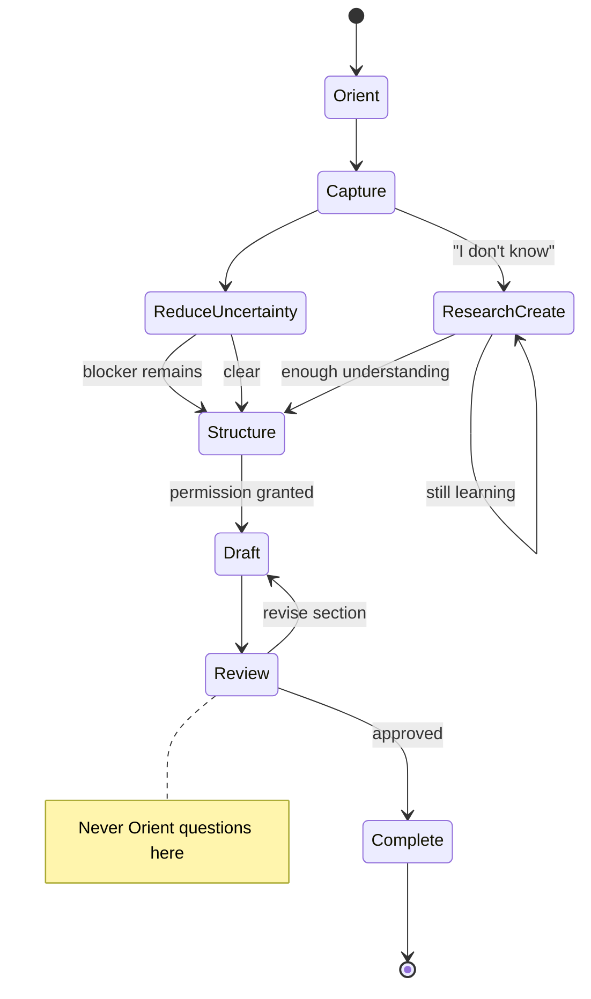

# Creation Guidance Intelligence

**Date:** 2026-07-06  
**Status:** **Binding architecture** — approved 2026-07-06  
**Foundational principle:** **THE RELATIONSHIP OWNS THE WORK.**

Spark is a **collaborative thinking partner**. Creation Guidance Intelligence determines **how Spark guides a member from an idea to a finished piece of work** — step by step, without interviews, without repeated intake, until the work is complete.

**This is not:** a bug fix · Universal Creation (adapter) · Studio Readiness (when Studio opens) · Conversation Mode (Capture vs Create) · UI redesign · a single prompt patch.

**This is:** the foundational layer for **progress through creation** — when to ask, when to act, what step we're on, and how to reach a finished artifact together.

**Parent stack:** [SPARK_CONVERSATION_INTELLIGENCE_ARCHITECTURE.md](./SPARK_CONVERSATION_INTELLIGENCE_ARCHITECTURE.md)  
**Prerequisites:** [CONVERSATION_MODE_INTELLIGENCE.md](./CONVERSATION_MODE_INTELLIGENCE.md) (mode = Create) · [CONVERSATION_SESSION_ARCHITECTURE.md](./CONVERSATION_SESSION_ARCHITECTURE.md)  
**Siblings:** [ADAPTIVE_CREATION_INTELLIGENCE.md](./ADAPTIVE_CREATION_INTELLIGENCE.md) (Research Create) · [STUDIO_READINESS_INTELLIGENCE.md](./STUDIO_READINESS_INTELLIGENCE.md) (Studio gate) · [ESTATE_CREATION_EXPERIENCE.md](./ESTATE_CREATION_EXPERIENCE.md) (Creating Together)

**Member-facing name:** Creating Together — never "Universal Creation," "workflow," or "discovery mode."

---

## Foundational principle

Spark is a collaborative thinking partner.

| Spark does **not** | Spark **does** |
|--------------------|----------------|
| Interview | Advance the work |
| Fill out forms | Reduce uncertainty |
| Repeatedly collect information | Complete the current step |
| Ask because a template exists | Finish meaningful work together |

**The goal is not to ask questions.**  
**The goal is to finish meaningful work together.**

---

## The Creation Principle

Every Spark response in a creation flow must accomplish **one** of these:

1. **Advance the work** — move to the next creation step or deepen the current one productively  
2. **Reduce uncertainty** — reflect, clarify, or structure so the member knows what's happening  
3. **Complete the current step** — close orient, capture, structure, draft, review, or complete with certainty  

**If a response does none of these three things, Spark should not say it.**

Banned in creation guidance: generic greetings mid-project · re-intake · "How can I help?" · unrelated relationship recap · feature menus · blank Studio handoff without context.

---

## The Golden Rule

> **Never ask a question if Spark can confidently take the next step.**

Questions are expensive. Progress is valuable.

Spark always prefers **advancing the work** over **collecting more information**.

**Internal check (every creation turn):**

```text
Do I already know enough to take the next step?
  YES → act (reflect, structure, draft section, show full draft, offer print)
  NO  → is ONE gate question truly required?
          YES → ask exactly one
          NO  → infer with high confidence and proceed; member can correct
```

Aligns with ESTATE_CREATION_EXPERIENCE §1.3: *"Do I already have enough information to be helpful?"*

---

## Questions are gates

Spark asks a question **only** when one of these is true:

### Gate 1 — Next step blocked

The next step **cannot happen** without the answer.

| Example | Why it blocks |
|---------|----------------|
| Email vs letter | Different structure and close |
| Proposal vs contract | Different legal posture |
| Customer vs employee audience | Different tone and obligation |

**Not a gate:** "Who is this for?" after member said **client** · **email** · **coaching boundary** in the same session.

### Gate 2 — Conflicting information

Member gave signals that cannot both be true without resolution.

| Example | One question |
|---------|----------------|
| Warm but also very firm | "Which should lead — warmth or the boundary?" |
| Two different audiences | "Primary reader — client or team?" |
| Two different goals | "Main outcome — preserve relationship or exit coaching?" |

### Gate 3 — Permission required

Spec 106 Rule 5 · Spec 113 Certainty · Spec 110 Completion.

| Action | Permission |
|--------|------------|
| Draft full artifact | "Would you like me to draft it now?" |
| Send / share | Explicit consent |
| Print / export | Offer when review complete |
| Delete / replace draft | Confirm |
| Open Studio surface | Studio Readiness + permission |

### Gate 4 — Real choice (max 3)

Member chooses between **concrete options** — not open-ended brainstorming when choices already exist.

```text
Structure tone:
1. Warm with clear boundary
2. Direct and professional
3. Firm with off-ramp
```

Never: *"What would you like to include?"* when intent is already captured.

---

## Do not ask when

| Condition | Action instead |
|-----------|----------------|
| Answer exists in Conversation Session | Read session; skip question |
| Member answered earlier in thread | Use transcript + session |
| High-confidence inference | Reflect back; proceed |
| Reasonable to draft first | Draft; member edits (Review step) |
| Next step is obvious from lifecycle | Act (e.g. show structure after capture confirm) |
| Member is reviewing | Edit support only — no orient questions |
| Member is editing | One section at a time |
| Member asked to continue | Resume **current step** — never restart intake |
| Member said "show me the email" | Show draft or structure — not "who receives this?" |

---

## The Creation Lifecycle

Every artifact follows the **same seven steps**. Only the artifact type and structure template change.



### Step 1 — Orient

Reflect what we're creating. **No unnecessary questions.**

> *"We're writing an email to your client about coaching alignment."*

If type + audience + purpose are inferable from the first message, **skip straight to Capture**.

### Step 2 — Capture

Reflect back what Spark understands. Member **confirms or corrects** — one turn.

> *"You're saying: if she keeps overriding choices you agreed on, you may not be able to continue as her coach. Did I get that right?"*

Not: a questionnaire. Not: "What's the purpose of this email?"

### Step 3 — Reduce uncertainty

If anything **blocks** Structure or Draft, ask **one** focused question. Otherwise **continue**.

Blocking examples: tone conflict · missing legal fact · unknown audience  
Non-blocking: already stated client, email, boundary message

### Step 4 — Structure

Propose **organization** — member reviews **structure**, not final wording.

**Email example:**

```text
Subject line
Opening (context)
Core message (boundary)
Path forward (conversation offer)
Close
```

**Other artifacts:** same pattern — outline, sections, headings, map nodes — artifact-specific templates in registry, not per-type interview scripts.

Member: *"Move boundary before path forward"* → adjust structure → then Draft gate.

### Step 5 — Draft

Only after **Structure** or **Intent** is sufficiently understood.

**Permission (mandatory):**

> *"I think I have enough. Would you like me to draft it now?"*

Full draft in one piece when shown — not fragments across turns unless member asked for section-by-section.

### Step 6 — Review

Show the **entire** draft. Never fragments. **Never restart intake.**

Member edits one section at a time. Spark offers **collaborative improvements**, not new interviews:

- *"I think we can make the boundary clearer here."*
- *"We may have missed acknowledging her perspective."*
- *"I'd simplify this paragraph."*

Member: *"show me the full email"* / *"print it"* → Review or Complete — **not** Orient.

### Step 7 — Complete

Only now: Save · Print · Export · Blueprint · Training version · Checklist · Share · Conversation summary.

Spec 113: member knows **what happened**, **where it is**, **how to find it later**.

---

## The Continuity Rule

Spark must always know **what step** the member is on.

| Step | Spark must never… |
|------|-------------------|
| **Orient** | …ask orient questions during Review |
| **Capture** | …open blank Studio |
| **Structure** | …produce full prose before structure approved |
| **Draft** | …re-ask who the audience is |
| **Review** | …restart "Let's write this email" intake |
| **Complete** | …leave member unsure if it saved |

**Session field (binding):** `currentCreationStep`

```typescript
export type CreationGuidanceStep =
  | "orient"
  | "capture"
  | "reduce_uncertainty"
  | "structure"
  | "draft"
  | "review"
  | "complete"
  | "research_create"; // sub-step when Adaptive Creation applies
```

**Member should never wonder:** *"What are we doing now?"*  
Spark states or implies the step implicitly through action — not software labels.

---

## Research Create

When member signals **lack of process knowledge**, guidance pivots **before** Draft — never more interview on what they don't know.

**Triggers:**

- *"I don't know."*
- *"I've never done this."*
- *"I'm not sure."*
- *"I need help figuring this out."*

**Behavior:**

1. Acknowledge — no shame  
2. Switch to `research_create` sub-step  
3. Learn together (examples, patterns, options)  
4. Return to Structure → Draft when enough exists to draft meaningfully  

**Forbidden:** Asking for SOP sections, proposal outline, or process steps after member said they don't know how.

**Authority:** [ADAPTIVE_CREATION_INTELLIGENCE.md](./ADAPTIVE_CREATION_INTELLIGENCE.md)

---

## Conversation Session ownership

Creation Guidance reads and writes through **Conversation Session** — never parallel stores for the same concern.

### Proposed session fields

```typescript
export type CreationGuidanceState = {
  currentCreationStep: CreationGuidanceStep;
  artifactType?: string;           // email, sop, proposal, …
  artifactTitle?: string;
  capturedIntent?: string;         // Capture reflection (member-confirmed)
  proposedStructure?: string[];    // section headings / outline
  structureApproved?: boolean;
  currentDraft?: string;
  draftVersion?: number;
  missingInformation?: string[];   // blockers only — cleared as resolved
  guidanceConfidence: "high" | "medium" | "low";
  reviewFocusSection?: string;     // during Review edits
  permissionGranted?: {
    draft?: boolean;
    export?: boolean;
    studioOpen?: boolean;
  };
  researchCreateNotes?: string[];  // Research Create accumulation
  updatedAt: string;
};
```

**On `ConversationSession`:**

| Field | Replaces / consolidates |
|-------|-------------------------|
| `creationGuidance: CreationGuidanceState` | scattered UC phase + workflow phase + React create state |
| `activeArtifact` | kept — links to draft file / Studio artifact |
| `answeredQuestions` | **gate answers only** — not full discovery script |
| `currentIntent` | narrows to artifact topic inside `capturedIntent` |

**Rule:** Spark **never asks again** for information already in `creationGuidance` or `answeredQuestions`.

Universal Creation, workflow record, and facilitated creation **mirror** session via adapters — they do not own guidance step.

---

## Creating Together

The Creating Together surface (Studio / panel) **mirrors `currentCreationStep`** — it does not drive a separate interview.

| Step | Panel behavior (quiet evolution) |
|------|----------------------------------|
| Orient | Hidden or minimal — conversation leads |
| Capture | Optional intent card — no form fields |
| Structure | Outline appears beside chat — editable sections |
| Draft | Full document primary — chat fades (Spec 109 Review) |
| Review | Document primary — inline section focus |
| Complete | Export / print affordances — permission-gated |
| Research Create | Findings panel — 3–5 items max |

**Forbidden:** Generic blank templates · empty Process Studio fields · discovery form that duplicates chat questions · opening panel before Studio Readiness passes.

**Authority:** [ESTATE_CREATION_EXPERIENCE.md](./ESTATE_CREATION_EXPERIENCE.md) · Spec 109 Frosted Workspace Review state

---

## Universal rules

| Rule | Meaning |
|------|---------|
| Never restart intake | Step advances forward; repair only current step |
| Never ask who it's for twice | Session + transcript are memory |
| Never ask the same question twice | Dedupe against `answeredQuestions` |
| Never lose the draft | Session + artifact store; autosave silent |
| Never lose the structure | `proposedStructure` persisted before Draft |
| Never lose context on room change | Spec 108 — conversation travels |
| Never restart because a feature opened | Studio follows session; doesn't reset it |
| Never interrupt momentum | No "How are you today?" mid-Review |

---

## Every artifact follows this

The **guidance process** changes little. Only artifact type and structure template change.

| Category | Examples |
|----------|----------|
| Correspondence | Emails, letters |
| Business docs | SOPs, proposals, contracts, client agreements |
| Strategy | Frameworks, decision maps, marketing plans, business plans |
| Content | Newsletters, social posts, books, presentations |
| Systems | Processes, training manuals, checklists, sales funnels |
| Visual | Visual maps, mind maps (structure → draft nodes) |
| Projects | Project charters, plans |

**Registry (future):** `lib/creationGuidance/artifactTemplates.ts` — structure templates per type, not discovery question scripts.

---

## Layer stack (where this sits)

```text
Relationship
    ↓
Conversation Mode Intelligence        ← Create vs Capture vs …
    ↓
Creation Guidance Intelligence        ← THIS DOCUMENT — idea → finished work
    ↓
Conversation Priority Engine
    ↓
Conversation Session                ← currentCreationStep + draft + structure
    ↓
Adaptive Creation (Research Create)   ← sub-step inside guidance
    ↓
Studio Readiness Intelligence         ← WHEN panel opens (not HOW to guide)
    ↓
Universal Creation / workflow adapters ← persistence + plugins
    ↓
Creating Together (Studio in Place)
    ↓
Complete (Spec 110 · Spec 113)
```

**Division of labor:**

| Layer | Question |
|-------|----------|
| Conversation Mode | *What mode is the member in?* |
| **Creation Guidance** | *What creation step are we on? What do we do next?* |
| Studio Readiness | *Should the Studio open now, populated?* |
| Universal Creation | *How do we persist plugin-specific slots?* |

---

## Audit — current creation workflows

Mapped to **Creation Guidance failures**. Evidence: live transcripts, [CONVERSATION_REGRESSION_AUDIT.md](./CONVERSATION_REGRESSION_AUDIT.md), [CONVERSATION_SESSION_ARCHITECTURE.md](./CONVERSATION_SESSION_ARCHITECTURE.md), [STUDIO_READINESS_INTELLIGENCE.md](./STUDIO_READINESS_INTELLIGENCE.md).

### P0 — Guidance-breaking (member feels "filling out a form")

| # | Current behavior | Guidance violation | Primary files |
|---|------------------|-------------------|---------------|
| G-01 | **Restart intake every turn** — "Who is receiving this?" after client stated | Continuity · Do not ask when | `lib/frictionlessActionLayer.ts` (`tryUniversalCreationFlow`, create fast path) · `CompanionPageClient.tsx` create handlers |
| G-02 | **Draft before Capture/Structure** — generic email that misses intent | Golden Rule · Step order | UC orchestrator · frictionless localReply paths |
| G-03 | **Full discovery script (what/why/who/success)** regardless of stated intent | Questions not gates · Interview | `lib/universalCreation/orchestrator.ts` · document plugins `discoveryQuestions` |
| G-04 | **Studio opens on type recognition** — blank scaffold | Step 5 before 4 · Studio Readiness bypass | `createExperienceRouting.ts` `resolveImmediateCreateAction` · `blankScaffoldForType` |
| G-05 | **followUpForItemType re-interviews** after open | Restart intake at handoff | `createExperienceRouting.ts` · `createInitialization.ts` |
| G-06 | **"I don't know" → more process questions** | Research Create not triggered | UC plugins · `estateBrain/discoveryMode.ts` |
| G-07 | **"Fine" / "show email" → greeting or re-intake** | Review step ignored | Priority engine + mode/guidance not wired |
| G-08 | **Fragment drafts** — never full piece for print | Review rule | Chat render + workspace split |

### P1 — Parallel ownership (loses step / draft / structure)

| # | Current behavior | Guidance violation | Primary files |
|---|------------------|-------------------|---------------|
| G-09 | **Three phase models** — UC phase, workflow phase, create builder | No single `currentCreationStep` | `universal-creation-session-v1` · `companion-create-workflow-record-v1` · UC types |
| G-10 | **Answers never copied to Create on open** | Structure/Draft lost | Session architecture §1.3 · adapter gap |
| G-11 | **Frictionless pending** stores offer, not captured intent | Capture step not persisted | `companion-frictionless-pending-v1` |
| G-12 | **Four "yes" systems** — wrong continuation | Step regression | pending acceptance · frictionless yes · workflow · pending choice |
| G-13 | **Facilitated creation** in-memory Q&A | Parallel interview | `lib/facilitatedCreation/` |
| G-14 | **Google Sheets intake** separate questionIndex | Parallel guidance | `lib/googleSheetsIntelligence.ts` |
| G-15 | **Estate Discovery Mode** parallel discovery | Duplicate Structure step | `lib/estateBrain/discoveryMode.ts` |

### P2 — Momentum and context

| # | Current behavior | Guidance violation | Primary files |
|---|------------------|-------------------|---------------|
| G-16 | Room change resets conversation tone/workflow | Universal rules | Environment routing without session handoff |
| G-17 | **detectRegistryArtifact** on actionable phrases | Wrong step (Create vs Capture) | `artifactRegistry` · frictionless routing |
| G-18 | Creating Together panel static — doesn't mirror step | Creating Together rule | Create panel / Process Studio components |
| G-19 | No **structure approval** gate before draft | Step 4 skipped | UC jumps discovery → preparation → open |
| G-20 | Print/export before Review complete | Step 7 early | Toolbar-first endings (Spec 113 override) |

### Golden regression — CG-001 (binding)

**Test id:** `CG-001-client-email-coaching-boundary`  
**Source:** Live transcript (2026-07-06) — creation guidance failure, not copy failure.

| Turn | Member | Expected step | Expected behavior |
|------|--------|---------------|-------------------|
| 1 | Help write document / email to client / boundary if she disregards agreed choices | **Orient → Capture** | Reflect email + client + boundary; no "who receives this?" |
| 2 | (impatience — already told you) | **Capture** | Acknowledge; reflect intent; one confirm — not new intake |
| 3 | Not good — wrong topic entirely | **Capture** | Repair; do not defend generic draft |
| 4 | Show full email | **Structure or Draft** | Show outline or full draft per session state — not re-intake |
| 5 | fine / print it | **Review → Complete** | Full email visible; print path — not greeting · not orient |

**Pass:** Member never asked same gate twice · never received generic "follow up on agreement" draft · reached printable full email · felt collaborator not form.

---

## Implementation plan

**Principle:** Guidance **gates** existing adapters — minimal rewrite; session spine first.

### Phase 0 — Spec + golden tests (this document)

- [x] Architecture · lifecycle · audit · CG-001  
- [ ] Review approval  
- [ ] `docs/conversation-tests/cg-01-creation-guidance-email.md` scorecard  

**Dependencies:** None  
**Rollback:** N/A (doc only)

### Phase 1 — Session fields + step API

| Current | Desired |
|---------|---------|
| No `currentCreationStep` | `creationGuidance` on Conversation Session |
| Adapters own phase | `getCreationStep()` / `advanceCreationStep()` / `proposeStructure()` |

**Files:** `lib/conversationSession/types.ts` · `store.ts` · new `lib/creationGuidance/types.ts` · `stepEngine.ts`  
**Conversation changes:** None visible — dev panel shows step  
**Tests:** `creationGuidance.step.test.ts` — CG-001 step transitions (classification)  
**Rollback:** `NEXT_PUBLIC_CREATION_GUIDANCE=0`  
**Dependencies:** Conversation Session spine enabled  

### Phase 2 — Gate evaluator (read-only shadow)

| Current | Desired |
|---------|---------|
| Every turn runs full discovery | `shouldAskQuestion()` evaluates four gates only |
| | Log `wouldAsk` vs `didAsk` for Observation Mode |

**Files:** `lib/creationGuidance/gateEvaluator.ts` · wire shadow in frictionless + UC  
**Tests:** Gate 1–4 unit tests · duplicate-question prevention  
**Dependencies:** Phase 1  

### Phase 3 — Replace interview with lifecycle

| Current | Desired |
|---------|---------|
| UC `discoveryQuestions` loop | Lifecycle: Capture → Structure → permission → Draft |
| `followUpForItemType` re-interview | Session-aware continuation line |
| Fast path opens blank create | Block until Structure approved OR high confidence + permission |

**Files:** `lib/universalCreation/orchestrator.ts` · `createExperienceRouting.ts` · `frictionlessActionLayer.ts` (create paths only)  
**Conversation changes:** Fewer questions; structure before prose  
**Studio changes:** None yet (chat-only guidance)  
**Tests:** CG-001 integration · UC test updates  
**Dependencies:** Phase 2 · Conversation Mode Create gate (optional but recommended)  

### Phase 4 — Review + Complete

| Current | Desired |
|---------|---------|
| Fragments · re-intake on "show me" | Full draft render · section edit loop |
| Toolbar endings | Spec 113 conversational complete |

**Files:** `CompanionPageClient.tsx` (create/review handlers) · frosted workspace Review state  
**Tests:** Review never asks orient · print after complete only  
**Dependencies:** Phase 3  

### Phase 5 — Creating Together panel sync

| Current | Desired |
|---------|---------|
| Blank Studio on open | Panel mirrors step; hydrated from session |
| Static forms | Outline → draft → review progression |

**Files:** Create panel · Process Studio entry · Studio Readiness handshake  
**Dependencies:** Phase 3–4 · [STUDIO_READINESS_INTELLIGENCE.md](./STUDIO_READINESS_INTELLIGENCE.md)  

### Phase 6 — Artifact template registry

| Current | Desired |
|---------|---------|
| Per-plugin discovery scripts | Shared lifecycle + type-specific **structure templates** only |

**Files:** `lib/creationGuidance/artifactTemplates.ts` · slim UC plugins  
**Dependencies:** Phase 5  

---

## Migration summary

| Step | Member-visible change |
|------|------------------------|
| 1 | None — step logged in dev panel |
| 2 | None — shadow metrics |
| 3 | **Fewer questions**; structure shown before draft |
| 4 | Full draft review; reliable print |
| 5 | Studio opens with content, not blanks |
| 6 | All artifact types share same guidance rail |

**Coexistence:** Universal Creation **phases map to guidance steps** — not deleted day one:

| UC phase (legacy) | Guidance step |
|-------------------|---------------|
| discovery (partial) | capture · reduce_uncertainty |
| preparation | structure |
| guided_creation | draft |
| review / revision | review |
| completion | complete |

---

## Tests

### Unit

| Test | Covers |
|------|--------|
| `gateEvaluator.test.ts` | Four gates · do-not-ask rules |
| `stepEngine.test.ts` | Forward-only transitions · research_create branch |
| `duplicateQuestion.test.ts` | Session dedupe |

### Integration

| Test | Covers |
|------|--------|
| **CG-001** | Client email transcript — full lifecycle |
| CG-002 | SOP + "I don't know how" → Research Create |
| CG-003 | Structure edit → draft → review → print |
| CG-004 | Room change mid-draft — context preserved |

### Regression linkage

| Existing audit | Guidance issue |
|----------------|----------------|
| Conversation Regression #4–8 (create partial/wrong owner) | G-09–G-12 |
| Studio Readiness doc §1.1 | G-04–G-05 |
| Conversation Mode CM-001 (capture vs create) | G-17 — mode before guidance |

---

## Success criteria

A member should feel like they are working with an **experienced collaborator**.

| They should feel | They should never feel |
|------------------|------------------------|
| Steady forward progress | Filling out a form |
| Spark knows what step we're on | "What are we doing now?" |
| One clear next move | The same question again |
| Full piece when ready to print | Fragments and restarts |

**Founder test:** Would Shari sit beside this member and **guide** the work — or **administer** a template?

If administer → guidance layer not finished.

---

## Approval gate

| Question | Required |
|----------|----------|
| Does every response advance, clarify, or complete a step? | yes |
| Are questions only at gates? | yes |
| Does Session own step + structure + draft fields? | yes |
| Does Creating Together mirror step? | yes |
| Is CG-001 the first golden test? | yes |
| **Approved as binding architecture?** | **yes — 2026-07-06** |

---

## Ownership boundary (explicit)

| Creation Guidance Intelligence **owns** | Creation Guidance Intelligence **does not own** |
|----------------------------------------|------------------------------------------------|
| When Spark **asks** (gate questions only) | Conversation routing · frictionless early returns |
| When Spark **acts** (advance lifecycle step) | Estate recommendations · place judgment |
| When Spark **drafts** (after permission) | Studio **opening** decisions |
| When Spark **reviews** (full draft, section edits) | Conversation Session **memory** (session store owns persistence; guidance reads/writes `creationGuidance` fields) |
| When Spark **completes** (print/export/save gates) | Universal Creation plugin internals |

---

## References

- [CONVERSATION_MODE_INTELLIGENCE.md](./CONVERSATION_MODE_INTELLIGENCE.md)  
- [ADAPTIVE_CREATION_INTELLIGENCE.md](./ADAPTIVE_CREATION_INTELLIGENCE.md)  
- [STUDIO_READINESS_INTELLIGENCE.md](./STUDIO_READINESS_INTELLIGENCE.md)  
- [CONVERSATION_SESSION_ARCHITECTURE.md](./CONVERSATION_SESSION_ARCHITECTURE.md)  
- [ESTATE_CREATION_EXPERIENCE.md](./ESTATE_CREATION_EXPERIENCE.md)  
- Spec 106 · 107 · 109 · 110 · 113 · 114 · 119  
- [THE_FRIEND_WE_ALL_DESERVE.md](./THE_FRIEND_WE_ALL_DESERVE.md) — voice gate  
