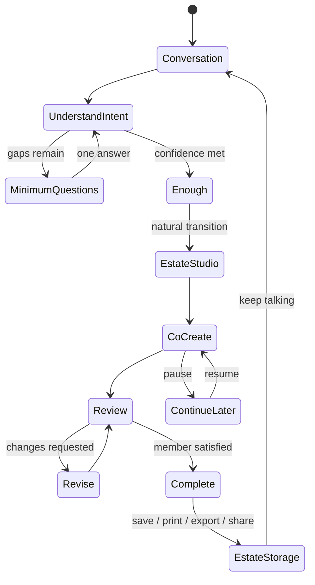
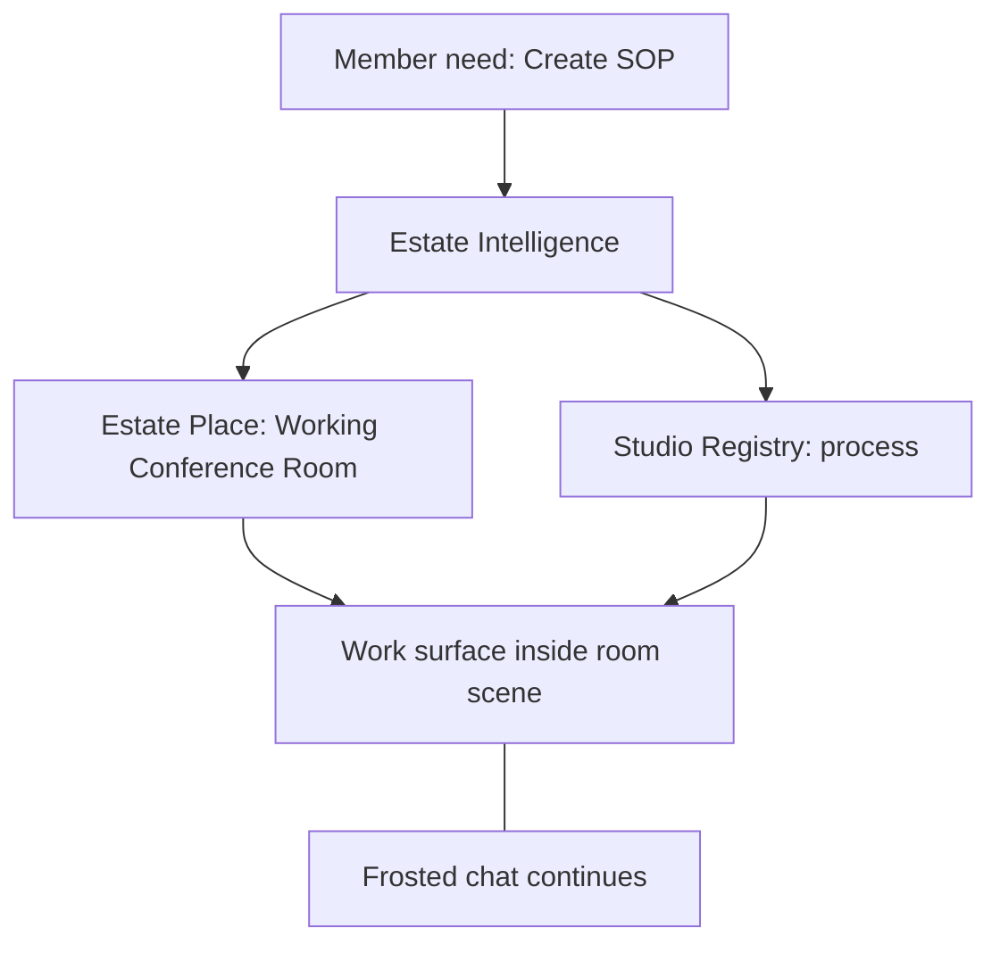

# Estate Creation Experience

**Date:** 2026-07-05  
**Status:** **Binding architecture** — no implementation until reviewed  
**Foundational principle:** **THE RELATIONSHIP OWNS THE WORK.**

The conversation is one expression of the relationship. The Studio is where work becomes visible **inside an Estate Place** — not a separate app the member "opened."

**Authority stack:**

| Layer | Document |
|-------|----------|
| Foundational principle | This document + [MEMBER_JOURNEY_ARCHITECTURE.md](./MEMBER_JOURNEY_ARCHITECTURE.md) |
| Orchestration master | [SPARK_CONVERSATION_INTELLIGENCE_ARCHITECTURE.md](./SPARK_CONVERSATION_INTELLIGENCE_ARCHITECTURE.md) |
| Conversation Mode | [CONVERSATION_MODE_INTELLIGENCE.md](./CONVERSATION_MODE_INTELLIGENCE.md) |
| Relationship spine | [CONVERSATION_SESSION_ARCHITECTURE.md](./CONVERSATION_SESSION_ARCHITECTURE.md) |
| **Creation Guidance** | [CREATION_GUIDANCE_INTELLIGENCE.md](./CREATION_GUIDANCE_INTELLIGENCE.md) |
| Studio Readiness | [STUDIO_READINESS_INTELLIGENCE.md](./STUDIO_READINESS_INTELLIGENCE.md) |
| Estate canon | [SPARK_ESTATE_MASTER_WORLD_BIBLE.md](./estate/SPARK_ESTATE_MASTER_WORLD_BIBLE.md) |
| Creation philosophy | [CREATE_EXPERIENCE_PHILOSOPHY.md](./CREATE_EXPERIENCE_PHILOSOPHY.md) (Spec 104) |
| Implementation adapter | [UNIVERSAL_CREATION_FRAMEWORK.md](./estate/UNIVERSAL_CREATION_FRAMEWORK.md) (internal — member sees *Creating Together*) |
| Conversation guardrails | Spec 106 · Spec 107 · Spec 109 · Spec 110 · Spec 113 |

**Architecture index:** [docs/README.md](./README.md)

---

## Executive summary

Members should **never feel like they left Spark to use another tool**. They should feel: *"We're in the Working Conference Room creating my SOP together."*

**The relationship owns the work.** The Conversation Session tracks the active task. **Studios** are capabilities — mostly invisible — that power work **inside physical Estate Places**. Members experience **places**, not product modules.

**Member-facing creation has one name: Creating Together.**  
Universal Creation, Facilitated Creation, Document Workflow, and Create Workflow are **implementation adapters** — never spoken to members.

**Studios are registered, not hardcoded.** The Studio Registry supports unlimited Studios (Correspondence, Process, Proposal, Publishing, Strategy, Thinking, Presentation, Learning, Research, Finance, Media, Design, Coaching, …).

---

## Binding decisions (2026-07-05)

| # | Decision |
|---|----------|
| 1 | **Two layers:** Physical Estate Places (emotional) + Studios (capabilities inside places) |
| 2 | **One active relationship** — one session spine; many artifacts may pause/resume |
| 3 | **Creating Together** — sole member-facing creation concept |
| 4 | **Studio Registry** — extensible; no fixed list of six |
| 5 | **Member Journey** — longitudinal layer below artifacts ([MEMBER_JOURNEY_ARCHITECTURE.md](./MEMBER_JOURNEY_ARCHITECTURE.md)) |

---

## 1. Philosophy

### 1.1 The relationship always comes first

```
Member speaks
    → Conversation Mode (Create?)
    → Conversation Session (memory · artifact)
    → Creation Guidance (orient → … → complete)
    → Estate Intelligence picks best Place (emotional environment)
    → Studio Readiness (when Studio opens populated)
    → Creating Together · Studio Registry
    → Work appears INSIDE the Estate Place
    → Conversation continues — never resets
    → Artifact may pause · resume · finish — relationship continues
```

The member experiences **one relationship in one Estate**. Chat and Studio surface are **expressions** of the same Conversation Session — not separate products.

### 1.2 Core beliefs (Spec 104 aligned)

| Belief | Member should feel |
|--------|-------------------|
| **Hero Principle** | *"I built this."* — Spark partners; member owns |
| **Relationship owns the work** | Nothing important lives only in a panel or a workflow store |
| **Estate is primary** | *"We're in the Library"* — not *"I opened Publishing Studio"* |
| **Studios are invisible** | Capabilities, not destinations |
| **Creating Together** | One creation experience — never "Universal" vs "Facilitated" |
| **Rule of Gentle Guidance** | Spark recommends — rarely directs |

### 1.3 The internal question (every turn)

> **What creation step are we on — and can Spark advance without asking?**

Authority: [CREATION_GUIDANCE_INTELLIGENCE.md](./CREATION_GUIDANCE_INTELLIGENCE.md)

If **yes** → advance the step (structure · draft · review).  
If **no** → ask **one** gate question — the minimum still missing.

### 1.4 What this is not

- Not a form wizard disguised as chat  
- Not a blank canvas after a rich discovery conversation  
- Not a GPS that says "Go to Creative Studio"  
- Not separate session stores per workspace  
- Not achievement pop-ups, progress bars, or "Task complete"

---

## 2. Creation lifecycle

Every artifact — email or course — follows the **same lifecycle**. Document type changes interview depth, Studio choice, and completion actions — not the emotional arc.

```
Conversation
    ↓
Understand Intent
    ↓
Ask only the minimum necessary questions
    ↓
"I have enough."
    ↓
Move naturally to the correct Estate Studio
    ↓
Continue creating together
    ↓
Review together
    ↓
Revise together
    ↓
Save → Print → Export → Share (when appropriate)
    ↓
Store inside the member's Estate
```

### 2.1 Phase map (member-visible vs internal)

| Stage | ConversationSession phase | Member experience |
|-------|---------------------------|-------------------|
| Listening | `listening` | Spark hears intent |
| Discovery | `discovery` | One question at a time in chat |
| Enough | threshold met | *"I think we have enough to begin."* |
| Studio transition | `guided_creation` → `draft` | Studio appears; chat stays |
| Co-creation | `draft` | Edit in Studio; talk in chat |
| Review | `review` | Draft primary (Spec 109); chat fades |
| Revision | `revision` | Natural edits until satisfied |
| Permission | `approval` | *"Does this feel ready?"* |
| Completion | `completion` | Certainty + next step (Spec 113) |
| Continue later | `continue_later` | Work preserved; no guilt |



### 2.2 Permission gates (non-negotiable)

- **Before first draft shown** — consent (Spec 106 Rule 5)  
- **Before export / print / send / publish** — consent  
- **Before permanent Brain write** — consent (Spec 112)

Session phase moves to `approval` / `permission`; it never forks a new session.

---

## 3. Two layers: Estate Places and Studios

### 3.1 Layer 1 — Physical Estate Places (emotional environments)

Places exist for **feeling, atmosphere, and belonging** — not feature labels.

| Examples | Role |
|----------|------|
| Welcome Home | Arrival · relationship |
| Coffee House | Warmth · casual conversation |
| Greenhouse · Ocean Conservatory · Butterfly Conservatory | Sensory · growth · wonder |
| Reflection Pond · Reading Nooks | Rest · reading · quiet |
| Library | Study · publishing adjacency |
| Working Conference Room · Round Table | Structured work · proposals · SOPs |
| Treehouse | Thinking · imagination · privacy |

**Source of truth:** Estate Knowledge Registry + [SPARK_ESTATE_MASTER_WORLD_BIBLE.md](./estate/SPARK_ESTATE_MASTER_WORLD_BIBLE.md).

Members **visit places**. They never **launch** tools.

### 3.2 Layer 2 — Studios (capabilities inside places)

Studios are **work environments** — registry entries mapping **artifact kinds** to **UI surfaces**. Members should **rarely** hear the word "Studio."

| Studio (registry id) | Capability | Example places |
|----------------------|------------|----------------|
| `correspondence` | Email, letters, messages | Working Conference Room, Library |
| `process` | SOP, checklist, workflow | Working Conference Room |
| `proposal` | Proposals, client docs | Round Table, Working Conference Room |
| `publishing` | Newsletter, article, book | Library, Reading Nooks |
| `strategy` | Plans, funnels, campaigns | Round Table |
| `thinking` | Maps, compass, brainstorm | Treehouse |
| *future:* `presentation`, `learning`, `research`, `finance`, `media`, `design`, `coaching` | Extensible via registry |

**Same Studio, multiple places:** Proposal capability may appear in Working Conference Room, Round Table, or Library — chosen by Estate Intelligence with **why**.

### 3.3 Routing example (canonical)

```
User: "I need to create an SOP."
  → Need: Create
  → Best Estate Place: Working Conference Room
  → Best Studio: process
  → Open process surface INSIDE Working Conference Room
  → Member: "We're in the Working Conference Room creating my SOP."
```



Studios are **views** on ConversationSession (`activeView`, `studioId`, `estatePlaceId`) — not independent discovery owners.

### 3.4 Studio Registry (binding — unlimited Studios)

```typescript
/** Proposed — lib/studioRegistry/types.ts */
type StudioRegistryEntry = {
  studioId: string;
  displayName: string;                 // internal / rare Shari use
  artifactKinds: readonly ArtifactKind[];
  supportedPlaceIds: readonly string[]; // or Estate Intelligence predicate
  activeView: ConversationView;
  pluginId?: string;
  interviewTier: "quick" | "guided" | "discovery";
  completionDestinations: string[];
  adapter: WorkspaceSessionAdapter;
  intelligenceReady: IntelligenceReadyHooks;
};

type StudioRegistry = {
  register(entry: StudioRegistryEntry): void;
  resolveStudio(input: {
    artifactKind: ArtifactKind;
    need: MemberNeed;
    placeId?: string;
    journeySignals?: JourneySignals;
  }): StudioRegistryEntry;
};
```

**V1 seeds six entries** — architecture supports unlimited registration without orchestration rewrite.

### 3.5 Studio experience rules

1. **Estate Place is hero** — scene ≥70% visual weight  
2. **Photograph Test** — real country estate?  
3. **Chat always reachable** — Spec 109; input visible  
4. **Diegetic affordances** — folio, desk — not dashboard chrome  
5. **Same session id** — hydrate; never cold-start  
6. **Gentle transition copy** — §5; never *"Opening Process Studio"*  

### 3.6 Creating Together (member-facing creation)

| Member never hears | Implementation adapter |
|--------------------|----------------------|
| Universal Creation | `lib/universalCreation/` |
| Facilitated Creation | `lib/facilitatedCreation/` |
| Document Workflow | `createWorkflowRecordStore` |
| Create Workflow | Create builder phases |

All adapters read/write **ConversationSession** under `memberFacingMode: "creating_together"`.

---

## 4. Interview rules

### 4.1 The enough-information rule

Before every question, Spark evaluates:

1. What is already in `discoverySlots` / `answers`?  
2. What did the member say in the **current** and **recent** turns?  
3. What does Business Brain already know (read-only prefill — never assert without confirmation)?  
4. What does this **artifact tier** require at minimum?

If sufficient → **do not ask**. Advance phase or begin draft prep.

### 4.2 Interview tiers (creation patterns)

| Pattern | Examples | Question budget | Studio timing |
|---------|----------|-----------------|---------------|
| **Quick Create** | Email, letter, LinkedIn post, thank-you note | **≤ 2** | When slots filled |
| **Guided Create** | SOP (member knows process), proposal, newsletter, presentation | **3–5** | When enough to scaffold |
| **Discovery Create** | Course, book, business, framework, membership, AI companion | **Confidence-driven** — one per turn | When draft **structure** exists |
| **Research Create** | SOP/process when member **doesn't know how**; business plan first-timer; automations; AI workflows | **No process questions** until research phase completes | **After** learn-together — see [ADAPTIVE_CREATION_INTELLIGENCE.md](./ADAPTIVE_CREATION_INTELLIGENCE.md) |

Tiers are **defaults**. Signal patterns in the member's first message may fill slots and reduce count to zero — or escalate immediately to **Research Create** when the member lacks process knowledge.

**Internal rule (binding):** Before every discovery question → *Does the member know the answer?* If **no** → Research Create; never ask for steps, stages, or structure they cannot provide.

### 4.3 Question discipline

- **One question per turn** (Spec 106 Rule 3)  
- **Numbered choices** when helpful — max 3 (T-003)  
- **Never re-ask** if `answeredQuestionIds` or slot filled (§6)  
- **Uncertainty paths** — escalate to **Research Create** when member lacks process knowledge; teach · recommend · research · examples — never repeat unanswerable questions ([ADAPTIVE_CREATION_INTELLIGENCE.md](./ADAPTIVE_CREATION_INTELLIGENCE.md) · [UNIVERSAL_CREATION_FRAMEWORK.md](./estate/UNIVERSAL_CREATION_FRAMEWORK.md))  
- **Conversation Style** from Settings — not a discovery question (`memberCreationTone.ts`)

### 4.4 Slot model (canonical)

Universal slots: `what` · `why` · `who` · `success`  
Plugins add typed slots (e.g. email `ask`, proposal `scope`) mapped to canonical slots for confidence scoring.

**Quick Create example (email):**

1. *Who is this for and what's the relationship?* (may prefill from one message)  
2. *What's the one thing you need them to do or understand?*  
→ *"I think we have enough to begin."*

**Guided Create example (SOP — member knows process):**

1. Who follows this process?  
2. What does done look like?  
3. Where do people usually get stuck?  
→ transition to Process Studio inside Working Conference Room  

**Research Create example (SOP — member does NOT know process):**

1. What is the SOP about?  
2. Member: *"I don't know how to do it either."*  
3. Spark pivots — learn together first; anchor question (platform, audience, tools)  
4. Research + teach-back in chat — **no steps questions**  
5. *"I think we understand this well enough. Let's build the SOP together."* → Studio  

See [ADAPTIVE_CREATION_INTELLIGENCE.md](./ADAPTIVE_CREATION_INTELLIGENCE.md).

**Discovery Create example (course):**

Longer arc — outcome, audience, transformation, format — still **one question at a time**, phase may stay in chat longer before Studio opens. Studio opens when draft structure exists, not when every future module is planned.

---

## 5. Transition rules

### 5.1 Natural transition language (Shari)

**Use:**

- *"I think we have enough to begin."*  
- *"Let's build this together."*  
- *"I've opened a workspace where we can continue."*  
- *"We're in a great place to work on this."*  
- *"Here's what we shaped — want to adjust anything at the top?"*

**Avoid:**

- *"Launching Creative Studio…"*  
- *"Opening the editor."*  
- *"Go to Process Studio."*  
- *"I've opened a new SOP. What process are we documenting today?"* (re-interview after handoff)

### 5.2 Transition sequence

```
1. Session confidence threshold met (or Quick Create cap reached)
2. applyConversationSessionPatch({
     phase: "draft" | "guided_creation",
     activeView: "<studio_view>",
     draftContent: <prefilled scaffold> | undefined
   })
3. Optional: set estatePlaceId for atmosphere (never resets session)
4. UI reveals Studio — chat remains
5. One Shari line acknowledging known context — zero repeated questions
6. Studio hydrates from session via WorkspaceSessionAdapter
```

### 5.3 Affirmation continuity

When member says *"yes"*, *"let's do it"*, *"sounds good"* after an offer:

- Load session by **`sessionId`** on the offer — not a parallel pending blob with only `artifactType`  
- Advance phase / `activeView` — **do not** `clearUniversalCreationSession()`  
- **Do not** call `startUniversalCreationTurn()` on workspace open

### 5.4 Design rules (release gates)

| Rule | Meaning |
|------|---------|
| Never restart discovery after entering a Studio | Phase ≥ `draft` → question guard only |
| Never ask questions already answered | Shared `answeredQuestionIds` |
| Never lose context on room change | Update `estatePlaceId` only |
| Never blank workspace when session has slots/draft | Hydrate or derive scaffold |
| Never imply the conversation ended | "Keep talking" always available (Spec 110) |

---

## 6. Conversation synchronization

### 6.1 One Conversation Session

There is **one** Conversation Session per active creation task. Chat and Studio subscribe to it.

```
┌─────────────────────────────────────────────────────────┐
│              ConversationSession (owner)                 │
│  intent · slots · draft · phase · activeView · artifactId │
└───────────────┬─────────────────────────┬───────────────┘
                │                         │
         ┌──────▼──────┐           ┌──────▼──────┐
         │  Chat view  │           │ Studio view │
         │ (frosted)   │           │ (draft/map) │
         └─────────────┘           └─────────────┘
                │                         │
                └──────── patch API ──────┘
                    applyConversationSessionPatch()
```

### 6.2 Sync rules

| Event | Session update | Chat knows | Studio knows |
|-------|----------------|------------|--------------|
| Member answers in chat | `discoverySlots`, `answeredQuestionIds` | immediate | on subscribe |
| Member edits draft in Studio | `draftContent`, `sourceOfLastUpdate: "workspace"` | next turn / hint | immediate |
| Spark rewrites in chat | `draftContent`, `sourceOfLastUpdate: "chat"` | immediate | on subscribe |
| Member closes Studio | `activeView: "chat"` | — | panel unmounts; session persists |
| Save / export | `artifactId`, `phase: "completion"` | certainty copy (Spec 113) | saved state |

- **Single write path:** `applyConversationSessionPatch()`  
- **Debounce** workspace draft patches — not every keystroke through chat router  
- **Version field** for optimistic merge  
- **Transcript ≠ state** — messages display history; session holds authoritative phase and draft

### 6.3 Question guard (shared)

```typescript
function mayAskQuestion(session: ConversationSession, questionId: string): boolean {
  if (session.answeredQuestionIds.includes(questionId)) return false;
  if (session.discoverySlots[slotForQuestion(questionId)]?.trim()) return false;
  if (session.phase !== "discovery" && session.phase !== "listening") return false;
  return true;
}
```

Chat router **and** Studio mount **and** LLM hints must use the same guard.

### 6.4 Pattern to follow

`lib/decisionCompassSessionAuthority.ts` — chat + panel already proved shared authority for Decision Compass. Creation generalizes this to **ConversationSession** for all Studios.

---

## 7. Save / Print / Export model

### 7.1 Conversation-driven completion (Spec 113)

Spark never ends with a toolbar. It ends with **certainty**:

1. **What happened?** — calm reassurance  
2. **Where is it?** — Estate library / project / Saved Work  
3. **Can I find it later?** — conversational retrieval

### 7.2 Completion menu (when appropriate only)

Offer only actions that apply to this artifact and phase:

| Action | Permission | When offered |
|--------|------------|--------------|
| Save | Soft auto-save always; explicit save on request | Draft exists |
| Print | Yes | Member asks or review complete |
| Export (PDF, Drive, …) | Yes | Plugin supports format |
| Share | Yes | Member intent |
| Duplicate | Optional | Template-worthy work |
| Turn into template | Yes | Member asks |
| Add to Project | Yes | Project context exists |
| Send | Yes | Correspondence artifacts |
| Archive | Yes | Member done but wants history |

**Keep talking** is always available — session does not close.

### 7.3 Plugin-driven actions

Each document plugin declares `completionActions` ([UNIVERSAL_CREATION_FRAMEWORK.md](./estate/UNIVERSAL_CREATION_FRAMEWORK.md)). Studio UI surfaces the same set conversationally — not a different menu per room.

---

## 8. Estate storage model

Completed work becomes **part of the Estate** — findable by meaning, not filename.

| Artifact | Estate destination (member language) | Storage hook (implementation) |
|----------|-----------------------------------|------------------------------|
| Proposal | Business Portfolio | Business Assets™ / Saved Work |
| SOP | Process Library | Saved Work → SOPs |
| Decision map | Project History | Decision Compass session + artifact link |
| Newsletter | Publishing Library | Saved Work → Newsletters |
| Presentation | Presentation Library | Saved Work / Projects |
| Email (sent/saved) | Correspondence archive | Saved Work |
| Course / book | Publishing Library + Project | Project + long-horizon artifact |

### 8.1 Intelligence-ready lineage

Every saved artifact carries:

- `originatedFromId` → ConversationSession / turn lineage  
- `artifactKind` · `studioId` · `estatePlaceId` at creation  
- Link to Business Asset when promoted  
- Brain proposal async — never block conversation (Spec 117)

### 8.2 Retrieval

*"Show me my onboarding SOP"* → Brain + Saved Work — **not** folder navigation in member copy.

---

## 9. Future extensibility

### 9.1 Adding a new artifact type

1. Register **document plugin** — detection, slots, template, enhancements, completion  
2. Register **Studio mapping** — which Studio view hosts it  
3. Assign **interview tier** — quick / guided / discovery  
4. Declare **Estate library** destination  
5. Implement **WorkspaceSessionAdapter** — hydrate + patch only  
6. Update **Intelligence Registry** — object type + engines  

No new member journey. No new session store.

### 9.2 Adding a new Studio

1. Estate Bible / room canon page (if new physical place)  
2. `EstateStudioDefinition` + `activeView`  
3. Adapter implements session contract  
4. Judgment layer may **recommend** the Studio (Gentle Guidance) — never auto-open  

### 9.3 Server sync (later)

Phase 1–3 may persist ConversationSession in localStorage. Future: Supabase row keyed by `sessionId`, draft blob in artifact store, session holds refs — same contract.

### 9.4 Adaptive intelligence

[ESTATE_ADAPTIVE_INTELLIGENCE.md](./estate/ESTATE_ADAPTIVE_INTELLIGENCE.md) prefills and shortens interviews — never bypasses permission or fabricates slots.

---

## 10. Recommended implementation order

**Do not big-bang.** Align with [CONVERSATION_SESSION_ARCHITECTURE.md §7](./CONVERSATION_SESSION_ARCHITECTURE.md).

| Order | Milestone | Outcome |
|-------|-----------|---------|
| **0** | Review + approve this document | Shared member-experience contract |
| **1** | ConversationSession spine (types + store + dual-write from UC) | One owner exists alongside legacy |
| **2** | Continuation fixes — no clear-on-handoff, affirmation by `sessionId`, question guard | *"Yes"* no longer loses answers |
| **3** | Interview tier enforcement — Quick/Guided caps in orchestrator + profiles | Email ≤2 questions before draft |
| **4** | Studio transition copy — replace `followUpForItemType` re-interviews | Natural handoff lines |
| **5** | Create panel bridge — hydrate from session, patch back | No blank SOP after discovery |
| **6** | Studio registry — map plugins → Studio names + `activeView` | Shari says "Process Studio" |
| **7** | Thinking Studio — Decision Compass + Visual Focus adapters on same session | One pattern all Studios |
| **8** | Retire legacy session owners (UC store, duplicate workflow answers) | Single write path |
| **9** | Observation Mode validation — CT-11, Rule of Three | Conversation quality evidence |

Feature flags: `CONVERSATION_SESSION_DUAL_WRITE`, `CONVERSATION_SESSION_CREATE_BRIDGE`, per-Studio bridges.

**Success journey (Phase 5+):**

> *"Help me write an SOP for onboarding my VA"* → 3 questions → *"I think we have enough to begin"* → Process Studio with prefilled headers → edit → close panel → chat continues → reopen → same draft — **zero repeated questions**.

---

## 11. Implementation audit (current codebase)

**Review date:** 2026-07-05 · **No code changed in this review.**

### 11.1 What already supports this model

| Area | Evidence | Alignment |
|------|----------|-----------|
| **Universal Creation phases** | `lib/universalCreation/types.ts` — discovery → … → completion | Same lifecycle as §2 |
| **Document plugins** | `documentRegistry.ts`, `documentCreationProfiles.ts` | Plugin model matches §9.1 |
| **Signal-based slot fill** | `signalPatterns` on discovery questions | Supports "enough info" rule |
| **Guided post-discovery flow** | `guidedCreationFlow.ts` — draft permission, review, revise, approve | Matches review/revise arc |
| **Create workspace philosophy** | `workspaceCreation.ts`, Spec 104 | Chat beside draft — split view intent |
| **Saved artifact + Saved Work** | `savedArtifact.ts`, `savedWorkStore.ts` | Completion + storage hooks exist |
| **Decision Compass authority** | `decisionCompassSessionAuthority.ts` | **Proven** chat+panel single owner — template for §6 |
| **Create fast path** | `createFastPath.ts` | Quick Create intent detection |
| **Adaptive prefill** | `estateBrain/adaptiveIntelligence.ts` | Brain read for slots — not replace session |
| **Frosted workspace states** | Spec 109 — review hides competing chat | Studio review UX spec exists |
| **Certainty before completion** | Spec 113, `savedArtifact` location queries | Conversational save/print |
| **Conversation Session design** | `CONVERSATION_SESSION_ARCHITECTURE.md` | Detailed spine — **not yet implemented** |
| **Gentle Guidance** | `lib/estateIntelligence/judgment/gentleGuidance.ts` | Transition copy principles §5 |

### 11.2 What conflicts with this model

| Conflict | Location | Impact |
|----------|----------|--------|
| **Multiple session owners** | `universal-creation-session-v1`, `companion-create-session-v1`, `createWorkflowRecordStore`, `estate-discovery-session-v1`, facilitated creation in-memory | Context loss, repeated questions |
| **Premature UC clear on handoff** | `frictionlessActionLayer.ts` — `clearUniversalCreationSession()` before create open (~1579, ~3212) | Discovery discarded at transition |
| **Re-interview on workspace open** | `createExperienceRouting.ts` — `followUpForItemType()` (*"I've opened a new email. Who is it for…"*) | Direct violation §5.1 / §11 design rules |
| **Blank scaffold handoff** | `resolveImmediateCreateAction` + `blankScaffoldForType` when session cleared | Blank doc after rich chat |
| **Frictionless pending carries thin context** | pending only `artifactType` + `initialPrompt` — not full session | *"Yes"* bridge loses answers |
| **Email profile asks 6 questions** | `documentCreationProfiles.ts` EMAIL | Exceeds Quick Create max (2) |
| **Continuation via regex** | `CREATION_MARKER_RE` in `orchestrator.ts` | Fragile; not session-phase based |
| **Creative Studio canon copy** | `docs/estate/creative-studio.md` — *"take us there"*, *"open the workspace"* | Conflicts with Gentle Guidance + §5 |
| **Facilitated creation parallel session** | `lib/facilitatedCreation/sessionStore.ts` — not persisted | Second owner for Creative Studio flows |
| **ConversationSession not implemented** | Design only in `CONVERSATION_SESSION_ARCHITECTURE.md` | Architecture gap between spec and runtime |
| **Software section labels** | `content-generator`, `AppSection` routing | Member-facing Studios not yet named in UI |

### 11.3 What can be reused (keep, adapt — do not rewrite)

| Asset | Reuse as |
|-------|----------|
| `universalCreation/*` plugins, `draftComposer`, `phases` | Discovery + draft engine **inside** ConversationSession |
| `documentCreationProfiles` | Tier caps + plugin slots — trim Quick Create profiles |
| `createSessionStore` | **View cache** — layout, scroll, denormalized draft with sync back |
| `createWorkflowRecordStore` | Panel field UI state — **not** discovery authority |
| `decisionCompassSessionAuthority` | Pattern for `conversationSessionAuthority` |
| `workspaceCreation.toCreationContext` | Map session → panel context at hydrate |
| `savedArtifact` / export guards | Completion layer §7 |
| `memberCreationTone` | Settings-driven tone — not interview |
| `createExperienceRouting` (structure) | Intent → Studio routing after session bridge |
| `CompanionPageClient` integration points | Wire session subscribe — avoid new parallel router |

### 11.4 What should be retired (after migration, not day one)

| Retire | When |
|--------|------|
| `universal-creation-session-v1` as **owner** | Phase 8 — merged into ConversationSession |
| `clearUniversalCreationSession()` before open | Phase 2 |
| `followUpForItemType` re-interview strings | Phase 4 — replace with session-aware ack |
| `CREATION_MARKER_RE` continuation | Phase 2 — phase + `pendingQuestionId` |
| Duplicate `collectedAnswers` as discovery source | Phase 5 — read-through session adapter |
| Facilitated creation in-memory session as owner | Phase 7 — merge into ConversationSession |
| Blank scaffold default when slots exist | Phase 5 |

### 11.5 Safest migration path

**Principle:** additive first, behavior fix second, panel bridge third, retire last.

```
Phase 1  ConversationSession store + dual-write from UC (no member-visible change)
Phase 2  Fix continuation: no clear-on-handoff; affirmation resolves sessionId
Phase 3  Enforce interview tiers (Quick ≤2, Guided ≤5) in orchestrator
Phase 4  Replace followUpForItemType + transition copy (Gentle Guidance)
Phase 5  Create panel hydrates/patches session (feature flag)
Phase 6  Studio registry + Shari-facing Studio names
Phase 7  Thinking Studio adapters (Compass, Visual Focus)
Phase 8  Remove legacy session writes after rollback window
```

**Scope discipline (Phase 1–3):** Creation + continuation only — **not** estate navigation pending choices, Google Sheets intake, or Journal Gazebo ceremony (separate object lifecycle).

**Rollback:** Feature flags off → legacy stores untouched until Phase 8.

**Validation:** CT-11 + creation smoke journey in §10 — Observation Mode Rule of Three before prompt changes.

### 11.6 Gap summary

| This document requires | Current state |
|------------------------|---------------|
| One Conversation Session | Designed, not built |
| Studios as views | Create panel = section routing; Studio names mostly docs-only |
| Quick Create ≤2 questions | Email profile has 6; confidence threshold 90% ≠ tier caps |
| Natural Studio transition | `followUpForItemType` re-asks; UC cleared on open |
| Chat ↔ Studio sync | Partial (Compass only); Create panel owns draft separately |
| Estate library destinations | Saved Work exists; conversational mapping incomplete |

---

## 12. Resolved decisions (2026-07-05)

| Former open question | Binding decision |
|---------------------|------------------|
| Physical rooms vs logical Studios | **Two layers.** Places = emotional (Layer 1). Studios = capabilities inside places (Layer 2). Member experiences the place, not the Studio name. |
| Concurrent tasks | **One active relationship.** One Conversation Session spine. Many artifacts — each may pause, resume, or finish. Spark always knows active · paused · finished. |
| Quick Create auto-draft | After tier-capped interview, draft may appear in chat or Studio — **same session id**, never cold-start. |
| Facilitated creation | **Merged.** Member-facing: *Creating Together* only. `facilitatedCreation/`, `universalCreation/`, workflow records = implementation adapters. |
| Server persistence timing | localStorage V1 with dual-write; plan Supabase `conversation_session` row before Phase 8 retire — relationship must survive refresh. |

**Remaining engineering choice (non-architecture):** exact Quick Create draft-first vs Studio-first UX — both must hydrate from ConversationSession.

---

## Appendix A — Related specs (conversation frozen)

Creation experience **implements** frozen conversation architecture — it does not replace it:

- Spec 106 — permission, one question, no re-ask  
- Spec 107 — phases map to ConversationSession.phase  
- Spec 109 — review state in Studio  
- Spec 110 — completion without forced closure  
- Spec 113 — certainty before save/export  

---

## Appendix B — Document map

| Topic | Path |
|-------|------|
| **Creation Guidance (binding)** | [CREATION_GUIDANCE_INTELLIGENCE.md](./CREATION_GUIDANCE_INTELLIGENCE.md) |
| Conversation Mode | [CONVERSATION_MODE_INTELLIGENCE.md](./CONVERSATION_MODE_INTELLIGENCE.md) |
| Studio Readiness | [STUDIO_READINESS_INTELLIGENCE.md](./STUDIO_READINESS_INTELLIGENCE.md) |
| Architecture index | [docs/README.md](./README.md) |
| Session spine (implementation detail) | [CONVERSATION_SESSION_ARCHITECTURE.md](./CONVERSATION_SESSION_ARCHITECTURE.md) |
| Member Journey | [MEMBER_JOURNEY_ARCHITECTURE.md](./MEMBER_JOURNEY_ARCHITECTURE.md) |
| Orchestration master | [SPARK_CONVERSATION_INTELLIGENCE_ARCHITECTURE.md](./SPARK_CONVERSATION_INTELLIGENCE_ARCHITECTURE.md) |
| Universal journey (implementation adapter) | [estate/UNIVERSAL_CREATION_FRAMEWORK.md](./estate/UNIVERSAL_CREATION_FRAMEWORK.md) |
| Creative Studio room | [estate/creative-studio.md](./estate/creative-studio.md) |
| UC runtime | `lib/universalCreation/` |
| Create open / handoff (conflict) | `lib/createExperience/createExperienceRouting.ts` |
| Compass authority (pattern) | `lib/decisionCompassSessionAuthority.ts` |

---

*The member should never feel like they left the relationship. The Estate Place is where they belong. The Studio is simply where work becomes visible — inside that place. **The relationship owns the work.** Everything else is how that relationship becomes visible.*
