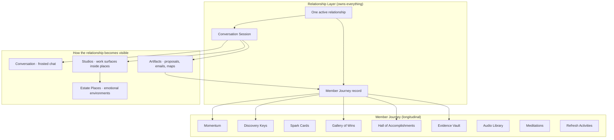
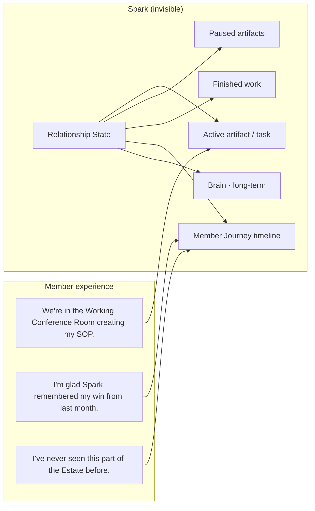
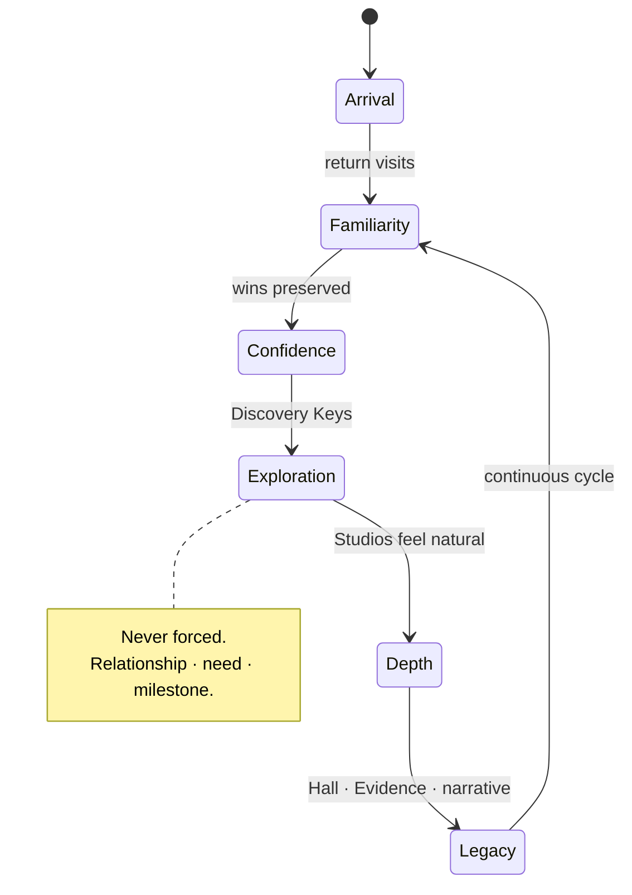

# Member Journey Architecture

**Date:** 2026-07-05  
**Status:** **Binding architecture** — no implementation until reviewed  
**Foundational principle:** **THE RELATIONSHIP OWNS THE WORK.**

**Parent stack:**

```
Relationship
    ↓
Conversation
    ↓
Estate Intelligence
    ↓
Creating Together
    ↓
Studio (inside Estate Place)
    ↓
Artifact
    ↓
Member Journey
```

**Related:**

| Document | Role |
|----------|------|
| [CONVERSATION_SESSION_ARCHITECTURE.md](./CONVERSATION_SESSION_ARCHITECTURE.md) | One active relationship · artifact pause/resume |
| [ESTATE_CREATION_EXPERIENCE.md](./ESTATE_CREATION_EXPERIENCE.md) | Creating Together · Studio Registry |
| [estate/ESTATE_INTELLIGENCE_ARCHITECTURE.md](./estate/ESTATE_INTELLIGENCE_ARCHITECTURE.md) | Place + capability routing |
| [estate/SPARK_ESTATE_MASTER_WORLD_BIBLE.md](./estate/SPARK_ESTATE_MASTER_WORLD_BIBLE.md) | Estate world · discovery lore |
| [ESTATE_KNOWLEDGE_REGISTRY_AUDIT.md](./ESTATE_KNOWLEDGE_REGISTRY_AUDIT.md) | Registry wiring |

---

## Purpose

The **Member Journey** is how a member's **life unfolds inside the Estate** — not how a document gets drafted.

It owns:

- Growth over time  
- Celebration and reflection  
- Momentum without pressure  
- Organic discovery of places and capabilities  
- The long arc of belonging  

The Member Journey is **not** Creation. It is **not** Estate Knowledge (facts about rooms). It is **not** the Conversation Session (active task state).

It is the **relationship made visible across days, months, and years**.

---

## Architecture

### Layer placement



### Relationship ownership diagram



**The member never sees:** Universal Creation, Facilitated Creation, workflow records, session keys, or Studio registry IDs.

**The member always feels:** one companion, one Estate, one continuing story.

---

## Journey layer — what it owns

| Domain | Member-facing idea | Spark posture |
|--------|-------------------|---------------|
| **Momentum** | Today's meaningful forward motion | Protect energy; never guilt |
| **Discovery Keys** | Gentle unlocks to new Estate areas | Organic; never achievement pop-ups |
| **Spark Cards** | Captured insights from conversation | Connection to growth, not flashcards |
| **Gallery of Wins** | Quiet celebration of transformation | Member hero; not usage metrics |
| **Hall of Accomplishments** | Milestones that matter to *them* | Dignity; no streaks |
| **Evidence Vault** | Proof of progress when they need confidence | Permission to revisit |
| **Audio Library** | Focus, calm, pleasure places sound | Atmosphere, not playlist UI |
| **Meditations** | Guided rest inside the Estate | Restoration before productivity |
| **Refresh Activities** | Games, gentle play, curiosity | Play pattern · Spec T-005 |
| **Learning History** | What they've explored with Spark | Recognition over recall |
| **Personal Growth** | Capability graph · narrative threads | Observation, never labels |

### What Member Journey does **not** own

| Not owned here | Owned by |
|----------------|----------|
| Discovery answers for current email | Conversation Session |
| Draft content | Conversation Session → Artifact |
| Which room fits this need | Estate Intelligence |
| Studio plugin questions | Creating Together (implementation) |
| Canonical place facts | Estate Knowledge Registry |

---

## How members grow

Growth is **not leveling up**. Growth is:

1. **Capability** — better decisions, clearer thinking  
2. **Belonging** — the Estate feels more like home  
3. **Trust** — Spark remembers without surveillance  
4. **Curiosity** — new places feel earned, not marketed  



Spark observes patterns **ethically** (Spec 112, Ethical Foundation) — observations, not identity conclusions.

---

## Discovery model

**The Estate unfolds naturally.** Members do not receive a feature catalog on day one.

### Discovery triggers

| Trigger | Example Spark voice |
|---------|---------------------|
| **Relationship** | *"I've been thinking about a place I'd like to show you."* |
| **Growth** | *"I think you're ready for another part of the Estate."* |
| **Curiosity** | *"There's a path off the garden we haven't walked yet."* |
| **Need** | *"For work like this, the Working Conference Room might feel right."* |
| **Milestone** | *"After what you finished last week — the Treehouse might be peaceful."* |

### Discovery rules

1. **Never** dashboard of all rooms  
2. **Never** achievement pop-up for unlocking  
3. **Max 3 invitations** when offering (T-003)  
4. **Always explain WHY** (Gentle Guidance)  
5. **Staying is valid** — discovery is optional  
6. **Planned places** — honest copy if not yet navigable  

Discovery Keys are **relationship objects** — not gamified badges. A key unlocks when Spark's judgment + journey state agree the member is ready.

---

## Philosophy by domain

### Momentum

Momentum is **protected forward motion**, not task count.

- Spark reduces scope when energy is low  
- *"Momentum is building. We don't need to add more — protecting it matters."*  
- Connects to Plan My Day / Momentum Builder **when member asks** — never as guilt  

**Anti-patterns:** streaks, overdue lists, "you haven't logged in."

### Gallery of Wins

Quiet transformation visible to the member — never confetti.

- Wins captured with permission (Spec 106, Hidden Work)  
- Celebrate **who they became**, not what Spark did  
- Bridge from completion (Spec 110) — *"Want to keep this in your Gallery?"*  

### Hall of Accomplishments

Milestone book — physical object in Estate canon (Spark Estate Bible).

- Launches, hires, first sale, hard seasons survived  
- Member owns the narrative  
- Spark may suggest an entry; member decides  

### Evidence Vault

When confidence wavers, members need **proof they have done hard things before**.

- Linked artifacts, decisions, wins — not surveillance  
- Conversational retrieval: *"Show me evidence from my launch last spring."*  

### Discovery Keys

Symbolic permission to **see** a new place or capability.

- Stored in Member Journey, not session  
- Spark offers: *"I think you're ready to see the Butterfly Conservatory when you want."*  
- Member accepts or ignores — no penalty  

### Spark Cards

Insights distilled from conversation — connection cards, not flashcards.

- Lineage to source conversation / artifact (intelligence-ready)  
- Surface when relevant, not on schedule  

### Refresh Activities

Games, gentle play, sensory rooms — **play pattern** (T-005).

- Spark Restoration Intelligence routes energy type  
- Never productivity framing during play  

### Audio Library

Estate sound — Focus Audio, pleasure places, room ambience.

- Recommended in context: *"Focus music might help here — want it?"*  
- Not a separate "music app"  

### Meditations

Restoration inside the Estate — Breathe, guided quiet, Listening Rooms.

- Emotional need **before** suggestion  
- Permission before starting  

---

## Future extensibility

### Member Journey Registry (proposed)

```typescript
/** Proposed — implementation detail, not member-facing */
type MemberJourneyObjectKind =
  | "momentum_snapshot"
  | "discovery_key"
  | "spark_card"
  | "gallery_win"
  | "accomplishment_entry"
  | "evidence_item"
  | "audio_bookmark"
  | "meditation_session"
  | "refresh_activity"
  | "learning_marker"
  | "milestone";

type MemberJourneyRegistryEntry = {
  kind: MemberJourneyObjectKind;
  id: string;
  relationshipId: string;
  createdAt: string;
  surfacedAt?: string;
  linkedArtifactId?: string;
  linkedConversationSessionId?: string;
  linkedPlaceId?: string;
  memberVisibleTitle: string;
  intelligenceReady: IntelligenceReadyHooks;
};
```

New journey object types **register** — they do not require UI redesign.

### Event hooks (invisible)

| Event | Journey may |
|-------|-------------|
| Artifact completion | Offer Gallery / Hall entry |
| First visit to place | Quiet journal note |
| Return after absence | No surveillance greeting; journey informs tone |
| Discovery Key granted | Estate Intelligence may recommend place once |
| Win captured (hidden work) | Propose celebration copy |

---

## Implementation impact

| Area | Change |
|------|--------|
| **Conversation Session** | `relationshipId` required; artifacts link to journey |
| **Estate Intelligence** | Discovery Key + journey state inputs to judgment |
| **Creating Together** | Completion bridges to Gallery / Hall / Evidence |
| **Studio Registry** | Artifacts materialize to journey on finalize |
| **Brain / Memory** | Journey ≠ Brain; Brain feeds prefill, Journey feeds meaning |
| **UI** | Journey objects are **places and books** — not dashboards |

---

## Files affected (future implementation)

| File / area | Role |
|-------------|------|
| `lib/conversationSession/` (new) | `relationshipId`, artifact links |
| `lib/memberJourney/` (new) | Registry, types, persistence |
| `lib/estateIntelligence/judgment/` | Discovery + journey signals |
| `lib/intelligence/INTELLIGENCE_REGISTRY.md` | Register journey object kinds |
| `lib/arrivalIntelligence/` | Returning user · journey tone |
| `lib/sparkHiddenWorkEngine/` | Win capture → journey bridge |
| Estate objects UI | Gallery book, Hall, Evidence Vault, Discovery Key |

---

## Migration recommendations

1. **Phase A** — Types + registry only; no member UI  
2. **Phase B** — Win capture → Gallery proposal (permission)  
3. **Phase C** — Discovery Keys in judgment layer (read-only flags)  
4. **Phase D** — Spark Cards lineage from conversation session  
5. **Phase E** — Full object-layer UI in Estate (not chrome)  

**Do not** build journey dashboard. **Do not** expose registry to members.

---

## Conflicts with current implementation

| Current | Conflict | Resolution |
|---------|----------|------------|
| Streak / engagement metrics | Journey philosophy | Remove; never ship |
| Achievement pop-ups | Discovery model | Retire |
| Separate feature menus | Journey unification | Pass 7 in bug reverse-engineering |
| Brain stores everything | Journey vs memory boundary | Session + Journey + Brain roles documented |
| `companion-recent-work-v1` only | No longitudinal journey | Member Journey subsumes with richer model |
| Estate guide shows 8 of 12 spaces | Discovery / knowledge | Registry-driven (Pass 3) |

---

## Redesign before coding

1. **Single `relationshipId`** in Conversation Session — blocks journey links  
2. **Studio Registry** — blocks place+studio routing  
3. **Priority Engine** — blocks correct completion → journey bridges  
4. **Product decision** on Discovery Key **visual** — object in scene vs conversational only for V1  

---

*The Estate is the world. Studios are where work becomes visible. The Member Journey is how life unfolds within the Estate. Everything should feel like one seamless relationship.*
