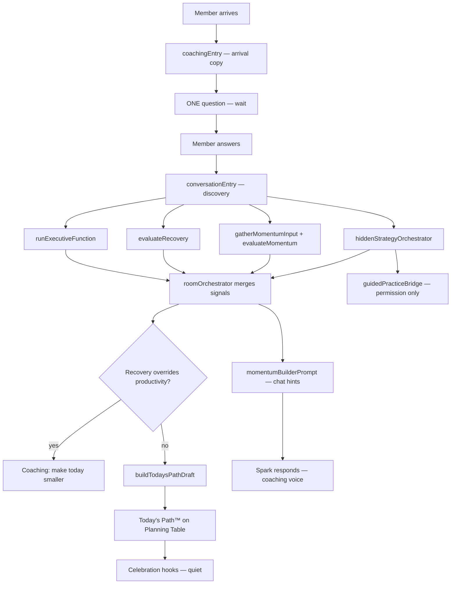

# Momentum Builder™ — V1 Orchestration Architecture

| Field | Value |
|-------|-------|
| **Status** | Proposed architecture — experience first, intelligence reused |
| **Canonical room** | `momentum-builder` (`AppSection`) |
| **Principle** | Orchestration, not duplication. Strategies are engine fuel — never member vocabulary. |
| **Parent** | [MOMENTUM_BUILDER_ROOM_ARCHITECTURE.md](./MOMENTUM_BUILDER_ROOM_ARCHITECTURE.md) · [ESTATE_ROOMS_FRAMEWORK.md](./ESTATE_ROOMS_FRAMEWORK.md) |

---

## Emotional contract

| Moment | Member should feel |
|--------|-------------------|
| **Arrival** | "I can do this." |
| **Departure** | "I know exactly what to do next." |

Everything in the room serves those two outcomes. If a feature teaches, defines, or browses — it does not belong here.

---

## What Momentum Builder™ is not

- Productivity page · task manager · strategy library · dashboard · framework browser · technique collection
- Replacement for `StrategiesPanel` / playbook (those remain legacy internal surfaces until migration completes)

## What it is

**The canonical execution room of the Spark Estate™** — where entrepreneurs regain forward motion.

Conversation chooses direction. Existing intelligence executes invisibly. Optional guided practice teaches only with permission.

---

## Estate experience (design before code)

Imagine a warm planning studio:

- Morning sunlight · large oak planning table · leather notebook · pencil
- A few organized sticky notes · planning wall · fresh flowers
- Calm, clarity, forward movement — nothing busy, nothing overwhelming

### Room layout (V1 → V2)

```
┌─────────────────────────────────────────────────────────────┐
│  [Estate background — planning studio art when shipped]      │
│                                                              │
│   ┌──────────────────────┐    ┌─────────────────────────┐ │
│   │ Conversation         │    │ Planning Table          │ │
│   │ (primary — lower     │    │ = Today's Path™         │ │
│   │  left frosted chat)  │    │ appears after Spark     │ │
│   │                      │    │ understands situation   │ │
│   │ Coaching only        │    │ NOT a task list         │ │
│   └──────────────────────┘    └─────────────────────────┘ │
│                                                              │
│   [Momentum Path™ — stone garden — V2 architecture only]    │
└─────────────────────────────────────────────────────────────┘
```

**Arrival:** No definitions. No teaching. Spark helps immediately.

> "Let's make today a little easier."
>
> *(pause)*
>
> ONE question — then wait.

---

## Existing systems inventory (reuse — do not rebuild)

### Strategy layer

| System | Path | Role in room | Member sees |
|--------|------|--------------|-------------|
| **strategyRouting** | `lib/strategyRouting.ts` | Classify ADHD apply vs business create intent | Nothing (internal) |
| **strategyIntelligence** | `lib/strategyIntelligence.ts` | Situation → strategy match, confidence | Nothing — coaching language only |
| **strategyCatalog** | `lib/strategyCatalog.ts` | Route to builtin strategies / activities | Nothing in room |
| **strategySystem** | `lib/strategySystem.ts` | Full strategy content corpus | Nothing by name |
| **situationAtlas** | `lib/adhdEntrepreneurSituationAtlas.ts` | Situation resolution | Nothing |

**Today:** `hiddenStrategyOrchestrator.ts` uses `recommendStrategyFromUserText` + `resolveSituation` only.

**Wire next:** `classifyStrategyIntent` when disambiguation needed; catalog routes for guided practice launch only (Layer 3).

---

### Momentum & planning layer

| System | Path | Role in room | Member sees |
|--------|------|--------------|-------------|
| **generateMomentumAction** | `lib/companionBrain/generateMomentumAction.ts` | Day-mode-aware next action inside brain cycle | Hospitality label only |
| **momentum-intelligence** | `lib/momentum-intelligence/` | Score momentum, wins, blockers, trends | Never scores — optional warm offers |
| **gatherMomentumInput** | `lib/momentum-intelligence/momentumSignals.ts` | Pull projects, day designer, cognitive load, activation | Nothing |
| **momentumStore** | `lib/momentum-intelligence/momentumStore.ts` | Snapshot persistence | Nothing |
| **Plan My Day** | `lib/planMyDay/` | Separate Morning Room estate experience | Not merged — bridge when member needs full day |
| **Day Designer** | `lib/day-designer/` | Conversational day shaping from chat | Internal bridge only |

**Naming note:** `momentum-intelligence/types.MomentumBuilder` (signal tags like `first_step`) ≠ T-012 practice builders ≠ EF Quick Recharge catalog (`lib/momentumBuilders/`).

---

### Recovery & executive function

| System | Path | Role in room | Member sees |
|--------|------|--------------|-------------|
| **recovery-intelligence** | `lib/recovery-intelligence/` | Fatigue/burnout detection; overrides productivity | Gentle coaching copy |
| **EF engine** | `lib/sparkCoreIntelligence/executiveFunctionEngine/` | Overwhelm/stuck detection, next step, breakdown | Coaching — never framework names |
| **bridgeToMomentum** | `executiveFunctionEngine/integrations.ts` | EF → momentum room posture | reduceChoices, warm lead |
| **restartRecovery** | `executiveFunctionEngine/restartRecovery.ts` | Return-after-absence paths | Hospitality welcome |

---

### Guidance & needs

| System | Path | Role in room | Member sees |
|--------|------|--------------|-------------|
| **companionNeedsIntelligence** | `lib/companionNeedsIntelligence/` | Need scoring, EF bands, place routing | Nothing direct |
| **ecosystem-intelligence** | `lib/ecosystem-intelligence/` | Priority signals; respects recovery override | Nothing direct |
| **sparkGuidanceEngine** | `lib/sparkGuidanceEngine/types.ts` | **Types only** — no runtime engine yet | N/A |
| **sparkWisdom** | `lib/sparkWisdom/` | Conversational wisdom (frozen) | Shari voice via chat hints |

---

### T-012 & practice catalogs

| System | Path | Role in room | Member sees |
|--------|------|--------------|-------------|
| **sparkMomentumBuilders** | `lib/sparkMomentumBuilders/types.ts` | T-012 spec types (domains, flow stages) | Future guided practice |
| **momentumBuilders** | `lib/momentumBuilders/` | EF Quick Recharge catalog | **Separate** — Game Room only |
| **guidedPracticeBridge** | `lib/momentumBuilderRoom/guidedPracticeBridge.ts` | Map approach → builderId; permission prompt | "I have something that might help" |

---

### Founder-only (not member room)

| System | Path | Notes |
|--------|------|-------|
| **momentumPatternEngine** | `lib/ecosystem/companion/momentumPatternEngine.ts` | Founder event analytics — feeds Momentum Profile™ quietly over time |

---

## Orchestration pipeline (canonical)

**Single entry:** `runMomentumBuilderRoomCycle()` in `lib/momentumBuilderRoom/roomOrchestrator.ts`

No new strategy engines. This function **calls** existing systems and assembles room state.



### Layer map

| Layer | Module | Existing systems consumed | Member surface |
|-------|--------|---------------------------|----------------|
| **1 Conversation** | `coachingEntry`, `conversationEntry`, `momentumBuilderPrompt` | EF detection copy, recovery welcome | Frosted chat |
| **2 Hidden Strategy** | `hiddenStrategyOrchestrator` | strategyIntelligence, situationAtlas, strategyRouting (next) | Nothing |
| **2b Signals** | `roomOrchestrator` | EF engine, recovery, momentum-intelligence | Nothing |
| **3 Momentum Profile™** | `momentumProfileBridge` | momentumStore, gatherMomentumInput, founder patterns (async) | Invisible |
| **4 Guided Practice** | `guidedPracticeBridge` | T-012 types, momentumBuilders launch routes | Permission offer only |
| **5 Today's Path™** | `todaysPath` | EF nextStep/breakdown, orchestration, momentum snapshot | Planning table |
| **6 Momentum Path™** | `momentumPathHooks` | **Architecture only V1** — stone milestones | V2 visual |
| **Estate** | `estateIntegration` | Homestead registry, journey positions | Navigation continuity |

---

## Today's Path™ (Planning Table)

**Not a task list.** A calm forward-motion object on the oak table.

Sections appear **only when useful** — no empty placeholders.

| Section | Canonical name | Source |
|---------|----------------|--------|
| Headline | — | Coaching synthesis from discovery |
| First Step™ | `firstStep` | `simplifyNextStep` / `breakdownLargeTask` |
| Easy Win™ | `easyWins` | Low-energy momentum candidates |
| Focus Session™ | `focusSessions` | When energy + time support |
| Roadblocks™ | `roadblocks` | `conversationEntry` + momentum blockers |
| Tomorrow Starts Here™ | `tomorrowStartsHere` | End-of-session handoff |

**Builder:** `buildTodaysPathDraft()` in `lib/momentumBuilderRoom/todaysPath.ts`

**Persistence:** V1 in-memory/session; V2 Business Brain + intelligence hooks on `TodaysPath` type.

---

## Momentum Path™ (V2 — architect now, build later)

Iconic progress = **stone garden path through the Estate** — not checklists or streaks.

V1 delivers **hooks only** (`lib/momentumBuilderRoom/momentumPathHooks.ts`):

- `MomentumPathMilestone` — meaningful progress events
- `recordMomentumPathMilestone()` — no-op persistence stub → future LIG/narrative
- Milestones: first step taken, easy win completed, focus session honored, roadblock named, return after absence

Members never see "streak" or "completion rate."

---

## Momentum Profile™ (largely invisible)

Quiet learning over time via existing momentum intelligence:

- Preferred work style · best hours · planning preferences
- Motivation patterns · energy curves · recurring obstacles/successes

**Bridge:** `readMomentumProfileSignals()` in `momentumProfileBridge.ts` — reads `momentumStore`, `gatherMomentumInput`, optional founder `momentumPatternEngine` samples.

Never surfaced as "your profile says…" — only shapes orchestration confidence.

---

## Suggested Builder (Layer 3)

Spark occasionally: *"I have something that might help."*

- Never a library · never "choose a method"
- `guidedPracticeBridge` returns permission prompt + internal `builderId`
- Launch routes through existing `momentumBuilders` / activities — not new runners

Teach techniques only when member asks or after meaningful progress (Business Mastery Minute).

---

## Celebration (quiet)

No gamification · no streaks · no guilt.

| Signal | Room response |
|--------|---------------|
| First step named | Notebook closes gently; warm sunlight shift (CSS) |
| Easy win done | Planning board updates |
| Session complete | Spark: "Nice work." |

Hooks in `estateIntegration.ts` → future room motion CSS.

---

## Estate integration

```
Welcome Home → Observatory™ → Library → Conservatory → Momentum Builder™ → Creative Studio → Coffee House
   arrive         discover        learn       think         decide & act          create          reflect
```

| Connection | Implementation |
|------------|----------------|
| Homestead room id | `momentum-builder` in `roomRegistry.ts` |
| Grow card | Redirects to `momentum-builder` (not educational catalog) |
| Observatory / Library | Future: opportunity → learning → **execution** handoff via `estateIntegration.ts` |
| Plan My Day | Separate room; bridge when member needs full morning planning |
| Quick Recharge | `game-room` / `momentumBuilders` — **not** this room |

---

## V1 deliverable checklist

| Item | Status | Path |
|------|--------|------|
| Room shell + route | ✅ Wired | `MomentumBuilderRoomShell`, `?section=momentum-builder` |
| Conversation entry | ✅ | `coachingEntry.ts`, `momentumBuilderPrompt.ts` |
| Teaching mode suppressed | ✅ | `CompanionPageClient` + chat hints |
| Hidden strategy orchestration | ⚡ Partial | `hiddenStrategyOrchestrator.ts` — expand wiring |
| Room cycle composer | ✅ New | `roomOrchestrator.ts` |
| Today's Path™ object | ✅ New | `todaysPath.ts` |
| Planning table placeholder | ✅ New | `MomentumBuilderRoomShell` CSS zone |
| Momentum Path™ hooks | ✅ New | `momentumPathHooks.ts` |
| Momentum Profile™ bridge | ✅ New | `momentumProfileBridge.ts` |
| Estate connection points | ✅ New | `estateIntegration.ts` |
| Full planning table UI | ❌ V2 | — |
| Momentum Path™ visual | ❌ V2 | — |
| Guided practice runners | ❌ V2 | Permission bridge only |

---

## What must NOT exist in V1

- Strategy menu · productivity dashboard · framework browser
- Definitions · educational introduction · "choose a method"
- Playbook navigation · overwhelming UI
- Exposed names: Pomodoro, Brain Dump, Eisenhower, Time Blocking, Two-Minute Rule, etc.

---

## Duplication risks (guardrails)

| Risk | Mitigation |
|------|------------|
| Two strategy selectors (chat vs room) | Room uses `roomOrchestrator` exclusively when `activeSection === momentum-builder` |
| Plan My Day vs Momentum Builder | Plan My Day = full morning room; Momentum Builder = stuck → forward motion |
| momentumBuilders catalog vs room | Catalog = Game Room; room = conversation + Today's Path™ |
| New strategy engines | **Forbidden** — only compose existing exports |

---

## Success criteria

1. First-time user understands the room **without instructions**
2. Feels **coached**, not taught
3. Spark does difficult thinking invisibly
4. Member experience: *"I came in stuck… now I know exactly what to do next."*

---

## Implementation order

1. **Experience** — arrival copy, frosted chat, planning table zone (done / in progress)
2. **Orchestration** — `roomOrchestrator` composes EF + recovery + momentum + hidden strategy
3. **Today's Path™** — populate planning table when confidence sufficient
4. **Chat hints** — feed orchestration output to `momentumBuilderRoomHintForChat`
5. **Estate bridges** — Observatory/Library handoff metadata
6. **V2** — Momentum Path™ visual, persistence, guided practice launch, room art

**Rule:** Wire intelligence behind the experience. Never expose implementation details.
