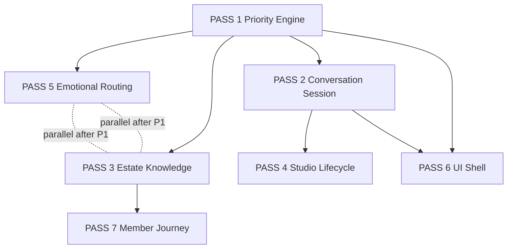

# Spark Conversation Bug Reverse Engineering

**Date:** 2026-07-05  
**Status:** Reverse-engineering + batching plan — **no implementation until reviewed**  
**Foundational principle:** **THE RELATIONSHIP OWNS THE WORK.**  
**Goal:** Group known bugs into **root systems** so each engineering pass fixes **many symptoms**, not one patch at a time.

**Related:**

| Document | Role |
|----------|------|
| [SPARK_CONVERSATION_INTELLIGENCE_ARCHITECTURE.md](./SPARK_CONVERSATION_INTELLIGENCE_ARCHITECTURE.md) | Target pipeline · full stack |
| [CONVERSATION_SESSION_ARCHITECTURE.md](./CONVERSATION_SESSION_ARCHITECTURE.md) | Session spine · one active relationship (Pass 2) |
| [MEMBER_JOURNEY_ARCHITECTURE.md](./MEMBER_JOURNEY_ARCHITECTURE.md) | Journey layer (Pass 7) |
| [CONVERSATION_REGRESSION_AUDIT.md](./CONVERSATION_REGRESSION_AUDIT.md) | Jul 4–5 evidence |
| [ESTATE_CREATION_EXPERIENCE.md](./ESTATE_CREATION_EXPERIENCE.md) | Creating Together · Studio Registry (Pass 4) |
| [estate/ESTATE_INTELLIGENCE_ARCHITECTURE.md](./estate/ESTATE_INTELLIGENCE_ARCHITECTURE.md) | Place + Studio routing (Pass 3) |

---

## Executive summary

**Twenty member-visible failures collapse into six root systems.**

| Root system | Bugs fixed | Engineering pass |
|-------------|------------|------------------|
| **RS-A** Continuation & priority (no single “yes to what?” owner) | 1, 2, 3, 13, 14 (partial) | **Pass 1** |
| **RS-B** Session fragmentation & handoff (no conversation spine) | 2, 4, 5, 6, 16, 17, 20 | **Pass 2** (+ Pass 4) |
| **RS-C** Routing order & need misclassification | 8, 10, 11, 12 (partial) | **Pass 1** (partial) + **Pass 5** |
| **RS-D** Estate knowledge not in chat path | 7, 8, 9, 15 (partial), 18 (partial) | **Pass 3** |
| **RS-E** Creation lifecycle & Studio decision missing | 4, 5, 16, 17 | **Pass 4** |
| **RS-F** UI shell & journey fragmentation | 14, 15, 19, 20 | **Pass 6** + **Pass 7** |

**Highest-impact first pass:** **Pass 1 — Conversation Priority Engine** (fixes wrong yes/continue, stale pendings, and unblocks Pass 2).

**Do not patch symptoms** (expand one regex, add one `if` in frictionless) until the pass owner is identified below.

---

## Root systems (the real bugs)

### RS-A — Continuation & priority failure

**What it is:** Four+ acceptance systems run without mandatory priority. Generic `"yes"`, `"continue"`, and `"add more"` bind to **stale** frictionless pending, pending-choice menus, or expired offers — not the **last assistant turn**.

**Stores involved:** `companion-frictionless-pending-v1`, `spark:pending-choice:v1`, React `pendingAcceptance`, `conversationWorkflowContinuation`, `companion-outcome-thread-v1`.

**Rule violated:** Most Recent Meaning Wins™ · Spec 106 one owner per turn.

---

### RS-B — Session fragmentation & handoff failure

**What it is:** Discovery answers live in `universal-creation-session-v1`; Studio opens from `companion-create-session-v1` + `blankScaffoldForType`; handoff **clears** UC session and **re-interviews** via `followUpForItemType()`.

**Stores involved:** UC session, create workflow record, create session, facilitated creation in-memory, frictionless pending (prompt only).

**Rule violated:** Conversation travels (Spec 108) · Never re-ask answered questions.

---

### RS-C — Routing order & misclassification

**What it is:** `CompanionPageClient.handleSend` runs pending-choice **before** session continuation; Decision Engine **CREATE terminal** overrides decide intent; `"too many ideas"` **excluded** from Clear My Mind path; emotional turns fall through to environment menus or generic chat.

**Modules involved:** `primaryTurnClassifier`, `intentAdapter`, `frictionlessActionLayer`, `environment-intelligence`, pipeline order in `CompanionPageClient.tsx`.

---

### RS-D — Estate knowledge disconnected from conversation

**What it is:** Canonical registry (75 places) + Estate Judgment layer exist but **chat menus** still use static 3-room arrays (`estateWanderNavigation`, `estateMetaNavigation`, clusters). `answerEstateKnowledgeQuery` / `evaluateEstateJudgment` not wired as **mandatory** pre-LLM path. `estateRoomKnowledgeHintForChat` import broken in estate guide path.

**Rule violated:** Gentle Guidance · Registry as authority · Photograph Test (repetitive wrong rooms).

---

### RS-E — No unified creation lifecycle / Studio decision

**What it is:** No single **enough** gate; no enforced chat → Studio → review → save/print/export; phase models differ (UC vs workflow vs Spec 107); Spark keeps asking when confidence threshold met.

**Rule violated:** Spec 104 · Spec 110 · Spec 113 · ESTATE_CREATION_EXPERIENCE lifecycle.

---

### RS-F — UI shell & member journey fragmentation

**What it is:** Legacy menus, workspace chrome, first-time intro vs returning-user flags, and estate features (breathe, games, audio, wins, evidence, momentum, Spark Cards, Discovery Keys) each have **separate** routing — not one Estate Intelligence recommendation surface.

**Rule violated:** One relationship (Spec 103) · Living in Spark Estate.

---

## §1 — Bug-to-root-cause table

| # | User-visible symptom | Likely files / modules | Root system | Primary cause tag | Also fixed if we fix… |
|---|----------------------|------------------------|-------------|-------------------|------------------------|
| **1** | `"Yes"` answers the wrong pending action | `pendingAcceptanceAuthority.ts`, `frictionlessActionLayer.ts` (`loadFrictionlessPendingForConfirmation`, `tryFrictionlessYesContinuation`), `pendingChoice/resolve.ts`, `companionIntelligenceRouter.ts`, `mostRecentMeaningWins.ts`, `CompanionPageClient.tsx` (~10295 vs ~12567) | **RS-A** | Stale pending · Routing order | **RS-A** Pass 1 |
| **2** | `"Yes add more"` does not continue email/proposal/SOP | `universalCreation/orchestrator.ts`, `CompanionPageClient.tsx` (UC continuation ~10385), `pendingChoice/resolve.ts` (`TOPIC_CHANGE_RE`), `frictionlessActionLayer.ts`, `pendingChoice/pendingChoice.test.ts` | **RS-A** + **RS-B** | Session handoff · Stale pending | Pass 1 **then** Pass 2 |
| **3** | `"Continue"` restarts instead of resumes | `conversationWorkflowContinuation.ts`, `resolveUniversalCreationTurn` (`startUniversalCreationTurn` on non-bare text), `frictionlessActionLayer.ts`, `createExperienceRouting.ts` | **RS-A** + **RS-B** | Session handoff · Stale pending | Pass 1 + Pass 2 |
| **4** | Creation asks repeated questions | `universalCreation/orchestrator.ts`, `createExperienceRouting.ts` (`followUpForItemType`), `createWorkflowRecordStore.ts`, `documentCreationProfiles.ts` | **RS-B** + **RS-E** | Session handoff · Memory | Pass 2 + Pass 4 |
| **5** | Studio opens blank after discovery | `frictionlessActionLayer.ts` (`clearUniversalCreationSession` ~1587), `createPendingAction.ts` (`blankScaffoldForType`), `createExperienceRouting.ts`, `createInitialization.ts`, `completeImmediateCreateOpen` in `CompanionPageClient.tsx` | **RS-B** | Session handoff | Pass 2 (+ Pass 4 bridge) |
| **6** | Room change interrupts/resets creation | `CompanionPageClient.tsx` (navigation handlers), UC session (not linked to `estatePlaceId`), no `ConversationSession` | **RS-B** | Session handoff · Memory | Pass 2 |
| **7** | Estate menus repeat same 3 rooms | `estate/estateWanderNavigation.ts`, `estate/estateMetaNavigation.ts`, `estate/estatePlaceClusters.ts`, `estatePlaceIdentityLock.ts` | **RS-D** | Estate knowledge · Routing | Pass 3 |
| **8** | Spark cannot answer what rooms/features exist | `estateKnowledge/estateKnowledgeRegistry.ts` (`answerEstateKnowledgeQuery`), `estateIntelligence/judgment/evaluateEstateJudgment.ts`, `sparkKnowledge/estateGuide.ts`, `sparkKnowledge/shariKnowledge.ts` (broken `estateRoomKnowledgeHintForChat` import) | **RS-D** | Estate knowledge · Prompt/judgment | Pass 3 |
| **9** | Water / reading / treehouse suggestions wrong or missing | `estatePlaceClusters.ts`, `estate/liveEstatePlace.ts`, `canonicalEstateSubplaces.ts`, `pendingChoice/resolve.ts` (`placeChoicesFromIds` filters non-live), `estateRoutingRegistry.ts`, pipeline order (kernel blocked) | **RS-D** + **RS-C** | Estate knowledge · Routing | Pass 3 (+ product live/planned decision) |
| **10** | Decision requests route as `"create"` | `sparkCompanion/intentAdapter.ts` (CREATE terminal reconcile), `sparkDecisionEngine/classifyIntent.ts`, `frictionlessActionLayer.ts` (~3057), `decisionCompassRouting.ts` | **RS-C** | Routing | Pass 1 guard or Pass 5 |
| **11** | Clear My Mind not immediate when user has lots of ideas | `frictionlessActionLayer.ts` (`buildSimpleOverwhelmOrganizeDecision` — **`!too many ideas`** → category `none`; `too many ideas` → visual/overwhelm branch ~2546) | **RS-C** | Routing · Judgment | Pass 5 |
| **12** | Emotional statements get generic troubleshooting | `primaryTurnClassifier.ts`, `environment-intelligence`, `chatFastPath/chatTurnGuarantee.ts`, `frictionlessActionLayer.ts` (`EMOTIONAL_REGULATION_RE` runs late), `CompanionPageClient.tsx` (~12005) | **RS-C** | Routing · Prompt/judgment | Pass 5 |
| **13** | Old pending actions override current conversation | Same as #1 + `pendingChoice/manager.ts` (TTL), `maybeClearStaleFrictionlessPending`, no priority engine | **RS-A** | Stale pending | Pass 1 |
| **14** | Old menus/workspaces appear unexpectedly | `pendingChoice/manager.ts`, stale localStorage pendings, legacy workspace panels in `CompanionPageClient.tsx`, `estateChromePolicy` | **RS-A** + **RS-F** | Stale pending · UI shell | Pass 1 then Pass 6 |
| **15** | Breathe, games, audio, meditations, wins, evidence, momentum, Spark Cards, Discovery Keys not unified | `estateIntelligence/registrations/*`, separate tool routes in `frictionlessActionLayer.ts`, `estateCapabilityIndex.ts`, no single feature recommendation API | **RS-D** + **RS-F** | Estate knowledge · UI shell | Pass 3 + Pass 7 |
| **16** | Spark does not know when to stop asking questions | `universalCreation/orchestrator.ts` (no global enough gate), `documentCreationProfiles.ts`, `createBuilderChat.ts` | **RS-E** | Session handoff · Judgment | Pass 4 |
| **17** | No natural conversation → Studio → review/save/print/export | `createOpenAuthority.ts`, `ESTATE_CREATION_EXPERIENCE.md` (designed, not wired), Spec 110/113 endings | **RS-E** | Session handoff · UI shell | Pass 4 |
| **18** | Gentle Guidance not followed consistently | `estateIntelligence/judgment/gentleGuidance.ts`, `narrate.ts` (partial); legacy copy in `frictionlessActionLayer`, `estateWanderNavigation`, environment menus | **RS-D** | Prompt/judgment · Estate knowledge | Pass 3 (enforce at response gate) |
| **19** | Returning vs first-time state conflict | `welcomeHome/*`, `sparkExperienceEngine/evaluateWelcomeHomeExperience.ts`, `welcomeRoom/arrival.ts`, intro audio flags, `estateChromePolicy.test.ts` | **RS-F** | UI shell | Pass 6 |
| **20** | Chat, rooms, workspaces, memory not one relationship | **All RS-A–F** — meta failure | **RS-B** (primary) | Memory · Session handoff | Passes 1→2→4 (spine), then 3, 6, 7 |

### Cause tag legend

| Tag | Meaning |
|-----|---------|
| **Routing** | Wrong layer speaks first or wrong category wins |
| **Memory** | State not persisted or not read |
| **Session handoff** | Open/navigate clears or ignores session |
| **Stale pending** | Expired offer executes anyway |
| **Estate knowledge** | Registry/judgment bypassed |
| **UI shell** | Legacy chrome/menus/workspace framing |
| **Prompt/judgment** | LLM hints conflict or judgment not applied |

---

## §2 — Engineering pass plan (7 passes max)

### PASS 1 — Conversation Priority Engine

**Fixes bugs:** 1, 2 (partial), 3 (partial), 13, 14 (partial), 10 (quick guard optional)

**Root systems:** RS-A, RS-C (partial)

**Objective:** One function resolves **what this turn belongs to** before any pending handler or CREATE terminal runs.

| Item | Detail |
|------|--------|
| **New modules** | `lib/conversationIntelligence/priorityEngine.ts`, `lib/conversationIntelligence/orchestrator.ts` (shell) |
| **Extract from** | `mostRecentMeaningWins.ts`, `pendingAcceptanceAuthority.ts`, `conversationWorkflowContinuation.ts`, `pendingChoice/resolve.ts` (affirmation branch) |
| **Wire** | `CompanionPageClient.handleSend` behind `CONVERSATION_PRIORITY_ENGINE` flag — **priority before** `resolvePendingChoiceTurn` |
| **Tests to add** | `priorityEngine.test.ts`: yes→last offer; yes→stale funnel blocked; continue→session; add-more→UC session; topic change clears stale |
| **Risks** | Medium — wrong bridge executes stale action; require turn + assistant alignment on every case |
| **Safest commit order** | 1) priorityEngine + tests · 2) wire pendingAcceptance · 3) reorder handleSend · 4) affirmation phrase expansion · 5) flag default off → on in dev |
| **Do not touch** | Create panel UI · estate backgrounds · prompts/wisdom layer · new specs |
| **Production verify** | Replay: sales funnel yes; clear-my-mind yes with stale create pending; email "yes add more"; "continue" after discovery Q |

---

### PASS 2 — Conversation Session / Creation Continuity

**Fixes bugs:** 2, 3, 4, 5, 6, 16 (partial), 17 (partial), 20 (foundation)

**Root systems:** RS-B, RS-E (partial)

**Objective:** One `ConversationSession` store; dual-write from UC; **never clear session on Studio open**; question guard.

| Item | Detail |
|------|--------|
| **New modules** | `lib/conversationSession/types.ts`, `store.ts`, `questionGuard.ts`, `adapters/migrateFromUniversalCreation.ts` |
| **Modify** | `universalCreation/orchestrator.ts` (dual-write), `frictionlessActionLayer.ts` (remove clear before open), `createExperienceRouting.ts` (retire `followUpForItemType` re-asks) |
| **Tests to add** | Session patch merge; `mayAskQuestion` rejects answered slots; handoff preserves answers; room change same sessionId |
| **Risks** | Medium-high — Create panel regression |
| **Safest commit order** | 1) types + store (read-only) · 2) dual-write UC · 3) dev panel diff · 4) remove UC clear on ready · 5) session-aware continuation replaces regex · 6) `buildCreateOpenFromConversationSession` stub |
| **Do not touch** | Full Studio UI redesign · Brain long-term memory schema · estate wander menus (Pass 3) |
| **Production verify** | SOP 3 questions → yes → Create shows prefilled context; close panel → chat continues; reopen same draft |

**Depends on:** Pass 1 (affirmations must bind to session, not stale pending)

---

### PASS 3 — Estate Knowledge + Estate Intelligence

**Fixes bugs:** 7, 8, 9, 15 (partial), 18, 14 (partial)

**Root systems:** RS-D

**Objective:** Chat estate answers and menus go through **registry + judgment**; static 3-room arrays retired; Gentle Guidance enforced in narrator.

| Item | Detail |
|------|--------|
| **Modify** | `estateWanderNavigation.ts`, `estateMetaNavigation.ts`, `estatePlaceClusters.ts` → call `evaluateEstateJudgment` / `pickRegistryPlaceIds`; `sparkKnowledge/shariKnowledge.ts` fix `estateRoomKnowledgeHintForChat`; wire `answerEstateKnowledgeQuery` in orchestrator |
| **Reuse** | `estateIntelligence/judgment/*`, `estateKnowledge/*`, `gentleGuidance.ts`, `narrate.ts` |
| **Tests to add** | Wander not always coffee-library-observatory; water cluster; "what rooms exist" informational; meta "only three places?" no navigate; judgment copy has no "Go to" |
| **Risks** | Medium — surfacing `planned` places; product sign-off on Possibility House / treehouse live status |
| **Safest commit order** | 1) fix estate guide import · 2) registry query in guide path · 3) judgment-backed wander · 4) meta phrase guards · 5) ordinal parse fix (can ship with Pass 1 if urgent) · 6) live/planned alignment |
| **Do not touch** | Conversation session schema · Create handoff · welcome intro |
| **Production verify** | "Somewhere near water"; "what can Spark do"; "another room" (rotating); treehouse when live |

**Can parallel with:** Pass 2 after Pass 1 (different files) — **avoid** both changing `CompanionPageClient` same week without coordination.

---

### PASS 4 — Studio Navigation + Creation Lifecycle

**Fixes bugs:** 4, 5, 16, 17, 2 (complete), 20 (member-visible continuity)

**Root systems:** RS-E, RS-B (complete)

**Objective:** Enough gate · tiered interview caps · Studio open decision · review/save/print/export via conversation (Spec 113).

| Item | Detail |
|------|--------|
| **Modify** | `createOpenAuthority.ts`, `createExperienceRouting.ts`, `universalCreation/orchestrator.ts` → `creationAdvisor`; implement `ESTATE_CREATION_EXPERIENCE.md` lifecycle |
| **Tests to add** | Email ≤2 Q then draft; SOP guided cap; enough→permission→Studio; no blank scaffold when slots filled |
| **Risks** | High — Create/Studio surface |
| **Safest commit order** | 1) enough gate (chat only) · 2) Studio hydrate from session · 3) phase transitions · 4) completion/certainty copy · 5) export paths |
| **Do not touch** | Estate menus · emotional routing · member journey objects |
| **Production verify** | Full journey: email quick create; funnel discovery; review; "where did it go?" certainty |

**Depends on:** Pass 2 session spine **required**

---

### PASS 5 — Emotional + Support Routing

**Fixes bugs:** 11, 12, 9 (partial — don't menu during distress), 10 (if not done in Pass 1)

**Root systems:** RS-C

**Objective:** Distress/recovery **before** menus, CREATE terminal, and environment offers.

| Item | Detail |
|------|--------|
| **Modify** | `primaryTurnClassifier.ts` (stress, breath, brain overload); `frictionlessActionLayer.ts` (`too many ideas` → Clear My Mind immediate); `environment-intelligence` gate; `intentAdapter.ts` decide-before-create |
| **Tests to add** | Stress transcript replay; "too many ideas" → brain-dump offer; decide phrase → compass not create |
| **Risks** | Low–medium — over-blocking legitimate environment invites |
| **Safest commit order** | 1) primaryTurn emotional expansion · 2) clear-my-mind for ideas · 3) environment gate · 4) decide guard |
| **Do not touch** | Session store · Studio UI |
| **Production verify** | Jul 4 stress paste; "I have too many ideas"; "help me decide between two offers" |

**Can parallel with:** Pass 3 (after Pass 1)

---

### PASS 6 — Estate UI Shell Cleanup

**Fixes bugs:** 14, 19, 20 (partial), 18 (partial — remove command copy in chrome)

**Root systems:** RS-F

**Objective:** Returning user never sees first-time intro; stale workspace chrome hidden; pending TTL enforced in UI.

| Item | Detail |
|------|--------|
| **Modify** | `CompanionPageClient.tsx` (legacy panels), `estateChromePolicy`, welcome intro gates, `pendingChoice` clear on navigation |
| **Tests to add** | `estateChromePolicy.test.ts`, `welcomeHomeReturningUser.test.ts` extensions |
| **Risks** | Medium — visual regressions |
| **Safest commit order** | 1) intro flag hardening · 2) chrome policy · 3) retire dead menus · 4) workspace placeholder audit |
| **Do not touch** | Conversation session · creation bridge |
| **Production verify** | Returning login: no intro audio; no orphan workspace tabs |

**Depends on:** Pass 1 (stale pending) — **should wait** until priority engine stable

---

### PASS 7 — Member Journey Layer

**Fixes bugs:** 15, 20 (long-term), 17 (connection to wins/gallery)

**Root systems:** RS-F + RS-D

**Objective:** Unified Estate Intelligence feature catalog — breathe, games, audio, meditations, momentum, Spark Cards, Discovery Keys, wins, evidence — **one recommendation API**, conversational bridges.

| Item | Detail |
|------|--------|
| **Modify** | `estateIntelligence/registrations/tools.ts`, `estateCapabilityIndex.ts`, orchestrator feature advisor |
| **Tests to add** | "I need to breathe" → breathe invite; "celebrate a win" → wins path; feature catalog query |
| **Risks** | Medium — scope creep into new features |
| **Safest commit order** | 1) feature catalog in registry · 2) judgment recommends features · 3) gentle bridges · 4) journey hooks (momentum, discovery key) |
| **Do not touch** | Core session · priority engine |
| **Production verify** | Ask for each feature class once; all get warm invite with why |

**Depends on:** Pass 3 estate intelligence path

---

## §3 — Dependency map



| Relationship | Passes | Notes |
|--------------|--------|-------|
| **Must happen first** | **Pass 1** | Everything with yes/continue/stale pending |
| **Must follow Pass 1** | Pass 2, Pass 5, Pass 6 | Session and emotional routing assume priority |
| **Must follow Pass 2** | Pass 4 | Studio bridge needs session spine |
| **Can parallel (after Pass 1)** | Pass 3 + Pass 5 | Different modules; coordinate `CompanionPageClient` edits |
| **Should wait** | Pass 6 until Pass 1 stable | Shell cleanup hides symptoms if priority still broken |
| **Should wait** | Pass 7 until Pass 3 | Features need judgment path |
| **Do not start** | Pass 4 before Pass 2 dual-write proven | Blank Studio will persist |

---

## §4 — Highest-impact first pass

### **PASS 1 — Conversation Priority Engine**

**Why first:**

1. Fixes **5 bugs directly** (1, 3, 13, 14 partial, 10 optional) and **unblocks** 2, 4, 5, 6, 17, 20.  
2. **Lowest new surface area** — mostly extract + reorder, no Studio UI.  
3. **Partially started** — `mostRecentMeaningWins.ts`, `pendingAcceptanceAuthority.ts` patches exist; needs **single owner** + pipeline order, not more patches.  
4. **Regression audit P0** — pending-choice false positives (#5, #10) pair naturally with Pass 1 commit 2.  

**Expected member impact after Pass 1:**

- `"Yes"` continues what Shari just offered.  
- Stale sales-funnel / menu pending loses to clear-my-mind thread.  
- `"Continue"` / `"add more"` reaches active UC session when present.  
- Meta questions less likely to navigate to Observatory.  

**Not fixed until later passes:** blank Studio, repeated discovery questions, estate knowledge breadth, emotional menus, journey unification.

---

## §5 — Recommended first Cursor implementation prompt

Use this **verbatim** when ready to code Pass 1:

---

> **Task: PASS 1 — Conversation Priority Engine (no feature work)**
>
> Read: `docs/SPARK_CONVERSATION_BUG_REVERSE_ENGINEERING.md` (Pass 1), `docs/SPARK_CONVERSATION_INTELLIGENCE_ARCHITECTURE.md` (Layer 3), `docs/CONVERSATION_REGRESSION_AUDIT.md`.
>
> **Goal:** One `resolveConversationPriority()` runs at the start of every turn **before** `resolvePendingChoiceTurn`, frictionless yes-continuation, or CREATE terminal reconcile.
>
> **Implement:**
> 1. `lib/conversationIntelligence/priorityEngine.ts` — verdict: winner, bindAffirmationTo, stalePendingsToClear.  
> 2. Extract logic from `mostRecentMeaningWins.ts` + `pendingAcceptanceAuthority.ts` — do not duplicate.  
> 3. Reorder `CompanionPageClient.handleSend` behind flag `CONVERSATION_PRIORITY_ENGINE`.  
> 4. Fix `pendingChoice/parseSelection.ts` — ordinals only on standalone menu picks (bugs #5, #10).  
> 5. Treat `"yes add more"`, `"add more"`, `"continue"` as session continuation when `loadUniversalCreationSession()` active.  
> 6. Optional: decide phrase guard before CREATE terminal in `intentAdapter.ts`.
>
> **Tests required before merge:**  
> - `priorityEngine.test.ts` (new)  
> - Extend `pendingChoice.test.ts`, `mostRecentMeaningWins.test.ts`, `frictionlessActionLayer.test.ts` yes-* cases  
> - `sparkV4Reliability.test.ts` meta-question no-navigate  
>
> **Do not:** change Create panel, estate backgrounds, prompts, or add specs.  
> **Do not:** patch frictionless with another one-off branch — wire through priority engine.

---

## §6 — Tests needed before coding (full suite)

Run / extend **before any pass merges:**

| Suite | Covers bugs |
|-------|-------------|
| `lib/conversation/mostRecentMeaningWins.test.ts` | 1, 13 |
| `lib/pendingChoice/pendingChoice.test.ts` | 1, 2, 5, 10, 14 |
| `lib/frictionlessActionLayer.test.ts` (`yes-*`) | 1, 2, 3 |
| `lib/companionIntelligenceRouter.test.ts` | 1, 13 |
| `lib/conversation/sparkV4Reliability.test.ts` | 5, 10, 14 |
| `lib/universalCreation/universalCreation.test.ts` | 2, 4, 7 |
| `lib/conversation/sopCreateRuntime.test.ts` | 4, 5, 7 |
| `lib/conversationArtifactAssembler.test.ts` | 5 (no blank scaffold) |
| `lib/estateIntelligence/judgment/estateJudgment.test.ts` | 8, 18 |
| `lib/estate/estateWanderNavigation.test.ts` (add) | 7 |
| `lib/conversation/emotionalSupportMenu.test.ts` | 12 |
| `lib/conversation/emotionalRouting.test.ts` (add) | 12 |
| `lib/sparkCompanion/intentAdapter.test.ts` (add) | 10 |
| `lib/welcomeHome/welcomeHomeReturningUser.test.ts` | 19 |
| Manual: Conversation Excellence Checklist C1–C20 | All |

**Golden manual replay (from regression audit):**

1. Stress transcript → no environment menu turn 2  
2. Email discovery → `"yes add more"` → same session  
3. SOP → profile first question, not generic create  
4. `"help me decide"` → Decision Compass, not Create  
5. `"are these the only three places?"` → answer, no Observatory  
6. Sales funnel → `"yes"` → universal_creation continues  

---

## §7 — Things Spark must never do again

| Never | Why | Enforced by |
|-------|-----|-------------|
| Bind generic `"yes"` to an offer the **last assistant message did not make** | Wrong task execution | Pass 1 priority |
| Execute **expired or misaligned** pending actions | Stale thread wins | Pass 1 priority |
| **`clearUniversalCreationSession()`** before Studio open | Loses discovery | Pass 2 session |
| Open Studio from **`blankScaffoldForType`** when session has answers | Blank document | Pass 2 + 4 |
| **`followUpForItemType`** re-interview after handoff | Repeated questions | Pass 2 |
| **`startUniversalCreationTurn`** on continuation without explicit new task | Restarts discovery | Pass 2 |
| Offer **static coffee/library/observatory** for every wander | Repetitive estate | Pass 3 |
| Navigate on **meta questions** about menus | False ordinal parse | Pass 1 + 3 |
| Route **decide intent** to CREATE terminal | Wrong workspace | Pass 5 |
| Show **environment menus during acute distress** | Spec 111 violation | Pass 5 |
| Send **"too many ideas"** to `"none"` instead of Clear My Mind | Bug #11 | Pass 5 |
| **Command** navigation (*"Go to…"*, *"Opening…"*) | Gentle Guidance | Pass 3 response gate |
| Treat **room change** as new conversation | Spec 108 | Pass 2 session |
| Show **first-time intro** to returning members | Trust break | Pass 6 |
| Surface **planned** places as navigable without honest copy | Estate trust | Pass 3 product gate |
| End with **Save/Export toolbar** instead of conversational certainty | Spec 113 | Pass 4 |
| Add **another frictionless early-return** without priority engine | Perpetuates RS-A | Process rule |

---

## Appendix A — Current `handleSend` order (why bugs happen)

```
classifyPrimaryConversationTurn + Decision Engine (CREATE may win)     ← #8, #10
  → early social / support exits
  → hasActivePendingChoice() → resolvePendingChoiceTurn              ← #1, #5, #10, #13
  → universal creation fast path                                       ← #2, #4, #7
  → frictionless (40+ branches) + yes-continuation                     ← #1, #3, #11
  → estate kernel / environment offer                                  ← #7, #9, #12
  → companion API + LLM
  → post-API: register pending menus                                    ← #14
```

**Target order (after Pass 1–2):**

```
orchestrateConversationTurn()
  → understanding
  → load ConversationSession
  → resolveConversationPriority()          ← FIRST
  → need classification
  → domain advisors (estate, creation, emotional)
  → studio decision
  → response gates
  → patch session
```

---

## Appendix B — Bug count per pass (quick reference)

| Pass | Bugs addressed |
|------|----------------|
| **1** Priority | 1, 2†, 3†, 5†, 10†, 13, 14† |
| **2** Session | 2, 3, 4, 5, 6, 16†, 17†, 20† |
| **3** Estate | 7, 8, 9, 15†, 18 |
| **4** Studio lifecycle | 4, 5, 16, 17, 20† |
| **5** Emotional | 10, 11, 12, 9† |
| **6** UI shell | 14, 19, 20† |
| **7** Journey | 15, 20 |

† = partial or foundational; full fix may need dependent pass.

---

## Appendix C — Sign-off before implementation

- [ ] Pass order approved (1 → 2 → 4 spine; 3/5 parallel after 1)  
- [ ] No new member-facing specs (implementation consolidation only)  
- [ ] Possibility House / treehouse live vs planned — product decision for Pass 3  
- [ ] Feature flags named and default off  
- [ ] Conversation Excellence Checklist attached to PR template  
- [ ] Observation Mode: prompt changes only after Rule of Three  

---

*End of document. No code has been changed. This is the batching plan for conversation bug fixes.*
