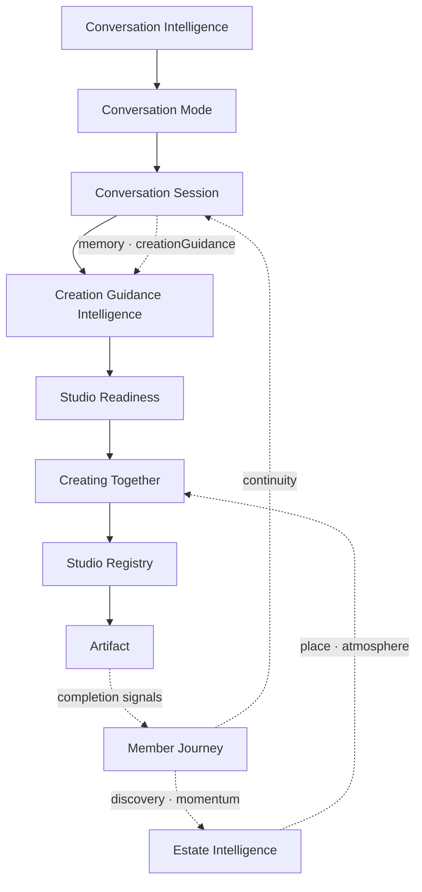
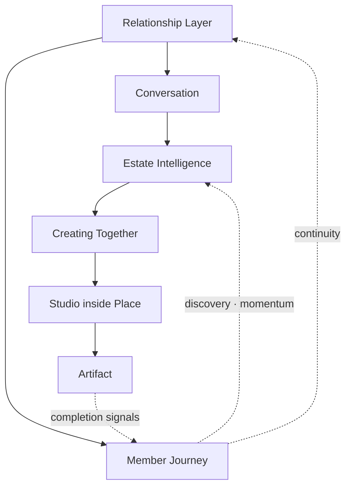
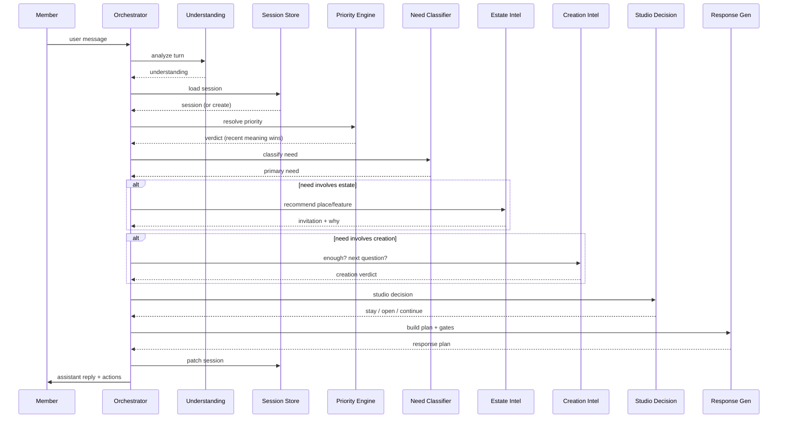
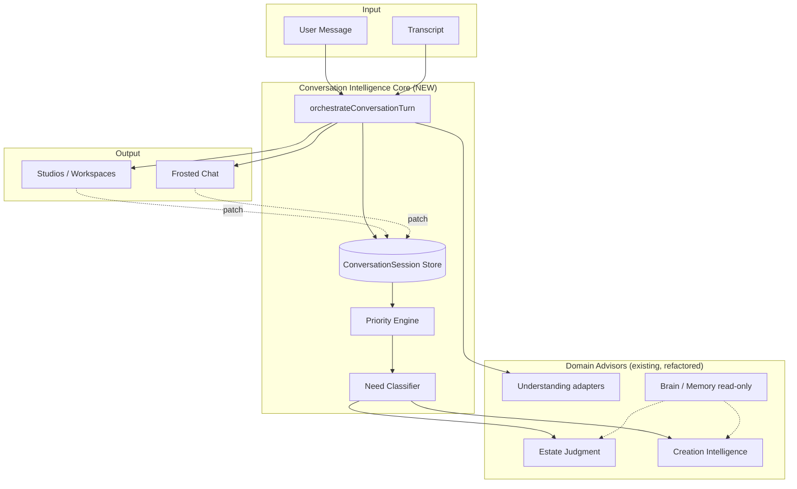

# Spark Conversation Intelligence Architecture

**Date:** 2026-07-05  
**Status:** **Binding architecture** — no implementation until reviewed  
**Foundational principle:** **THE RELATIONSHIP OWNS THE WORK.**

The conversation is only one expression of the relationship. The relationship remembers, notices, celebrates, learns, and continues. Everything else — chat, Estate places, Studios, artifacts, Member Journey — is how that relationship becomes visible.

**Operational principle:** *One intelligent companion. One continuous relationship. Not a collection of workflows.*

**Supersedes (as orchestration authority):** ad-hoc routing order in `CompanionPageClient`, parallel session ownership, per-feature continuation patches.

**Does not supersede (member experience canon):** Specs 105–119 · Wisdom Layer 120–131 · [SPARK_CONVERSATION_ARCHITECTURE_FREEZE.md](./SPARK_CONVERSATION_ARCHITECTURE_FREEZE.md) · [The Friend We All Deserve™](./THE_FRIEND_WE_ALL_DESERVE.md)

**Child documents (detail by domain):**

| Document | Layer |
|----------|-------|
| [CONVERSATION_MODE_INTELLIGENCE.md](./CONVERSATION_MODE_INTELLIGENCE.md) | Conversation Mode · sticky member activity (Capture · Create · …) |
| [CONVERSATION_SESSION_ARCHITECTURE.md](./CONVERSATION_SESSION_ARCHITECTURE.md) | Conversation Session · one active relationship · memory spine |
| [CREATION_GUIDANCE_INTELLIGENCE.md](./CREATION_GUIDANCE_INTELLIGENCE.md) | Creation Guidance · idea → finished work (ask · act · draft · review · complete) |
| [STUDIO_READINESS_INTELLIGENCE.md](./STUDIO_READINESS_INTELLIGENCE.md) | Studio Readiness · when Studio opens populated |
| [ESTATE_CREATION_EXPERIENCE.md](./ESTATE_CREATION_EXPERIENCE.md) | Creating Together · Places + Studio Registry |
| [ADAPTIVE_CREATION_INTELLIGENCE.md](./ADAPTIVE_CREATION_INTELLIGENCE.md) | Research Create · knowledge-gap detection (within Creation Guidance) |
| [MEMBER_JOURNEY_ARCHITECTURE.md](./MEMBER_JOURNEY_ARCHITECTURE.md) | Member Journey · discovery · momentum |
| [estate/ESTATE_INTELLIGENCE_ARCHITECTURE.md](./estate/ESTATE_INTELLIGENCE_ARCHITECTURE.md) | Estate Intelligence · place + capability routing |
| [CONVERSATION_REGRESSION_AUDIT.md](./CONVERSATION_REGRESSION_AUDIT.md) | Evidence for why this exists |
| [SPARK_CONVERSATION_BUG_REVERSE_ENGINEERING.md](./SPARK_CONVERSATION_BUG_REVERSE_ENGINEERING.md) | Bug map + 7 engineering passes |
| [estate/INTENT_AWARE_CONVERSATION_FRAMEWORK.md](./estate/INTENT_AWARE_CONVERSATION_FRAMEWORK.md) | Estate Intelligence tone |

**Architecture index:** [docs/README.md](./README.md)

---

## Binding decisions (2026-07-05)

| Decision | Orchestration rule |
|----------|-------------------|
| **Relationship owns work** | Every layer serves one active relationship — not isolated workflows |
| **One active relationship** | One Conversation Session spine; many artifacts (pause · resume · finished) |
| **Creating Together** | Member-facing creation only; Universal Creation / Facilitated Creation / workflows = adapters |
| **Creation Guidance** | When to ask · act · draft · review · complete — not interview loops |
| **Studio Readiness** | Studio opens only when populated and helpful — not on type alone |
| **Places + Studios** | Estate Place first (emotional); Studio Registry second (capability inside place) |
| **Studio Registry** | Unlimited Studios — never hardcode six |
| **Member Journey** | Longitudinal layer — informs discovery; does not own task state |
| **Organic discovery** | Estate unfolds via relationship · growth · need · milestone — not feature catalog |

---

## Full architecture stack

**Binding stack (2026-07-06)** — see [docs/README.md](./README.md) for the full index.

```
Conversation Intelligence          ← this document · master pipeline
    ↓
Conversation Mode Intelligence   ← Capture · Create · Explain · … (sticky until shift)
    ↓
Conversation Session             ← task spine · memory · artifacts · creationGuidance fields
    ↓
Creation Guidance Intelligence   ← orient → capture → structure → draft → review → complete
    ↓
Studio Readiness Intelligence    ← WHEN Studio opens (populated)
    ↓
Creating Together                ← member-facing · Estate Place + panel
    ↓
Studio Registry                  ← Correspondence · Process · Proposal · … (capabilities)
    ↓
Artifact                         ← proposal · email · map · project · …
    ↓
Member Journey                   ← momentum · wins · keys · growth over time
```

### Layer ownership (explicit)

| Layer | Owns | Does **not** own |
|-------|------|------------------|
| **Conversation Intelligence** | Pipeline order · orchestrator contract | Member-facing copy |
| **Conversation Mode** | `currentConversationMode` · mode stack | Creation lifecycle steps |
| **Conversation Session** | Session memory · artifact stack · transcript link | When to ask vs act in Create |
| **Creation Guidance** | When ask · act · draft · review · complete | Routing · Estate recs · Studio open · session store |
| **Studio Readiness** | Studio open gate · hydration readiness | Draft wording · structure approval |
| **Creating Together** | Member experience · place-first creation | Universal Creation adapters |
| **Studio Registry** | Capability → Studio mapping | Conversation intake |
| **Member Journey** | Longitudinal discovery · momentum | Active task state |

**Creation Guidance Intelligence** ([CREATION_GUIDANCE_INTELLIGENCE.md](./CREATION_GUIDANCE_INTELLIGENCE.md)) is **approved binding architecture** as of 2026-07-06.



**Prior simplified stack (superseded for creation path):**

```
Relationship                    ← owns everything
    ↓
Conversation                    ← one expression (frosted chat)
    ↓
Estate Intelligence             ← place + atmosphere + capability judgment
    ↓
Creating Together               ← member-facing creation (adapters below)
    ↓
Studio (inside Estate Place)    ← work surface; mostly invisible to member
    ↓
Artifact                        ← proposal · email · map · project · …
    ↓
Member Journey                  ← momentum · wins · keys · growth over time
```



Estate Intelligence runs **parallel** to the creation stack when the member need is place/atmosphere — it does not replace Creation Guidance during Create mode.

---

## Executive summary

Almost every conversation regression we have found is **the same failure in different clothes**:

> Spark **recognizes** intent correctly. Then **loses judgment** about what the member meant *most recently*, what we **already know**, and what **must not be restarted**.

The fix is not another patch in `frictionlessActionLayer.ts`. The fix is **one orchestration pipeline** with **one session spine**, **one priority engine**, and **one response gate** — so every turn asks the same questions Shari would ask before speaking.

This document defines that pipeline. Implementation follows phased migration (§10). **No feature work ships ahead of Phase 2 priority + session spine.**

---

## The root problem

### Symptom clusters → one cause

| What members experience | What Spark actually does |
|-------------------------|--------------------------|
| Asks questions already answered | Discovery stores in UC; Create workspace cold-starts |
| Loses context after opening a Studio | `clearUniversalCreationSession()` + blank scaffold |
| Stale pending overrides current thread | Four acceptance systems race without priority |
| Restarts interviews on "yes" / "continue" | Regex continuation + `startUniversalCreationTurn()` |
| Suggests unrelated actions under stress | Emotional turn falls through to estate menus |
| Doesn't recommend Estate naturally | Hard-coded 3-room lists bypass judgment layer |
| Doesn't know when to stop asking | No unified "enough information" gate |
| Room change resets work | Atmosphere updates; session does not travel |

### Architectural diagnosis

```
Today:
  User message
      ├─► frictionlessActionLayer      (40+ early-return branches)
      ├─► companionIntelligenceRouter  (hints + acceptance)
      ├─► estateConversationPipeline   (estate offers)
      ├─► estateJudgment               (new — partial)
      ├─► environment-intelligence     (parallel)
      ├─► primaryTurnClassifier        (partial ownership)
      ├─► pendingChoice / pendingAcceptance / frictionlessPending / outcomeThread
      ├─► universalCreation orchestrator
      └─► Companion API + LLM
              ↑
      No single owner asks:
      "What does THIS turn mean in THIS conversation?"
```

**Judgment requires memory of the conversation task.** Today memory is **fragmented across 15+ stores** (see [CONVERSATION_SESSION_ARCHITECTURE.md §1.2](./CONVERSATION_SESSION_ARCHITECTURE.md)).

---

## Design goal

> Spark should feel like **one intelligent companion** in **one continuous relationship**.

Optimize for:

1. **Relationship ownership** — the relationship owns work; conversation is one expression  
2. **Recent meaning** — latest intent beats stale offers  
3. **Known information** — never re-ask answered slots  
4. **Calm judgment** — enough before more; help before menus  
5. **Conversational estate** — recommend with *why*, never command  
6. **Organic journey** — discovery and celebration through Member Journey — not dashboards  

Not for:

- Workflow execution speed  
- Feature surfacing  
- Impressive routing breadth  

---

## Master pipeline

Every member turn flows through **one ordered pipeline**. Layers may **decline** to act; they may not **side-step** the pipeline.

```
┌─────────────────────────────────────────────────────────────────┐
│                        USER MESSAGE                              │
└───────────────────────────────┬─────────────────────────────────┘
                                ▼
┌─────────────────────────────────────────────────────────────────┐
│  1. CONVERSATION UNDERSTANDING                                   │
│     intent · emotion · urgency · topic · subject change          │
└───────────────────────────────┬─────────────────────────────────┘
                                ▼
┌─────────────────────────────────────────────────────────────────┐
│  2. CONVERSATION SESSION  (load / create / patch)                │
│     single source of truth for this conversational task          │
└───────────────────────────────┬─────────────────────────────────┘
                                ▼
┌─────────────────────────────────────────────────────────────────┐
│  2b. CONVERSATION MODE  (when in Create / Capture / …)           │
│     sticky mode · mode stack · topic ≠ mode                      │
└───────────────────────────────┬─────────────────────────────────┘
                                ▼
┌─────────────────────────────────────────────────────────────────┐
│  3. CONVERSATION PRIORITY ENGINE                                 │
│     rank what this turn belongs to · Most Recent Meaning Wins    │
└───────────────────────────────┬─────────────────────────────────┘
                                ▼
┌─────────────────────────────────────────────────────────────────┐
│  4. NEED CLASSIFICATION                                          │
│     Create · Think · Decide · Focus · Recover · …                  │
└───────────────────────────────┬─────────────────────────────────┘
                                ▼
          ┌─────────────────────┴─────────────────────┐
          ▼                     ▼                     ▼
┌──────────────────┐ ┌──────────────────┐ ┌──────────────────┐
│ 5. ESTATE        │ │ 6. CREATION      │ │ (parallel hints) │
│ INTELLIGENCE     │ │ GUIDANCE +       │ │ Brain · Memory   │
│                  │ │ ADAPTIVE CREATE  │ │                  │
└────────┬─────────┘ └────────┬─────────┘ └────────┬─────────┘
          └─────────────────────┼─────────────────────┘
                                ▼
┌─────────────────────────────────────────────────────────────────┐
│  7. STUDIO READINESS  (Studio Decision)                          │
│     when Studio opens · populated · never blank · never restart  │
└───────────────────────────────┬─────────────────────────────────┘
                                ▼
┌─────────────────────────────────────────────────────────────────┐
│  8. RESPONSE GENERATION + GATES                                  │
│     warm · context-aware · gated · never repetitive              │
└───────────────────────────────┬─────────────────────────────────┘
                                ▼
                    CONVERSATION CONTINUES
                    (session patched · transcript appended)
```

### Orchestrator contract (proposed)

```typescript
/** Proposed — not implemented */
type ConversationTurnPlan = {
  understanding: ConversationUnderstanding;
  session: ConversationSession;           // canonical — see CONVERSATION_SESSION_ARCHITECTURE
  priority: ConversationPriorityVerdict;
  primaryNeed: MemberNeed;
  estate?: EstateRecommendation | null;
  creation?: CreationRecommendation | null;
  studio: StudioDecision;
  response: ResponsePlan;                   // hints + localReply? + actions
};

function orchestrateConversationTurn(input: TurnInput): ConversationTurnPlan;
```

**Single entry point** replaces scattered early returns. Existing modules become **advisors** that return structured recommendations — not autonomous routers.

---

## Layer 1 — Conversation Understanding

**Question:** *What did the member just say — and how does it relate to the last few turns?*

### Outputs

| Field | Description |
|-------|-------------|
| `surfaceIntent` | Literal ask (create email, go to library, I'm stressed) |
| `hiddenIntent` | Wisdom Layer 121 — what they may actually need |
| `emotionalState` | calm · overwhelmed · anxious · excited · fatigued · … |
| `urgency` | immediate · today · exploratory · none |
| `topic` | create · estate · business · personal · meta · … |
| `subjectChange` | boolean — new topic vs continuation |
| `continuationSignal` | yes · no · continue · number · affirmation · decline |
| `confidence` | high · medium · low |

### Responsibilities

- Detect **subject change** vs **continuation** before any pending handler runs  
- Detect **emotional distress** before estate menus or creation  
- Detect **meta questions** ("what can Spark do", "where am I") before generic chat  
- Never invent context (Spec 106 Rule 2)  

### Internal questions (mandatory)

1. Is this a direct answer to my last question?  
2. Did they change subject without closing the old one?  
3. Is this emotional before functional?  
4. Is this a bare "yes" — and **yes to what**?

### Existing code to reuse

| Module | Reuse |
|--------|-------|
| `lib/intentRoutingIntelligence.ts` | Surface intent + category |
| `lib/conversation/primaryTurnClassifier.ts` | Turn ownership signals |
| `lib/adhdEntrepreneurIntelligence.ts` | Entrepreneur lens |
| `lib/conversation/emotionalDistressRouting.ts` | Distress gating |
| `lib/conversation/emotionalFirstResponseSequence.ts` | Emotional-first ordering |
| `lib/conversation/shariCompanionEngine.ts` | Difficult moments |
| `lib/conversationWorkflowContinuation.ts` | Affirmation / consent detection |
| `lib/conversation/mostRecentMeaningWins.ts` | Topic + alignment helpers |
| Wisdom Layer types | Hidden intent (advisory only) |

### Retire / demote

- Duplicate intent detection inside `frictionlessActionLayer` branches that contradict `intentRoutingIntelligence`  
- Regex-only continuation without session context  

---

## Layer 2 — Conversation Session

**Question:** *What is the one conversation we are in right now?*

### One source of truth

The **Conversation Session** owns everything about the **current conversational task**. Never duplicated in workspace stores, pending blobs, or React state.

| Domain | Session owns |
|--------|--------------|
| Task | `primaryIntent`, `taskSummary`, `originalUserText` |
| Creation | `artifactKind`, `discoverySlots`, `answeredQuestionIds`, `pendingQuestionId` |
| Progress | `phase`, `momentum`, `draftContent` |
| Place | `estatePlaceId`, `activeView` |
| Context | `emotionalState` snapshot, linked `projectId`, `artifactId` |
| Offers | `lastOffer` with `sessionId` + expiry |
| History | `phaseHistory`, not the transcript |

**Transcript** (`companion-conversation-v1`) remains display-only. **Session** is state.

### Rules

1. **One active session** per member (v1) — stack / pause is v2  
2. **Workspaces are views** — patch session; never fork discovery  
3. **"Yes" resolves via session** — not frictionless pending alone  
4. **Room change updates `estatePlaceId`** — same `sessionId`  
5. **Clear session only on explicit new task or idle expiry**  

Full field spec: [CONVERSATION_SESSION_ARCHITECTURE.md §2.2](./CONVERSATION_SESSION_ARCHITECTURE.md).

### Existing code → session migration map

| Current store | Fate |
|---------------|------|
| `universal-creation-session-v1` | Merge → session discovery fields |
| `companion-create-workflow-record-v1` answers | Read-through from session |
| `companion-frictionless-pending-v1` | Narrow → `{ sessionId, offerKind }` |
| `companion-outcome-thread-v1` | Merge → session task + momentum |
| `spark:pending-choice:v1` | Keep for estate menus only; link `sessionId` |
| React `pendingAcceptance` | Persist into session `lastOffer` |
| `estate-discovery-session-v1` | Merge for non-create discovery |

**Pattern to copy:** `lib/decisionCompassSessionAuthority.ts` — chat + panel authority.

---

## Layer 3 — Conversation Priority Engine

**Question:** *What wins this turn — the live conversation or something older?*

### Priority stack (mandatory order)

```
1. Current conversation thread     ← last assistant offer + member reply
2. Active creation session         ← same sessionId, phase ≠ complete
3. Emotional needs                 ← distress before productivity
4. Navigation (explicit)           ← member named a place or said "take me"
5. Suggestions                     ← gentle, one primary
6. Reminders                       ← only if member asked or due context
7. Old pending actions             ← lowest; expire aggressively
```

**Rule: The Most Recent Meaning Wins™**

On generic acceptance ("yes", "sure", "okay"):

> Internally: **"Yes… to what?"**  
> Bind to **last assistant offer**, not a reminder from twenty minutes ago.

If the live thread is *"Let's clear your mind"* → `"yes"` belongs there, not to a sales-funnel pending.

### Priority verdict (proposed)

```typescript
type ConversationPriorityVerdict = {
  winner:
    | "answer_current_question"
    | "continue_creation"
    | "emotional_support"
    | "accept_last_offer"
    | "explicit_navigation"
    | "gentle_suggestion"
    | "new_task"
    | "decline_stale_pending";
  stalePendingsToClear: string[];      // pending ids / kinds
  bindAffirmationTo: "assistant_offer" | "session_question" | "none";
  reason: string;                       // dev panel only
};
```

### Gates before any pending handler

```typescript
function resolvePriority(input): ConversationPriorityVerdict {
  // 1. Bare yes? → align with lastAssistant + session.pendingQuestionId
  // 2. Active session with open question? → answer_current_question
  // 3. Distress signals? → emotional_support (block menus)
  // 4. Subject change? → clear incompatible pendings
  // 5. Else evaluate stale pendings last
}
```

### Existing code to reuse

| Module | Role after migration |
|--------|---------------------|
| `lib/conversation/mostRecentMeaningWins.ts` | Core alignment logic |
| `lib/pendingAcceptanceAuthority.ts` | Becomes priority adapter |
| `lib/conversationWorkflowContinuation.ts` | Workflow leg of acceptance |
| `lib/pendingChoice/resolve.ts` | Menu leg + stale override |
| `lib/companionIntelligenceRouter.ts` | Consolidate into priority engine |

### Retire

- Independent acceptance paths that skip alignment check  
- Pending handlers that run **before** subject-change detection  
- Expired pendings that still execute  

---

## Layer 4 — Need Classification

**Question:** *What kind of help does this person need right now?*

### Need taxonomy

| Need | Member signals | Spark posture |
|------|----------------|---------------|
| **Create** | write, draft, build, funnel, SOP | Minimum questions → create |
| **Think** | help me think, talk through, not sure | Coach · one question |
| **Decide** | choose between, which option | Decision Compass invite |
| **Focus** | can't focus, too many thoughts | Focus support · timer · audio |
| **Recover** | overwhelmed, burned out, stressed | Restore before productivity |
| **Reflect** | what did I learn, looking back | Mirror · synthesize |
| **Organize** | sort, prioritize, plan my day | Momentum · quiet structure |
| **Celebrate** | I did it, finished | Quiet celebration (Spec 110) |
| **Learn** | what is, explain, teach me | Answer · no tool open |
| **Connect** | community, guild, someone else | Connection pattern |
| **Rest** | tired, need quiet, unwind | Restoration places · no agenda |
| **Play** | game, fun, surprise me | Pleasure places · light |
| **Support** | hard day, lonely, anxious | Presence first · Spec 111 |

**One primary need per turn.** Secondary need informs hints only.

Maps to Spec 114 flow modes without duplicating the spec.

### Classification rules

1. **Recover > Organize** when distress detected  
2. **Learn > Create** when question is definitional ("what is a funnel")  
3. **Think > Create** when member has not asked for a deliverable  
4. **Rest > Navigation** when member is vague + fatigued  
5. **Create** only when deliverable intent is clear or session phase is already creation  

### Existing code to reuse

| Module | Reuse |
|--------|-------|
| `lib/sparkConversationFlowEngine/types.ts` | Flow mode mapping |
| `lib/frictionlessActionLayer.ts` categories | Migration reference |
| `lib/intentRoutingIntelligence.ts` | Initial category |
| `lib/conversation/emotionalDistressRouting.ts` | Recover gating |
| `lib/estateIntelligence/judgment/intentFamilies.ts` | Estate need overlap |

---

## Layer 5 — Estate Intelligence

**Question:** *Would a different room or estate affordance genuinely help — and why?*

### Responsibilities

Recommend (never command):

- **Rooms** — from canonical registry + judgment, not static 3-room lists  
- **Features** — Focus Audio, Breathe, Clear My Mind, music  
- **Workspaces** — when need crosses into Studio territory  
- **Explain WHY** — one warm sentence (*"Library might be peaceful for this kind of thinking"*)

### Conversational rules (Rule of Gentle Guidance)

| Never | Prefer |
|-------|--------|
| "Go to the Greenhouse" | "Greenhouse might be a peaceful place for this" |
| "Opening Clear My Mind" | "Want to clear your mind together?" |
| Three static rooms every time | Registry-driven picks, max 3 (T-003) |
| Estate menu during distress | Stay present · offer rest only if helpful |

### Pipeline position

Estate Intelligence runs **after** priority engine confirms:

- Not answering an open creation question  
- Not pure emotional support turn (unless offering rest)  
- Not stale pending recovery  

### Architecture

```
User message + session + need
        ↓
Estate Judgment (evaluateEstateJudgment)
        ↓ reads
Estate Knowledge Registry
        ↓ outputs
PlaceRecommendation[] + FeatureRecommendation[] + why
        ↓
Gentle Guidance narrator (invitation, 3 choices max)
```

### Existing code to reuse

| Module | Reuse |
|--------|-------|
| `lib/estateIntelligence/judgment/` | **Primary** estate brain |
| `lib/estateKnowledge/` | Registry facts |
| `lib/estateIntelligence/estateConversationPipeline.ts` | Consolidate entry |
| `lib/estateIntelligence/judgment/gentleGuidance.ts` | Copy rules |
| `lib/estate/canonicalEstateRegistry.ts` | Place source |
| `lib/environment-intelligence` | Atmosphere advisor (subordinate) |

### Retire / fix

| Code | Reason |
|------|--------|
| `estateWanderNavigation.ts` static `pickWanderPlaceIds` | Regression #1 — repeats 3 rooms |
| `estateMetaNavigation.ts` `DEFAULT_EXPLORATORY_PLACE_IDS` | Same |
| Hard-coded cluster-only menus without judgment | Bypasses WHY |
| Environment menu on distress turns | Regression #9 |

---

## Layer 6 — Creation Guidance Intelligence

**Question:** *What creation step are we on — and should Spark ask, act, draft, review, or complete?*

**Authority:** [CREATION_GUIDANCE_INTELLIGENCE.md](./CREATION_GUIDANCE_INTELLIGENCE.md) — **approved binding architecture 2026-07-06**

### Owns

| Decision | Rule |
|----------|------|
| **When Spark asks** | Gate questions only — blocked step · conflict · permission · max-3 choice |
| **When Spark acts** | Advance orient → capture → structure → draft → review → complete |
| **When Spark drafts** | After structure or intent + permission |
| **When Spark reviews** | Full draft · section edits · never restart intake |
| **When Spark completes** | Print · export · save · Spec 113 certainty |

### Does not own

- Conversation routing (`frictionlessActionLayer` early returns)  
- Estate recommendations (Layer 5)  
- Studio **opening** decisions (Layer 7 — Studio Readiness)  
- Session **memory** (Layer 2 — Conversation Session persists; guidance patches `creationGuidance` fields)

### The Golden Rule

> **Never ask a question if Spark can confidently take the next step.**

### Lifecycle (binding)

Orient → Capture → Reduce uncertainty → Structure → Draft (permission) → Review → Complete

Golden regression: **CG-001** (client email coaching boundary transcript).

Detail: [CREATION_GUIDANCE_INTELLIGENCE.md](./CREATION_GUIDANCE_INTELLIGENCE.md)

---

## Layer 6b — Adaptive Creation (Research Create)

**Question:** *Does the member lack process knowledge — and should we research before drafting?*

**Authority:** [ADAPTIVE_CREATION_INTELLIGENCE.md](./ADAPTIVE_CREATION_INTELLIGENCE.md) — sub-step within Creation Guidance (`research_create`)

### Responsibilities

- Select **creation pattern**: Quick · Guided · Discovery · **Research Create**  
- Detect **member knowledge level** — never ask process questions the member cannot answer  
- Track **answered vs missing** slots — via session `creationGuidance`  
- Decide **enough threshold** → stop asking (Creation Guidance gates)  
- **Research Create** delays draft and Studio until understanding exists  

### The internal question (every creation turn)

> **Does the member know the answer?**  
> **Do I already know this?**  
> **Do I have enough?**  
> **Would another question genuinely help?**

If the member **does not know** → **Research Create** (guidance sub-step, not menu loop).  
If any other answer is no → **do not ask** — advance the step (Creation Guidance Golden Rule).

### Interview tiers (from ESTATE_CREATION_EXPERIENCE)

| Pattern | Max questions | Examples |
|---------|---------------|----------|
| Quick Create | ≤ 2 | email, short post |
| Guided Create | 3–5 | newsletter, proposal (member knows content) |
| Discovery Create | confidence-driven | funnel, workshop, course |
| Research Create | no process questions until research complete | SOP when member lacks process, automations, first business plan |

### Enough gate (proposed)

```typescript
function creationEnoughVerdict(session: ConversationSession): {
  enough: boolean;
  missingSlots: string[];
  nextQuestionId: string | null;   // ONE only
  shouldDraft: boolean;
  shouldOpenStudio: boolean;
} {
  // Never return nextQuestionId if answeredQuestionIds contains it
  // Never return nextQuestionId if discoverySlots[slot] is filled
  // Prefill from Brain — counts as known
}
```

### Existing code to reuse

| Module | Reuse |
|--------|-------|
| `lib/universalCreation/orchestrator.ts` | Phase logic — demote to adapter |
| `lib/universalCreation/documentCreationProfiles.ts` | Question sets + tiers |
| `lib/universalCreation/documentRegistry.ts` | Plugin model |
| `lib/estateBrain/adaptiveIntelligence.ts` | Prefill |
| `lib/createExperience/createExperienceRouting.ts` | Studio routing — fix handoff |
| `lib/createOpenAuthority.ts` | Permission gates |

### Retire

| Code | Reason |
|------|--------|
| `followUpForItemType()` re-interviews | Re-asks answered slots |
| `clearUniversalCreationSession()` before open | Loses context |
| `CREATION_MARKER_RE` continuation | Regex ≠ session truth |
| `blankScaffoldForType` after rich discovery | Blank Studio regression |
| Parallel `estate-discovery-session-v1` for create | Duplicate discovery |

Detail: [ESTATE_CREATION_EXPERIENCE.md §3–6](./ESTATE_CREATION_EXPERIENCE.md).

---

## Layer 7 — Studio Readiness Intelligence

**Question:** *Should the Studio open now — populated — or should work stay in conversation?*

**Authority:** [STUDIO_READINESS_INTELLIGENCE.md](./STUDIO_READINESS_INTELLIGENCE.md)

**Boundary:** Creation Guidance decides **draft · review · complete** in chat. Studio Readiness decides **when** the Studio surface opens and whether it is **hydrated** from session — not whether to interview again.

### Decision matrix

| Verdict | When | Member experience |
|---------|------|-------------------|
| **Stay in chat** | Discovery incomplete · emotional turn · quick answer | Frosted chat only |
| **Open Studio** | Enough info · draft ready · member consented | Studio appears; chat continues |
| **Continue Studio** | `activeView` set · session phase draft/review | Same draft · same thread |
| **Open visual workspace** | map · compass · visual thinking need | Visual studio · seeded from session |
| **Never restart** | Always | Same `sessionId` · hydrate · no re-interview |

### Studio types (Estate Creation Experience)

| Studio | Artifact kinds |
|--------|----------------|
| Correspondence | email, letter |
| Process | SOP, checklist |
| Proposal | proposal, scope |
| Publishing | newsletter, blog |
| Strategy | plan, funnel, campaign |
| Thinking | mind map, decision map |

### Handoff sequence (non-negotiable)

```
1. creationEnoughVerdict.enough === true
2. Permission if draft visible (Spec 106)
3. session.patch({ phase, activeView })
4. Studio hydrates from session — NOT blank scaffold
5. One Shari line — acknowledges known context
6. Chat thread continues — no reset
```

### Existing code to reuse

| Module | Reuse |
|--------|-------|
| `lib/createOpenAuthority.ts` | Permission |
| `lib/decisionCompassSessionAuthority.ts` | Authority pattern |
| `lib/visualThinkingStudio.ts` | Visual open |
| `lib/workspaceMode.ts` | View switching |
| ESTATE_CREATION_EXPERIENCE §5 | Studio mapping |

---

## Layer 8 — Response Generation

**Question:** *What would Shari say — naturally, in context, without repetition?*

### Inputs

- `ConversationTurnPlan` from layers 1–7  
- Spec 106 guardrails + Spec 111 hospitality  
- Wisdom Layer hints (invisible)  
- Hidden work (Spec 118) — async, never blocks  

### Response plan (proposed)

```typescript
type ResponsePlan = {
  localReply?: string | null;        // if deterministic
  useLLM: boolean;
  hints: string[];                     // merged, deduplicated
  actions: ConversationAction[];     // open studio, navigate, tool
  mustNotInclude: string[];          // banned patterns, re-ask ids
  gate: ResponseGateResult;
};
```

### Mandatory response gates (before send)

**Spark must ask itself:**

| # | Question |
|---|----------|
| 1 | Do I already know this? |
| 2 | Do I have enough? |
| 3 | Would another question genuinely help? |
| 4 | Am I continuing the same conversation? |
| 5 | Is there a better room — and can I say why gently? |
| 6 | Should I simply help instead of routing? |

**Every response must pass:**

| ✓ | Gate |
|---|------|
| □ | Continues the conversation |
| □ | Preserves momentum |
| □ | Avoids repeated questions |
| □ | Avoids stale pending actions |
| □ | Recommends naturally (not commands) |
| □ | Explains WHY when suggesting |
| □ | Keeps member in control |
| □ | Would Shari naturally say this? |

### Existing code to reuse

| Module | Reuse |
|--------|-------|
| `lib/humanConversation/` | Voice enforcement |
| `lib/sparkKnowledge/shariKnowledge.ts` | Hint assembly |
| `lib/companionContextRouting/` | Estate-facing sanitize |
| `lib/sparkCompanion/` | LLM call |
| Spec 119 QA gates | Release validation |

### Retire

- 15 stacked hint blocks with conflicting instructions  
- Raw `err.message` in assistant copy  
- Feature-first response templates  

---

## End-to-end diagram

### Turn sequence



### Component map (target state)



---

## Code inventory

### Keep and elevate

| Area | Files | Role in new architecture |
|------|-------|--------------------------|
| Session design | `CONVERSATION_SESSION_ARCHITECTURE.md` | Layer 2 spec |
| Priority / meaning | `lib/conversation/mostRecentMeaningWins.ts` | Layer 3 core |
| Estate judgment | `lib/estateIntelligence/judgment/*` | Layer 5 core |
| Creation profiles | `lib/universalCreation/documentCreationProfiles.ts` | Layer 6 questions |
| Compass authority | `lib/decisionCompassSessionAuthority.ts` | Layer 7 pattern |
| Acceptance | `lib/pendingAcceptanceAuthority.ts` | Layer 3 adapter |
| Intent | `lib/intentRoutingIntelligence.ts` | Layer 1 |
| Emotional | `lib/conversation/emotionalDistressRouting.ts` | Layer 1 + 3 |
| Gentle guidance | `lib/estateIntelligence/judgment/gentleGuidance.ts` | Layer 5 voice |
| Human voice | `lib/humanConversation/*` | Layer 8 |
| Specs 105–119 | docs | Gates + validation |

### Reuse as adapters (shrink, do not delete day one)

| Module | Transformation |
|--------|----------------|
| `lib/frictionlessActionLayer.ts` | Split into advisors; thin legacy wrapper during migration |
| `lib/companionIntelligenceRouter.ts` | Merge into orchestrator hint assembly |
| `lib/universalCreation/orchestrator.ts` | Creation advisor; session read/write |
| `lib/estateIntelligence/estateConversationPipeline.ts` | Subsumed by Layer 5 entry |
| `lib/companionOutcomeThread.ts` | Merge into session |
| `lib/conversationWorkflowContinuation.ts` | Priority engine submodule |
| `lib/pendingChoice/*` | Estate menu only |

### Retire (after migration flags)

| Module / pattern | Why |
|------------------|-----|
| 15+ parallel session stores | Session spine replaces |
| `clearUniversalCreationSession()` on Studio open | Destroys continuity |
| `followUpForItemType()` post-handoff questions | Session has answers |
| `CREATION_MARKER_RE` / regex continuation | Session phase drives continue |
| `resolvedArtifactFromCreatePending` blank scaffold | Hydrate from session |
| Static `ESTATE_WANDER_PLACE_ORDER` menus | Judgment + registry |
| Independent acceptance without priority | Causes stale yes |
| `CompanionPageClient` 200-line routing chain | Single orchestrator call |

### Conflict hotspots (touch carefully)

| File | Conflict |
|------|----------|
| `app/companion/CompanionPageClient.tsx` | God-object routing — primary integration point |
| `lib/frictionlessActionLayer.ts` | Competing early returns |
| `lib/createExperience/createExperienceRouting.ts` | Re-interview on open |
| `lib/universalCreation/orchestrator.ts` | Regex vs session phase |
| `lib/estate/estateWanderNavigation.ts` | Static menus vs judgment |
| `lib/environment-intelligence` | Parallel estate suggestions |
| React ephemeral state | `pendingAcceptance`, workflow |

---

## Migration plan

**Constraints:** Small commits · feature flags · low regression risk · no big-bang · **no new member-facing specs**

### Phase 0 — Freeze feature routing changes

- Stop adding branches to `frictionlessActionLayer`  
- New conversation behavior → adapter behind orchestrator flag only  
- Log regressions to [CONVERSATION_REGRESSION_AUDIT.md](./CONVERSATION_REGRESSION_AUDIT.md)  

### Phase 1 — Session spine (additive)

*From CONVERSATION_SESSION_ARCHITECTURE — unchanged intent*

| Commit | Work |
|--------|------|
| 1.1 | `lib/conversationSession/types.ts` + store |
| 1.2 | Dual-write from UC + outcome thread |
| 1.3 | Dev panel session diff |
| 1.4 | Question guard tests |

**Risk:** Low  

### Phase 2 — Priority engine + orchestrator shell

| Commit | Work |
|--------|------|
| 2.1 | `lib/conversationIntelligence/orchestrator.ts` — shell only, delegates to legacy |
| 2.2 | `lib/conversationIntelligence/priorityEngine.ts` — extract from mostRecentMeaningWins + pendingAcceptance |
| 2.3 | Wire `CompanionPageClient` behind `CONVERSATION_ORCHESTRATOR_V1` flag |
| 2.4 | Affirmation tests: yes-sales-funnel, yes-clear-my-mind, stale pending |
| 2.5 | Distress-before-menu gate in priority layer |

**Risk:** Medium — run CT-11 + Excellence Checklist  

### Phase 3 — Creation continuity (stop restarts)

| Commit | Work |
|--------|------|
| 3.1 | Session-aware continuation replaces regex |
| 3.2 | Remove UC clear before Studio open |
| 3.3 | `followUpForItemType` → session-aware ack |
| 3.4 | Creation advisor reads/writes session only |

**Risk:** Medium — creation smoke suite  

### Phase 4 — Studio hydration bridge

| Commit | Work |
|--------|------|
| 4.1 | `buildStudioOpenFromSession()` |
| 4.2 | Create panel read/write adapter |
| 4.3 | Decision Compass + Visual seed from session |

**Risk:** Medium-high — flag per Studio  

### Phase 5 — Estate judgment menus

| Commit | Work |
|--------|------|
| 5.1 | Replace wander fallbacks with judgment picks |
| 5.2 | Pending choice ordinal safety |
| 5.3 | Distress + meta question guards |

**Risk:** Medium  

### Phase 6 — Retire legacy stores

| Commit | Work |
|--------|------|
| 6.1 | Stop writing UC store |
| 6.2 | Frictionless pending → sessionId only |
| 6.3 | Remove dead branches |
| 6.4 | Observation Mode validation (Rule of Three) |

**Risk:** Higher — only after Excellence Checklist green  

### Feature flags

| Flag | Purpose |
|------|---------|
| `CONVERSATION_SESSION_DUAL_WRITE` | Phase 1 |
| `CONVERSATION_ORCHESTRATOR_V1` | Phase 2 |
| `CONVERSATION_PRIORITY_ENGINE` | Phase 2 |
| `CONVERSATION_SESSION_CREATE_BRIDGE` | Phase 4 |
| `ESTATE_JUDGMENT_MENUS` | Phase 5 |

Rollback = disable flags. Legacy paths remain until Phase 6.

---

## Conversation Excellence Checklist

**Mandatory before every release** that touches conversation routing, session, creation, estate offers, or acceptance.

### Continuation & meaning

| # | Test | Pass |
|---|------|------|
| C1 | **Yes continues correctly** — bare "yes" binds to last assistant offer, not stale pending | ☐ |
| C2 | **Continue resumes correctly** — "continue" / "let's keep going" advances same session | ☐ |
| C3 | **Most recent meaning wins** — clear-my-mind thread beats old create reminder | ☐ |
| C4 | **No stale pending actions** — expired or misaligned pendings cleared silently | ☐ |
| C5 | **Affirmation after discovery question** — advances creation, does not restart | ☐ |

### Creation & studios

| # | Test | Pass |
|---|------|------|
| C6 | **No repeated questions** — answered slots never re-asked in chat or Studio | ☐ |
| C7 | **Email drafts begin quickly** — Quick Create ≤ 2 questions | ☐ |
| C8 | **SOP drafting after enough info** — Guided tier respects max depth | ☐ |
| C9 | **Studios never restart conversations** — open hydrates session; no blank scaffold | ☐ |
| C10 | **Studio continue** — close panel → chat → reopen = same draft | ☐ |
| C11 | **Permission before draft visible** — Spec 106 Rule 5 | ☐ |

### Estate & guidance

| # | Test | Pass |
|---|------|------|
| C12 | **Rooms recommend naturally** — WHY included; max 3 choices | ☐ |
| C13 | **Rule of Gentle Guidance** — no "Go to X" / "Opening X" | ☐ |
| C14 | **Estate questions answered correctly** — judgment + registry, not wander fallback | ☐ |
| C15 | **Vague water / treehouse / subspaces** — registry-aware, honest if not live | ☐ |
| C16 | **Room change preserves task** — same sessionId after navigation | ☐ |

### Emotional & safety

| # | Test | Pass |
|---|------|------|
| C17 | **Emotional responses precede problem solving** — stress ≠ estate menu | ☐ |
| C18 | **Clear My Mind starts immediately** — when offered and accepted | ☐ |
| C19 | **No software errors in chat** — estate context isolation | ☐ |
| C20 | **Shari test** — read aloud; sounds like a person | ☐ |

### Regression smoke (automated minimum)

Run on every conversation PR:

```bash
npx vitest run lib/conversation/mostRecentMeaningWins.test.ts
npx vitest run lib/companionIntelligenceRouter.test.ts
npx vitest run lib/frictionlessActionLayer.test.ts -t "yes-"
npx vitest run lib/estateIntelligence/judgment/estateJudgment.test.ts
# CT-11 manual or scripted when changing prompts
```

---

## Relationship to frozen specs

This architecture **does not add Spec 132+**. It **consolidates implementation** under existing canon:

| Spec | How this architecture honors it |
|------|-----------------------------------|
| 105 Conversation Engine | Pipeline is the engine; one conversation |
| 106 Guardrails | Response gates · permission · no invent |
| 107 State Machine | Maps to session `phase` |
| 108 Environment | Estate Intelligence layer; optional |
| 109 Frosted Workspace | Chat + Studio views |
| 110 Completion | Session momentum + completion phase |
| 111 Hospitality | Emotional priority · gentle guidance |
| 112 Memory | Brain prefill; session ≠ durable memory |
| 113 Certainty | Completion handoff |
| 114 Flow Engine | Need classification |
| 118 Hidden Work | Async; never blocks Layer 8 |
| 119 Tests | Excellence Checklist extends CT suite |

**Observation Mode remains active.** Architecture changes are **implementation**; prompt changes still follow Rule of Three.

---

## Success criteria (member-visible)

This architecture succeeds when a member can say:

> "I told Spark what I needed, answered a few questions, said yes — and we **kept going**. Nothing reset. Nothing repeated. The room changed when it helped, but **Spark never forgot what we were doing**."

Reference journey (must pass after Phase 4):

1. "Help me write an SOP for onboarding my VA"  
2. Answer discovery questions in chat  
3. "Yes, let's create it together"  
4. Process Studio opens **with context** — not blank  
5. Edit · close panel · continue chatting  
6. Reopen — same draft · same thread  
7. "Actually I'm stressed" → support first · no random menu  
8. "Show me somewhere quiet" → **one** gentle estate invitation with **why**  

---

## Open questions for review

1. **Orchestrator location** — `lib/conversationIntelligence/` vs extend `companionIntelligenceRouter.ts`?  
2. **Server-side session** — localStorage Phase 1 only, or Supabase session row now?  
3. **Concurrent tasks** — single active session vs paused stack?  
4. **LLM in loop** — which layers are deterministic-only for v1?  
5. **Phase 2 first?** — Agree to ship priority engine before Studio bridge?  

---

## Appendix — File map (implementation reference)

| Layer | Primary files (today) | Target |
|-------|----------------------|--------|
| Understanding | `intentRoutingIntelligence.ts`, `primaryTurnClassifier.ts`, `emotionalDistressRouting.ts` | `conversationIntelligence/understanding.ts` |
| Mode | *not built* | `conversationModeIntelligence/*` |
| Session | `conversationSession/store.ts` | `conversationSession/store.ts` |
| Priority | `mostRecentMeaningWins.ts`, `pendingAcceptanceAuthority.ts` | `conversationIntelligence/priorityEngine.ts` |
| Need | `intentRoutingIntelligence.ts`, flow engine types | `conversationIntelligence/needClassifier.ts` |
| Estate | `estateIntelligence/judgment/*` | `conversationIntelligence/estateAdvisor.ts` |
| Creation Guidance | *spec only* | `creationGuidance/stepEngine.ts`, `gateEvaluator.ts` |
| Adaptive Create | `universalCreation/*`, `documentCreationProfiles.ts` | subordinate to Creation Guidance |
| Studio Readiness | `createOpenAuthority.ts`, `createExperienceRouting.ts` | `conversationIntelligence/studioReadiness.ts` |
| Response | `sparkCompanion`, `humanConversation`, hints | `conversationIntelligence/responsePlan.ts` |
| Integration | `CompanionPageClient.tsx` | calls `orchestrateConversationTurn()` |

---

*End of document. No implementation code has been changed. Review and approve before Phase 1.*
