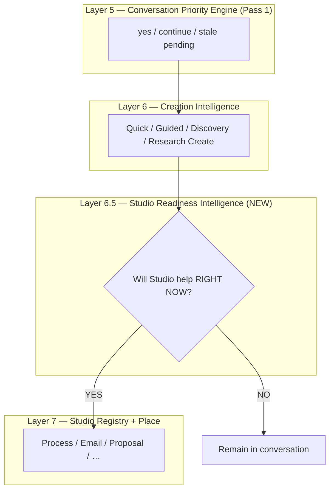

# Studio Readiness Intelligence

**Date:** 2026-07-05  
**Status:** **Binding architecture** — no implementation until reviewed  
**Foundational principle:** **THE RELATIONSHIP OWNS THE WORK.**

**Parent stack:** [SPARK_CONVERSATION_INTELLIGENCE_ARCHITECTURE.md](./SPARK_CONVERSATION_INTELLIGENCE_ARCHITECTURE.md) · Layer 7 — Studio Readiness  
**Sibling:** [CREATION_GUIDANCE_INTELLIGENCE.md](./CREATION_GUIDANCE_INTELLIGENCE.md) · [ADAPTIVE_CREATION_INTELLIGENCE.md](./ADAPTIVE_CREATION_INTELLIGENCE.md) · [CONVERSATION_SESSION_ARCHITECTURE.md](./CONVERSATION_SESSION_ARCHITECTURE.md) · [ESTATE_CREATION_EXPERIENCE.md](./ESTATE_CREATION_EXPERIENCE.md)

**Boundary:** Creation Guidance owns **when** to draft · review · complete in conversation. Studio Readiness owns **when** the Studio surface opens and whether it is **hydrated** — not creation intake or step logic.

---

## Executive summary

**This is not a Process Studio bug. This is not an SOP bug.**  
It is a **missing intelligence layer** between **Conversation** and **Studio**.

Today Spark often opens a Studio as soon as it **recognizes the artifact type**. The member confirms. Process Studio (or Create) appears — **almost empty**. Process Name, Owner, Steps, Handoff… blank. The conversation is **interrupted** instead of **helped**.

**New principle (binding):**

> **Knowing WHAT is being created does NOT mean Spark knows WHEN the Studio should open.**  
> **Artifact recognition ≠ Studio readiness.**

**Studio Readiness Intelligence** has one responsibility:

> **"Will opening the Studio make the member's work easier RIGHT NOW?"**

| Answer | Action |
|--------|--------|
| **NO** | Remain in conversation |
| **YES** | Open the Studio — **already populated** |

**Canonical rule:**

> Spark should never interrupt a good conversation simply because it recognized what the member is creating.  
> The Studio is not the destination.  
> The Studio is where the work we've already started together becomes visible.  
> **Conversation leads. Studios follow. The relationship decides when the Studio becomes helpful.**

---

## 1. The problem (member-visible)

### 1.1 Example — SOP / Process Studio

```
Member: "I need help creating an SOP."
Spark:  [asks a few questions]
Member: "Yes."
Spark:  [Process Studio opens immediately]

Member sees:
  Process Name   — blank
  Owner          — blank
  Steps          — blank
  Handoff        — blank
```

The member thought they were **continuing a conversation**. They received **another blank form**.

### 1.2 What went wrong (architecture)

| Layer | What happened | What should happen |
|-------|---------------|-------------------|
| **Artifact recognition** | Detected `sop` | ✓ Correct |
| **Discovery** | Partial slot fill (what/why/who/success) | May be insufficient for **process steps** |
| **Readiness gate** | **Missing** — open triggered by type + confidence score | Evaluate **meaningful content** first |
| **Handoff** | `blankScaffoldForType("SOP")` + re-interview copy | Hydrate from session answers + composed draft |
| **Member experience** | Blank Studio | *"Oh… it's already helping me."* |

---

## 2. Studio Readiness Intelligence — scope

### 2.1 Single question

Before opening **any** Studio, Spark evaluates:

| # | Question | If NO → stay in chat |
|---|----------|----------------------|
| 1 | Do we **understand the goal**? | Keep clarifying (one question) |
| 2 | Do we **know enough** for this artifact type? | Continue discovery or Research Create |
| 3 | Will the Studio contain **meaningful information** (not empty labels)? | Compose draft in conversation first |
| 4 | Will opening **reduce effort** for the member? | Don't open yet |
| 5 | Will opening **interrupt** discovery the member still needs? | Stay in chat |
| 6 | Is the member **still learning** how to do this? | Research Create — no Studio |

**If ANY answer suggests "We still need conversation" → remain in chat.**

### 2.2 Readiness gates (all required for open)

A Studio opens only when **all** are true:

- ✓ **Purpose** is understood  
- ✓ **Artifact type** is known  
- ✓ **Enough information** exists to create meaningful content (not placeholder headers alone)  
- ✓ The member will **benefit** from seeing/editing the work (not just being interviewed in a panel)

### 2.3 Things Spark must never do again

| Never | Instead |
|-------|---------|
| Open a **blank** Studio because the artifact type is known | Open only when content would feel **already started** |
| Treat **template headers** (SOP Title, Purpose, Steps 1. 2. 3.) as "meaningful content" | Require **member-derived** or **Spark-composed** substance in fields |
| Clear discovery session on handoff | **Conversation Session** owns answers through open |
| Re-ask in chat what the Studio form asks (*"Who is this for?"* after discovery) | One relationship — answers travel |
| Open Studio when member said *"I don't know how to do it"* | **Research Create** until draft-worthy understanding |

**Member test on first Studio frame:**

> *"Oh… it's already helping me."*  
> — not —  
> *"Now I have another blank form to fill out."*

---

## 3. Studio Readiness Levels

Every artifact in the **Conversation Session** stores:

```typescript
studioReadinessLevel: 0 | 1 | 2 | 3 | 4 | 5;
```

| Level | Name | Member experience | Studio |
|-------|------|-------------------|--------|
| **0** | Conversation only | Chat only — understanding, no create surface | **Closed** |
| **1** | Discovery | Creating Together — minimum questions | **Closed** |
| **2** | Research | Learn together first ([Research Create](./ADAPTIVE_CREATION_INTELLIGENCE.md)) | **Closed** |
| **3** | Draft preparation | Spark composes behind the scenes; member may review in chat | **Closed** (optional inline preview) |
| **4** | Studio ready | Enough exists to populate meaningfully | **May open** — permission first |
| **5** | Review / edit | Member editing prepared work | **Open** — primary surface |

**Transitions:**

```
0 → 1   create intent recognized
1 → 2   uncertainty / "I don't know how"
2 → 1   enough research to resume discovery
1 → 3   discovery complete for tier — compose draft
3 → 4   draft passes meaningful-content gate
4 → 5   member accepts open + Studio hydrates
5 → 0   complete or pause — relationship continues
```

**Rule:** `studioReadinessLevel >= 4` is **necessary** for Studio open. Level 5 is normal active editing.

---

## 4. Examples (binding)

### 4.1 SOP — stay in chat

```
Member: "I need an SOP."
→ Level 1 Discovery. Process Studio stays closed.
```

### 4.2 SOP — member doesn't know how

```
Member: "I don't know how to do it."
→ Level 2 Research Create. Process Studio stays closed.
```

### 4.3 SOP — workflow understood

```
Member: "We've figured out the workflow."
Spark:  [composes steps from conversation]
→ Level 4 Studio ready → permission → Process Studio opens populated.
```

### 4.4 Email — Quick Create

```
Member: "I need to write an email."
→ Quick Create tier — few slots → Level 4 quickly → Email Studio may open soon.
Still: no blank To/Subject/Body if those can be prefilled from chat.
```

### 4.5 Marketing strategy — long arc

```
Member: "I need to create a marketing strategy."
→ Level 1 Discovery — many slots — Strategy Studio opens only at Level 4+.
```

---

## 5. Relationship to other layers



| Layer | Owns | Does not own |
|-------|------|--------------|
| **Conversation Priority** | Which pending action wins this turn | Whether Studio should exist |
| **Creation Intelligence** | Which creation **pattern** (Quick/Guided/Discovery/Research) | Panel open timing |
| **Studio Readiness** | **When** Studio opens + minimum content bar | Artifact type detection |
| **Conversation Session** | `studioReadinessLevel`, answers, draft lineage | UI layout |
| **Studio Registry** | Which capability surface maps to artifact | Discovery questions |

---

## 6. Audit — current implementation

### 6.1 Files that decide Studio opening today

| File | Function / path | What it uses today | Gap |
|------|-----------------|-------------------|-----|
| **`lib/createExperience/createExperienceRouting.ts`** | `resolveImmediateCreateAction()` | `detectRegistryArtifact()` / `inferCreateItemTypeFromText()` → **`blankScaffoldForType()`** | Opens on **type alone**; no readiness level; **`followUpForItemType()` re-interviews** |
| **`lib/frictionlessActionLayer.ts`** | `tryUniversalCreationFlow()` | UC turn kind; on fall-through **`clearUniversalCreationSession()`** + `resolveImmediateCreateAction()` | Discards discovery at open; **`immediateCreateOpen`** bypasses permission |
| **`lib/universalCreation/orchestrator.ts`** | `isUniversalDiscoveryComplete()`, `finalizeDiscovery()`, `readyMessage()` | **Slot flags** (what/why/who/success) ≥ 90% — not step content | SOP can "complete" without process steps; calls `resolveImmediateCreateAction()` in `readyMessage` |
| **`lib/createPendingAction.ts`** | `resolvedArtifactFromCreatePending()` | `artifactType` + **`blankScaffoldForType()`** only | Pending stores `initialPrompt`, not UC `answers` |
| **`lib/createInitialization.ts`** | `blankScaffoldForType()`, `BLANK_ARTIFACT_SCAFFOLDS` | Static template strings | **Placeholder headers ≠ meaningful content** |
| **`lib/artifactRegistry.ts`** | `detectRegistryArtifact()` | Regex / keyword → kind | Recognition only — no readiness |
| **`lib/universalCreation/createFastPath.ts`** | `isSimpleCreateRequest()`, `resolveCreateFastPathAction()` | Simple create regex + doc type | Fast path can skip deep readiness |
| **`app/companion/CompanionPageClient.tsx`** | `completeImmediateCreateOpen()`, `openCreationWorkspaceCore()`, `acceptAssistedAction()` | `ImmediateCreateOpenPayload.artifact` — often **blank** `ResolvedArtifact` | No readiness check at UI gate |
| **`lib/createSessionStore.ts`** | Panel hydration | `companion-create-session-v1` | Separate from UC session — split ownership |
| **`lib/createWorkflowRecordStore.ts`** | Workflow panel fields | `collectedAnswers` | Not fed from UC on handoff |
| **`lib/decisionCompassSessionAuthority.ts`** | Decision Compass open | Chat + panel authority (**good pattern**) | Readiness for **seed content** still ad hoc |
| **`lib/frictionlessActionLayer.ts`** | Visual thinking, playbook, projects branches | Intent routing | Separate open paths — each needs readiness rules |

### 6.2 Artifact types affected (non-exhaustive)

| Artifact / Studio | Open trigger today | Typical gap |
|-----------------|-------------------|-------------|
| **Process / SOP** | UC discovery complete OR create intent + yes | Steps blank — slot model doesn't capture process |
| **Proposal** | Same | Headers only in scaffold |
| **Email** | Quick Create — faster but still blank body common | May open before who/what filled in panel |
| **Newsletter** | Registry + UC | Same scaffold issue |
| **Sales funnel** | UC + Create | Stages empty |
| **Presentation** | Catalog / visual routing | Structure without content |
| **Project** | `resolveImmediateCreateProjectAction()` | Name-only open |
| **Decision Map** | Decision Compass routing | Better session model — still needs seed bar |
| **Strategy / Playbook** | Momentum / playbook section | Planning open before substance |
| **Publishing** | Create / content-generator | Generic blank doc |
| **Visual / Mind map** | Visual structure routing | Purpose node may be empty |

### 6.3 Information used vs missing

| Currently used | Missing for readiness |
|----------------|----------------------|
| Artifact kind (regex/registry) | **`studioReadinessLevel`** on session |
| UC slot flags (what/why/who/success) | **Artifact-specific sufficiency** (e.g. SOP needs steps or research complete) |
| `UNIVERSAL_DISCOVERY_THRESHOLD` (90%) | **Meaningful content evaluator** (chars, filled fields, member-derived vs template) |
| `phase: "guided_creation"` | **Draft composed in chat** before open |
| `initialPrompt` on frictionless pending | Full **`answers`** + **`draftContent`** on session |
| Permission on some review paths | **Mandatory permission** before every Studio open at Level 4 |
| `creationPattern` (proposed in Adaptive doc) | **`researchPhase`** gate blocking open |

### 6.4 Readiness gate that should exist (per artifact family)

| Family | Minimum before open (Level 4) |
|--------|------------------------------|
| **Quick Create** (email, short doc) | Purpose + recipient/audience + main point → **draft body or prefilled fields** |
| **Guided Create** (proposal, checklist) | Tier question cap met + **composed sections with substance** |
| **Discovery Create** (funnel, course) | Structure outline exists in session — not empty stage names |
| **Research Create** (SOP when member unsure) | **`researchPhase: ready_to_draft`** — never open at Level 1–2 |
| **Process / SOP** | At least **named process + 2+ concrete steps** OR explicit member outline |
| **Decision Map** | Decision question + options seeded from chat |
| **Project** | Working title + intent — not empty project shell |

---

## 7. Implementation plan

**Scope discipline:** Studio Readiness is **Pass 4** in the bug reverse-engineering batch — **after** Pass 1 (Priority) and Pass 2 (Conversation Session spine). This document is **design now**; code follows session spine.

### 7.1 Design (no code until reviewed)

| Deliverable | Description |
|-------------|-------------|
| **`evaluateStudioReadiness(session)`** | Pure function → `{ level, canOpen, reasons[], missing[] }` |
| **Readiness profiles** | Per `UniversalDocumentType` + Studio Registry entry — extends `documentCreationProfiles` |
| **Meaningful content check** | Reject open if `draftContent` is only `BLANK_ARTIFACT_SCAFFOLDS` match |
| **Session field** | `studioReadinessLevel` on Conversation Session (see [CONVERSATION_SESSION_ARCHITECTURE.md](./CONVERSATION_SESSION_ARCHITECTURE.md)) |

### 7.2 Conversation Session integration

1. UC / Research / Guided flows **update** `studioReadinessLevel` each turn  
2. **Block** `immediateCreateOpen` when `level < 4`  
3. On Level 4 → **permission** (Spec 106) → open with `session.draftContent`  
4. **Never** `clearUniversalCreationSession()` before readiness-approved open  

### 7.3 Studio Registry integration

Each registry entry gains:

```typescript
readinessProfile: {
  minLevelToOpen: 4;
  requiredSlots: string[];           // artifact-specific
  minSubstantiveFields: number;
  allowQuickOpen: boolean;           // email vs strategy
  composeBeforeOpen: boolean;        // run draftComposer in chat first
}
```

Member-facing Studio names unchanged — readiness is **invisible**.

### 7.4 Migration (safest order)

```
Step 1  Document + evaluateStudioReadiness() unit tests (no open behavior change)
Step 2  Dual-write studioReadinessLevel from UC orchestrator (observability only)
Step 3  Block resolveImmediateCreateAction when level < 4 (feature flag)
Step 4  Hydrate open from session.draftContent — retire blank default when answers exist
Step 5  Remove followUpForItemType re-interview strings
Step 6  Per-artifact readiness profiles (SOP, proposal, email, …)
Step 7  Wire Decision Compass / Visual / Project paths through same evaluator
Step 8  Remove legacy open-on-type paths after CT-11 + smoke journeys pass
```

### 7.5 Tests (required before flag on)

| Test | Assert |
|------|--------|
| SOP intent, 2 generic answers | `canOpen === false`, level ≤ 3 |
| SOP + "I don't know how" | level === 2, Research Create |
| SOP + workflow described in chat | level ≥ 4, draft has steps |
| Email quick create, slots filled | level ≥ 4, fields prefilled |
| `resolveImmediateCreateAction` blocked at level 3 | No `immediateCreateOpen` |
| Yes after discovery | No open until permission + level 4 |
| Existing UC session answers | Open hydrates — not `blankScaffoldForType` |

### 7.6 Small commits (suggested)

1. `docs: STUDIO_READINESS_INTELLIGENCE.md`  
2. `feat: evaluateStudioReadiness pure evaluator + tests`  
3. `feat: session studioReadinessLevel dual-write`  
4. `fix: gate resolveImmediateCreateAction on readiness (flag)`  
5. `fix: hydrate Studio from session draftContent`  
6. `fix: remove followUpForItemType re-interview on handoff`  
7. `feat: SOP/process readiness profile`  

### 7.7 Rollback strategy

| Flag | Behavior |
|------|----------|
| `STUDIO_READINESS_GATE=0` | Legacy open-on-type (current) |
| `STUDIO_READINESS_GATE=1` | Enforce level ≥ 4 |
| `STUDIO_READINESS_HYDRATE=0` | Open allowed but legacy blank scaffold |
| `STUDIO_READINESS_HYDRATE=1` | Require session draft hydration |

Rollback = flags off. No session schema migration required until Pass 2 spine lands (additive fields only).

---

## 8. What this fixes (bug mapping)

| Symptom | Root cause | Fixed by |
|---------|------------|----------|
| Blank Process Studio after SOP discovery | Open on type + blank scaffold | Readiness level + hydrate |
| "Yes" opens empty Create | `immediateCreateOpen` without content bar | Gate level ≥ 4 |
| Re-asked questions after open | `followUpForItemType()` | Session-aware ack only |
| Rich chat → blank doc | UC cleared on handoff | Session spine + no clear |
| "I don't know" → step interview | Missing Research Create gate | Level 2 blocks open |
| Member feels they "left Spark" | Studio as destination | Conversation leads |

Cross-reference: [SPARK_CONVERSATION_BUG_REVERSE_ENGINEERING.md](./SPARK_CONVERSATION_BUG_REVERSE_ENGINEERING.md) — RS-B, RS-E, bugs #4, #5, #16, #17.

---

## 9. What remains for other passes

| Pass | Scope | Relation to Studio Readiness |
|------|-------|------------------------------|
| **Pass 1** | Conversation Priority Engine | ✅ yes/continue ownership — does not decide Studio timing |
| **Pass 2** | Conversation Session spine | **Prerequisite** — `studioReadinessLevel` lives on session |
| **Pass 3** | Estate Intelligence / knowledge | Place routing — not Studio open timing |
| **Pass 4** | Creation lifecycle + **this document** | **Primary implementation home** |
| **Pass 5+** | Routing, UI shell, Member Journey | Out of scope here |

---

## 10. Release gate (Shari test)

Before any Studio open ships:

1. Would the member think *"Oh… it's already helping me"* on first frame?  
2. Does opening **reduce** effort vs staying in chat?  
3. Did conversation **create** the work — Studio merely **reveal** it?  
4. Permission obtained (Spec 106)?  
5. Certainty: member knows where work lives (Spec 113)?  

**Any no → not shippable.**

---

## 11. Canonical statements (binding)

**Principle:**

> Artifact recognition ≠ Studio readiness.

**Rule:**

> Spark must **never** open a blank Studio.

**Experience:**

> Every Studio should open already feeling useful.

**Architecture:**

> Conversation leads. Studios follow. The relationship decides when the Studio becomes helpful.

---

*End of Studio Readiness Intelligence — binding architecture pending review.*
