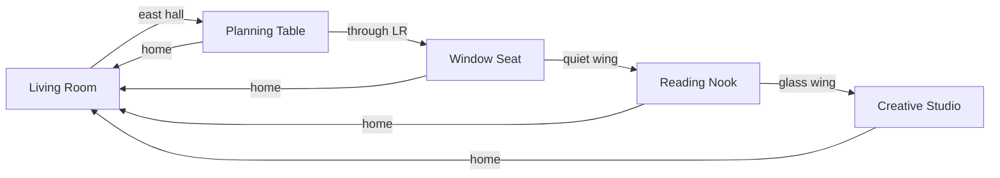

# Journey Between Rooms™
## Companion Homestead™ — How Movement Feels

**Version:** 1.0  
**Status:** Canonical design authority — **design only; no implementation in this sprint**  
**Authority:** Subordinate to Product Constitution™ · Companion Constitution™ · [`MASTER_PROPERTY_BLUEPRINT.md`](./MASTER_PROPERTY_BLUEPRINT.md) · [`Shari Voice Bible™`](../../lib/shariVoiceBible/CONSTITUTION.md)  
**Sibling documents:** [`COMPANION_JOURNEY_EXPERIENCE_BIBLE.md`](../COMPANION_JOURNEY_EXPERIENCE_BIBLE.md) (Part V — Art of Transitions™) · [`FIRST_PRODUCTION_EXPERIENCE.md`](./FIRST_PRODUCTION_EXPERIENCE.md) · [`SCREEN_COMPOSITION_GUIDE.md`](./SCREEN_COMPOSITION_GUIDE.md) · room look books in [`../room-lookbooks/`](../room-lookbooks/)

**This is not:**
- A page-transition spec
- An animation showcase
- A navigation map
- A component library

**This is:** how a guest **moves through one Iowa home** — stand up, walk, arrive, sit down — without ever feeling like they opened another screen.

---

## Success test

Close your eyes. Imagine someone using the Companion for an hour.

When they think back, they should **not** remember:

> *"I opened six different screens."*

They should remember:

> *"I spent an hour at Shari's house."*

That is the standard.

---

# Part I — Mission

We have designed the rooms.

The next step is to design how people **naturally move between them**.

The Companion Homestead™ is not a collection of pages. It is **one home**.

The guest should never feel like they left one page and opened another. They should feel like they **walked through the house**.

| Wrong mental model | Right mental model |
|--------------------|-------------------|
| Open panel | Stand up |
| Load page | Walk |
| Navigate | Arrive |
| Switch feature | Sit down in another room |

The **emotional state travels with the guest**. The house remembers. The conversation continues. Life in each room keeps going while they are away.

---

# Part II — Design philosophy

## The guest never "opens a feature"

The guest **goes somewhere**.

```
Living Room™
    ↓  (east hall, morning light)
Planning Table™
    ↓  (back through living room, softer pace)
Window Seat™
    ↓  (southwest bump-out, quieter)
Reading Nook™
    ↓  (glass wing, golden hour)
Creative Studio™
    ↓  (home again)
Living Room™
```

Everything is **connected** — physically on the blueprint, emotionally in memory, conversationally in chat.

## Walking instead of switching

Never design copy, motion, or logic around:

- Open Panel
- Load Page
- Navigate
- Go to feature

Always design around:

1. **Stand up** — close the moment in this room without erasing it  
2. **Walk** — 1–2 seconds of transitional life between thresholds  
3. **Arrive** — cross a doorway; light and sound shift  
4. **Sit down** — the room was already living; you are joining it  

## One home, one relationship

Movement reinforces: *this is not six apps in a trench coat.*

Shari does not reintroduce herself at every doorway. Chat does not reset. Objects do not respawn. Kinsey does not teleport.

---

# Part III — Spatial truth (where walks actually go)

Movement must respect [`MASTER_PROPERTY_BLUEPRINT.md`](./MASTER_PROPERTY_BLUEPRINT.md). Guests subconsciously feel wrong paths.

## Phase 1 daily loop (canonical walkthrough geography)

| From | To | Physical path | ~Steps felt | Light shift |
|------|-----|---------------|-------------|-------------|
| Living Room™ | Planning Table™ | East hall past kitchen smell | 8–12 | Morning clear → planner sun |
| Planning Table™ | Window Seat™ | Back through living room, southwest | 10–14 | Bright → soft side light |
| Window Seat™ | Reading Nook™ | Quiet wing, same floor | 6–8 | Rain-muted → reef glow |
| Reading Nook™ | Creative Studio™ | Southeast glass wing | 10–12 | Calm → golden color |
| Creative Studio™ | Living Room™ | Return through hall | 10–14 | Creative warmth → hearth |
| Any room | Living Room™ | Shortest honest path home | varies | Whatever room was → hearth |

**Rule:** Never imply the guest teleported. If the path passes the living room, the guest may **glimpse** it — fireplace glow, window light — even if they do not stop.



---

# Part IV — Every Room Has A Threshold™

A threshold is a **doorway moment** — intentional, human, never a feature label.

## Threshold anatomy

| Element | Purpose |
|---------|---------|
| **Threshold line** | One short sentence Shari says at the door — invitation, not instruction |
| **Doorway beat** | 0.5–1.0s pause — guest chooses to cross |
| **Crossing** | Transitional Moment™ begins |
| **Arrival line** | Optional — only if room needs orientation; often silence |

## Threshold copy principles

- No feature names (*Plan My Day*, *Brain Dump*, section IDs)
- No productivity commands (*shape your day*, *optimize*)
- No "Let's…" coaching openers — Voice Bible™ rules apply
- Maximum **12 words** for walking line; **one sentence** at threshold
- All threshold lines live in **Shari Voice Bible™** (`kind: invitation` or future `kind: threshold`) — never ad-hoc in components

## Phase 1 threshold library (design authority)

| Room | Threshold feeling | Example threshold lines (approved direction) |
|------|-------------------|---------------------------------------------|
| **Living Room™** | Exhale; you are home | *"You don't have to figure everything out here."* · *"Come in."* · *"Home."* |
| **Planning Table™** | Spread it out; one day | *"We can spread everything out."* · *"Table's clear."* · *"One day at a time."* |
| **Window Seat™** | Quieter; unload | *"Come sit by the window for a minute."* · *"Quieter over here."* · *"Window's open."* |
| **Reading Nook™** | Absorb; gentle focus | *"I think you'll like it in here."* · *"Nook's calm today."* · *"Good light for reading."* |
| **Creative Studio™** | Permission; play | *"I've been saving something to show you."* · *"Studio's bright."* · *"Room for ideas."* |

**Arriving home** (any room → Living Room):

| Feeling | Example |
|---------|---------|
| Return without failure | *"Back home."* · *"Here again."* · *"Living room."* |

Threshold lines are **offers**. Guest can decline and stay. Consent always — per Journey Experience Bible™ Part V.

---

# Part V — Transitional Moments™

Movement takes **approximately 1–2 seconds**. Never abrupt. Never flashy. Never game-like.

The guest should simply **feel like they moved**.

## What a transition is

| It is | It is not |
|-------|-----------|
| A breath between rooms | A loading screen |
| Light changing on your face as you walk | A spinner |
| The next room coming into view | A slide deck |
| Optional footstep on gravel (off by default) | A cinematic camera fly-through |

## Allowed elements (pick 2–3 max per path)

| Element | Spec | ADHD note |
|---------|------|-----------|
| **Gentle crossfade** | 800–1200ms opacity; overlap 200ms | Default; always available |
| **Slight camera drift** | ≤3% scale shift toward destination; parallax ≤8px | Never zoom |
| **Light change** | Warm → cool or bright → dim matching room profile | Signals arrival without text |
| **Walking sound** | Single soft footstep or floorboard creak; optional; off in reduced-motion | Never looped march |
| **Room reveal** | Destination photograph eases in from direction of travel (east walk = content from right) | Maintains orientation |
| **Ambient bleed** | Previous room audio fades 400ms after new room audio rises | Continuity |

## Forbidden (ADHD Design Rules™ — motion)

- Flash
- Spin
- Zoom
- Bounce
- Slide-from-offscreen UI panels
- Progress bars labeled "Loading"
- Feature title cards
- Achievement-style room unlocks

## Reduced motion

When `prefers-reduced-motion: reduce`:

- Opacity crossfade only (~400ms)
- No parallax, no footstep audio, no scale
- Threshold copy may still appear as text — motion never required for orientation

## Timing budget

| Beat | Duration |
|------|----------|
| Threshold offer visible | Until guest accepts or declines |
| Walk transition | 1000–1800ms total |
| Arrival settle | 300–500ms before interaction unlocks |
| **Maximum** | 2200ms — never longer without guest action |

---

# Part VI — Rooms Continue Living™

When the guest leaves a room, **nothing freezes**.

When they return, **life continued**.

The UI may not show every change on every return — but the system must **never reset** as if no time passed.

## Per-room continuity (design authority)

| Room | While guest is away | On return — guest may notice |
|------|---------------------|------------------------------|
| **Living Room™** | Steam from mug fades; sun angle shifts; Kinsey moves (window → rug → hall) | Warmer or cooler light; mug at different level; blanket folded differently |
| **Planning Table™** | Planner may open to today; pen cap off; coffee cup migrates | Page turned; one sticky note added or removed |
| **Window Seat™** | Rain continues or clears; blanket draped | Different weather on glass; candle shorter |
| **Reading Nook™** | Fish in reef tank move; bookmark advanced if guest was reading | Different fish configuration; lamp already on if evening |
| **Creative Studio™** | Project left mid-process; pencil moved | Same project, new scribble; window light more golden |

## Rules

1. **No hard resets** on navigation — session state persists per room  
2. **Time-of-day advances** globally — homestead clock is one clock  
3. **Objects have memory** — companion object registry tracks placement  
4. **Absence is not punishment** — returning after a week shows life, not guilt  
5. **Subtlety** — most changes are felt, not announced  

---

# Part VII — Emotional Continuity™

The guest's **emotional state travels with them**.

Rooms should not start over. They should **continue the conversation**.

## Emotional carrier (what crosses every threshold)

| Signal | Source | Consumers |
|--------|--------|-----------|
| `emotionalTag` | Last chat + arrival reality | Room atmosphere, Shari cadence |
| `energyLevel` | Day state | Planning Table density, Window Seat invitation |
| `recentRoom` | Departure tracking | Threshold copy, ambient bleed |
| `conversationThread` | Chat history | No re-greeting; Shari references prior line |
| `reliefAfterCapture` | Clear My Mind completion | Planning Table gentler; Living Room quieter |

## Path-specific emotional bridges

| From | To | Bridge | Room already knows |
|------|-----|--------|-------------------|
| Living Room (overwhelmed) | Window Seat | Validate → hold | Soft light pre-warmed; blanket visible |
| Living Room (spark) | Creative Studio | Energy → permission | Supplies out; project surface clear |
| Window Seat (relief) | Planning Table | Lighter → orient | Fewer items on table; smaller ask |
| Planning Table (done) | Living Room | Clear → rest | Fire lower; mug ready |
| Creative Studio (win) | Living Room | Celebrate → land | Room feels warmer; no immediate next task |
| Any (grief) | Window Seat | Grief → witness | Curtains drawn softer; no fixes offered |

**Never:** dump raw captures into Planning Table. **Never:** re-ask *"How are you?"* at the new threshold.

---

# Part VIII — The House Remembers™

During movement, the guest should sense **one property** — not isolated JPEGs.

## Ambient life during transit (non-interactive)

Possible glimpses on walks that pass shared space:

| Glimpse | When | Purpose |
|---------|------|---------|
| Hallway sun strip | East-west walks | Orientation; time of day |
| Kitchen light through door | Passing kitchen | Home is lived-in |
| Bird at feeder through window | Morning paths | Iowa alive |
| Kinsey crossing far hall | Random low frequency | Resident life |
| Barn silhouette through west window | Studio ↔ office paths | Property scale |
| Wind chime one note | Porch-adjacent paths | Arrival memory echo |

**Nothing interactive during transit.** No buttons. No detours. Glimpses only.

The guest always knows:

- **Where they came from** — brief afterimage of previous room tone  
- **Where they are** — light + photograph identity  
- **Why they are there** — threshold line still echoing; chat thread continuous  

---

# Part IX — ADHD Design Rules™ (movement)

Transitions exist to **reduce anxiety**, not perform.

| Never | Always |
|-------|--------|
| Flash, spin, zoom, bounce | Predictable 1–2s rhythm |
| Surprise room changes | Consent at threshold |
| Lose chat context | Communication anchor visible entire walk |
| Re-orient with menus | Same house map position; you moved, map didn't jump |
| Punish back navigation | Walking home is always valid |
| Multiple choices mid-transit | One path; one arrival |

**Orientation tripod:** came from · am in · why here — satisfied within 3 seconds of arrival.

---

# Part X — Chat Never Stops

The conversation with Shari **never ends** because the guest changed rooms.

| Never | Always |
|-------|--------|
| New session banner | Same thread |
| Repeated greeting at threshold | Optional walking line only |
| *"How can I help you in Plan My Day?"* | Continue prior sentence |
| Chat history cleared | Scrollback preserved |
| Mic disabled during walk | Anchor reachable (tier may gate voice) |

**The room changes. The relationship does not.**

### Walking chat behavior

| Phase | Chat UI |
|-------|---------|
| Threshold offer | Input may dim; never removed |
| Walk (1–2s) | Input stays; send queues or waits until arrival settle |
| Arrival | Input fully active; placeholder may shift to room-appropriate (Voice Bible) |
| First message in new room | Shari responds in context — no room-intro script |

---

# Part XI — Movement matrix (Phase 1)

Every directed pair needs: **path · threshold · transition profile · emotional bridge · living delta**

## Core pairs (priority 1)

| From → To | Threshold direction | Transition profile | Living delta on arrival |
|-----------|----------------------|--------------------|-------------------------|
| Living Room → Planning Table | Spread out | `fade-through-light` + east drift | Planner open |
| Living Room → Window Seat | Quieter | `slow-drift-in` + dim | Blanket, rain optional |
| Living Room → Reading Nook | Calm | `slow-drift-in` | Reef motion |
| Living Room → Creative Studio | Ideas | `color-bloom` + warm | Project visible |
| Window Seat → Living Room | Home | `fade-through-light` + warm | Quieter hearth |
| Planning Table → Living Room | Home | `page-rest` + warm | Mug, softer fire |
| Creative Studio → Living Room | Home | `color-settle` | Studio project behind |

## Return-from-anywhere

**Home** is always one gesture — not buried in menus. Label in UI is place name (*Living Room*), never *Dashboard* or *Home screen*.

## Declined threshold

If guest declines Shari's room offer:

- Stay in current room — no animation penalty  
- Shari acknowledges without push — Voice Bible echo  
- Chat continues — no second ask for 5+ minutes  

---

# Part XII — Walkthrough Day™ (experience rehearsal)

**No coding.** Walk this day before any implementation sprint.

Imagine opening the Homestead at **7:00 AM** and living through it.

| Time | Location | Experience check |
|------|----------|----------------|
| **7:00** | Living Room™ | Coffee morning; one greeting; no feature menu. Feels like arrival. |
| **7:15** | Walk → Planning Table™ | Threshold + 1.5s walk; planner already open; chat continues from living room topic. |
| **7:45** | Walk → Creative Studio™ | Energy from planning carries; studio feels bright, not unrelated. |
| **8:30** | Walk → Living Room™ | Home again; mug moved; sun shifted; no re-greeting. |
| **12:00** | Walk → Window Seat™ (Clear My Mind) | Quieter; overwhelmed thread honored; no productivity push. |
| **12:25** | Walk → Reading Nook™ | Slower pace; fish moving; grief/relief still in Shari's tone. |
| **1:00** | Walk → Living Room™ | Afternoon light; Kinsey different place; conversation one thread. |
| **6:30 PM** | Return (same day) | Evening lamp on; **no** *"Welcome back!"* — *"Evening."* or *"Hi."* only. |
| **7:00** | End | Memory test: *"I spent the day at Shari's house."* |

### Walkthrough pass criteria

- [ ] No moment felt like opening a new app  
- [ ] No repeated introductions  
- [ ] Emotional state carried at least three times visibly  
- [ ] At least one room showed life change on return  
- [ ] Transit never caused anxiety  
- [ ] Chat never reset  
- [ ] Could draw the path walked on paper without confusion  

If any box fails — **fix the design**, not the code.

---

# Part XIII — Relationship to implementation

## What exists today (reference only)

| Asset | Role |
|-------|------|
| `lib/shariVoiceBible/` | All spoken lines including walking + invitations |
| `lib/arrivalExperience/` | Arrival beat machine; first walk from Living Room |
| `placeLibrary.transitionAnimation` | Per-room animation profile seeds |
| `CompanionWelcomeScene` walking state | First production walk prototype |

## What this document authorizes (future sprint)

1. `JourneyBetweenRooms™` state — departure room, in-transit, arrival room  
2. Threshold offer UI — consent before cross  
3. Transit layer — 1–2s crossfade + directional reveal per matrix  
4. `RoomContinuityStore` — per-room living deltas  
5. `EmotionalCarrier` — thread across navigation  
6. Voice Bible entries for every threshold in Part IV  

## What this document forbids until walkthrough passes

- New room UI polish before movement feels true  
- Flashy transition libraries  
- Per-room chat resets  
- Hard-coded threshold strings outside Voice Bible  

---

# Part XIV — Approval gate

Before implementation of Journey Between Rooms™:

- [ ] This document reviewed  
- [ ] Walkthrough Day™ completed on paper or prototype — all pass criteria met  
- [ ] Threshold lines added to Shari Voice Bible™  
- [ ] Movement matrix signed off for Phase 1 five rooms  
- [ ] Reduced-motion path defined  
- [ ] Chat-never-stops behavior signed off  

**After approval:** one implementation sprint — movement only — no new room features.

---

# Part XV — The standard (close)

People will not remember crossfade milliseconds.

They will remember whether the homestead felt like **one warm, familiar home**.

Design movement until the walkthrough day is true.

Then — and only then — build it.

---

*Companion Homestead™ · Journey Between Rooms™ · Every Room Has A Threshold™ · Transitional Moments™ · Rooms Continue Living™ · Emotional Continuity™ · The House Remembers™ · Walkthrough Day™*
