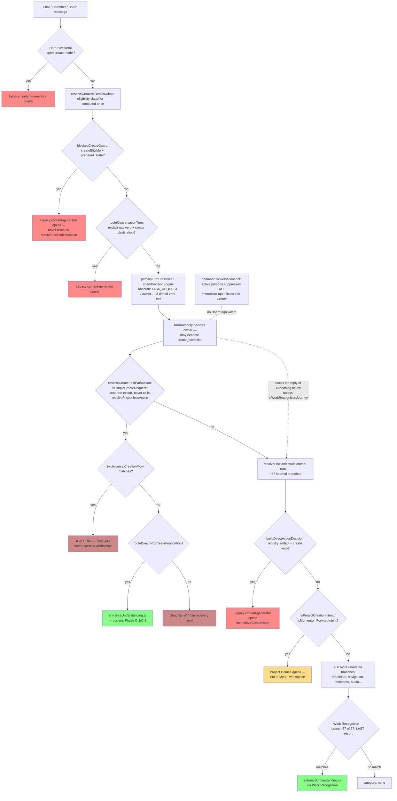
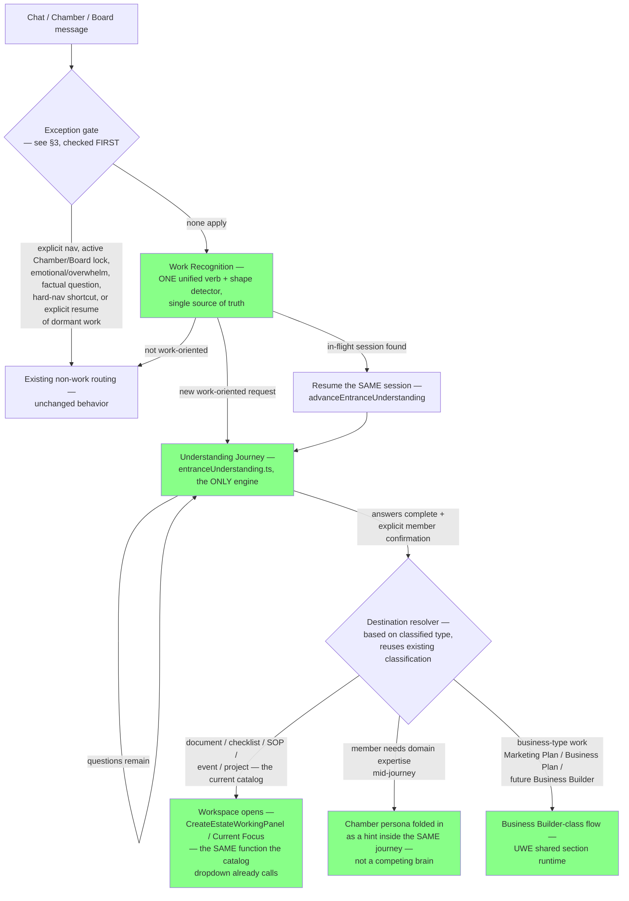

# Work Intent Target Routing Architecture

**Status:** Design only, per founder instruction — **no code in this pass.**
**As of:** 2026-08-07. Built directly on `WORK_INTENT_OWNERSHIP_AUDIT.md` — every claim below traces back to a citation in that document; nothing here is newly re-investigated.

---

## Requirements traceability

| # | Requirement | Where this design addresses it |
|---|---|---|
| 1 | One owner for work-oriented requests | §2 (future state) — Work Recognition becomes a single, early, unified gate; §4 Phase T-2 |
| 2 | No duplicate understanding journeys | §2, §4 Phase T-5 — Events Intelligence's own 7-question set is reconciled into `entranceUnderstanding.ts`, not left as a second engine |
| 3 | Preserve working Create experience | §2 — the catalog/dropdown path (`CreateEstateEntrancePanel.tsx`) is explicitly untouched throughout; it is already the reference implementation everything else converges onto |
| 4 | Preserve Chamber expertise activation | §3 exceptions list, item E2; §4 Phase T-1 |
| 5 | Preserve Business Builder flows | §3 exceptions/destinations; see the naming note below — "Business Builder" isn't a system that exists today (confirmed by exhaustive grep in the audit); this design treats the closest existing match (UWE Marketing Plan / Business Plan work types) as the destination to preserve, and leaves the Understanding Journey's destination resolver open for a future named Business Builder surface to plug into the same way |
| 6 | Remove legacy ContentGenerator interception | §4 Phase T-3/T-4; §5 risks |
| 7 | Define exceptions where Work Recognition should NOT run | §3 |

---

## 1. Current state (as mapped in the audit)

**Read this diagram as:** a work-shaped message must fail eight separate upstream checks — three of which open the legacy panel directly and two of which are confirmed dead ends — before Work Recognition, sitting at the very bottom, is ever consulted. This is the architecture `WORK_INTENT_OWNERSHIP_AUDIT.md` Part 1/2 documented in full; nothing above is new.

---

## 2. Future state (target)

**What changed, structurally, versus §1:**
- Work Recognition moves from "last of ~57 checks across 9 layers" to "first, after only a short, explicit exception list."
- There is exactly one Understanding Journey engine (`entranceUnderstanding.ts`) and exactly one destination resolver after it — not three separate legacy openers, two dead ends, and a second Events Intelligence question set.
- Chamber is a **destination the journey can route through**, not a parallel system that must independently rediscover work intent — this preserves expertise activation (requirement 4) while eliminating the current asymmetric suppression as a *silent* side effect (it becomes an explicit, documented exception instead, §3 E2).
- "Business Builder" is drawn as a destination class, not a system — per the audit, nothing named this exists yet; the design leaves the resolver's contract (classified type → destination) as the seam a real Business Builder would plug into later, without inventing it now.

---

## 3. Exceptions — where Work Recognition must NOT run

Derived directly from the audit's Part 1/4 findings — each exception below corresponds to a real, already-working mechanism the audit found, not a new invention:

| # | Exception | Why (audit citation) |
|---|---|---|
| E1 | **Explicit navigation intent** ("take me to…", "go to…") | Already a hard exception inside Work Recognition's own resumption logic (`isExplicitNavigationIntent`, confirmed working, Phase A/AT-5.7) — must extend to the new early position too. |
| E2 | **Active Chamber/Board persona conversation, genuinely locked** | `chamberConversationLock.ts` (audit Part 4, finding #1) — an engaged specialist owns the turn until the member exits or explicitly changes direction. Preserves requirement 4. Board currently has no equivalent lock — this design treats that as something to *decide*, not silently inherit (§5 risk R4). |
| E3 | **Emotional/overwhelm turns** | `EMOTIONAL_REGULATION_RE`, `isOverwhelmProblem`, friction-first detectors (audit Part 2, branches #14/#47/#52) — support comes before task execution, unchanged. |
| E4 | **Pure factual/definitional questions** | Already built into Work Recognition's own shape detector (`FACTUAL_QUESTION_RE`, `FACTUAL_HOW_QUANTITY_RE`) — no change needed, just confirming it survives the reposition. |
| E5 | **Hard-navigation literal shortcuts** ("open create mode") | `hardNavigationCommands.ts` — a deliberate, narrow, already-intentional shortcut (audit Part 1, row 1). Kept, but repointed at the *current* entrance/workspace, not the legacy panel (§4 Phase T-3). |
| E6 | **Explicit resume of dormant, already-registered work** | Distinct from Work Recognition's own in-flight-session resumption (which stays inside Work Recognition, E-none). A member naming an already-created workspace by title ("continue my newsletter") belongs to `lib/activeWorkspaceRegistry`'s resume-intent matching (already registry-driven, fixed earlier this session), not a fresh Understanding Journey. |
| E7 | **Pending-choice / awaiting-confirmation turns already owned by another flow** | An active numbered-choice menu, a pending yes/no offer, or an in-progress non-Create flow (reminder intake, brain-dump, etc.) keeps ownership until it resolves — matches existing `pendingChoiceExecution`/continuity-owner behavior (audit Part 1 row 5's `canOwnerHandleTurn`). |

Everything **not** matching E1-E7 is, by design, a candidate for Work Recognition — including the four verbs the audit found weakest-covered today (`improve`/`organize`/`launch`/`start`), once verb recognition is consolidated (Phase T-2 below).

---

## 4. Migration phases

Each phase is independently shippable and checkpointed, matching this session's established discipline — narrow, additive, tested, reviewed before the next phase starts. No phase depends on a later one.

### Phase T-1 — Consolidate verb/shape recognition into one source of truth
Collapse the six independently-drifted verb-regex lists the audit found (`creationExecutionEligibility`, `SIMPLE_CREATE_VERB_RE`, `TASK_REQUEST_RE`, `CREATE_RE`/`CREATE_DO_RE`, `EXPLICIT_CREATE_COMMAND_RE`, Work Recognition's own `EXPLICIT_VERB_RE`) into Work Recognition's detector as the single authority, extended to genuinely cover all ten verbs (closing the `improve`/`organize`/`launch`/`start` gaps). Every other system that currently maintains its own copy switches to calling the shared detector instead of re-deriving it. **No routing/precedence change yet** — this phase only makes "does this count as work intent" consistent everywhere it's already asked. Lowest risk, foundational for everything after.

### Phase T-2 — Give Work Recognition first refusal
Add the early exception-gated check from §3, positioned before the legacy interceptors (audit Part 1 rows 3, 4, 8). When Work Recognition's (now-consolidated, Phase T-1) detector matches and no exception applies, hand the turn to the existing `resolveWorkRecognitionResumption`/`resolveCreateFoundationRecognition`/`resolveWorkRecognitionNewRecognition` functions immediately — before `blockedCreateGuard`, `resolveCreateFastPathAction`, or `buildDirectActionDecision` ever see the text. This is the architectural core of requirement 1. See §6 for this phase's own smallest first slice.

### Phase T-3 — Repoint the hard-navigation shortcut, retire `blockedCreateGuard`'s legacy open
Once T-2 is live and verified, `hardNavigationCommands.ts`'s "open create mode" shortcut (E5) points at the current entrance instead of `content-generator`, and `blockedCreateGuard`'s early-return (audit row 3 — the first and most damaging legacy interceptor, since it fully bypasses `resolveFrictionlessAction`) becomes unreachable for any text Work Recognition already claims in T-2. Confirm via telemetry/tests that it's genuinely dead for the target verb set before removing it — don't delete on the assumption alone.

### Phase T-4 — Retire the remaining legacy interceptors and dead ends
`resolveCreateFastPathAction`'s legacy fallback branch, `buildDirectActionDecision`/`resolveImmediateCreateAction` (audit row/finding #38 — the mechanism already found live-blocking Phase C-2), and `tryUniversalCreationFlow`/the base Universal Creation orchestrator (confirmed dead end) are removed or reduced to the narrow slice they still legitimately own (Create-Foundation's own `routeDirectlyToCreateFoundation===false` carve-out for the 6 `PRE_WORKSPACE_DISCOVERY_UC_TYPES`, which is a deliberate, kept exception per the audit, not a bug). Satisfies requirement 6.

### Phase T-5 — Reconcile Events Intelligence into one Understanding Journey
The audit's strongest duplicate-brain finding: Events Intelligence's own 7-question foundation set overlaps `entranceUnderstanding.ts`'s outcome/audience/purpose questions under different ids. Fold the event-domain-specific questions (format/dates/budget/venue) in as an **extension** of `entranceUnderstanding.ts`'s existing question set for event-classified types — reusing the same session/answer machinery already built — rather than a second interview asked after the first. Highest-risk phase (owns its own persisted `EventRecord` model); scope and data-migration plan need their own dedicated review before starting.

### Phase T-6 — Resolve the Chamber/Board asymmetry deliberately
Decide, with the founder, whether Board should get an equivalent lock to Chamber's (E2), or whether Chamber's suppression should instead become an explicit "hand off to Chamber as a destination" step inside the Understanding Journey (matching the future-state diagram's `CHAMBER` node) rather than a silent pre-emption. Either answer is legitimate; the audit found this as an asymmetry, not a bug — this phase is about making the choice on purpose.

### Phase T-7 — Verb coverage completion
With Phase T-1's consolidated detector live, explicitly extend coverage for `organize`/`design`/`launch`/`start` (currently near-zero across every system per the audit's coverage matrix), reusing the founder's original "ADHD-context intelligence, not a keyword list" principle from Work Recognition's own design — request-shape detection, not just more regex.

---

## 5. Risks

| Risk | Detail | Mitigation |
|---|---|---|
| R1 — Reordering regresses currently-working routes | Dozens of the ~57 internal branches (emotional support, navigation, reminders, audio) currently run *before* Work Recognition precisely because they're checked early; Phase T-2 doesn't touch their position, only inserts Work Recognition even earlier — but the exception list (§3) must be complete, or a message that should have gone to e.g. overwhelm-support gets claimed by Work Recognition instead. | Exception list is derived from the audit's actual findings, not invented; Phase T-2 ships behind a feature flag with a full regression sweep across every branch the audit catalogued, not just the ones this design touches. |
| R2 — `isSimpleCreateRequest`/verb-list consolidation has wide blast radius | The audit noted several of these regexes are also used as *exclusion* checks elsewhere (e.g. inside other detectors' own guards) — Phase T-1 changing their matched set could ripple into unrelated code that assumes the old, narrower behavior. | Phase T-1 is scoped to *consolidation*, not *widening*, first — match the union of what already worked, verify zero regressions, and treat verb-coverage *expansion* (organize/design/launch/start) as the separate, later Phase T-7, not bundled in. |
| R3 — Removing legacy `content-generator` paths breaks in-flight sessions | Members with an existing, real `content-generator` workspace (pre-dating this work) still need it to render — Phase T-3/T-4 must not orphan already-created work. | Retire the *entry points* (nothing new opens `content-generator`), not the panel's ability to render an existing session; confirm via the registry (`spark.activeWorkspaceRegistry.v1`) whether any live entries still reference it before removing render support, if ever. |
| R4 — Chamber/Board decision (T-6) has real relationship cost either way | Adding a Board lock changes established behavior; converging Chamber into "destination, not gate" risks a jarring interruption to an active specialist conversation if the exception logic isn't exactly right — this directly touches the Companion Covenant ("trust not impress") and the Friend We All Deserve's "never surprise" principle. | Treat T-6 as its own founder-reviewed decision, not a default outcome of the other phases; whichever direction is chosen, live-verify (not just unit test) the specific "member deep in a Chamber conversation says something work-shaped" scenario before shipping. |
| R5 — Events Intelligence merge risks data-model conflicts | `EventRecord` is a separate persisted model from `RuntimeCreationRecord`/`WorkingMemoryFields` — folding its questions into `entranceUnderstanding.ts` without a clear id/record mapping could either duplicate data or silently drop it (the same class of bug this session already found and fixed once, for guided/event domains, in the Working Memory id-mismatch fix). | Phase T-5 gets its own dedicated design review (mirroring this document's own process) before any code — not assumed safe by analogy to the other phases. |
| R6 — turnAuthority's `explicitCreationRequested` classification is shared by non-Work-Recognition owners | The Phase C-2 fix already extended `turnAuthority`'s bypass for Work Recognition; broadening it further (Phase T-2/T-4) touches a classification also used by `create_consent_accept` and founder-action-recovery paths — changing its behavior for "work-oriented" text could have side effects on those unrelated owners. | Keep the Phase C-2 pattern: an explicit, additive flag (`isWorkRecognitionJourney`-style) rather than redefining `explicitCreationRequested` itself; never touch the base classification's own logic. |
| R7 — Testing surface is large | Ten verbs × ~nine layers × the exception list is a substantial regression matrix — under-testing any one phase risks an invisible regression surfacing much later, the same way the `turnAuthority` gate itself was only found via live browser testing, not unit tests alone. | Every phase gets both the unit-test coverage this session has used throughout *and* live browser verification of at least the founder's own worked examples (newsletter, workshop, retreat) before being called done — not unit tests alone. |

---

## 6. Smallest safe first code change

**Not implemented in this pass — described only, per instruction.**

The single smallest, safest, most valuable first slice is the opening move of Phase T-2, scoped even narrower than the full phase:

> Add **one new, additive, feature-flagged early check** in `app/companion/CompanionPageClient.tsx`'s `handleSend`, positioned immediately before `blockedCreateGuard`'s early-return (`CompanionPageClient.tsx:15300`, the first and most damaging legacy interceptor — it fully bypasses `resolveFrictionlessAction` today). The check:
> 1. Confirms none of E1/E2/E3/E7 apply (explicit nav, Chamber/Board lock, emotional/overwhelm, or an already-owned pending flow) — reusing the exact existing functions those systems already expose (`isExplicitNavigationIntent`, `isChamberMemberConversationActive`, the emotional-regulation detectors, `canOwnerHandleTurn`), not new logic.
> 2. Calls Work Recognition's existing, already-tested entry points in the existing priority order — `resolveWorkRecognitionResumption` first (session continuity), then `detectWorkRecognitionShape`/`resolveCreateFoundationClassification` for new recognition — exactly the functions Phase B/C-1/C-2 already built and unit-tested this session. **No new detection logic, no new engine.**
> 3. If any of those return non-null, uses that result immediately and returns — for this turn only, before `blockedCreateGuard`, `resolveCreateFastPathAction`, or anything else in Part 1's precedence list runs.
> 4. Is gated behind a boolean flag (e.g. `isWorkRecognitionFirstRefusalEnabled()`), matching the existing precedent already used in this exact file (`isConversationStabilizationEnabled`, `isEstateIntelligenceRuntimeEnabled`) — a single flag flip fully disables it with no code revert needed.

**Why this specific slice, and not something larger:** it is purely additive (when the flag is off, or when none of Work Recognition's own detectors match, behavior is provably unchanged — the new check falls through to today's exact precedence order); it reuses only already-shipped, already-tested code; it requires no removal of any legacy path yet (T-3/T-4 stay separate, later, and reversible on their own schedule); and it directly begins requirement 1 ("one owner") in the single place the audit identified as causing the most damage (`blockedCreateGuard`'s full bypass of `resolveFrictionlessAction`) without yet touching the other eight layers. It is the smallest change that makes the future-state diagram (§2) true for at least one real entry point, provably safely.

---

## Evidence Matrix

- **Source:** `docs/create-experience/WORK_INTENT_OWNERSHIP_AUDIT.md` in full — every file:line citation in this design traces back to that document's Parts 1-4; nothing here was independently re-investigated.
- **Not done in this pass:** no code changed, no phase started. Design only, per explicit instruction.

**Decision Owner:** Founder. Awaiting approval of the target architecture and phase sequencing before Phase T-1 (or the §6 smallest-first-change) begins.
