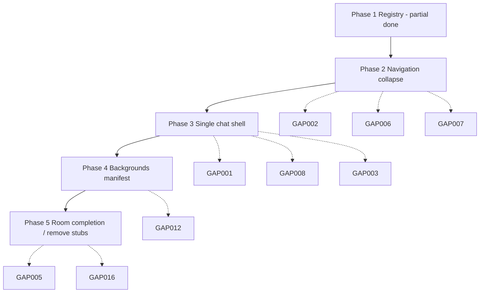

# Spark Estate V4 — Architectural Reset Gap Report

| Field | Value |
|-------|-------|
| **Version** | 1.0 |
| **Date** | 2026-06-30 |
| **Status** | Audit only — **no implementation changes** |
| **Authorities** | [Constitution](./01%20-%20Spark%20Estate%20Constitution.md) · [Living in Spark Estate](./Living%20in%20Spark%20Estate.md) · [Spark Estate Bible](./Spark%20Estate%20Bible.md) |
| **Charter** | [ESTATE_ARCHITECTURAL_AUTHORITY.md](./ESTATE_ARCHITECTURAL_AUTHORITY.md) · [ARCHITECTURAL_RESTORATION.md](./ARCHITECTURAL_RESTORATION.md) |

---

## Executive summary

Spark Estate V4 has substantial **backend canon** (room registry, intelligence registrations, Bible docs) but the **member-facing shell** still reflects pre-canon patterns from the vs3 companion era: split workspaces, sidebar signposts, global feature menus, arrival narration, bottom-anchored chat, emoji invitation grids, and a ~5,500-line orchestrator with parallel routing paths.

**Largest structural gaps**

| Theme | Severity | Headline |
|-------|----------|----------|
| **Orchestration** | P0 | `CompanionPageClient.tsx` is the app — multiple layout modes coexist |
| **Navigation** | P0 | Sidebar + global menu + back buttons + offers — not “conversation is navigation” |
| **Arrival / rooms** | P0 | Hero plaques, invitation panels, title fades — violates “Estate never explains itself” |
| **Chat placement** | P1 | Bottom-right frosted strip vs centered conversation-first estate |
| **Routing** | P1 | Six+ routers; no single `goToPlace()` |
| **Objects layer** | P1 | Guidebook, Bell, Accomplishments Book largely absent or software-shaped |
| **Backgrounds** | P1 | 27 registry rooms, 16 assets; many missing or mis-keyed |
| **Vocabulary** | P2 | “Step into…”, settings menus, Grow hub placeholders |

Phase 1 registry work (Library vs Momentum Institute split) is **correct direction** but **does not surface** to members until Phases 2–5 of [ESTATE_CLEANUP_ROADMAP.md](../ESTATE_CLEANUP_ROADMAP.md) land.

---

## Methodology

1. Read the three binding authorities and `ESTATE_ARCHITECTURAL_AUTHORITY.md`.
2. Trace runtime from `app/companion/CompanionPageClient.tsx` through registry, routing, layout, and representative room panels.
3. Compare against Bible place taxonomy (Ch 7), object canon (Ch 4, 13, 16–17), and Constitution Articles I, VIII, conversation law.
4. Cross-check `ESTATE_ARCHITECTURAL_AUTHORITY.md` “subordinate / invalid” list.

**Out of scope for this audit:** changing conversation specs 105–119, adding features, or validating live LLM turns.

---

## Priority legend

| Priority | Meaning |
|----------|---------|
| **P0** | Breaks constitutional law or makes the product feel like software, not an estate |
| **P1** | Major philosophy drift; blocks “one home” coherence |
| **P2** | Localized mismatch; fix after P0–P1 |
| **P3** | Cleanup, naming, asset hygiene |

---

## Gap index (by priority)

| ID | Area | Priority |
|----|------|----------|
| GAP-001 | Monolithic orchestrator / dual layout shells | P0 |
| GAP-002 | Parallel navigation systems | P0 |
| GAP-003 | Room arrival: plaques + invitation grids | P0 |
| GAP-004 | Software vocabulary in offers and routing | P0 |
| GAP-005 | Grow hub placeholders as “rooms” | P0 |
| GAP-006 | Global Estate Menu as feature catalog | P1 |
| GAP-007 | AppSidebar / homestead signpost | P1 |
| GAP-008 | Chat bottom-anchored vs conversation-primary | P1 |
| GAP-009 | Split `WorkspaceLayout` beside chat | P1 |
| GAP-010 | Fragmented routing (no single place transition) | P1 |
| GAP-011 | Living vs Destination place behavior mixed | P1 |
| GAP-012 | Background asset coverage and keys | P1 |
| GAP-013 | Guidebook as fixed UI chrome | P1 |
| GAP-014 | Accomplishments / Bell object layer missing | P1 |
| GAP-015 | Celebration as inline card, not place + bell | P1 |
| GAP-016 | Momentum Institute LMS-shaped UI | P1 |
| GAP-017 | Knowledge Cards vs Bible object story | P2 |
| GAP-018 | Evidence Vault dual identity (bank vs vault room) | P2 |
| GAP-019 | Profile / settings as software panels | P2 |
| GAP-020 | Onboarding cinematic vs quiet arrival | P2 |
| GAP-021 | Estate arrival title/motto sequence | P2 |
| GAP-022 | Room naming / trademark inconsistency | P2 |
| GAP-023 | Duplicate section ↔ room mapping logic | P2 |
| GAP-024 | Subordinate template docs still driving code | P2 |
| GAP-025 | Recognition / intervention cards in chat | P2 |
| GAP-026 | Library vs Institute member experience still blurred in UI | P2 |
| GAP-027 | Missing transitional-place treatment | P3 |
| GAP-028 | Asset filename typos and legacy fallbacks | P3 |

---

## Detailed findings

### GAP-001 — Monolithic orchestrator / dual layout shells

**Current behavior**  
`CompanionPageClient.tsx` (~5,546 lines) owns section state, chat, offers, workspace panels, estate overlays, grow/growth destinations, recognition, voice, and dozens of `open*Core` helpers. Home uses `WorkspaceLayout` (split chat + workspace). Direct estate visits use `EstateChatNavigationOverlay` + `WelcomeHomeFrostedChatPanel`. Profile estate rooms use `ProfileEstateRoomExperience`. Institute/Stables/Builder use dedicated room panels. Conditions like `showDirectEstateOverlay`, `welcomeHomePrimary`, `workspacePanel`, and `profileEstateChromeActive` decide which shell renders.

**Why it conflicts**  
Constitution: the Estate is **one continuous home**; conversation travels. Bible Ch 7: places have types, not separate app modes. `ESTATE_ARCHITECTURAL_AUTHORITY.md` lists feature-first `AppSection` / workspace patterns as **invalid**. Multiple shells = members feel they switched applications.

**Recommended correction**  
Extract a thin **Estate shell** (single chat surface + place resolver + optional destination workspace). `CompanionPageClient` becomes wiring only. One frosted conversation layer everywhere; destination UI mounts *inside* or *behind* conversation per place type — not alternate page layouts.

**Files involved**  
`app/companion/CompanionPageClient.tsx`, `components/companion/WorkspaceLayout.tsx`, `components/companion/estate/EstateChatNavigationOverlay.tsx`, `components/companion/WelcomeHomeFrostedChatPanel.tsx`, `components/companion/ProfileEstateRoomExperience.tsx`

**Dependencies**  
GAP-002, GAP-008, GAP-009, GAP-010, Phase 2 of cleanup roadmap

**Priority**  
P0

---

### GAP-002 — Parallel navigation systems

**Current behavior**  
Members can move via: (1) natural language → multiple routers, (2) `AppSidebar` / Homestead signpost, (3) `GlobalEstateMenu` (⋯), (4) `BackButton` on many sections, (5) estate invitation buttons, (6) workspace offer buttons, (7) estate map, (8) menu actions opening profile estate overlays.

**Why it conflicts**  
Living in Spark Estate: *“Members never feel they are navigating menus.”* Constitution: conversation is primary; Spark accompanies, never sends. Bible Ch 8 forbids dashboard-like escape hatches. Four visible nav systems recreate a traditional app.

**Recommended correction**  
Collapse to **conversation-led navigation** + folded map + optional Guidebook object. Retire or hide sidebar/signpost/global menu from member-facing estate (founder/dev only if needed). Back becomes conversational (“Let’s head back toward Welcome Home”) or ambient map gesture — not persistent chrome.

**Files involved**  
`components/companion/AppSidebar.tsx`, `components/companion/GlobalEstateMenu.tsx`, `lib/estateMenu/menuConfig.ts`, `lib/homesteadSignpost.ts`, `components/companion/homesteadSignpost/HomesteadSignpost.tsx`, `CompanionPageClient.tsx` (`goBack`, `onNavSelect`, `openProfileEstateRoomFromMenu`)

**Dependencies**  
GAP-006, GAP-007, GAP-010, GAP-013

**Priority**  
P0

---

### GAP-003 — Room arrival: plaques + invitation grids

**Current behavior**  
`EstateRoomVisitChrome` shows `EstateRoomTemplateArrival` (hero title, subtitle, purpose, Shari paragraphs) plus `EstateRoomInvitationPanel` (emoji choices, “While you're here”) before conversation. `useEstateRoomVisitPhase` gates conversation behind invitation unless member engages.

**Why it conflicts**  
Constitution **Article VIII** — *The Estate Never Explains Itself.* Experience Guide: members remember feelings, not menus; invitations must be **genuine**, not concierge task lists. `ESTATE_ARCHITECTURAL_AUTHORITY.md` explicitly retires `ESTATE_ROOM_TEMPLATE.md` invitation panels and hero plaques. Living Places should not open with feature pickers.

**Recommended correction**  
Living Places: scene + ambient presence + conversation input only — no plaque, no grid. Destination Places: optional **one** gentle Shari line in chat, then conversation; activities discovered in-world (objects), not emoji buttons. Delete or bypass template arrival for Living Places entirely.

**Files involved**  
`components/companion/estate/EstateRoomVisitChrome.tsx`, `components/companion/estate/EstateRoomTemplateArrival.tsx`, `components/companion/estate/EstateRoomInvitationPanel.tsx`, `lib/estate/estateRoomInvitationCatalog.ts`, `lib/estate/estateRoomTemplate/catalog.ts`, `components/companion/estate/useEstateRoomVisitPhase.ts`

**Dependencies**  
GAP-011, GAP-024, conversation guardrails (one question, not grids)

**Priority**  
P0

---

### GAP-004 — Software vocabulary in offers and routing

**Current behavior**  
Workspace offers and command router use labels like `"Step into Clear My Mind™"`, `"Step into The Conservatory™"`, `"Open Client Avatar"`. Frictionless layer mirrors same pattern. `estateRoomRouting.ts` documents estate language but runtime copy still uses “Step into…”.

**Why it conflicts**  
Bible Ch 8–9: place language, not feature navigation. Environment Integration Spec 108 (still binding): forbidden — *“Opening the Conservatory…”*, *“Navigate to…”*, *“Choose a room.”* Relationship Constitution: never sound like software sending the member somewhere.

**Recommended correction**  
Replace offer/button copy with accompaniment invitations: *“We could sit in the Conservatory if that helps”* / *“Yes · Stay here · Show the map”* — three choices max. Centralize copy in one estate voice module audited against Bible glossary.

**Files involved**  
`lib/estateIntelligence/estateOffer.ts`, `lib/estateIntelligence/estateCommandRouter.ts`, `lib/frictionlessActionLayer.ts`, `lib/intentRoutingIntelligence.ts`, `lib/estateIntelligence/estateRouter.ts`

**Dependencies**  
GAP-010; Spec 108 invitation pattern

**Priority**  
P0

---

### GAP-005 — Grow hub placeholders as “rooms”

**Current behavior**  
`GrowPlaceholderPanel` renders for multiple grow sections with kicker “Grow”, title from `GROW_SECTION_META`, and copy *“This room is taking shape… guided experiences will arrive here soon.”* Shown inside `GrowRoomShell` / `EstateWorkspace` white panel pattern.

**Why it conflicts**  
Bible: unfinished places should not appear as broken rooms in the living estate. Constitution: build **places**, not feature stubs. Experience Guide: overwhelm from labels and incomplete destinations. Authority doc lists Grow hub placeholders as **invalid**.

**Recommended correction**  
Remove placeholder sections from member navigation until real Destination experiences exist. Route conversational intent to nearest **Living Place** or honest Shari acknowledgment — not empty Grow panels.

**Files involved**  
`components/companion/GrowPlaceholderPanel.tsx`, `lib/growNavigation.ts`, `CompanionPageClient.tsx` (grow section renders), `AppSidebar.tsx` (grow signpost)

**Dependencies**  
GAP-002, GAP-007

**Priority**  
P0

---

### GAP-006 — Global Estate Menu as feature catalog

**Current behavior**  
`GlobalEstateMenu` exposes sections: “Your Estate”, “Conversation”, “Settings & Account” with emoji items: Estate Profile™, Growth Profile™, Institute Cabinet™, Evidence Vault™, Journal, Portfolio, Seeds Planted, Goals & Projects, Progress Timeline, new conversation/day, settings, notifications, voice, log out.

**Why it conflicts**  
Living in Spark Estate: estate should not overwhelm with buttons and menus. Bible Ch 8: objects (books, guide, bell) — not session settings chrome. Constitution: profile and growth belong **in the world**, not a universal ⋯ menu.

**Recommended correction**  
Replace menu with in-world access: Guidebook for orientation, Library/Portfolio rooms for artifacts, Memory Center conversation when needed. Keep only accessibility/account essentials behind a quiet profile object — not a feature catalog.

**Files involved**  
`lib/estateMenu/menuConfig.ts`, `components/companion/GlobalEstateMenu.tsx`, `CompanionPageClient.tsx` (`showGlobalEstateMenu`, `openProfileEstateRoomFromMenu`)

**Dependencies**  
GAP-013, GAP-019, GAP-002

**Priority**  
P1

---

### GAP-007 — AppSidebar / homestead signpost

**Current behavior**  
Persistent sidebar with `SECTION_NAV`, Homestead signpost destinations (Grow, Growth, Create, etc.), Google utilities links, and nav highlighting by `AppSection`.

**Why it conflicts**  
Same as GAP-002. Sidebar is explicit **software navigation** — contradicts “changing rooms, not changing software” (Spec 108) and Bible living-estate map metaphor (folded map, not left rail).

**Recommended correction**  
Remove sidebar from member estate shell; fold destinations into map + conversation. Homestead signpost may remain as **visual art** on Welcome Home only if non-functional or conversational.

**Files involved**  
`components/companion/AppSidebar.tsx`, `lib/companionUi.ts` (`SECTION_NAV`), `lib/homesteadSignpost.ts`, `companion-app` layout CSS

**Dependencies**  
GAP-002, GAP-010

**Priority**  
P1

---

### GAP-008 — Chat bottom-anchored vs conversation-primary

**Current behavior**  
`estate-room-frosted-chat.css` fixes chat `bottom-right`, width `min(36rem, 44vw)`, grows upward. Profile rooms comment says “frosted chat center” but estate overlay uses bottom anchor. Home `WelcomeHomeFrostedChatPanel` uses different class stack.

**Why it conflicts**  
Frosted Workspace Spec 109 (binding for conversation UI): **one centered** frosted conversation panel; room visible around edges. Bottom strip mimics messenger widget — conversation feels ancillary to the scene. Constitution: conversation belongs to member and should be visually **primary**.

**Recommended correction**  
Unify on centered frosted panel (Spec 109 typography minimums), same geometry on Welcome Home and all rooms. Bottom anchor only on mobile if needed for thumb reach — not desktop default.

**Files involved**  
`app/companion/estate-room-frosted-chat.css`, `app/companion/estate-room-fullbleed.css`, `components/companion/WelcomeHomeFrostedChatPanel.tsx`, `components/companion/estate/EstateRoomChatChrome.tsx`, `lib/workspaceLayoutTokens.ts`

**Dependencies**  
GAP-001, GAP-009

**Priority**  
P1

---

### GAP-009 — Split `WorkspaceLayout` beside chat

**Current behavior**  
`WorkspaceLayout` renders desktop split: chat ~40% left, workspace ~60% right; mobile tab flip. Used on home when `workspacePanel` or standalone sections active. Header with “Work With Shari”, view size controls, back to chat.

**Why it conflicts**  
Spec 109: not a dashboard, not three columns; draft/review states fade chat — not permanent split. Bible: destination work happens **in the place**, not beside a persistent chat column. Violates Intelligence Paradox if members manage layout.

**Recommended correction**  
Conversation-full by default. Destination workspaces (Create, Evidence, Institute drawer) enter Review-style states: draft primary, chat soft — not side-by-side builder pattern on home.

**Files involved**  
`components/companion/WorkspaceLayout.tsx`, `lib/workspaceNav.ts`, `lib/workspaceViewSize.ts`, `CompanionPageClient.tsx` (`focusWorkspaceLayout`, `chatLayoutMode`)

**Dependencies**  
GAP-001, GAP-008

**Priority**  
P1

---

### GAP-010 — Fragmented routing (no single place transition)

**Current behavior**  
Place changes flow through overlapping paths: `estateCommandRouter`, `estateDirectRoomResolve`, `acceptWorkspaceOffer`, `frictionlessActionLayer`, `intentRoutingIntelligence`, `companionRoutingExecutor`, governor `workspace_open`, `estateMatcher`/`estateRouter`, and inline `openSectionBesideChatCore` / `openGrowthDestinationCore` in `CompanionPageClient`. Section map in `estateSectionMap.ts` parallels `estateRoomRegistry.ts`.

**Why it conflicts**  
Constitution: conversation travels naturally; only member ends conversation. Parallel routers make transition behavior inconsistent (some paths show offers, some jump sections, some set `directEstateVisit`). Bible Ch 7 place types not enforced at routing layer.

**Recommended correction**  
One pipeline: **utterance → resolve place (registry) → transition (ambient) → continue thread**. Deprecate section-first routing. `goToPlace(placeId, { preserveThread: true })` as sole mutation; offers become conversational lines only.

**Files involved**  
`lib/estateIntelligence/estateCommandRouter.ts`, `lib/estate/estateDirectRoomResolve.ts`, `lib/estateMemory/estateSectionMap.ts`, `lib/frictionlessActionLayer.ts`, `lib/intentRoutingIntelligence.ts`, `lib/estateIntelligence/estateRouter.ts`, `lib/estateIntelligence/estateMatcher.ts`, `CompanionPageClient.tsx` (`handleSend`, `acceptWorkspaceOffer`)

**Dependencies**  
Phase 1 registry (done); GAP-001, GAP-004

**Priority**  
P1

---

### GAP-011 — Living vs Destination place behavior mixed

**Current behavior**  
Registry marks `roomType` (welcome, reflection, learning, etc.) but runtime treats most rooms identically: full invitation catalog, same arrival chrome. Greenhouse, Reading Nook, Conservatory use same invitation/grid pattern as Momentum Institute. Bible taxonomy (Living / Destination / Transitional) not encoded in visit chrome.

**Why it conflicts**  
Bible Ch 7: Living Places — conversation, **no dedicated features**; Destination Places — intentional experiences; Transitional — atmosphere only. Applying Institute-style invitations to Greenhouse makes living places feel like app modules.

**Recommended correction**  
Add `placeKind: 'living' | 'destination' | 'transitional'` to registry; branch visit chrome once. Living: scene + chat only. Destination: embed object/workflow (drawer wall, vault, portfolio). Transitional: no chat override, ambient pass-through.

**Files involved**  
`lib/estate/estateRoomRegistry.ts`, `lib/estate/types.ts`, `EstateRoomVisitChrome.tsx`, `estateRoomInvitationCatalog.ts`, room panels (`MomentumInstituteRoomPanel`, `StablesRoomPanel`, etc.)

**Dependencies**  
GAP-003, GAP-016

**Priority**  
P1

---

### GAP-012 — Background asset coverage and keys

**Current behavior**  
`ESTATE_ROOM_REGISTRY` defines **27** rooms. `public/backgrounds/` has **16** files. `welcome-home` references `/backgrounds/welcome-home-background.png` — **file absent**. Conservatory uses `butterflyConservatory` — not in public folder. Typo: `sunroom-background,.png`. Greenhouse registry lists `celebrationGardenLegacy` as fallback. Many rooms `status: "planned"` or `image-ready-needs-asset`.

**Why it conflicts**  
Experience Guide: members inhabit a **believable place**; missing/wrong backgrounds break immersion and trust (Spec 103). Constitution heart: *preserve the feeling worth protecting.* Broken assets = software loading states.

**Recommended correction**  
Asset manifest keyed 1:1 to registry IDs; block member routing to rooms without approved plate OR use intentional transitional veil — never wrong room image. Fix filename typos; remove cross-room fallback (greenhouse ≠ celebration garden).

**Files involved**  
`lib/estate/estateRoomAssets.ts`, `lib/estate/estateRoomRegistry.ts`, `lib/estate/estateRoomBackground.ts`, `public/backgrounds/*`, `components/companion/estate/EstateRoomFullBleedBackground.tsx`

**Dependencies**  
Cleanup roadmap Phase 4 (backgrounds)

**Priority**  
P1

---

### GAP-013 — Guidebook as fixed UI chrome

**Current behavior**  
`SparkEstateGuideAnchor` is a `position: fixed` bottom-right button with cover image on every screen. `sparkEstateGuide.ts` only exports image path. Opens guide flow via click handler in `CompanionPageClient` — not a physical book in a room.

**Why it conflicts**  
Bible Ch 13: Guidebook is an **Estate object** with story, discovered naturally — not omnipresent FAB. Living in Spark Estate: objects live in the world. Constitution objects list: Guidebook alongside Library, not session chrome.

**Recommended correction**  
Place Guidebook in Welcome Home (or Library desk) as scene object; conversation opens it. Remove global fixed anchor. Content from Bible object page / Section 04.

**Files involved**  
`components/companion/SparkEstateGuideAnchor.tsx`, `lib/estate/sparkEstateGuide.ts`, `CompanionPageClient.tsx`, `docs/estate/bible/objects/Guidebook.md`

**Dependencies**  
GAP-002, GAP-006

**Priority**  
P1

---

### GAP-014 — Accomplishments / Bell object layer missing

**Current behavior**  
No `AccomplishmentsBook` component or volume system in codebase (grep hits docs only). Celebration referenced via `recognitionMoment` + `RecognitionMomentCard` inline in chat. `celebrationGarden` background exists; no bell interaction. Bible Ch 16–17 and Constitution accomplishments articles have **no runtime counterpart**.

**Why it conflicts**  
Canon: accomplishments become **stories** in Library volumes; **bell** marks meaningful wins quietly. Inline dismissible card with uppercase “milestone” title is software notification pattern, not estate ritual.

**Recommended correction**  
Defer pop-up card; route milestones to Accomplishments Book object + optional Celebration Room visit + bell sound (member permission). Conversation acknowledges; object persists story.

**Files involved**  
`components/companion/RecognitionMomentCard.tsx`, `lib/recognition/*`, `lib/celebrationGarden/celebrationGardenRoom.ts`, `CompanionPageClient.tsx` (`recognitionMoment`), future `lib/estate/objects/accomplishmentsBook.ts`

**Dependencies**  
GAP-015, GAP-003

**Priority**  
P1

---

### GAP-015 — Celebration as inline card, not place + bell

**Current behavior**  
`evaluateRecognitionMoment` sets state; `RecognitionMomentCard` renders in chat stream with dismiss, uppercase title, white card UI. `momentumBuilderRoomExperience?.celebration` separate path. No requirement to visit Celebration Garden / All Out Celebration room.

**Why it conflicts**  
Bible Ch 16: celebration is **place + ritual** (sometimes bell), not chat interruption. Spec 110 completion: warm acknowledgment, not gamified popup. T-003: celebrate transformation, not metrics — card title reads like system alert.

**Recommended correction**  
Shari acknowledges in conversation; if member accepts, ambient transition to celebration place OR bell moment — no card chrome. Align copy with Hospitality Spec 111.

**Files involved**  
`RecognitionMomentCard.tsx`, `lib/recognition/types.ts`, `CompanionPageClient.tsx`, `lib/celebrationGarden/celebrationGardenRoom.ts`, `MomentumBuilderRoomPanel.tsx`

**Dependencies**  
GAP-014, GAP-011

**Priority**  
P1

---

### GAP-016 — Momentum Institute LMS-shaped UI

**Current behavior**  
`MomentumInstituteRoomPanel` mounts `InstituteDrawerWall`, `InstituteKnowledgeCardPanel`, cabinet stores, phase catalog bootstrap, drawer open on arrival via intelligence hint. Feels like content LMS: drawers, cards, engagement tracking.

**Why it conflicts**  
Bible Ch 12–14: Institute is **discovery**, lessons are **conversations** — not school. Experience Guide: Momentum Institute develops entrepreneurs through dialogue, not walls of cards. Destination place yes — but presentation must not contradict “not a course catalog” (registry `library` purpose line).

**Recommended correction**  
Reframe drawers as physical room details (cabinet, shelves) with conversation-first entry; cards open as Shari dialogue, not panel app. Reduce visible catalog grid on arrival — align with GAP-003.

**Files involved**  
`components/companion/momentumInstitute/*`, `lib/momentumInstitute/drawerWall/*`, `lib/estateIntelligence/registrations/knowledge.ts`, `MomentumInstituteRoomPanel.tsx`

**Dependencies**  
GAP-003, GAP-011, GAP-017; Phase 1 registry split (done)

**Priority**  
P1

---

### GAP-017 — Knowledge Cards vs Bible object story

**Current behavior**  
`InstituteKnowledgeCardPanel`, `engageKnowledgeCard`, view models, learning stores — technical “knowledge card” product language throughout `lib/momentumInstitute/`.

**Why it conflicts**  
Bible Ch 4 lists **Knowledge Cards™** as estate object — story, not flashcard UI. Should feel like picking up a card on a desk, then talking — not CRUD panel.

**Recommended correction**  
Rename member-facing copy to estate vocabulary; single card surface in scene; hide store mechanics. Map object metadata to intelligence hooks without exposing “card panel”.

**Files involved**  
`InstituteKnowledgeCardPanel.tsx`, `lib/momentumInstitute/drawerWall/knowledgeCardEngagement.ts`, `knowledgeCardViewModel.ts`

**Dependencies**  
GAP-016

**Priority**  
P2

---

### GAP-018 — Evidence Vault dual identity

**Current behavior**  
Menu label “Evidence Vault™” opens `evidence-bank` section via `EvidenceBankPanel` — form-heavy CRUD (categories, attachments, print/export). Routing: `evidence-bank` section vs `evidence-vault` room id in offers/`directEstateVisit`. Growth panel nav with back button.

**Why it conflicts**  
Bible lists **Evidence Vault** as Destination place for proof on hard days — not a data-entry app. Constitution: quiet growth evidence, not spreadsheet. Dual naming confuses canon place vs legacy `AppSection`.

**Recommended correction**  
One canonical id: `evidence-vault` room. Conversation-led capture; forms behind permission. Retire `evidence-bank` section name in member copy. Entry via menu → conversation or place, not growth hub.

**Files involved**  
`EvidenceBankPanel.tsx`, `lib/evidenceBankStore.ts`, `lib/estateMenu/menuConfig.ts`, `estateSectionMap.ts`, `CompanionPageClient.tsx` (evidence-bank branches)

**Dependencies**  
GAP-006, GAP-010, GAP-011

**Priority**  
P2

---

### GAP-019 — Profile / settings as software panels

**Current behavior**  
`ProfileEstateRoomExperience` wraps estate-profile and growth-profile as fullscreen rooms with menu entry. Settings, notifications, voice in global menu. `BusinessProfilePanel` / growth profile logic scattered. Copy: “Your account and companion preferences.”

**Why it conflicts**  
Bible: profile is part of **living estate**, not settings app. Constitution personal objects (Portfolio, Journal) are places. Relationship Constitution: no transactional settings moments.

**Recommended correction**  
Fold preferences into conversational Memory Center pattern (Spec 112). Estate Profile as a quiet room object (desk, mirror) — minimal forms. Demote notifications/voice to true system settings only when required.

**Files involved**  
`ProfileEstateRoomExperience.tsx`, `lib/growth/profileEstateRooms.ts`, `BusinessProfilePanel.tsx`, `menuConfig.ts`, `GlobalEstateMenu.tsx`

**Dependencies**  
GAP-006, GAP-008

**Priority**  
P2

---

### GAP-020 — Onboarding cinematic vs quiet arrival

**Current behavior**  
`WelcomeHomeFirstLaunch` (`WelcomeHomePage`) runs phased intro: cinematic dolly, pause, chat reveal, audio manager, dev panel — gated by `WelcomeHomeExperiencePlan.showIntro`. `completeWelcomeHomeFirstLaunch` can auto-send *“Introduce me to something wonderful.”*

**Why it conflicts**  
Experience Guide: arrival should feel like **coming home**, not product onboarding. Constitution Art VIII: estate does not explain itself — cinematic tour narrates the product. Bible: Welcome Home is belonging, not tutorial.

**Recommended correction**  
First visit = ambient Welcome Home scene + one Shari greeting in chat (no multi-phase cinematic). Respect `prefers-reduced-motion`. No auto-sent exploration prompt unless member chooses.

**Files involved**  
`components/companion/WelcomeHomeFirstLaunch.tsx`, `lib/welcomeHome/*`, `lib/welcomeRoom/*`, `CompanionPageClient.tsx` (`completeWelcomeHomeFirstLaunch`)

**Dependencies**  
GAP-012 (welcome-home asset), GAP-021

**Priority**  
P2

---

### GAP-021 — Estate arrival title/motto sequence

**Current behavior**  
`estateArrivalExperience.ts` defines per-room `title`, `motto`, `shariGreeting`, timed fades (`ESTATE_ARRIVAL_NAME_FADE_MS`, hold, fade out). `invitationAfterArrival: true` for institute and others. Greeting example: *“What would you like to do while we're here?”* — menu-like.

**Why it conflicts**  
Article VIII explicitly forbids the estate explaining itself. Title/motto fades are **exposition**. Menu-shaped greeting violates one-question guardrails (Spec 106).

**Recommended correction**  
Remove timed title/motto UI; optional ambient sound only. Shari line reflects conversation context, not activity picker. Phase 2 invitation flag should be deleted when GAP-003 fixed.

**Files involved**  
`lib/estate/estateArrivalExperience.ts`, `docs/estate/ESTATE_ARRIVAL_EXPERIENCE.md`, arrival host components if wired

**Dependencies**  
GAP-003

**Priority**  
P2

---

### GAP-022 — Room naming / trademark inconsistency

**Current behavior**  
Mixed strings: registry `trademark` fields, menu labels with ™, sections like `brain-dump` vs Conservatory, `growth-library` vs Library, `evidence-bank` vs Evidence Vault, `how-do-i` vs Guidebook flow. `estateRoomAliasRegistry` partially normalizes.

**Why it conflicts**  
Bible Ch 9: controlled estate vocabulary. Constitution: places not features. Inconsistent names break conversational navigation and trust.

**Recommended correction**  
Single display name table from Bible glossary; `AppSection` ids internal only — never member-visible. Audit all `growth-*`, `focus-*` section kickers.

**Files involved**  
`lib/estate/estateRoomRegistry.ts`, `lib/estate/estateRoomAliasRegistry.ts`, `lib/companionUi.ts`, `menuConfig.ts`, `growNavigation.ts`, `growthNavigation.ts`

**Dependencies**  
GAP-010, GAP-018

**Priority**  
P2

---

### GAP-023 — Duplicate section ↔ room mapping logic

**Current behavior**  
`estateSectionMap.ts`, `estateRoomRegistry.routes`, `DIRECT_SECTION_OVERRIDES`, `getEstateRoomForRoute`, and intelligence `estateRegistryId` can disagree. Phase 1 fixed library/institute collision; similar risks remain for journal, portfolio, peaceful-places.

**Why it conflicts**  
Authority: registry should be **one source of truth**. Duplication caused library→institute bug; more drift likely.

**Recommended correction**  
Generate section map from registry only. Delete overrides except transitional aliases. Tests: every `AppSection` maps to ≤1 canonical room.

**Files involved**  
`lib/estateMemory/estateSectionMap.ts`, `lib/estate/estateRoomRegistry.ts`, `lib/estate/estateDirectRoomResolve.ts`, `estateIntelligence/registrations/*.ts`

**Dependencies**  
GAP-010; Phase 1 complete

**Priority**  
P2

---

### GAP-024 — Subordinate template docs still driving code

**Current behavior**  
`ESTATE_ROOM_TEMPLATE.md` / `estateRoomTemplate/catalog.ts` supply hero plaques and welcome copy used in production `EstateRoomTemplateArrival`. Authority doc marks template **retired** for invitation/hero pattern.

**Why it conflicts**  
Implementation follows subordinate doc, not canon — explicit violation of `ESTATE_ARCHITECTURAL_AUTHORITY.md`.

**Recommended correction**  
Stop importing template catalog for member UI. Retain only tests/fixtures until room copy comes from Bible room pages.

**Files involved**  
`lib/estate/estateRoomTemplate/*`, `EstateRoomTemplateArrival.tsx`, `docs/ESTATE_ROOM_TEMPLATE.md`

**Dependencies**  
GAP-003

**Priority**  
P2

---

### GAP-025 — Recognition / intervention cards in chat

**Current behavior**  
Besides recognition, chat shows intervention/offer cards (`suppressInterventionCards` flags, activation offers, loop offers, pending actions) — software affordances in message stream.

**Why it conflicts**  
Spec 109: one clear next step in conversation — not competing cards. Frosted workspace states handle offers; inline cards increase cognitive load (T-003).

**Recommended correction**  
Fold offers into Shari messages with numbered choices; use workspace states for drafts only. Remove card chrome from chat thread.

**Files involved**  
`CompanionPageClient.tsx`, `SimpleChat.tsx`, frictionless/offer components, `HomeChatInputFooter.tsx`

**Dependencies**  
GAP-004, GAP-009

**Priority**  
P2

---

### GAP-026 — Library vs Institute member experience still blurred

**Current behavior**  
Registry split correct (`library` → `growth-library`, `momentum-institute` → institute panel). Menu still lists Institute Cabinet separately; Library room invitations may route to journal/audio; conversational “library” vs “institute” relies on matcher rules member cannot see.

**Why it conflicts**  
Bible Ch 11 vs 12–14: Library = volumes/stories; Institute = discovery conversations — **distinct destinations**.

**Recommended correction**  
Distinct arrival scenes, copy, and conversational disambiguation when ambiguous. Menu cabinet entry only when standing in Institute. Library volumes UI ≠ drawer wall.

**Files involved**  
`estateRoomInvitationCatalog.ts` (library vs institute entries), `MomentumInstituteRoomPanel.tsx`, growth-library section components, `estateMatcher.ts`

**Dependencies**  
Phase 1 (done), GAP-016, GAP-011

**Priority**  
P2

---

### GAP-027 — Missing transitional-place treatment

**Current behavior**  
Registry includes halls/paths implicitly; no `placeKind: transitional`. All routed rooms get full visit chrome.

**Why it conflicts**  
Bible Ch 7: transitional places are atmosphere between destinations — not full stops with invitations.

**Recommended correction**  
Mark transitional routes in registry; shorten visit — ambient cross-fade only, conversation continues without invitation phase.

**Files involved**  
`estateRoomRegistry.ts`, `EstateChatNavigationOverlay.tsx`, routing layer

**Dependencies**  
GAP-011

**Priority**  
P3

---

### GAP-028 — Asset filename typos and legacy fallbacks

**Current behavior**  
`sunroom-background,.png` (comma), `celebration-garden-background 1.webp` (space), `discovery -room-background.png` (space), greenhouse using celebration legacy asset.

**Why it conflicts**  
Operational drift; wrong scene breaks immersion (GAP-012).

**Recommended correction**  
Normalize filenames; one asset per room; remove legacy cross-wiring in `estateRoomAssets.ts`.

**Files involved**  
`public/backgrounds/*`, `estateRoomAssets.ts`, `estateRoomAssets.test.ts`

**Dependencies**  
GAP-012

**Priority**  
P3

---

## Conversation flow (cross-cutting)

| Issue | Summary |
|-------|---------|
| GAP-001 | Multiple shells break thread continuity perception |
| GAP-003 | Invitation phase blocks natural dialogue |
| GAP-004 | Offers sound like app navigation |
| GAP-010 | Routers may reset context differently |
| GAP-025 | Inline cards compete with one-question flow |

**Canon alignment target:** Constitution Arts I, VI, VIII — listen first; conversation travels; estate never explains itself. Specs 105–107 still govern turn logic; gap is **presentation and routing**, not replacing state machine.

---

## What already aligns (keep)

| Area | Notes |
|------|-------|
| **Registry as concept** | `estateRoomRegistry.ts` matches Bible “register once” intent |
| **Phase 1 library/institute split** | Intelligence registrations and tests corrected |
| **Full-bleed backgrounds** | `EstateRoomFullBleedBackground` + ambience toggle directionally right |
| **Profile estate rooms** | Edge-to-edge plate, no sidebar — closer to canon than split layout |
| **Alias registry** | `estateRoomAliasRegistry` supports conversational place names |
| **Architectural authority docs** | Constitution, Experience Guide, Bible, authority manifest exist and are clear |
| **Observation Mode** | Correctly prevents feature sprawl during restoration |

---

## Recommended restoration sequence

Aligns with [ESTATE_CLEANUP_ROADMAP.md](../ESTATE_CLEANUP_ROADMAP.md):

**Do not start** object-layer work (Guidebook, Bell, Accomplishments) until P2–P3 collapse navigation and chat — otherwise new objects attach to invalid chrome.

---

## Test implications

| Gap | Suggested check |
|-----|-----------------|
| GAP-010 | Single integration test: utterance → place id → thread length preserved |
| GAP-003 | Living place visit has zero invitation buttons |
| GAP-004 | Snapshot test on offer strings — forbid “Step into” |
| GAP-012 | CI asset manifest: every `status: active` room has file |
| GAP-023 | Property test: section map bijection with registry routes |

Existing `estateIntelligence.test.ts` covers registry collisions — extend after routing unification.

---

## Document control

| Action | Owner | When |
|--------|-------|------|
| Review gaps P0–P1 | Founder | Before Phase 2 work |
| Approve correction order | Founder + architect | This report |
| Implementation | Engineering | After approval only |
| Re-audit | QA / Observation Mode | After each cleanup phase |

**No code changes were made in producing this report.**
