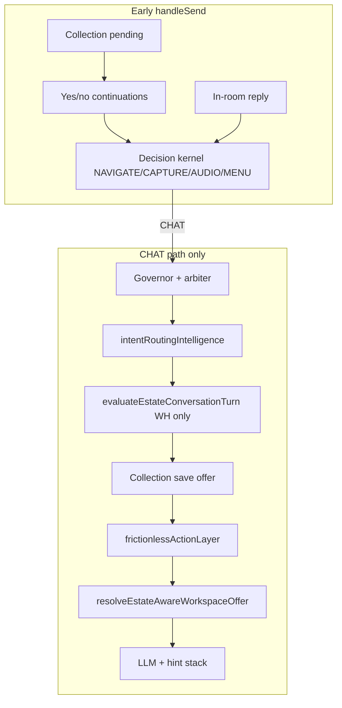

# Estate Turn Orchestration Plan™

| Field | Value |
|-------|-------|
| **Status** | Planning only — **no runtime wiring in this document** |
| **Purpose** | Plan how `evaluateEstateTurn()` becomes the **single conversation routing orchestrator** without breaking current chat |
| **Parent** | [SPARK_ESTATE_MASTER_PLAN.md](./SPARK_ESTATE_MASTER_PLAN.md) Phase 2 |
| **Companion DNA** | [THE_FRIEND_WE_ALL_DESERVE.md](../THE_FRIEND_WE_ALL_DESERVE.md) — task lock must not violate friendship |
| **Code today** | `lib/estate/estateTurn.ts` · `estateMemberNeedIndex.ts` (Phase 1, not wired) |

---

## Executive summary

Spark currently runs **15+ parallel routing systems** inside `handleSend`. They were added incrementally; each solved a real problem. Together they **compete**, especially when a member is mid-task (research, draft, summarize) and a later turn contains words that also match room-intent regexes.

**Phase 2 goal:** one orchestrator — `evaluateEstateTurn()` extended into `evaluateEstateOrchestration()` — that returns a **single decision per turn**: stay in conversation · continue task · invite place · suggest places · navigate · capture · audio.

**Non-goal:** big-bang replacement. Shadow mode first. Active task lock before room handoff. Legacy matchers retire last.

---

## 1. Current routing systems (inventory)

Every system below may **suggest a room**, **open a workspace**, **offer navigation**, or **interrupt conversation** with a local reply.

### 1.1 Estate intelligence (`lib/estateIntelligence/`)

| System | File | Triggers | Output |
|--------|------|----------|--------|
| **Estate matcher** | `estateMatcher.ts` | `userText`, emotion, overwhelmed, intentCategory | Scored capability matches; `PRODUCT_RULES` regex (e.g. `research` → Observatory™) |
| **Estate router** | `estateRouter.ts` | High/medium match | Invitation copy, `primarySection`, suppressGenericDefinition |
| **Estate intelligence** | `estateIntelligence.ts` | Wrapper | `EstateIntelligenceEvaluation`; suppresses if already at destination |
| **Estate offer** | `estateOffer.ts` | High confidence | `WorkspaceOffer`; sets `estateRoutingActive` |
| **Command router** | `estateCommandRouter.ts` | Direct verbs, hybrid, intent expressions, contextual yes | `EstateCommandDecision` (direct / intent / hybrid); calls `resolveEstatePlace`, alias registry |
| **Conversation pipeline** | `estateConversationPipeline.ts` | Welcome Home / frosted chat only | Concierge + estate eval + workspace offer |
| **V3 behavior recovery** | `v3BehaviorRecovery.ts` | Bridge layer | `resolveEstateAwareWorkspaceOffer` — estate beats v3 intent when high confidence |
| **Capability registry** | `registrations/*.ts` | Static keywords/phrases | Feeds matcher (legacy vocabulary; collides with canonical `placeId`) |

### 1.2 Canonical estate (`lib/estate/`)

| System | File | Triggers | Output |
|--------|------|----------|--------|
| **resolveEstatePlace** | `resolveEstatePlace.ts` | Member text | `exact-place` · `explicit-object` · `explicit-activity` · `suggestion` · `none` |
| **goToPlace** | `goToPlace.ts` | Canonical `placeId` | Navigation metadata (section, directVisit, preserveConversation) |
| **Canonical suggestions** | `canonicalPlaceSuggestions.ts` | Feeling profiles (quiet, celebrate, learn…) | Ranked `placeId[]`, max 3, never forced |
| **Estate place navigation** | `estatePlaceNavigation.ts` | Text + lastAssistant + pending menu | `navigate` · `offer` · `unknown_place` · `none` |
| **Legacy regex routing** | `estateRoomRouting.ts` | Text | `EstateRoomMatch[]` — explicit nav + intent rules (**retire candidate**) |
| **In-room conversation** | `estateRoomInConversation.ts` | `directEstateVisit.roomId` | Warm in-place reply; suppresses intent while visiting |
| **Member need index** | `estateMemberNeedIndex.ts` | Natural phrases | `EstateTurnResolution` (Phase 1) |
| **evaluateEstateTurn** | `estateTurn.ts` | Phrase | Need + places + mount metadata (**not wired to chat**) |
| **Estate intent bridge** | `estateIntentBridge.ts` | Text + current place | Understanding only — no nav |
| **Alias registry** | `estateRoomAliasRegistry.ts` | Exact/bounded room names | `roomId`, section overrides |
| **Decision kernel** | `decisionKernel/resolveEstateAction.ts` | Every non-informational turn (via `classifyCompanionIntent`) | **NAVIGATE · CAPTURE · AUDIO · MENU · CHAT** — strict priority |

### 1.3 Workspace & feature routing

| System | File | Triggers | Output |
|--------|------|----------|--------|
| **workspaceMode** | `workspaceMode.ts` | `detectDoingIntent` — doing beats talking | `WorkspaceOffer` (projects, create, brain-dump, audio…) |
| **Intent routing** | `intentRoutingIntelligence.ts` | Every chat turn on CHAT path | Category, workspace offer, overwhelm route, clarify |
| **Frictionless layer** | `frictionlessActionLayer.ts` | Pre-LLM; defers exact room names | Local reply, workspace offer, pending action |
| **Menu continuation** | `menuContinuationIntelligence.ts` | Numbered menu picks | Overrides intent routing |
| **Companion governor** | `companionGovernor.ts` | Turn surface eval | `workspace_open` via `detectOpenSectionRequest` |
| **Turn arbiter** | `companionTurnArbiter.ts` | Post-governor | Surface arbitration |
| **First workflow** | `companionFirstWorkflow.ts` | First-workflow detection | Workspace offer |
| **Overwhelm today** | `overwhelmTodayRouting.ts` | Overwhelm signals | Feature routing |
| **Ecosystem intent** | `companionEcosystemIntent.ts` | Ecosystem problems | Workspace offer |
| **Visual structure** | `visualStructureRouting.ts` | Visual thinking | Menu / workspace |
| **Welcome room** | `welcomeRoom.ts` | Welcome flows | Invitation |
| **Pending action** | `pendingAction.ts` | Governor | Section open detection |

### 1.4 Estate memory & continuations

| System | File | Triggers | Output |
|--------|------|----------|--------|
| **Pending transition** | `estateMemory/estatePendingTransition.ts` | Estate invitation accepted | Session intent, follow-up questions |
| **Offer continuation** | `estateMemory/estateOfferContinuation.ts` | Assistant estate invite + user yes | Recovered `FrictionlessPendingAction`, section inference |
| **Section map** | `estateMemory/estateSectionMap.ts` | Section ↔ entryId | Display names (**collision risk**: library vs institute) |

### 1.5 Collection framework

| System | File | Triggers | Output |
|--------|------|----------|--------|
| **Collection save offer** | `collectionOfferIntelligence.ts` | Long reflective text, not nav | Permission to save in journal / greenhouse / evidence |
| **Collection offer flow** | `collectionOfferFlow.ts` | Pending collection + yes/no | Open room with prefill |
| **Collection prefill** | `collectionOfferFlow.ts` | roomId + source text | Capture field prefill |

### 1.6 Companion orchestrator (`CompanionPageClient.tsx`)

| Hook / block | Role |
|--------------|------|
| `handleSend` (~18k lines) | **Master sequencer** — dozens of early returns before LLM |
| Yes/no continuations | Frictionless, collection, estate recovery (~line 9600+) |
| `classifyCompanionIntent` → `executeCompanionIntent` | Decision kernel (~10608) |
| `resolveEstateRoomInConversationReply` | In-room suppression (~10589) |
| `evaluateEstateConversationTurn` | Welcome Home only (~11387) |
| `evaluateCollectionSaveOffer` | If `!estateRoutingActive` (~11423) |
| `resolveFrictionlessAction` | Pre-LLM local/tool (~11458) |
| `resolveEstateAwareWorkspaceOffer` | Estate + v3 + doing intent |
| `recoverEstateWorkspaceOfferFromChat` | Yes-after-invitation recovery (~9637) |
| `acceptWorkspaceOfferCore` | Large section switch — actual navigation |
| `runDirectEstateRoomNavigation` | `directEstateVisit`, memory handoff |
| Phase observers (2–11) | Proactive offers injected into hint stack |

### 1.7 Not in runtime (rules/docs only)

| Item | Notes |
|------|-------|
| `lib/sparkCoreIntelligence/` | Referenced in Cursor rules; **no on-disk runtime** in companion-app |
| `evaluateEstateTurn` | Phase 1 tests only |
| `estateIntentBridge` | Not wired into `resolveEstatePlace` |

---

## 2. Conflict map

### 2.1 How systems compete today



**Key conflicts:**

| Conflict | What happens | Winner today |
|----------|--------------|--------------|
| Kernel vs estate conversation pipeline | Both can evaluate navigation phrases | Kernel runs **first**; pipeline only on CHAT path + Welcome Home |
| `resolveEstatePlace` vs `estateMatcher` | Same phrase, different targets | Both active; matcher used in Welcome Home / command router |
| `detectIntentCommand` vs `suggestion` kind | Feeling phrases → suggest; matcher may still fire on CHAT path | Command router defers on `suggestion`; **matcher does not** |
| `research` in user text | Task continuation vs Observatory route | Matcher: `(want\|need) to research` → **observatory** (high) |
| `estateRoutingActive` | Suppresses collection/frictionless/stress | Estate high-confidence only |
| Governor `workspace_open` | Parallel to estate kernel | Different phrase sets — both can exist |
| In-room visit | Suppresses intent commands | Explicit nav still allowed |
| Phase 2–11 observers | Inject proactive offers into hints | Can fire alongside estate offers |

### 2.2 Case study — research task hijacked by room routing

**Source:** Live conversation pattern reported in product review (Wonderdog / AI research context). **Not yet committed** as a fixture in `docs/CONVERSATION_LEARNING_LOG.md` — must become a regression test before Phase 2D.

**Reconstructed transcript (failure pattern):**

| Turn | Speaker | Content | What should have happened |
|------|---------|---------|---------------------------|
| 1 | Member | "Can you research AI tools for Wonderdog?" | Spark promises quiet research; **active task lock** opens (`research`) |
| 2 | Spark | "I'll look into that — give me a moment." | Hidden work begins; no room offer |
| 3 | Member | "Yes" / "Okay" | Continues task — **not** interpreted as estate yes |
| 4 | Member | "What did you find?" / "Show me the research" | Deliver results or honest status — **no navigation** |
| 5 | Spark | *(failure)* Offers Observatory / Creative Studio / Peaceful Places | **Room hijack** — matcher sees `research` |
| 6 | Member | "That's not what I asked" / "I don't want a room" | **Correction override** — suppress all routing |
| 7 | Spark | *(failure)* Still suggests places or workspaces | Routing fired again on CHAT path |
| 8 | Member | "Where is what you found?" | Task retrieval — not `goToPlace` |

**Mechanisms that caused hijack (code-level):**

1. **`estateMatcher.ts`** — `(?:want|need) to research` → `observatory` (score 20+). Member turn 4 may still contain "research."
2. **`estateRoomRouting.ts`** — `research ai tools` → observatory (legacy, parallel).
3. **No active task lock** — nothing prevents matcher/frictionless/intentRouting from running while research is pending.
4. **Yes continuation ambiguity** — turn 3 "yes" may bind to **estate offer** (`recoverEstateWorkspaceOfferFromChat`) if any prior assistant message looked like an invitation.
5. **Kernel CHAT fallback** — after kernel returns CHAT, full stack runs including `resolveEstateAwareWorkspaceOffer`.
6. **Correction not authoritative** — "that's not what I asked" does not set a **routing suppression window**.

**Friend test failure:** Spark acted like software scheduling a tour while the member waited for a friend to return with homework.

---

## 3. New orchestration order (target)

Single function: **`evaluateEstateOrchestration(context)`** — superset of today's `evaluateEstateTurn`.

### Input context (per turn)

```typescript
// Planning types only — not implemented yet
type EstateOrchestrationContext = {
  userText: string;
  lastAssistantText: string | null;
  priorUserText: string | null;
  conversationTurn: number;
  currentPlaceId: string | null;
  activeSection: AppSection | null;
  workspacePanel: AppSection | null;
  emotionalState: string | null;
  overwhelmed: boolean;
  /** Active task lock — see §4 */
  activeTask: ActiveTask | null;
  /** Pending continuations */
  pendingFrictionless: FrictionlessPending | null;
  pendingCollectionOffer: CollectionPending | null;
  pendingEstatePlaceMenu: PlaceMenuPending | null;
  pendingEstateInvitation: boolean;
  inDirectEstateVisit: boolean;
  informationalTurn: boolean;
};
```

### Decision order (strict — first match wins)

| Priority | Gate | Result |
|----------|------|--------|
| **0** | **Active task lock** | If task `in_progress` and turn is task continuation → `CONTINUE_TASK` (no room routing) |
| **1** | **User correction override** | Phrases in §5 → `STAY_CONVERSATION` + `suppressRoutingForNTurns` |
| **2** | **Pending offer continuation** | Frictionless yes/no · collection yes/no · estate invitation yes · numbered place menu |
| **3** | **In-room explicit companion action** | `estateRoomInConversation` — journal/quiet/reflect topics while visiting |
| **4** | **Exact place request** | Nav verb + alias · bare destination · `resolveEstatePlace` → `exact-place` |
| **5** | **Explicit task request** | New research/draft/summarize/find… → open task lock · `BEGIN_TASK` |
| **6** | **Explicit activity / object** | `clear my mind`, `accomplishments book`, `proof of growth` |
| **7** | **Capture intent** | Write to journal / evidence / portfolio (kernel CAPTURE) |
| **8** | **Audio intent** | Soundscape request (kernel AUDIO) |
| **9** | **Emotional / need suggestion** | `evaluateEstateTurn` → `suggest` or `invite` (max 3 places) |
| **10** | **Stay in conversation** | `CHAT` — LLM path; hints only; no auto-nav |

**Rules:**

- **Suggestion never auto-navigates** (Spec 108, existing `resolveEstatePlace` law).
- **Invite** requires member yes (continuation layer).
- **Only one** workspace/estate offer surface per turn.
- **Task lock blocks 9** unless member explicitly asks for a place (priority 4).

### Output (single union)

```typescript
type EstateOrchestrationDecision =
  | { kind: "continue_task"; task: ActiveTask }
  | { kind: "begin_task"; task: ActiveTask }
  | { kind: "complete_task"; taskId: string }
  | { kind: "navigate"; placeId: string; command: GoToPlaceInput }
  | { kind: "suggest_places"; placeIds: string[]; line: string }
  | { kind: "invite_place"; placeId: string; line: string }
  | { kind: "capture"; ... }
  | { kind: "audio"; ... }
  | { kind: "stay_conversation"; suppressRouting?: boolean }
  | { kind: "execute_pending"; ... };
```

---

## 4. Active task lock

### 4.1 What creates a task

A task begins when Spark **commits** to deliverable work — explicit or accepted:

| Task kind | Example member phrases | Example Spark commitments |
|-----------|------------------------|---------------------------|
| `research` | "research X", "look into", "find out about" | "I'll look into that", "Let me research" |
| `draft` | "draft an email", "write a post" | "I'll draft that for you" |
| `summarize` | "summarize this", "TL;DR" | "I'll summarize what we have" |
| `find` | "find examples", "pull quotes" | "I'll find some options" |
| `create` | "create a plan", "build an outline" | Permission + build (ties to create workflow) |
| `analyze` | "analyze these numbers", "compare options" | "I'll analyze that" |
| `compare` | "compare A vs B" | "I'll compare them" |
| `write` | "write a letter", "write copy" | Distinct from journal **express** need — task when deliverable promised |
| `email` | "draft email to…" | Task + possibly creative studio |
| `schedule` | "schedule a post", "plan my week" | Task until calendar action complete |

**Task opens on:**

1. Member explicit request **+** Spark acceptance in prior assistant turn, OR  
2. Member explicit request with high confidence (no room words), OR  
3. Member yes **only when** prior assistant turn was task proposal (not estate invitation).

**Stored shape (planning):**

```typescript
type ActiveTask = {
  id: string;
  kind: TaskKind;
  topic: string;           // normalized subject — "AI tools for Wonderdog"
  status: "promised" | "in_progress" | "delivered" | "cancelled";
  openedAtTurn: number;
  lastTouchedTurn: number;
  deliveryTurn?: number;
  sourceUserText: string;
};
```

Session persistence: `spark:estate:active-task:v1` (planning name — **do not wire until Phase 2C**).

### 4.2 What continues a task (while locked)

- "What did you find?" · "Show me the research" · "Where is it?" · "Any updates?"  
- "Keep going" · "What else?" · "And?"  
- Follow-ups on same topic without nav verbs  

### 4.3 What completes a task

- Spark delivers results member acknowledges ("thanks", "that's what I needed")  
- Member explicit close: "that's enough", "we're good on that"  
- Member hard pivot with topic change **+** no reference to task subject for 2+ turns  
- Task error with honest failure + member acceptance  

### 4.4 What cancels a task

- Member: "stop researching", "forget that", "never mind"  
- **User correction override** (§5)  
- Conflicting explicit place nav: "take me to the library" — cancels task **after** confirmation? **Plan:** cancel task, then priority 4 navigates (one confirmation if both strong)  

### 4.5 Interaction with hidden work engine (Spec 118)

Task lock is **member-visible promise**; hidden work (`research_prep`, `draft_prep`) runs underneath. Routing must not surface Observatory while `research_prep` is `in_progress`.

---

## 5. User correction override

When detected → **`STAY_CONVERSATION`**, clear pending estate/collection offers, extend routing suppression **3 turns** (planning default).

### Phrase families (normalize, match substrings)

| Family | Examples |
|--------|----------|
| **Reject room** | "I don't want a room", "stop suggesting places", "not a tour", "stay here" |
| **Reject misunderstanding** | "that's not what I asked", "no, I meant", "you're not listening", "that's not what I wanted" |
| **Demand task artifact** | "show me the research", "what did you find", "where is what you found", "let me see it", "show me what you wrote" |
| **Reject workspace** | "I don't want to open", "not the observatory", "stop sending me to" |
| **Frustration halt** | "just answer", "focus on what I asked", "please stop" |

### Behavior

1. Do **not** call matcher, frictionless estate offers, or `evaluateEstateConversationTurn` place offers on this turn.  
2. Set `routingSuppressedUntilTurn = currentTurn + 3`.  
3. If `activeTask` exists → prioritize `CONTINUE_TASK` / retrieval.  
4. Spark reply: repair + one clarifying question max (Spec 106).  
5. Log to `CONVERSATION_LEARNING_LOG.md` — Rule of Three before prompt changes.

---

## 6. Implementation phases (no code yet)

### Phase 2A — Observe / log only

| Item | Detail |
|------|--------|
| **Add** | `evaluateEstateOrchestrationShadow(context)` — runs new order, **no side effects** |
| **Log** | Dev-only: decision that would have won vs what `handleSend` actually did |
| **Output** | `docs/estate/orchestration-shadow-log.md` samples in CI artifact (optional) |
| **Risk** | Zero member impact |

### Phase 2B — Shadow mode in production

| Item | Detail |
|------|--------|
| **Add** | Shadow call inside `handleSend` after kernel, before LLM |
| **Compare** | `shadowDecision` vs `kernelDecision` vs `estateConversationTurn` |
| **Metrics** | Mismatch rate, hijack candidates (task + room offer same turn) |
| **Gate** | &lt;5% unexpected mismatches on phrase test matrix before 2C |

### Phase 2C — Active task lock

| Item | Detail |
|------|--------|
| **Add** | `lib/estate/activeTaskLock.ts` + session persistence |
| **Wire** | Task open/continue/complete in `handleSend` **before** matcher stack |
| **Do not** | Change room routing yet — only block offers while task active |
| **Tests** | Wonderdog research transcript fixture (§7) |

### Phase 2D — Room routing handoff

| Item | Detail |
|------|--------|
| **Wire** | `evaluateEstateOrchestration` replaces parallel estate eval on CHAT path |
| **Delegate** | Kernel NAVIGATE → orchestrator priority 4; MENU → 9 |
| **Single offer** | `resolveEstateAwareWorkspaceOffer` consumes orchestrator output only |
| **Keep** | `goToPlace` as execution primitive |

### Phase 2E — Retire legacy systems

| Retire (ordered) | Replace with |
|------------------|--------------|
| `estateRoomRouting.ts` regex | `resolveEstatePlace` + need index |
| Duplicate `PRODUCT_RULES` | `estateMemberNeedIndex` + canonical aliases |
| `estateIntelligence/registrations` keyword dupes | Generated from canonical registry |
| Governor `workspace_open` for estate-capable sections | `goToPlace` |
| Parallel `evaluateEstateConversationTurn` estate matcher | Orchestrator on all chat surfaces |

**Do not retire:** `goToPlace`, `resolveEstatePlace`, offer continuation, collection framework, frictionless **non-estate** categories.

---

## 7. Tests required before wiring

### 7.1 Existing suites (must stay green)

```bash
npx vitest run lib/estate/estateTurn.test.ts
npx vitest run lib/estate/goToPlace.test.ts
npx vitest run lib/estate/decisionKernel/cafeNavigation.test.ts
npx vitest run lib/estateIntelligence/estateCommandRouter.test.ts
npx vitest run lib/estateIntelligence/estateIntelligence.test.ts
npx vitest run lib/estate/collectionFramework/registry.test.ts
```

### 7.2 New — `estateOrchestration.test.ts` (required before 2C)

**Phrase matrix** (extend `estateTurn.test.ts`):

- All Phase 1 phrases (write, peaceful, swimming, course, forget, proof)

**Task lock fixtures (Wonderdog / AI research pattern):**

| # | User turn | Active task | Expected decision |
|---|-----------|-------------|-------------------|
| R1 | "Research AI tools for Wonderdog" | null → opens | `begin_task` research |
| R2 | "Yes" (after Spark research promise) | research in_progress | `continue_task` — **not** estate yes |
| R3 | "What did you find?" | research in_progress | `continue_task` — **not** navigate observatory |
| R4 | "Show me the research" | research in_progress | `continue_task` / retrieval |
| R5 | "I don't want a room" | any | `stay_conversation` + suppress routing |
| R6 | "That's not what I asked" | research in_progress | `stay_conversation` + suppress |
| R7 | "Where is what you found?" | research in_progress | `continue_task` — **not** MENU |
| R8 | "Take me to the Journal Gazebo" | research in_progress | `navigate` journal (explicit place beats task) |

**Correction override fixtures:**

- Each phrase in §5 → `stay_conversation`, no `placeIds`

**Regression — must not break:**

- "Take me to the Library" → `library` not `momentum-institute` (cafeNavigation / command router class)
- "I want to sit somewhere quiet" → `suggest` ≤3 places, no auto-nav
- Coffee House contextual "take me there" after mention

### 7.3 Integration test (before 2D)

**Goal:** `handleSend` simulation or exported `planCompanionTurn()` with mocked LLM — assert **no workspace offer** on turns R3–R4 when task active.

*Note: `ESTATE_CLEANUP_ROADMAP.md` already calls out that unit tests prove detection, not full `handleSend` chain — integration test is Phase 2D gate.*

---

## 8. Risk list

| Risk | Severity | If done too fast |
|------|----------|------------------|
| Big-bang replace `handleSend` early returns | **Critical** | Regressions across create builder, strategy apply, compass |
| Task lock false positives | **High** | Spark never suggests helpful places |
| Task lock false negatives | **High** | Research hijack continues |
| Yes disambiguation wrong | **High** | "yes" opens wrong room mid-task |
| Retire matcher before need index complete | **High** | NL accuracy drops for unmapped phrases |
| Shadow log in production without flag | **Medium** | Noise, perf |
| Correction suppress too long | **Medium** | Spark feels unhelpful for 3+ turns |
| Correction suppress too short | **Medium** | Hijack repeats on turn+1 |
| Library / institute collision unfixed | **High** | Wrong room even with orchestrator |
| `growth-journal` vs `journal` alias bugs | **Medium** | Navigation to wrong shell |
| Phase 2–11 observer hints | **Medium** | Proactive offers bypass orchestrator |
| Wonderdog fixture without real API research | **Low** | Task delivery still needs hidden work — routing is necessary not sufficient |

---

## 9. Final recommendation

### Wire first (safest order)

1. **Phase 2A shadow logger** — pure observation, zero behavior change.  
2. **Phrase + task fixtures in tests** — commit Wonderdog research table (§7.2) **before any wiring**.  
3. **Phase 2C active task lock only** — blocks room offers during `research`/`draft`/etc.; does not change how places route when no task.  
4. **Phase 2B shadow metrics** — run until hijack rate measurable on real logs.  
5. **Phase 2D** — single orchestrator output feeding **one** offer path; keep kernel for CAPTURE/AUDIO/MENU until proven redundant.

### Leave alone (for now)

| System | Why |
|--------|-----|
| `goToPlace` / `resolveEstatePlace` | Correct primitives — orchestrator calls them |
| Create builder / strategy apply / compass early returns | Unrelated workflows — don't merge into estate orchestrator |
| Collection offer flow | Keep — orchestrator gate **when** to offer save, not rewrite capture |
| Frictionless non-estate categories | Sheets, reminders, welcome room — separate lane |
| Journal Gazebo visuals | Explicitly deferred |
| Legacy registry deletion | Phase 2E only |
| `estateRoomRouting.ts` deletion | Until shadow proves need index + resolveEstatePlace cover regex set |
| LLM hint stack / phase observers | Gate behind `!routingSuppressed && !activeTask` in 2C, don't remove |

### First code PR (when approved)

**One PR:** `activeTaskLock.ts` + test fixtures R1–R8 + shadow function stub — **no `handleSend` wiring**.

**Second PR:** Wire task lock at top of `handleSend` only.

**Third PR:** Shadow mode logging.

Only after metrics → orchestrator handoff (2D).

---

## Related documents

- [SPARK_ESTATE_MASTER_PLAN.md](./SPARK_ESTATE_MASTER_PLAN.md)  
- [ESTATE_CLEANUP_ROADMAP.md](../ESTATE_CLEANUP_ROADMAP.md)  
- [PHASE_C_GOTOPLACE_REPORT.md](./PHASE_C_GOTOPLACE_REPORT.md)  
- [THE_FRIEND_WE_ALL_DESERVE.md](../THE_FRIEND_WE_ALL_DESERVE.md)  
- [SPARK_HIDDEN_WORK_ENGINE_FRAMEWORK.md](../SPARK_HIDDEN_WORK_ENGINE_FRAMEWORK.md) (Spec 118)

---

*Planning document only. No runtime behavior changed.*
