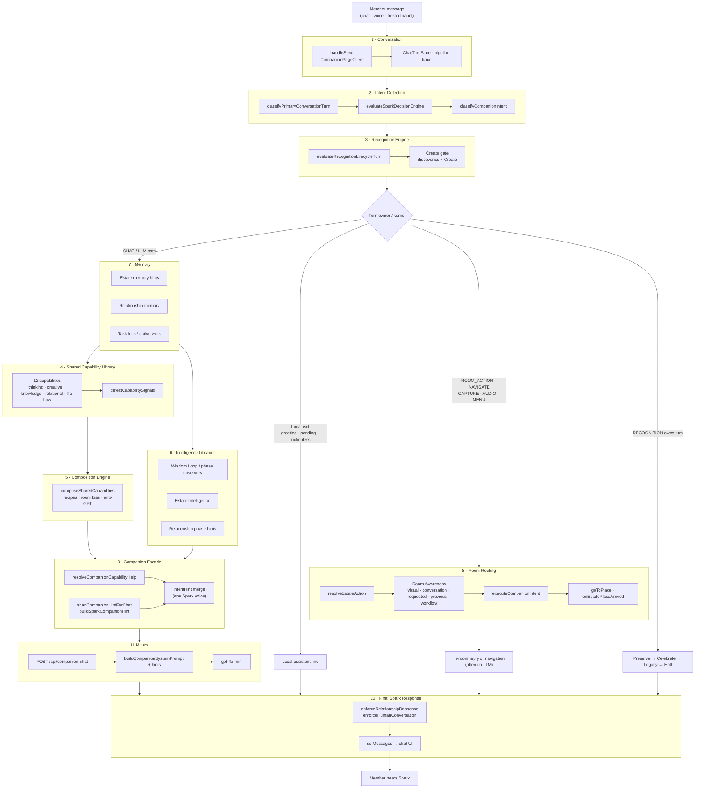
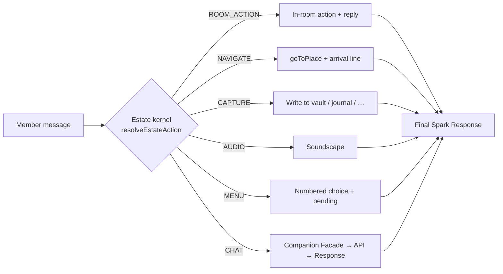
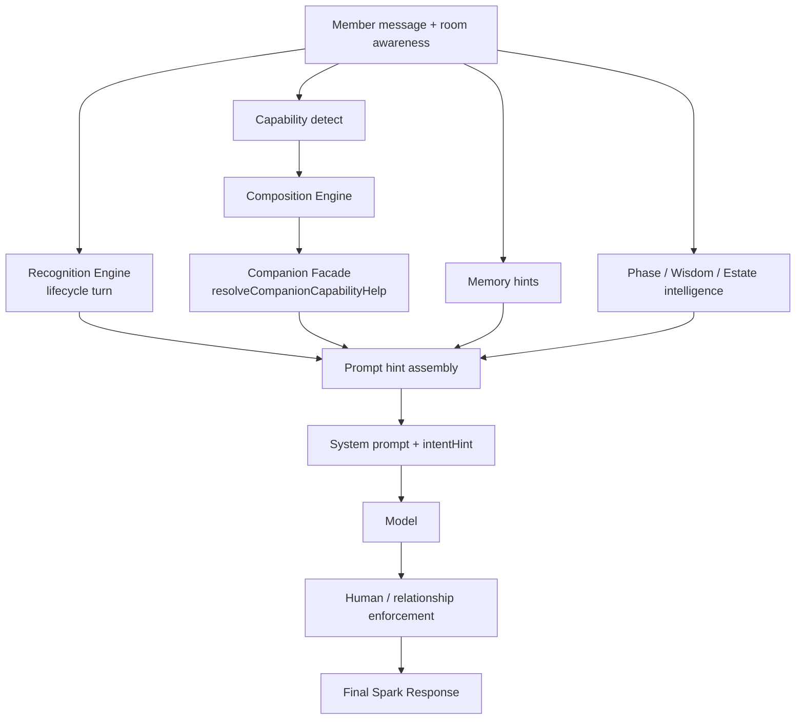
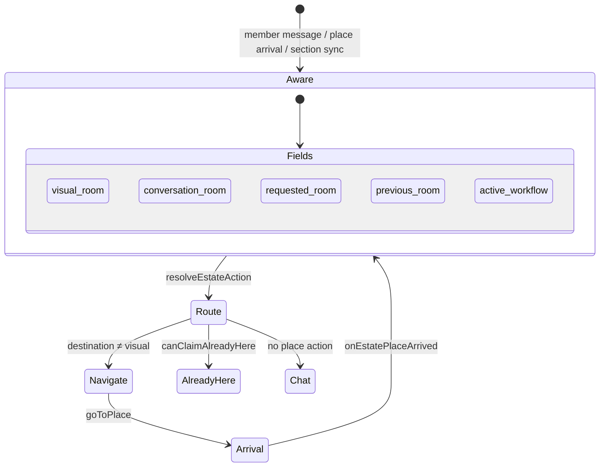

# 151_SPARK_COMPANION_RUNTIME_ARCHITECTURE

# Spark Estate™
## Spark Companion Runtime Architecture

**Series:** Runtime / Architecture Index (151)  
**Status:** Binding visual map of the companion turn pipeline  
**Date:** 2026-07-09  
**Principle:** One intelligent companion. Relationship owns the work.

**Canonical mirror (orchestration docs):** [`docs/SPARK_COMPANION_RUNTIME_ARCHITECTURE.md`](../../../SPARK_COMPANION_RUNTIME_ARCHITECTURE.md)

This document shows how Conversation, Intent Detection, Recognition Engine, Shared Capability Library, Composition Engine, Intelligence Libraries, Memory, Room Routing, Companion Facade, and Final Spark Response work together — from member message to spoken reply.

**Related:**
- [060_CURSOR_IMPLEMENTATION_ORDER.md](./060_CURSOR_IMPLEMENTATION_ORDER.md) — Cursor build order
- [100_SPARK_ESTATE_MASTER_MANIFEST.md](./100_SPARK_ESTATE_MASTER_MANIFEST.md) — master library index
- [131_SHARED_CAPABILITY_LIBRARY_OVERVIEW.md](./131_SHARED_CAPABILITY_LIBRARY_OVERVIEW.md) — Shared Capability series
- [140_CAPABILITY_LIBRARY_BUILD_ORDER.md](./140_CAPABILITY_LIBRARY_BUILD_ORDER.md) — capability build order
- [140_SHARED_CAPABILITY_LIBRARY_INDEX.md](./140_SHARED_CAPABILITY_LIBRARY_INDEX.md) — capability catalog index
- [`docs/SPARK_CONVERSATION_INTELLIGENCE_ARCHITECTURE.md`](../../../SPARK_CONVERSATION_INTELLIGENCE_ARCHITECTURE.md) — orchestration authority
- [`docs/estate/ESTATE_ROOM_AWARENESS.md`](../../ESTATE_ROOM_AWARENESS.md) — visual / conversation / requested / previous / workflow
- [RECOGNITION_LIFECYCLE_IMPLEMENTATION.md](../RECOGNITION_LIFECYCLE_IMPLEMENTATION.md) — recognition pipeline

---

## 1. Complete runtime flow (member message → final response)

---

## 2. Layer map (what each box owns)

| # | Layer | Code home | Owns | Does not own |
|---|--------|-----------|------|--------------|
| 1 | **Conversation** | `CompanionPageClient.handleSend`, `chatTurnLifecycle` | Turn lifecycle, message commit, fail-safe completion | Place identity, capability product names |
| 2 | **Intent Detection** | `primaryTurnClassifier`, `sparkDecisionEngine`, `classifyCompanionIntent` | One turn owner; kernel vs chat | LLM wording |
| 3 | **Recognition Engine** | `lib/sparkRecognitionEngine/` | Discovery → preserve → celebrate → legacy → hall; Create gate | Birthday milestones (`lib/recognition/`) |
| 4 | **Shared Capability Library** | `lib/sparkSharedCapabilities/catalog` | 12 reusable skills | Member-facing “GPT” surfaces |
| 5 | **Composition Engine** | `composeSharedCapabilities` | Which skills combine for this turn | Navigation / room identity |
| 6 | **Intelligence Libraries** | Wisdom Loop, phase observers, estate intelligence | Judgment, wisdom-before-info, place tone | Final spoken product names |
| 7 | **Memory** | `estateMemory`, relationship phases, task lock | Continuity across turns | Visual room confirmation |
| 8 | **Room Routing** | `decisionKernel`, `goToPlace`, `roomAwareness` | Where the member is / goes | Capability composition |
| 9 | **Companion Facade** | `resolveCompanionCapabilityHelp`, `buildSparkCompanionHint` | One companion voice; hide internals | Raw capability catalogs |
| 10 | **Final Spark Response** | `/api/companion-chat` + client enforcement | Spoken reply in UI | Silent kernel actions (already done) |

---

## 3. Decision branches (when the LLM is skipped)

**Already-here law:** Room Routing may claim “You’re already here” only when `visual_room` confirms (`canClaimAlreadyHere`). Stale conversation memory alone is never enough.

---

## 4. Intelligence assembly on the LLM path

How Memory, Recognition, Capabilities, and Intelligence Libraries feed the Facade before the model speaks:

**Integration point for Recognition + Composition + Facade:**  
`lib/sparkWisdom/buildWisdomPromptHint.ts` (calls `evaluateRecognitionLifecycleTurn` + `resolveCompanionCapabilityHelp`).

**Production companion path today:** `CompanionPageClient` merges phase/memory/estate hints and posts to `/api/companion-chat`, where `shariCompanionHintForChat` → `buildSparkCompanionHint` reinforces one-companion voice. Full Wisdom Loop + shared-capability composition is the target assembly path for that same Facade.

---

## 5. Room awareness in the runtime

---

## 6. Anti-laws (runtime must not violate)

1. **Companion over features** — capabilities never introduce themselves as products or GPTs.
2. **Recognition before Create** — discoveries do not open Create unless the member explicitly asks.
3. **Visual confirms presence** — no false “already here.”
4. **One owner per turn** — primary classifier + decision engine reconcile; kernel and chat do not both “win.”
5. **Relationship continuity** — navigation and composition must not reset conversation.

---

## 7. Key file index

| Concern | Path |
|---------|------|
| Conversation entry | `app/companion/CompanionPageClient.tsx` (`handleSend`) |
| Primary intent | `lib/conversation/primaryTurnClassifier.ts` |
| Decision engine | `lib/sparkCompanion/sparkDecisionEngine/` |
| Recognition | `lib/sparkRecognitionEngine/` |
| Shared capabilities | `lib/sparkSharedCapabilities/` |
| Composition | `lib/sparkSharedCapabilities/compose.ts` |
| Facade | `lib/sparkSharedCapabilities/facade.ts` |
| Wisdom / hint assembly | `lib/sparkWisdom/buildWisdomPromptHint.ts` |
| Room kernel | `lib/estate/decisionKernel/resolveEstateAction.ts` |
| Room awareness | `lib/estate/roomAwareness/` |
| Companion hint (API) | `lib/sparkCompanion/buildSparkCompanionHint.ts` |
| Chat API | `app/api/companion-chat/route.ts` |

---

## 8. How to maintain this diagram

- Prefer editing the Mermaid blocks in this file over screenshots.
- Keep this library doc and `docs/SPARK_COMPANION_RUNTIME_ARCHITECTURE.md` in sync.
- When a layer gains a new owner module, update **§2 Layer map** and **§7 Key file index** in the same PR.
- Keep branch diagrams (§3) aligned with `resolveEstateAction` priority: `ROOM_ACTION` → `NAVIGATE` → `CAPTURE` → `AUDIO` → `MENU` → `CHAT`.
