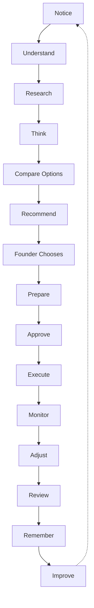
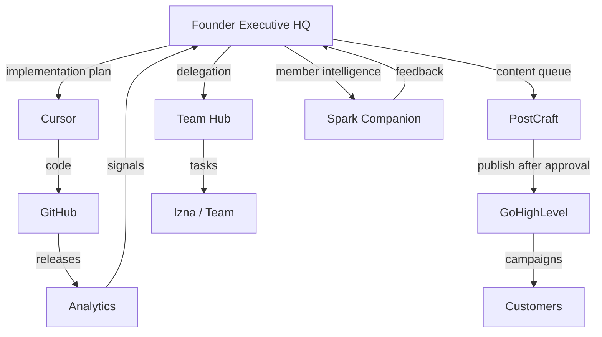

# Executive Execution System™

**From great ideas to finished results — the operational layer of Founder**

| | |
|---|---|
| **Status** | Binding — Phase 3: Executive Execution™ |
| **Audience** | Shari · operators · developers · AI models |
| **Parents** | [Founder Master Blueprint™](./FOUNDER_MASTER_BLUEPRINT.md) · [Founder Experience Manifesto™](./FOUNDER_EXPERIENCE_MANIFESTO.md) |
| **Activates** | Executive Operating System™ · Executive Orchestrator™ · Decision Lifecycle™ · Institutional Memory™ |
| **Phase rule** | Complete executive workflow — not isolated features |

> **Founder does not simply recommend work. Founder prepares, coordinates, monitors, and improves every initiative until it is complete.**

---

## Why this exists

Visual Spark Studios generates extraordinary ideas. The cost is not creativity — it is **execution load**: too many threads, too much re-explaining, too little organized preparation.

Phase 3 turns the foundation we built into **Executive Operations**: one lifecycle, one state of execution, work organized into packets — always with Shari in control.

**The primary goal:** Help Shari move from idea → implementation → completion with the least possible mental effort.

**Founder becomes the Executive Operations Center for Visual Spark Studios.**

---

# Section 1 — The Executive Lifecycle

Every major initiative follows **one operating model**. No exceptions. No side doors.

```
Notice
    ↓
Understand
    ↓
Research
    ↓
Think
    ↓
Compare Options
    ↓
Recommend
    ↓
Founder Chooses
    ↓
Prepare
    ↓
Approve
    ↓
Execute
    ↓
Monitor
    ↓
Adjust
    ↓
Review
    ↓
Remember
    ↓
Improve
```

## What each stage means for Shari

| Stage | Founder’s job | Shari’s experience |
|-------|---------------|-------------------|
| **Notice** | Awareness detects meaningful change | “Something worth knowing surfaced calmly.” |
| **Understand** | Questions, context, mission link | “I know what this is about.” |
| **Research** | Evidence gathered overnight | “I don’t have to dig.” |
| **Think** | Options framed; tradeoffs clear | “I can think with a partner.” |
| **Compare Options** | Decision lifecycle comparison | “I see the paths honestly.” |
| **Recommend** | Governor: one primary path | “One clear suggestion — my choice.” |
| **Founder Chooses** | Shari decides | Ownership preserved |
| **Prepare** | Orchestrator assembles work packets | “It’s already organized.” |
| **Approve** | Explicit gates — nothing sneaks through | “Nothing happens without me.” |
| **Execute** | Delegation to tools/people with packets | “Work moves — I’m not chasing.” |
| **Monitor** | Progress, blocks, risks — quiet | “I’m told before it’s a crisis.” |
| **Adjust** | Recommendations to correct course | “Course corrections, not panic.” |
| **Review** | Structured retrospective | “We learn, not blame.” |
| **Remember** | Institutional Memory | “We never lose the why.” |
| **Improve** | Continuous Improvement loop | “The company gets wiser.” |



**Engineering alignment:** Executive OS operating loop · Decision Lifecycle · Orchestrator · Awareness · Governor · Improvement · Institutional Memory.

---

# Section 2 — The Execution Dashboard

This is **not** another dashboard.

It is **the current state of execution** — one calm surface, Rule of One compliant.

## Display only

| Element | Limit |
|---------|-------|
| **Current Mission** | 1 |
| **Current Phase** | 1 label in the lifecycle |
| **Progress** | Plain English + simple indicator |
| **Waiting For** | ≤ 3 items |
| **Risks** | ≤ 3 items |
| **Today’s Next Action** | 1 |
| **Upcoming Milestones** | ≤ 3 |

## Never display by default

- Full task lists  
- Multi-mission kanban walls  
- KPI tiles  
- Notification feeds  
- “Everything happening in the company”  

**Experience test:** Does this feel like glancing at a chief of staff’s one-page briefing — or like opening project software?

If project software — redesign.

---

# Section 3 — Implementation Preparation

When Shari **approves** an initiative, Founder automatically **prepares** (never auto-executes):

| Prepared artifact | Purpose |
|-------------------|---------|
| **Mission updates** | Active mission reflects reality |
| **Development roadmap** | Sequenced build path |
| **Cursor implementation plan** | Ready for Innovation Studio / dev |
| **Executive checklist** | Nothing forgotten |
| **Research package** | Evidence attached |
| **Decision history** | Why we chose this |
| **Marketing outline** | Message and channel sketch |
| **PostCraft content queue** | Drafts queued — not published |
| **GHL workflow outline** | Automation designed — not live |
| **Launch checklist** | Ship readiness |
| **Measurement plan** | How we’ll know it worked |
| **Review plan** | When and how we’ll look back |

**Permanent rule:** Nothing executes automatically. Everything waits for Founder approval at the appropriate gate.

**Alignment:** Executive Orchestrator™ · Executive Preparation (implementation prep, checklists, assignments, automation *candidates*).

---

# Section 4 — Executive Work Packets

Founder does not hand Shari hundreds of tasks.

Founder prepares **Executive Work Packets** — organized briefcases of work.

## Each packet contains

| Field | Why Shari needs it |
|-------|-------------------|
| **Objective** | One sentence — what done looks like |
| **Context** | Background without re-reading history |
| **Why it matters** | Business and mission link |
| **Required research** | Already summarized + links to depth |
| **Dependencies** | What must happen first |
| **Implementation steps** | Ordered, realistic |
| **Success criteria** | How we judge completion |
| **Estimated time** | Respect for calendar reality |
| **Estimated impact** | Why this is worth doing |
| **Estimated ROI** | Honest, not hype |
| **Links to related work** | Graph connections — no duplicates |

## How it should feel

> *Someone already organized the work. I’m reviewing a prepared brief — not building a project from scratch.*

Packets appear in **Prepared** or **Ready for Review** — never as a dumping ground of todos.

---

# Section 5 — Smart Delegation

Every work packet answers **who should do what**:

| Route | When |
|-------|------|
| **Shari** | Judgment, creative direction, final approval, relationship moments |
| **Izna** | Operational execution, coordination, follow-through |
| **Cursor** | Software implementation, technical build |
| **PostCraft** | Content creation and campaign prep |
| **GHL** | Automation workflows (after approval) |
| **Founder monitor** | Watch signals; surface only when needed |
| **Future team** | Roles extend without redesigning packets |

Delegation is **recommended**, never assumed. Shari can override any routing.

**Plain English example:** *“Izna could coordinate member outreach. Cursor could build the landing page. You’d approve before anything goes live.”*

---

# Section 6 — The Approval Gate

Founder prepares everything. Founder never crosses into execution without Shari.

## Approval levels

| Level | Meaning |
|-------|---------|
| **Draft** | Early thinking — not ready |
| **Prepared** | Behind-the-scenes work complete |
| **Ready for Review** | Shari’s attention requested |
| **Approved** | Shari said yes — execution may proceed |
| **Executing** | Work in motion |
| **Completed** | Deliverable done — not necessarily reviewed |
| **Reviewed** | Retrospective captured |
| **Archived** | Closed; memory preserved |

## Gate rules

- **Publish, launch, spend, send, delete** — require **Approved** minimum  
- **Executing** without **Approved** is a system failure  
- Regression from Approved requires explicit acknowledgment  

**Alignment:** Decision Lifecycle approval stages · Orchestrator approval gates.

---

# Section 7 — Monitoring

Founder monitors continuously — **quietly** until adjustment is needed.

| Signal | What Founder watches |
|--------|---------------------|
| **Mission progress** | Pace vs. intention |
| **Blocked work** | Dependencies stuck |
| **Deadlines** | Upcoming — not alarmist |
| **Customer feedback** | Listening Rooms, support patterns |
| **Content performance** | PostCraft outcomes |
| **Marketing performance** | GHL campaigns |
| **Revenue** | Trends — context, not panic |
| **Unexpected risks** | Awareness exceptions |
| **Automation opportunities** | Improvement engine |

## How monitoring surfaces

- **Adjust** recommendations before crises  
- **Never** notification-center spam  
- **Governor** decides if Shari needs to know today  

**Tone:** *“This milestone is slipping — want to simplify scope or shift the date?”* — not *“ALERT: behind schedule.”*

---

# Section 8 — Executive Reviews

Structured reviews — predictable rhythm, progressive disclosure.

## Review types

| Cadence | Focus |
|---------|-------|
| **Daily** | Today’s next action; blocks (30 seconds) |
| **Weekly** | Mission momentum; waiting items |
| **Monthly** | Department health; experiments |
| **Quarterly** | Strategy; Observatory-style patterns |
| **Mission Review** | One mission deep dive |
| **Product Review** | Listening Rooms, launches |
| **Marketing Review** | Campaigns, content |
| **Customer Review** | Member intelligence |
| **Company Review** | Whole-studio health |

## Every review answers

1. **What happened?**  
2. **Why?**  
3. **What worked?**  
4. **What failed?**  
5. **What surprised us?**  
6. **What should change?**  

Reviews end in **Remember** and **Improve** — not guilt.

---

# Section 9 — The Executive Operations Map

How work flows across the ecosystem.



## Responsibility matrix

| System | Founder → System | System → Founder |
|--------|------------------|------------------|
| **Cursor** | Implementation plans, specs | Build status (manual/git) |
| **GitHub** | Release expectations | Ship events, PR state |
| **PostCraft** | Content queue, outlines | Drafts ready for review |
| **GoHighLevel** | Workflow *outlines* | Performance signals |
| **Analytics** | Measurement plans | Evidence for reviews |
| **Team Hub** | Work packets, assignments | Completion signals |
| **Companion** | — | Customer/member intelligence |
| **Customers** | — | Feedback, outcomes |

**Rule:** Founder coordinates. Tools execute after approval.

---

# Section 10 — The Founder Control Principle

**Permanent. Non-negotiable.**

## Founder may

Prepare · Organize · Recommend · Research · Monitor · Draft · Summarize · Compare · Coordinate

## Founder may never (without explicit approval)

| Action | Why |
|--------|-----|
| **Publish** | Trust and brand |
| **Launch** | Business commitment |
| **Spend money** | Financial control |
| **Delete production data** | Irreversible harm |
| **Modify customer information** | Privacy and trust |
| **Execute automations** | Member impact |

**Default:** Prepare freely · Act with permission.

Identical principle in [Founder Master Blueprint™](./FOUNDER_MASTER_BLUEPRINT.md) Section 11 — this document operationalizes it for execution.

---

# Section 11 — Executive Leverage

Measure **value — not activity**.

| Metric | What good looks like |
|--------|---------------------|
| **Hours saved** | Less re-research, re-explaining, re-organizing |
| **Context switches avoided** | One mission focus protected |
| **Decisions simplified** | Options clear; one recommendation |
| **Research summarized** | Overnight and packets deliver |
| **Implementation prepared** | Checklists exist before Shari asks |
| **Automation opportunities** | Identified; approved when ready |
| **Delegation opportunities** | Right work to right person/tool |
| **Momentum maintained** | Missions advance without overwhelm |
| **Founder energy protected** | Calm mornings; no alert fatigue |
| **Business opportunities discovered** | Quality opportunities — not noise |

**Never optimize:** time-in-app, tasks closed, notifications clicked.

---

# Section 12 — The Executive Experience

Execution should feel like:

| Role | Feeling |
|------|---------|
| **Exceptional COO** | Operations run; Shari sees clarity |
| **Executive Chief of Staff** | Prepared, discreet, competent |
| **Trusted strategist** | Honest tradeoffs |
| **Thoughtful mentor** | Encouragement without patronizing |
| **Calm project coordinator** | Packets — not ticket walls |

## Never feel like

- Project management software  
- Task software  
- AI chat  
- A dashboard of guilt  

**Manifesto alignment:** Rule of One on the execution surface · Estate remains hero · Plain English always.

---

# Section 13 — The Shari Test

Before any execution feature ships, answer **yes** to all:

| Question | Pass |
|----------|------|
| **Do I understand why we’re doing this?** | Objective + why it matters in packet |
| **Do I understand my options?** | Compare + recommend visible |
| **Has Founder already done the preparation?** | Packet / checklist exists |
| **What still requires me?** | Explicit — only judgment & approval |
| **Can I confidently approve this?** | Evidence + decision history attached |
| **Will this actually save me time?** | Leverage metric plausible |

**If any answer is no — the experience is incomplete.**

---

# Section 14 — The Success Definition

Founder should allow Shari to run an **increasingly complex company** while feeling **progressively calmer**.

Every improvement should increase:

- **Executive clarity**  
- **Executive confidence**  
- **Executive leverage**  
- **Business momentum**  
- **Creative capacity**  

**Not complexity.**

## The ultimate success sentence

> *“I can approve great work in minutes because everything was prepared with care — and nothing important happens without me.”*

---

## Document relationships

| Document | Role |
|----------|------|
| [Founder Master Blueprint™](./FOUNDER_MASTER_BLUEPRINT.md) | Strategy, departments, roadmap |
| [Founder Experience Manifesto™](./FOUNDER_EXPERIENCE_MANIFESTO.md) | Morning feel, UI constitution |
| **Executive Execution System™** | Idea → completion operations |
| Intelligence Registry (internal) | Engineering objects and bridges |

## Phase 3 activation map (architecture already built)

| Capability | Location |
|------------|----------|
| Operating loop | `lib/executiveOS/` |
| Decision → execution | `lib/executiveDecision/` → `lib/orchestrator/` |
| Work preparation | Orchestrator checklists, assignments, monitoring |
| Attention & one voice | `lib/governor/` · `lib/calmIntelligence/` |
| Memory & improve | `lib/institutionalMemory/` · `lib/improvement/` |

**Phase 3 work:** Wire experience to this document — not new intelligence modules.

---

**Version:** 1.0 — Executive Execution System™  
**Phase:** 3 — Executive Execution™  
**Established:** 2026  

*The operating manual for how Founder helps Visual Spark Studios execute extraordinary ideas — calmly, completely, with Shari in control.*
