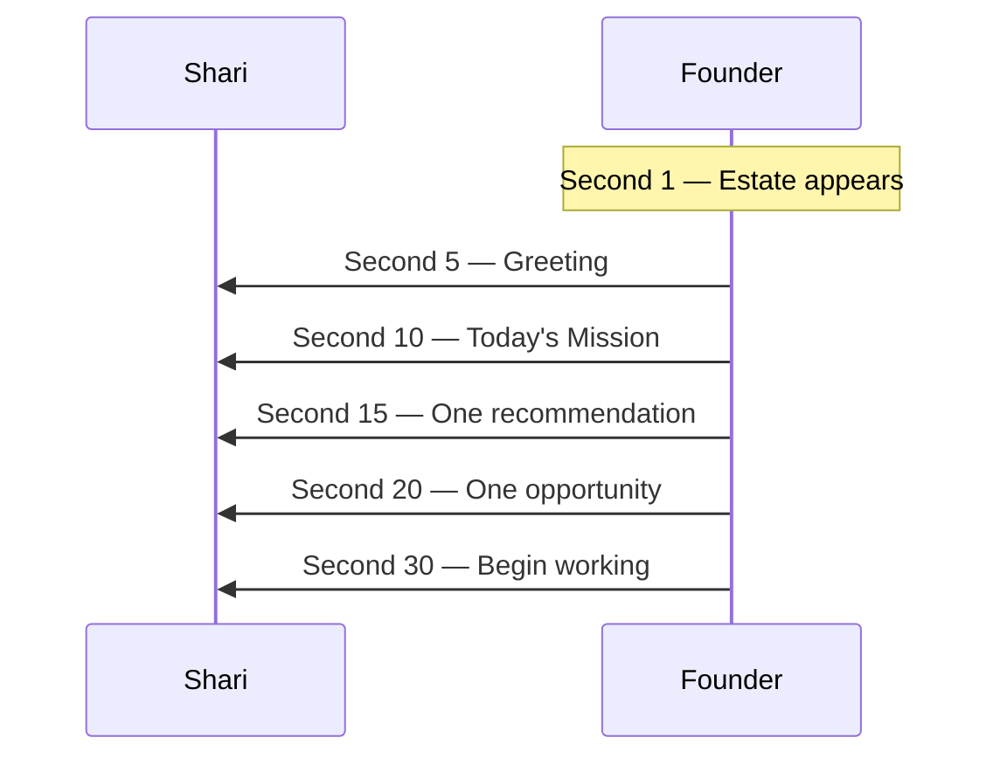

# Founder Experience Manifesto™

**The constitution for every Founder screen, sound, and moment**

| | |
|---|---|
| **Status** | Binding — Phase 1: The Executive Experience™ |
| **Audience** | Shari · designers · developers · AI models · anyone touching Founder UI |
| **Parent** | [Founder Master Blueprint™](./FOUNDER_MASTER_BLUEPRINT.md) — strategy and architecture |
| **This document governs** | How Founder *feels* · what appears on screen · what never appears |
| **Phase rule** | No new intelligence · no new architecture · no new rooms — **experience only** |

> **Before designing or building any Founder screen, read this document.**

---

## Why this exists

We have built an exceptional foundation. Intelligence coordinates. Memory compounds. Decisions have lifecycle. The Governor protects attention.

**Phase 1 is not about building more. It is about making Founder feel like the finest executive headquarters ever created.**

Think Apple product unboxing — inevitable, calm, premium.  
Think Four Seasons arrival — warmth without fuss.  
Think Disney Imagineering — every detail serves the story.  
Think a private executive office — beautiful, quiet, prepared.

**The primary goal:** Founder becomes the place Shari genuinely wants to begin every morning.

---

# Section 1 — The Feeling

## When Founder opens, Shari should immediately feel:

### “I’m exactly where I need to be.”

Not in an app. Not in a tool. **At headquarters.**

The visual world should feel like walking into a place that was prepared for her — lights right, desk clear, view beautiful. No login guilt. No “you’re behind.” No feature grid demanding exploration.

The emotional message is **belonging and orientation** — not performance.

### “I know what matters.”

Before Shari thinks, Founder has already done the invisible work:

- What changed overnight  
- What connects to today’s mission  
- What can wait  

She should never wonder: *Where do I start?* or *What did I forget?*

The screen should communicate **priority without shouting**.

### “I’m prepared.”

Research summarized. Decisions framed. Next steps drafted — quietly, in the background.

Shari should feel the way a CEO feels when a great chief of staff says: *“I’ve got the briefing ready when you want it.”*

Not: *“Here are 47 notifications.”*

### “I can do this.”

Founder never implies inadequacy. Never counts days away. Never uses streaks, scores, or red badges.

The tone is **steady confidence** — the company is complex; Shari is capable.

### “My executive team has already been working.”

Overnight intelligence, awareness, and preparation should feel **present but invisible**.

Shari sees the result — calm clarity — not the machinery.

---

## The emotional palette

| Feel | What it means in practice |
|------|---------------------------|
| **Calm** | No motion for motion’s sake; no alert fatigue |
| **Elegant** | Restraint; every element earns its place |
| **Professional** | Worthy of Visual Spark Studios’ brand |
| **Intentional** | Nothing accidental; nothing decorative-only |
| **Warm** | Human voice; never cold SaaS |
| **Luxury** | Space, typography, time — not gold trim gimmicks |
| **Executive** | Decisions and missions — not tasks and tickets |
| **Focused** | One path forward visible; depth on request |
| **Simple** | Complexity hidden; clarity visible |

**Never:** cluttered · overwhelming · childish · “AI”

---

# Section 2 — The First 30 Seconds

Every morning follows the same **arrival choreography**. Predictability reduces cognitive load.

| Second | What happens | What Shari sees / hears |
|--------|--------------|-------------------------|
| **1** | Office loads | Full-bleed Estate scene — beautiful, still. No spinner language. No “Loading modules.” The place simply appears. |
| **5** | Greeting | One warm line — time-aware, mission-aware. Example tone: *“Good morning. It’s a clear day at headquarters.”* |
| **10** | Today’s Mission | **One** active mission name and one sentence of purpose. Not a mission list. |
| **15** | One recommendation | Governor’s primary recommendation — plain English, confident, humble. |
| **20** | One opportunity | **One** opportunity worth knowing — optional depth behind “Show me more.” |
| **30** | Begin working | Input or primary action visible. Shari can speak, type, or tap one obvious next step. |

## What does NOT happen in the first 30 seconds

- No dashboard tiles  
- No notification drawer  
- No “What would you like to do?” menu with twelve choices  
- No tutorial overlay  
- No competing cards animating in  
- No technical status (“3 workflows pending”)  



**Nothing else competes for attention.**

---

# Section 3 — The Rule of One

Founder never leads with volume.

## Never lead with

- Ten cards  
- Twenty recommendations  
- Five dashboards  
- Side-by-side panels fighting for focus  

## Always lead with

| Element | Count |
|---------|-------|
| **Mission** | 1 active focus |
| **Recommendation** | 1 primary |
| **Next action** | 1 clear step |

Everything else **exists** — in the library, behind disclosure, in conversation — but does not **compete** on arrival.

**Design test:** Cover the screen except the primary column. Can Shari still know what to do? If no — remove until yes.

---

# Section 4 — The Rule of Three

When lists appear, they are **short by default**.

| Category | Maximum visible without asking |
|----------|-------------------------------|
| Opportunities | 3 |
| Decisions | 3 |
| Risks | 3 |
| Waiting items | 3 |
| Priorities | 3 |

**“Show me everything”** is always available — never the default.

Copy when more exists: *“Three more are waiting in the library when you want them.”*

---

# Section 5 — Progressive Disclosure

Every information surface follows the same depth ladder:

```
Executive Summary
        ↓
   Show Me More
        ↓
      Evidence
        ↓
   Full History
```

## Layer rules

| Layer | Purpose | Tone |
|-------|---------|------|
| **Executive Summary** | Decision-quality in one breath | One short paragraph or three bullets max |
| **Show Me More** | Context for judgment | Still plain English |
| **Evidence** | Sources, data, links | Available; never forced |
| **Full History** | Lineage, prior decisions, memory | For trust and audit — rare daily use |

**Never** open on Evidence or Full History.  
**Never** hide that deeper layers exist — use invitation, not surprise.

---

# Section 6 — Executive Language

Founder speaks like a **thoughtful executive partner** — someone who has worked with Shari for years.

## Voice is

- Plain English  
- Professional  
- Warm  
- Confident  
- Honest about uncertainty  

## Voice is not

- AI assistant (“Great question!”)  
- Chatbot (“Here’s a breakdown of…”)  
- Technical (“Context switched to mission_id…”)  
- Corporate (“Leverage synergies”)  
- Alarmist (“Urgent: action required”)  

## Examples

| Instead of… | Say… |
|-------------|------|
| “There are multiple pending workflow opportunities.” | “I found three things that could move the business forward today.” |
| “Your context has changed.” | “Because you’re focusing on Listening Rooms today, I’ve prepared everything related to that mission.” |
| “Error: fetch failed.” | “Something got tangled for a second — I’m still here.” |
| “You have 12 overdue tasks.” | “A few items are waiting — want to look at one?” |
| “AI recommends…” | “I’d suggest…” or “One path worth considering…” |
| “Optimize your workflow.” | “This might save you time this week.” |

## The Shari test (copy)

> Would Shari say this out loud to a colleague across the desk?

If no — rewrite.

---

# Section 7 — The Estate Experience

The Estate is **not decoration**. It changes how Shari thinks.

Each place has purpose, tone, situation, and atmosphere.

| Place | Purpose | Emotional tone | When recommended | Visual atmosphere |
|-------|---------|----------------|------------------|-------------------|
| **Round Table** | Strategic dialogue; major choices | Warm, serious, collegial | Big decisions; advisory review | Rich wood, soft light, sense of gathering |
| **Observatory** | Long view; patterns over time | Quiet, wonder, patience | Quarterly review; weak signals | Height, sky, stillness — perspective |
| **Library** | Research depth | Scholarly, calm, focused | Research For Me; evidence work | Books, warm lamps, intellectual refuge |
| **Greenhouse** | Incubating fragile ideas | Hopeful, gentle, patient | Early concepts not ready to launch | Glass, growth, soft green, morning light |
| **Coffee House** | Informal thinking | Relaxed, human, unhurried | Brainstorm; Think With Me | Steam, murmur, comfort — creativity loosens |
| **Listening Rooms** | Member empathy; product soul | Intimate, respectful, attentive | Customer intelligence; mission work | Soft seating, acoustic warmth, “hearing” |
| **Reflection Garden** | Restoration; integration | Peaceful, grounding, slow | After intensity; weekly reflection | Nature, open sky, unhurried paths |
| **Innovation Studio** | Prototyping; building | Curious, energizing, precise | Build Something; technical bets | Clean work surfaces, tools visible but ordered |

**Estate rule:** Invitation only — *“The Library might be peaceful for this.”* Never *“Opening Library module…”*

Scene is always hero (≥70% visual weight). UI floats — never dashboard-over-wallpaper.

---

# Section 8 — Calm Intelligence

Founder hides complexity by default.

Before showing anything, ask:

| Question | If “no” → hide or defer |
|----------|-------------------------|
| **Does Shari need this now?** | Wait |
| **Can it wait?** | Library / background |
| **Should it stay hidden?** | Silent preparation only |
| **Can this be prepared automatically?** | Prepare; don’t interrupt |

## Practices

- **Governor coordinates** — one voice, no competing system alerts  
- **Awareness notices** — only significant change surfaces  
- **Rule of One / Three** — enforced in layout, not only in logic  
- **No progress guilt** — preparation is invisible; results are calm  

**Member ease wins:** If showing it makes morning harder — it does not ship.

---

# Section 9 — Executive Delight

Delight is **quiet luxury** — not gamification.

## Appropriate delight

| Moment | How it feels |
|--------|--------------|
| **Mission completed** | A single beautiful acknowledgment — flowers on the desk, not confetti |
| **Seasonal Estate** | Subtle atmosphere shift — autumn light, winter hearth — discovered, not announced |
| **Anniversary reflections** | *“One year ago today you decided…”* — warm, brief, optional |
| **Quiet celebration** | Bell, note, or visual pause — earned, rare |
| **Progress recognition** | *“Listening Rooms moved forward this week.”* — fact, not hype |

## Never

- Streaks · badges · points · leaderboards  
- Cartoon animation · arcade sounds  
- “Amazing job!” performance praise  
- Surveillance (“We noticed you haven’t…”)  

**Delight should feel like someone cared — not like software cheered.**

---

# Section 10 — The Shari Experience

Everything respects how Shari naturally works.

## Who Shari is

- An **experienced executive** — not a beginner to be trained  
- A **late-diagnosed ADHD entrepreneur** — executive function is precious  
- **Creative and visual** — beauty matters; clutter hurts  
- **Easily overwhelmed by clutter** — density is the enemy  
- **Excited by possibility** — needs hope, not fear  
- **Needs clarity** — one path, plain words  
- **Needs encouragement** — steady, never patronizing  
- **Needs simplicity** — fewer decisions, not more features  

## Design implications

| Need | Founder response |
|------|------------------|
| Clarity | Rule of One; progressive disclosure |
| Low overwhelm | Rule of Three; calm mornings |
| Visual thinking | Estate hero; generous whitespace |
| ADHD-friendly EF | One primary action; input always visible |
| Encouragement | Warm copy; progress without guilt |
| Executive respect | No dumbed-down UI; no interrogation |

**The Member Wins™ applies to Shari:** Does this make *her* morning easier?

---

# Section 11 — Accessibility

Beauty and accessibility are not opposites.

## Requirements

| Standard | Application |
|----------|-------------|
| **Large typography** | Executive copy readable at a glance — no squinting |
| **Excellent spacing** | Breathing room between ideas — clutter reads as noise |
| **Minimal decisions** | One primary action per screen |
| **Minimal clicks** | Depth on request — not depth by default |
| **Large targets** | Tap and click areas generous |
| **Visual hierarchy** | One hero element; supporting text recedes |
| **High readability** | Contrast on glass; no pale gray on busy backgrounds |

**Never sacrifice beauty** — accessibility is part of premium, not an afterthought.

Reference: Frosted workspace typography minimums (Shari messages 30–36px desktop) where conversation appears.

---

# Section 12 — Design Principles

## Founder should always feel

**Professional · Premium · Beautiful · Executive · Organized · Thoughtful · Intentional · Comfortable · Hopeful · Focused**

## Founder should never feel

**Busy · Loud · Technical · Overwhelming · Corporate · Cold · Generic**

## Quick reference card

```
✓  One mission · one recommendation · one next step
✓  Estate scene is the hero
✓  Plain English · warm · confident
✓  Depth behind “Show me more”
✓  Preparation invisible · clarity visible

✗  Dashboards · tile walls · notification centers
✗  “AI” voice · technical errors · guilt copy
✗  Ten cards on arrival · feature menus
✗  Childish delight · streaks · surveillance
```

---

# Section 13 — The Test

**Every future feature must answer yes to at least one — ideally several:**

| Question | Pass criterion |
|----------|----------------|
| **Does this reduce mental effort?** | Fewer things to hold in head |
| **Does this save time?** | Less searching, re-explaining, re-deciding |
| **Does this reduce decisions?** | Fewer forks on the critical path |
| **Does this increase clarity?** | Shari knows what matters and what’s next |
| **Does this feel luxurious?** | Worthy of a private executive office |
| **Does this help Shari create?** | Momentum on missions — not busywork |

**If the answer is no across the board — it does not belong in Phase 1 or any future Founder screen.**

---

## Relationship to other canon

| Document | Relationship |
|----------|--------------|
| [Founder Master Blueprint™](./FOUNDER_MASTER_BLUEPRINT.md) | Strategy, departments, intelligence — **why** |
| **This Manifesto** | Screens, mornings, copy, Estate feel — **how it should feel** |
| Spark Estate Constitution | Places and objects — Estate canon wins on place names |
| Relationship Constitution | Emotional safety — all copy passes Shari test |
| Calm Intelligence™ (architecture) | Rule of One/Three — this manifesto enforces in UI |

---

## Phase 1 scope reminder

| In scope | Out of scope |
|----------|--------------|
| This document | New intelligence systems |
| Future UI aligned to manifesto | New architecture modules |
| Experience constitution | New Estate rooms |
| | Screen redesign in this sprint |
| | Components, routes, services |

---

**Version:** 1.0 — Founder Experience Manifesto™  
**Phase:** 1 — The Executive Experience™  
**Established:** 2026  

*When a developer reads this, they should know not only what Founder looks like — but how it should make Shari feel every single morning.*

*Calm. Prepared. Capable. At headquarters.*
