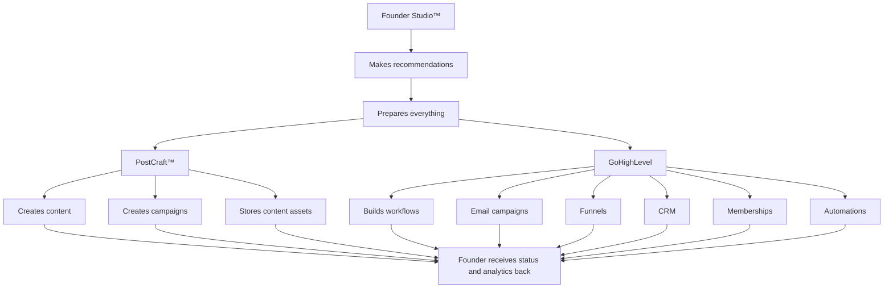

# Founder Studio™ — Marketing Orchestration

**Founder decides · PostCraft creates · GoHighLevel delivers**

| | |
|---|---|
| **Status** | Binding — V1 architecture |
| **Parent** | [FOUNDER_V1.md](./FOUNDER_V1.md) · [IMPLEMENTATION_ROADMAP.md](./IMPLEMENTATION_ROADMAP.md) Phase 2 |
| **UI** | `/companion/founder/executive-integration-center` |
| **Code** | `lib/executiveIntegration/marketingOrchestration.ts` |

---

## The flow

Founder Studio does not replace PostCraft or GoHighLevel. Founder **recommends**, **prepares**, and **coordinates** — then receives status and analytics back.

```
Founder Studio™
        │
        ▼
Makes recommendations
        │
        ▼
Prepares everything
        │
        ├────────► PostCraft™
        │             Creates content
        │             Creates campaigns
        │             Stores content assets
        │
        └────────► GoHighLevel
                      Builds workflows
                      Email campaigns
                      Funnels
                      CRM
                      Memberships
                      Automations
                ▼
Founder receives status and analytics back.
```

---

## Mermaid (implementation reference)



---

## Roles (non-negotiable)

| Layer | Responsibility | Never |
|-------|----------------|-------|
| **Founder Studio™** | Judgment, preparation, permission, orchestration, morning clarity | Auto-publish · auto-send · duplicate dashboards |
| **PostCraft™** | Content creation, campaigns, asset storage | Decide strategy alone |
| **GoHighLevel** | Delivery — workflows, email, funnels, CRM, memberships, automation | Launch without Founder approval |

---

## What returns to Founder

| Source | Status & analytics |
|--------|-------------------|
| **PostCraft** | Content queue · campaign drafts · performance signals · asset readiness |
| **GoHighLevel** | Workflow status · funnel progress · email results · CRM segments · membership state |

Founder surfaces **what changed** and **what deserves attention** — not raw tool dashboards.

---

## Integration Center actions (V1)

| System | Founder prepares | Opens |
|--------|------------------|-------|
| PostCraft | Send content · import analytics | Ecosystem dashboard / Creation Studio |
| GoHighLevel | Funnel · email workflow · import campaign results | GHL dashboard |

Live connection: `/api/ecosystem/dashboard/status`.

---

## Permission rule

**Preparation is automatic. Execution requires Shari.**

Drafts, workflows, and campaigns wait in queue until approved. Nothing launches from PostCraft or GHL without explicit consent.

---

## Related documents

- [EXECUTIVE_EXECUTION_SYSTEM.md](./EXECUTIVE_EXECUTION_SYSTEM.md) — decision to execution  
- [GITHUB_ROADMAP.md](./GITHUB_ROADMAP.md) — M2 Executive Integrations  
- [NO_FEATURE_CREEP.md](./NO_FEATURE_CREEP.md) — no third marketing dashboard  
