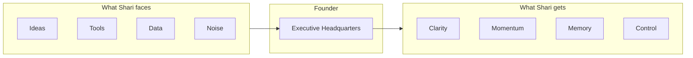
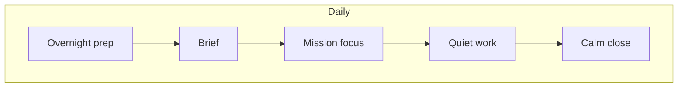
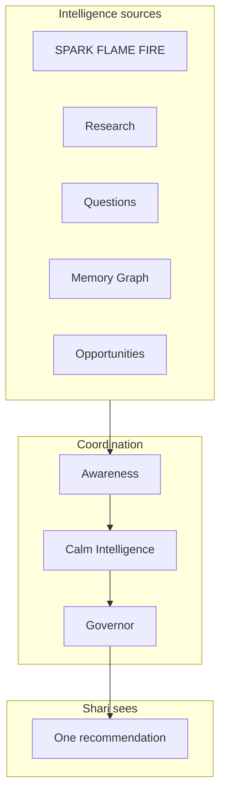
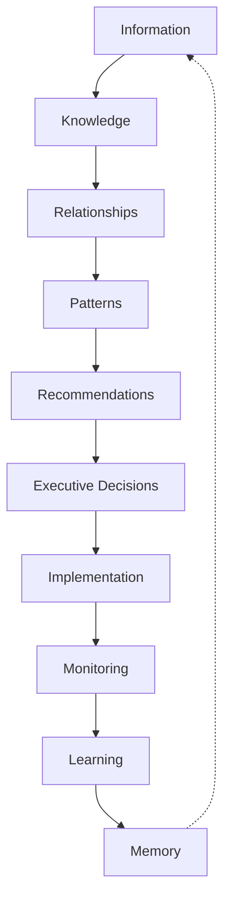
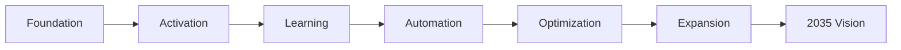

# Founder Master Blueprint™

**The single source of truth for Visual Spark Studios**

| | |
|---|---|
| **Status** | Binding design authority |
| **Audience** | Shari · future team · developers · AI models · strategic partners |
| **Supersedes** | Feature-first thinking · dashboard thinking · “just add a module” thinking |
| **Does not replace** | Spark Estate Constitution · Relationship Constitution · Intelligence Registry (engineering) |
| **When in conflict** | This document wins on *why* and *experience*; canon wins on *Estate places*; registry wins on *data shapes* |

> **Read this before building anything in Founder.**

---

## How to use this document

- **Before a feature:** Does it align with the Founder Promise (Section 2) and Executive Control Principle (Section 11)?
- **Before copy:** Does it pass the Shari Rule (Section 12)?
- **Before intelligence work:** Does it flow through Awareness → Governor (Sections 7–8)?
- **Before a new room:** Does it earn its existence (Section 4)?

---

# Section 1 — The Vision

## What is Founder?

**Founder is the Executive Headquarters for Visual Spark Studios.**

It is not an app you “use.” It is where Shari arrives to run the company — calmly, clearly, and in control.

Founder is the executive layer of the Spark ecosystem. It sits above tools. It connects them. It remembers what they forget. It speaks in plain English. It protects attention. It turns information into decisions, and decisions into prepared work — always with Shari in command.

## What problem does it solve?

Running Visual Spark Studios creates an impossible load:

- Too many ideas, not enough clarity  
- Too many tools, not enough connection  
- Too much information, not enough wisdom  
- Too many decisions, not enough calm  

Founder exists so Shari never has to hold the whole company in her head.

## Why does it exist?

Spark’s mission is entrepreneurial transformation — for members and for the studio itself. Founder is how the studio practices what it teaches: calm capability, clear decisions, compounding wisdom.

**Founder exists so the company can grow without Shari drowning.**

## How Founder is different

| It is NOT… | Founder IS… |
|------------|-------------|
| **AI chat** | A long-term executive partner that remembers, connects, and prepares — conversation is one door, not the whole building |
| **A dashboard** | One trusted morning surface — not fifty tiles competing for attention |
| **Project management** | Mission-centered executive work — projects serve strategy, not the other way around |
| **Business software** | An experience that feels like a luxury executive office — not SaaS clutter |
| **ChatGPT** | *Your* company’s intelligence — institutional memory, decision history, relationships, and Spark context ChatGPT will never have |

## The one-sentence vision

> **Founder is the Executive Headquarters where Visual Spark Studios thinks, decides, builds, and remembers — calmly.**

---

# Section 2 — The Founder Promise

## Founder always

| Promise | What it means for Shari |
|---------|-------------------------|
| **Reduces cognitive load** | Fewer decisions about *what to look at* |
| **Protects attention** | Nothing important is lost; nothing unimportant shouts |
| **Explains clearly** | Plain English — always |
| **Provides options** | Real choices, honestly framed |
| **Recommends one path** | One primary recommendation; the rest wait |
| **Prepares implementation** | Drafts, checklists, research — behind the scenes until you ask |
| **Remembers everything important** | Institutional memory — not “where did I put that?” |
| **Learns continuously** | Quieter and wiser over time — not louder |
| **Keeps the Founder in control** | Spark suggests; Shari decides |

## Founder never

| Never | Why |
|-------|-----|
| **Overwhelms** | Overwhelm destroys executive function — the product’s enemy |
| **Interrupts unnecessarily** | Interruption is expensive; silence is often correct |
| **Makes meaningful business decisions** | Shari is the hero; Founder illuminates |
| **Publishes without approval** | Trust dies in one unauthorized send |
| **Executes without approval** | Preparation yes; action only with permission |
| **Forgets history** | Duplicated work is a tax on the studio |
| **Duplicates work** | One lineage, one truth — not copies everywhere |

---

# Section 3 — The Executive Experience

## The first 30 seconds every morning

1. **Arrival** — Founder feels like walking into a beautiful executive office, not opening software.  
2. **Orientation** — One calm greeting. No dashboard. No interrogation.  
3. **One thing** — The Governor has already coordinated overnight intelligence into **one primary recommendation**.  
4. **Permission** — “Would you like to go deeper?” — never forced depth.

**Example morning opening (tone, not fixed copy):**

> “Good morning. Listening Rooms moved forward yesterday. One decision is waiting when you’re ready. Everything else can wait.”

## After opening Founder

- The **Executive Brief** is available — summary first, detail on request.  
- **Missions** sit at the center — what the company is building *now*.  
- **Estate atmosphere** supports the work (coffee house for conversation, library for research) — optional, never required.  
- **Conversation** continues wherever Shari was — never resets because the “room” changed.

## How Founder greets Shari

- Warm, professional, unhurried.  
- No “Welcome back! We missed you!” surveillance.  
- No streaks, scores, or guilt.  
- Acknowledges reality: energy, season, what’s active.

## How recommendations are presented

**Rule of One · Rule of Three**

| Layer | Limit |
|-------|-------|
| Primary recommendation | **1** |
| Supporting items | **3** max |
| Everything else | Library / background |

Recommendations pass through:

1. **Awareness** — did something meaningful *change*?  
2. **Calm Intelligence** — does Shari need this *today*?  
3. **Governor** — one voice, no competing systems.

## How work begins

Shari chooses an **experience**, not a module:

- Build Something  
- Think With Me  
- Help Me Decide  
- Research For Me  
- Launch Something  
- Review My Company  
- Teach Me  
- Quiet Work  

Each experience has one purpose, one tone, one outcome.

## Missions at the center

A **mission** is what the company is intentionally building (e.g., Listening Rooms). Founder orbits the active mission:

- Decisions link to missions  
- Research serves missions  
- Opportunities rank against missions  
- Memory remembers missions  

## How the Estate contributes

The Estate is **atmosphere and depth** — not navigation homework.

- Conversation is home; rooms are optional destinations.  
- Founder may *invite*: “The Library might be peaceful for this research.”  
- Shari may always stay where she is.

## Emotional target

Founder should feel:

**Calm · Prepared · Intentional · Professional · Beautiful · Comfortable · Executive · Hopeful · Focused**

Never: frantic, guilty, behind, or like operating software.

---

# Section 4 — The Estate

Every Founder Estate space must answer: **Why does this place exist?**

Places are **experiences**, not menu items.

| Place | Purpose | Thinking style | Emotional tone | When recommended | Example use |
|-------|---------|----------------|----------------|------------------|-------------|
| **Round Table** | Strategic dialogue; big decisions in the open | Collaborative, multi-perspective | Warm, serious, equal | Choosing between major paths; advisory review | “Should we pivot the workshop model?” |
| **Coffee House** | Informal thinking; creative looseness | Conversational, exploratory | Relaxed, human, unhurried | Brainstorming; Think With Me | Morning clarity before structure |
| **Listening Rooms** | Product soul; member empathy | Empathic, qualitative | Intimate, respectful | Customer intelligence; mission work | Reviewing member feedback patterns |
| **Observatory** | Long-range view; patterns over time | Panoramic, patient | Quiet, wonder | Quarterly review; weak signals | “What’s emerging in the market?” |
| **Library** | Research depth; evidence | Analytical, thorough | Scholarly, calm | Research For Me; due diligence | Competitor scan before launch |
| **Greenhouse** | Ideas incubating; fragile early growth | Nurturing, experimental | Hopeful, gentle | New concepts not ready for decisions | Seed content or product experiments |
| **Reflection Garden** | Restoration; integration after intensity | Reflective, slow | Peaceful, grounding | After launch, hard week, burnout risk | Weekly reflection without KPIs |
| **Innovation Lab** | Prototyping; “what if” | Playful, rigorous | Curious, energizing | Build Something; technical bets | Cursor/GitHub experiment planning |
| **Music Conservatory** | Creative craft; rhythm and refinement | Aesthetic, iterative | Inspiring, focused | Content creation; PostCraft campaigns | Shaping a workshop narrative |
| **Pool** | Lightness; mental reset | Diffuse, associative | Refreshing, unguarded | Recovery; stuck on a problem | Step away without leaving Founder |
| **Walking Paths** | Movement thinking; clarity through motion | Kinesthetic, sequential | Open, steady | Decision fatigue; need perspective | Talk-through while “walking” |
| **Treasure Room** | Wins, artifacts, proof of progress | Celebratory, archival | Proud, warm | Celebration; investor story; morale | Rediscover a forgotten win |
| **Cabinet of Chapters** | Narrative of the studio; eras and themes | Story-driven, longitudinal | Reflective, meaningful | Annual review; legacy; brand story | “How did we become this company?” |

**Estate rule:** If a place cannot be recommended naturally in conversation, it is not finished.

---

# Section 5 — The Executive Departments

Founder is organized as **departments**, not software modules.

| Department | Purpose | Inputs | Outputs | Responsibilities | Future integrations |
|------------|---------|--------|---------|------------------|---------------------|
| **Research** | Turn questions into evidence | Questions, market signals, member feedback | Summaries, citations, briefs | Overnight research, Library experience | Analytics, web research, Institute |
| **Strategy** | Clarify direction and tradeoffs | Missions, opportunities, advisory council | Options, recommendations | SPARK, FLAME, Round Table | Roadmap, scenario planning |
| **Creation** | Prepare builds and content | Decisions, briefs, templates | Drafts, outlines, assets | Orchestrator prep, PostCraft | Cursor, GitHub, PostCraft |
| **Marketing** | Reach and resonance | Content, campaigns, avatars | Campaign plans, calendars | GHL, PostCraft publishing | Ads, analytics, social |
| **Operations** | Run the machine reliably | Processes, bottlenecks, team load | Checklists, SOPs, automation candidates | Improvement engine, Orchestrator | GHL, Team Hub, automation |
| **Innovation** | Test what’s next safely | Weak signals, experiments | Experiment records, learnings | Greenhouse, Innovation Lab | Prototypes, Institute |
| **Memory** | Remember what matters | Decisions, lessons, outcomes | Institutional memory entries | Institutional Memory, Intelligence Graph | All systems write here |
| **Learning** | Compound wisdom | Experiments, reviews, mistakes | Lessons, patterns | Improvement, Digital Twin | Institute, competency growth |
| **Customer Intelligence** | Understand members deeply | Listening Rooms, support, analytics | Pain patterns, opportunities | Listening Rooms, Companion signals | CRM, GHL, surveys |
| **Executive Briefing** | Morning clarity | Overnight cycle, awareness | Plain-English brief | Executive Brief, Governor | Email digest (optional, permission) |
| **Performance** | Honest company health | Missions, metrics, departments | Health view, leverage metrics | Executive OS, Review My Company | Analytics, revenue |
| **Team** | Coordinate people | Assignments, approvals | Delegation packages | Orchestrator, Team Hub | Team Hub, GHL |

---

# Section 6 — The Daily Executive Flow

Founder supports Shari’s rhythm — it does not impose one.

## Sample day

| Time | Founder’s role |
|------|----------------|
| **7:30** | Quiet prep already done overnight — nothing demands attention yet |
| **8:00** | **Morning Brief** — one page, plain English; Founder Alerts only if truly significant |
| **9:00** | **Mission work** — one primary recommendation; experience chosen (Build, Decide, Research…) |
| **Noon** | Light touch — waiting items summarized only if asked |
| **Afternoon** | Deep work protected — Quiet Work mode; Governor holds interruptions |
| **Evening** | Gentle close — what was accomplished, where it lives, optional tomorrow preview |

## Weekly

- Mission progress without guilt  
- Improvement opportunities (max 3)  
- Research digest if requested  

## Monthly

- Company review (Review My Company experience)  
- Institutional memory highlights  
- Experiment outcomes  

## Quarterly

- Observatory-style pattern review  
- Strategic missions refresh  
- Roadmap alignment  

## Annual

- Cabinet of Chapters narrative  
- Treasure Room — year in wins  
- 2035 vision check (Section 13)

---

# Section 7 — The Intelligence Layers

Plain English guide to what each layer **does for Shari**.

| Layer | What Shari experiences |
|-------|------------------------|
| **SPARK™** | Orientation — “here’s the landscape” |
| **FLAME™** | Mentoring voice — warm guidance, not lecturing |
| **FIRE™** | Urgency only when truly warranted |
| **Executive Questions™** | The right question at the right time — one at a time |
| **Research™** | Answers without Shari doing the digging |
| **Opportunity Discovery™** | “Something might be worth your attention” — evidence-backed |
| **Memory™** | “We remember — you don’t have to” |
| **Predictive Intelligence™** | Early signals — humble, never certain |
| **Decision Lifecycle™** | Decisions with options, comparison, approval gates |
| **Executive Orchestrator™** | From decision to prepared execution — checklists, assignments, monitoring |
| **Institutional Memory™** | Organizational wisdom — why we chose what we chose |
| **Companion Intelligence Graph™** | Everything connected — missions, research, content, decisions |

**Coordination layers (built as architecture):**

| Layer | Role |
|-------|------|
| **Executive Awareness™** | Notices change before reporting |
| **Calm Intelligence™** | Shows less, helps more |
| **Executive Experience Framework™** | Experiences, not tools |
| **Companion Intelligence Governor™** | One voice — all systems report here |

---

# Section 8 — The Information Flow

How raw life becomes organizational wisdom.

| Stage | What happens | Shari’s experience |
|-------|--------------|-------------------|
| **Information** | Signals arrive — feedback, metrics, conversations | Mostly invisible |
| **Knowledge** | Research and synthesis | “Here’s what we found” |
| **Relationships** | Ideas linked to missions, people, products | “This connects to Listening Rooms” |
| **Patterns** | Repeated themes observed | “This keeps showing up” |
| **Recommendations** | Governor selects what matters | One primary path |
| **Executive Decisions** | Options compared; Shari chooses | Clear, owned decisions |
| **Implementation** | Orchestrator prepares execution | Checklists — not chaos |
| **Monitoring** | Progress without nagging | Calm status when asked |
| **Learning** | What worked, what didn’t | Lessons captured |
| **Memory** | Institutional Memory updated | Never lost; never duplicated |

---

# Section 9 — The Product Ecosystem

Founder is the hub — not the whole universe.

| Product | Founder’s relationship | Responsibilities |
|---------|------------------------|------------------|
| **Spark Companion™** | Member-facing home; emotional intelligence upstream | Member insights feed Customer Intelligence; never merged with Founder UI |
| **PostCraft™** | Creation and publishing arm | Campaign drafts, content calendar; publish only with approval |
| **GoHighLevel** | Operations and marketing automation | Contacts, workflows; Founder proposes, Shari approves |
| **Cursor** | Building tool | Innovation Lab execution; code stays in dev world |
| **GitHub** | Source of truth for software | Release tracking; Orchestrator links launches |
| **Analytics** | Evidence input | Performance department; never dashboard-first |
| **Team Hub™** | People coordination | Assignments from Orchestrator |
| **Future products** | Register in ecosystem map before build | Must declare inputs/outputs to Founder |

**Rule:** Founder coordinates; it does not replace specialized tools. It makes them feel like one company.

---

# Section 10 — The Executive Design Principles

## Founder should feel like

- A **luxury executive office** — beautiful, calm, worthy of important work  
- A **trusted chief of staff** — prepared, discreet, competent  
- A **thoughtful executive coach** — curious, honest, never condescending  
- A **research department** — thorough, cited, humble  
- A **strategy consultant** — options and tradeoffs, not dogma  
- A **project coordinator** — quiet preparation behind the scenes  

## Founder should never feel like

- A **dashboard** — tiles, KPI walls, alert fatigue  
- A **cluttered app** — menus, modules, feature grids  
- A **chatbot** — generic AI voice, lists, “Great question!”  
- A **notification center** — pings, badges, guilt  

**Photograph test (from Estate canon):** Could this frame hang on a wall — and still feel like somewhere you would want to work?

---

# Section 11 — The Executive Control Principle

**Permanent. Non-negotiable.**

## Founder may automate

- Organizing information  
- Linking related items  
- Drafting internal prep documents  
- Scheduling *proposals* (not final sends)  
- Monitoring progress signals  
- Remembering and indexing  

## Founder may prepare

- Research summaries  
- Decision comparisons  
- Implementation checklists  
- Campaign drafts  
- ROI estimates  
- Experiment designs  

## Founder may monitor

- Mission progress  
- Launch readiness  
- Bottleneck patterns  
- Weak signals  

## Founder must never execute without approval

| Action | Rule |
|--------|------|
| Publish content | Permission required |
| Send email/SMS to customers | Permission required |
| Charge money / change pricing | Permission required |
| Deploy code to production | Permission required |
| Delete institutional memory | Permission required |
| Final business decision | **Shari only** |
| Contractual commitments | **Shari only** |

**Default:** Prepare freely · Act with permission.

---

# Section 12 — The Shari Rule

Every piece of Founder-facing intelligence must answer:

| Question | Plain English standard |
|----------|------------------------|
| **What happened?** | One calm sentence of fact |
| **Why should I care?** | Business or human impact — no hype |
| **How does this affect Spark?** | Connection to mission, members, revenue, trust |
| **What do you recommend?** | One primary recommendation |
| **What are my options?** | Honest choices — usually ≤ 3 |
| **What should we do?** | Suggested next step — Shari decides |

**Assume no technical background.** If it sounds like software, rewrite it.

**Banned in member/founder experience:** “Error” · “Failed” · “Optimize” · “You must” · dashboard jargon.

---

# Section 13 — The 2035 Vision

## Five years (2030)

- Founder knows Visual Spark Studios the way a great COO would — patterns, people, products, seasons  
- Overnight intelligence is genuinely useful most mornings — not noise  
- Institutional Memory makes re-explaining the past rare  
- New team members onboard through Founder’s narrative — Cabinet of Chapters for the company  
- Member intelligence and studio intelligence remain ethically separated but strategically aligned  

## Ten years (2035)

- Founder is **irreplaceable** not because of AI tricks — because of **relationship, memory, and wisdom** compounded for a decade  
- The Intelligence Graph is the studio’s living map — decisions traceable, lessons inherited  
- Automation handles routine operations; Shari’s time goes to judgment, creativity, and people  
- Founder adapts to Shari’s evolving role (founder → chairman → mentor) without losing history  

## How it learns

- Observes patterns — never labels identity  
- Strengthens what repeats · fades what doesn’t  
- Rule of evidence: one conversation never changes behavior  

## How it becomes wiser

- Every decision leaves a lesson  
- Every launch leaves a review  
- Awareness notices · Governor prioritizes · Memory preserves  

---

# Section 14 — The Competitive Moat

Competitors can copy screens. They cannot copy:

| Moat | Why it matters |
|------|----------------|
| **Institutional Memory** | A decade of *your* decisions — not generic training data |
| **Relationships** | How ideas, people, and missions connect at Visual Spark |
| **Companion Intelligence Graph™** | Living map — not folders |
| **Continuous learning** | Improvement loop tied to real outcomes |
| **Decision history** | Why you chose — not just what you chose |
| **Organizational wisdom** | Lessons that survive employee turnover |
| **Founder adaptation** | Digital Twin observes *how Shari works* — ethically, humbly |

**The product is not features. The product is compounded executive relationship.**

---

# Section 15 — The Roadmap

Phases — priorities, dependencies, order.

## Phase 1 — Foundation ✅ (architecture complete)

| Deliverable | Status |
|-------------|--------|
| Executive Command Center | Built |
| Decision Lifecycle | Built |
| Orchestrator | Built |
| Institutional Memory + Intelligence Graph | Built |
| Overnight Cycle + Executive Brief | Built |
| Executive OS | Built |
| Calm Intelligence | Built |
| Experience Framework | Built |
| Awareness | Built |
| Intelligence Governor | Built |
| **This Blueprint** | **You are here** |

## Phase 2 — Activation (next)

- Wire Governor to member-facing Founder arrival (no new intelligence — presentation only)  
- Morning Brief as default entry — not dashboard  
- Experience routing from natural language  
- Estate invitations aligned to experiences  

**Depends on:** Foundation  
**Blocks:** Learning phase quality

## Phase 3 — Learning

- Live Institutional Memory writes from real decisions  
- Improvement experiments with measured ROI  
- Digital Twin refinement from observed patterns (permission-gated)  

**Depends on:** Activation

## Phase 4 — Automation

- Approved GHL workflows from Orchestrator  
- PostCraft publish pipelines with permission gates  
- Monitoring without nagging  

**Depends on:** Learning + Control Principle enforcement

## Phase 5 — Optimization

- Executive Leverage metrics (Section 16)  
- Awareness tuned from real usage  
- Department dashboards **never** — leverage reports in plain English only  

**Depends on:** Automation

## Phase 6 — Expansion

- Team Hub delegation packages  
- Multi-product portfolio view  
- Partner / investor Treasure Room mode  

**Depends on:** Optimization

## Phase 7 — Future Vision (2035)

- Chairman mode · legacy narrative · institute integration  
- Predictive intelligence with humility gates  
- Full ecosystem autoprep — zero autopublish  

---

# Section 16 — The Success Metrics

**Executive Leverage metrics** — how Founder earns its place.

| Metric | What it proves |
|--------|----------------|
| **Time saved** | Hours not spent re-searching, re-explaining, re-deciding |
| **Context switches avoided** | Deep work protected |
| **Decision fatigue reduced** | Fewer low-quality afternoon decisions |
| **Research hours saved** | Overnight and Research department value |
| **Duplicate work prevented** | Memory and Graph working |
| **Automation completed** | Approved workflows actually running |
| **Ideas rediscovered** | Treasure Room / Memory recall |
| **Revenue opportunities found** | Opportunity Discovery hit rate |
| **Customer problems solved** | Listening Rooms → action loop |
| **Founder satisfaction** | “I’d rather open Founder than ChatGPT” |
| **Momentum** | Missions progressing without overwhelm |
| **Learning** | Lessons captured per quarter |

**Never optimize for:** time-in-app, streaks, notification clicks, feature counts.

**Optimize for:** quality of Shari’s next decision.

---

# Appendix A — Alignment map (for developers)

When implementing, align code to this blueprint:

| Blueprint section | Engineering anchor |
|-------------------|-------------------|
| Founder Promise | Spec 100–103, Calm Intelligence, Governor |
| Executive Experience | Experience Framework, Command Center, Brief |
| Estate | T-017, Estate Constitution, Bible |
| Departments | Intelligence Registry engines |
| Information Flow | Awareness → Governor → Decision → Orchestrator → Memory |
| Control Principle | Spec 106 permission gates, Orchestrator approvals |
| Shari Rule | Executive Brief readability, Relationship Constitution |

---

# Appendix B — Document governance

| Change type | Who decides |
|-------------|-------------|
| Wording that affects Shari’s experience | Shari |
| New Estate place | Estate canon + this blueprint |
| New intelligence layer | Must map to Section 8 flow + Registry |
| New department | Must map to Section 5 table |
| Control Principle changes | Shari only — Section 11 is permanent |

**Version:** 1.0 — Founder Master Blueprint™  
**Established:** 2026  
**Next review:** After Activation phase ships

---

*This is the operating manual for the next decade of Visual Spark Studios.*

*When in doubt: reduce cognitive load, protect attention, recommend one path, keep Shari in control.*
