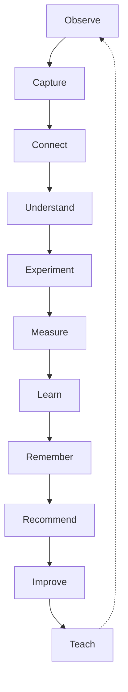

# Learning Organization System™

**Building a company that learns — the compounding layer of Founder**

| | |
|---|---|
| **Status** | Binding — Phase 4: The Learning Organization™ |
| **Audience** | Shari · operators · developers · AI models |
| **Parents** | [Founder Master Blueprint™](./FOUNDER_MASTER_BLUEPRINT.md) · [Founder Experience Manifesto™](./FOUNDER_EXPERIENCE_MANIFESTO.md) · [Executive Execution System™](./EXECUTIVE_EXECUTION_SYSTEM.md) |
| **Activates** | Institutional Memory™ · Continuous Improvement Engine™ · Executive Digital Twin™ · Pattern recognition across the ecosystem |
| **Phase rule** | Every lesson improves the whole company — not isolated features |

> **Founder evolves from helping Shari today… to helping Future Shari become dramatically more successful because of everything learned yesterday.**

---

## Why this exists

Visual Spark Studios creates value every day — launches, conversations, decisions, experiments, recoveries. Without a learning system, that value evaporates. The same mistakes repeat. The same research gets redone. Wisdom stays trapped in memory instead of compounding.

Phase 4 makes learning **organizational**, not personal burden.

**The primary goal:** Every experience should make Visual Spark Studios™ wiser.

**Nothing valuable should ever be forgotten. Everything should become reusable intelligence.**

---

# Section 1 — The Learning Loop

Everything follows **one cycle**. Every completed mission should improve the next one.

```
Observe
    ↓
Capture
    ↓
Connect
    ↓
Understand
    ↓
Experiment
    ↓
Measure
    ↓
Learn
    ↓
Remember
    ↓
Recommend
    ↓
Improve
    ↓
Teach
    ↓
Repeat
```

## How this connects to execution

The [Executive Execution System™](./EXECUTIVE_EXECUTION_SYSTEM.md) ends every initiative with **Review → Remember → Improve**. The Learning Loop is **how** those stages work — and how their output feeds the next initiative.

| Stage | Founder’s job | Shari’s experience |
|-------|---------------|-------------------|
| **Observe** | Awareness, Companion, analytics — quiet watching | “The company is paying attention.” |
| **Capture** | Lessons, decisions, outcomes recorded | “We didn’t lose that.” |
| **Connect** | Link research → product → revenue → lesson | “I see how this fits.” |
| **Understand** | Why it happened — not just what | “That makes sense.” |
| **Experiment** | Small tests before big bets | “We tried before we committed.” |
| **Measure** | Honest outcomes | “We know if it worked.” |
| **Learn** | Distill takeaway | “We got wiser.” |
| **Remember** | Institutional Memory | “We don’t start from zero.” |
| **Recommend** | Evidence-based next time | “Founder knows our history.” |
| **Improve** | Playbooks, checklists, process | “Next time is easier.” |
| **Teach** | Founder Academy moments | “I’m growing, not judged.” |
| **Repeat** | Loop closes; compounding begins | “The company learns itself.” |



**No disconnected intelligence.** Every engine that observes or recommends participates in this loop.

---

# Section 2 — What Should Be Learned

Founder continuously learns from **everything** that happens at Visual Spark Studios.

| Domain | Examples of what compounds |
|--------|---------------------------|
| **Business patterns** | What moves revenue; what drains energy |
| **Founder habits** | When Shari decides best; what creates friction |
| **Customer questions** | Repeated asks from Listening Rooms, Companion |
| **Successful launches** | What preceded wins |
| **Failed launches** | What to never repeat |
| **Marketing performance** | Channels, messages, timing |
| **Content performance** | PostCraft outcomes |
| **Research quality** | What evidence actually changed decisions |
| **Automation effectiveness** | GHL workflows that helped vs. noise |
| **Decision outcomes** | Chosen path vs. result |
| **Product evolution** | How offerings matured |
| **Community interests** | What members gravitate toward |
| **Revenue drivers** | Honest attribution |
| **ADHD insights** | EF-friendly patterns for Shari and members |

**Principle:** If it mattered once, it may matter again. Capture with judgment — not surveillance.

---

# Section 3 — Lesson Capture

Every **completed initiative** triggers a calm lesson capture — not an interrogation.

## The eight questions

| Question | Purpose |
|----------|---------|
| **What worked?** | Repeatable success |
| **What surprised us?** | Update mental models |
| **What failed?** | Honest post-mortem |
| **What should never happen again?** | Hard boundaries |
| **What should become our standard practice?** | Norms |
| **What should become a checklist?** | Executive Execution prep |
| **What should become an automation?** | GHL / workflow candidate |
| **What should become institutional knowledge?** | Permanent memory |

## Capture rules

- **Short beats long** — a paragraph can be enough  
- **Permission before permanent** — same trust as Companion Memory  
- **No shame** — failures are data, not verdicts  
- **Link to mission** — lessons attach to work, not float orphaned  

**Alignment:** Executive Execution reviews · Institutional Memory · Continuous Improvement Engine.

---

# Section 4 — The Playbook Engine

Founder gradually builds **playbooks** — reusable guides so the second time is dramatically easier than the first.

## Example playbooks

| Playbook | What it encodes |
|----------|-----------------|
| **Product Launch** | Sequence, gates, measurement |
| **Workshop** | Prep, delivery, follow-up |
| **Course Creation** | Momentum Institute patterns |
| **Podcast** | Production and promotion |
| **Research** | Sources, synthesis, decision handoff |
| **Customer Interview** | Listening Room discipline |
| **Social Media** | PostCraft rhythms |
| **Onboarding** | Member first wins |
| **Hiring** | When team grows |
| **Recovery** | Burnout, pivot, failed launch |

## How playbooks grow

1. Initiative completes → lesson capture  
2. Repeated pattern detected → draft playbook section  
3. Shari reviews → **Approved** playbook version  
4. Next initiative → Executive Work Packet includes relevant playbook  

**Everything should become easier next time.** Not more complex — more prepared.

---

# Section 5 — Pattern Recognition

Over time, Founder recognizes **repeated evidence** — tentatively, ethically, never as labels.

| Pattern type | Example signal |
|--------------|----------------|
| **Repeated customer questions** | Same confusion three launches in a row |
| **Repeated founder struggles** | Decision fatigue before big workshops |
| **Repeated implementation delays** | Scope creep on feature X |
| **Repeated marketing success** | Story-led emails outperform |
| **Repeated launch failures** | Shipping without measurement plan |
| **Repeated opportunities** | Adjacent product interest |
| **Repeated bottlenecks** | Approval waiting on one artifact |
| **Repeated energy patterns** | Momentum after morning deep work |

## How patterns surface

- **Observations**, not conclusions — Shari confirms  
- **Rule of Three** — pattern before recommendation change  
- **Governor** — one primary insight when it matters today  
- **Never surveillance tone** — hospitality always  

**Everything becomes evidence.** Wisdom grows from patterns Shari recognizes as true.

---

# Section 6 — Executive Wisdom

Founder distinguishes four levels. **Strive for wisdom — not information overload.**

```
Information
    ↓
Knowledge
    ↓
Experience
    ↓
Wisdom
```

| Level | Definition | Founder behavior |
|-------|------------|------------------|
| **Information** | Raw facts, metrics, feeds | Collect quietly; rarely show |
| **Knowledge** | Organized, connected facts | Summarize when asked |
| **Experience** | “We tried this; here’s what happened” | Attach to decisions and playbooks |
| **Wisdom** | “Given our history, this is the thoughtful path” | One recommendation with evidence |

## Anti-patterns

| Wrong | Right |
|-------|-------|
| Dumping dashboards | One insight with context |
| More data = better | Right depth for the decision |
| AI certainty | Honest confidence levels |
| Remembering everything | Remember what reduces future effort |

**Manifesto alignment:** Rule of One · Calm mornings · Future Shari wins.

---

# Section 7 — The Recommendation Evolution

Recommendations should **compound** — each year more grounded in Visual Spark Studios’ real history.

| Era | What Shari hears |
|-----|------------------|
| **Year 1** | “Here’s a sound general approach.” |
| **Year 2** | “Last three launches suggest…” |
| **Year 3** | “Given your rhythm and member response…” |
| **Year 5** | “Based on the last 37 launches, this approach consistently produces the best results for Visual Spark Studios.” |

## What makes evolution possible

- Decision history preserved  
- Outcomes linked to choices  
- Playbooks versioned  
- Failed paths remembered — not erased  
- Governor still delivers **one** primary recommendation  

**Competitors can copy a feature. They cannot copy your recommendation history.**

---

# Section 8 — The Business Playbook

Every department gradually develops a **living playbook** — not a dusty PDF.

| Component | Purpose |
|-----------|---------|
| **Best practices** | What we do on purpose |
| **Templates** | Starting points — not cages |
| **Checklists** | Nothing important forgotten |
| **Lessons** | Short captures from real work |
| **Examples** | Proof from our studio |
| **Case studies** | Deeper stories when useful |
| **Mistakes to avoid** | Hard-won boundaries |
| **Future improvements** | Honest next bets |

## Departments (Master Blueprint alignment)

Strategy · Product · Marketing · Content · Operations · Customer Intelligence · Innovation · Research · Finance · Team · Founder Development

Each department playbook **connects** — product lessons inform marketing; customer questions inform research.

**Everything becomes reusable.** Shari approves what graduates from draft lesson to official practice.

---

# Section 9 — The Knowledge Network

Nothing exists alone. Founder maintains a **living graph** of how work connects.

```
Research
    ↓
Customer Questions
    ↓
Products
    ↓
Content
    ↓
Marketing
    ↓
Revenue
    ↓
Lessons
    ↓
Future Recommendations
```

## Why the network matters

| Isolated | Connected |
|----------|-----------|
| “We published a post” | “This post answered a question we heard five times — it drove trial signups” |
| “Launch failed” | “Launch failed — we skipped the research step that succeeded last time” |
| “New idea” | “New idea — similar to 2024 experiment; here’s what we learned then” |

**Engineering alignment:** Living Intelligence Graph · Institutional Memory links · lineage (`originatedFromId`) · no duplicate copies when ideas evolve.

**Member parallel:** Spark teaches entrepreneurs to connect thinking. Founder practices the same discipline for the studio.

---

# Section 10 — The Founder Academy

Founder eventually **teaches** Shari — thoughtfully, never judgmentally.

## Example teaching moments

- *“I’ve noticed something…”*  
- *“Here’s a better way we discovered last quarter…”*  
- *“This pattern has appeared five times.”*  
- *“You’ve become much faster at…”*  
- *“These three habits consistently increase momentum.”*  

## Teaching principles

| Always | Never |
|--------|-------|
| Encouraging | Critical |
| Specific | Vague praise |
| Optional depth | Lecture |
| Celebrates growth | Compares to others |
| Permission to ignore | Pressure to “improve” |

**Tone:** Mentor on the porch — not performance review software.

**Alignment:** Executive Digital Twin™ (observational patterns, no personality labels) · Founder Development department.

---

# Section 11 — Executive Playback

Shari should ask **natural questions** and receive prepared answers from company memory.

## Example playback questions

- *“Show me everything we learned while building Listening Rooms.”*  
- *“What mistakes slowed this launch?”*  
- *“Which marketing ideas consistently perform?”*  
- *“What always delays product releases?”*  
- *“What has made the biggest difference over the last five years?”*  

## Playback experience

| Requirement | Why |
|-------------|-----|
| **Searchable by meaning** | Not filenames |
| **Chronological when helpful** | Story of evolution |
| **Linked evidence** | Trust the answer |
| **Calm presentation** | Brief first; depth on request |
| **No archive guilt** | Learning, not blame |

**Everything becomes searchable.** Playback is how Future Shari inherits Past Shari’s work without re-living it.

---

# Section 12 — The Company Memory

Visual Spark Studios should eventually possess **layered memory** — each type serving a different future need.

| Memory type | Holds |
|-------------|-------|
| **Institutional Memory** | Lessons, norms, what we believe as a company |
| **Decision Memory** | What we chose, why, what happened |
| **Customer Memory** | Questions, outcomes, listening (ethical bounds) |
| **Product Memory** | Evolution, launches, experiments |
| **Marketing Memory** | Campaigns, messages, results |
| **Research Memory** | Sources, syntheses, confidence |
| **Innovation Memory** | Builds, prototypes, technical bets |
| **Operational Memory** | How work actually gets done |

## Memory principles

- **Wiser, not larger** — forget noise; keep signal  
- **Permission for sensitive permanence**  
- **Version history** — evolution, not overwrite  
- **Nothing important disappears**  

**Alignment:** Institutional Memory™ · Business Brain lifecycle · Executive Execution “Remember” stage.

---

# Section 13 — The Shari Rule

Every lesson presented to Shari should answer **six questions** — simply.

| Question | If “no” — incomplete |
|----------|---------------------|
| **Why does this matter?** | Lesson feels like noise |
| **How can we use it?** | Interesting but idle |
| **Should we repeat it?** | Unclear standard |
| **Should we automate it?** | Manual burden returns |
| **Should we teach it?** | Team can’t inherit |
| **Should we change our process?** | Same mistake awaits |

**Explain everything simply.** One paragraph beats a report. Depth available — never forced.

Same spirit as Master Blueprint Shari Rule and Executive Execution Shari Test.

---

# Section 14 — The Competitive Advantage

## What competitors can copy

- Features  
- Layouts  
- Branding  
- Technology  

## What they cannot copy

| Moat | Why it compounds |
|------|------------------|
| **Years of organizational learning** | Time + honesty |
| **Connected institutional memory** | Graph, not folders |
| **Founder-specific knowledge** | Shari’s rhythms respected |
| **Business playbooks** | Proven in your context |
| **Decision history** | Outcomes linked to choices |
| **Customer understanding** | Earned in relationship |
| **Continuous improvement** | Culture encoded in system |

**This becomes the moat.**

Visual Spark Studios already teaches transformation. The Learning Organization is how the **studio** transforms itself — visibly to Shari, invisibly to the market.

---

# Section 15 — The Success Definition

Five years from now, Founder should be able to say:

> **“We have become significantly better because we continuously learned from ourselves.”**

## What must be true

| Stakeholder | Success |
|-------------|---------|
| **The system** | Wiser — better recommendations, richer playbooks |
| **The company** | Faster execution with fewer repeated mistakes |
| **The Founder** | Deeper judgment — evidence, not hype |
| **Shari** | More executive leverage every year |

## What must not be true

- More dashboards  
- More notifications  
- More “you should track…”  
- More complexity disguised as intelligence  

**Every year should increase executive leverage — not cognitive load.**

---

## Document relationships

| Document | Role |
|----------|------|
| [Founder Master Blueprint™](./FOUNDER_MASTER_BLUEPRINT.md) | Strategy, departments, vision |
| [Founder Experience Manifesto™](./FOUNDER_EXPERIENCE_MANIFESTO.md) | How learning *feels* — calm, never surveillance |
| [Executive Execution System™](./EXECUTIVE_EXECUTION_SYSTEM.md) | Review · Remember · Improve in every mission |
| **Learning Organization System™** | How the whole company compounds wisdom |
| Intelligence Registry (internal) | Memory, improvement, profile objects |

## Phase 4 activation map (architecture already built)

| Capability | Location |
|------------|----------|
| Lessons, decisions, experiments | `lib/institutionalMemory/` |
| Opportunities, ROI, reviews | `lib/improvement/` |
| Founder patterns (observational) | `lib/founderProfile/` |
| Signals → recommendations | `lib/awareness/` · `lib/governor/` |
| Execution handoff | `lib/orchestrator/` · `lib/executiveDecision/` |

**Phase 4 work:** Connect experience and workflows to this document — not new isolated intelligence modules.

---

**Version:** 1.0 — Learning Organization System™  
**Phase:** 4 — The Learning Organization™  
**Established:** 2026  

*The operating manual for a company that continuously learns and improves — so nothing valuable is ever lost, and every tomorrow is wiser than yesterday.*
