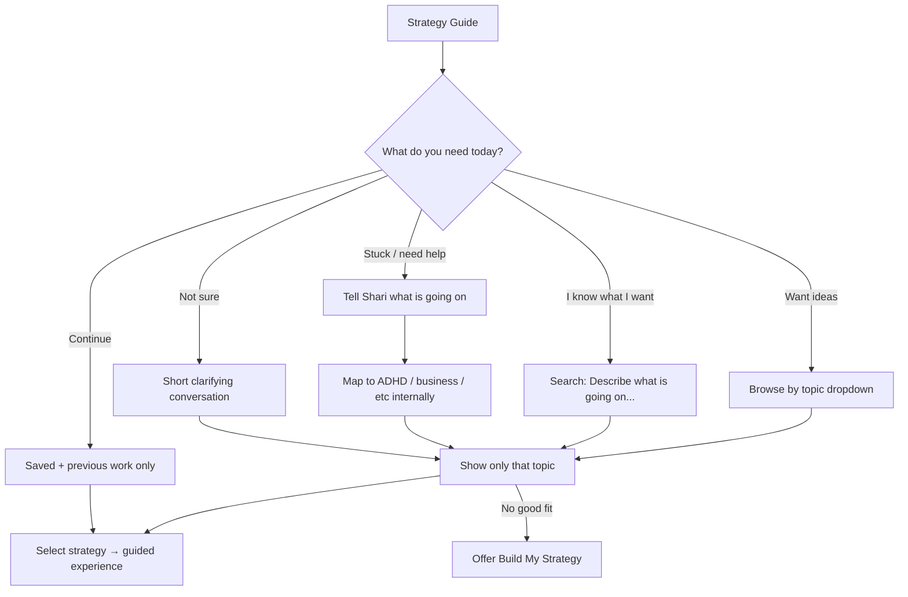

# Strategy Experience Simplification & Concierge Redesign (179)

**Status:** Proposal only · **Do not implement** until reviewed and approved · **Do not deploy**

**Philosophy:** Hide the library. Expose the guidance. Strategy Library stays the knowledge source; Shari becomes the concierge.

---

## 1. Current navigation flow

| Step | Exact label | Wiring |
|------|-------------|--------|
| Welcome Home category | **Get Advice** | `welcomeHomeNavigationStructure.ts` → `get-advice` |
| Destination | **Strategy Library** | id `strategy-library` |
| Opener | `openStrategyLibraryCore()` | CPC + `EstateRoomExperienceMenu` |
| Section | `playbook` | Full-bleed `StrategyLibraryEstatePanel` → `StrategiesPanel` |

**Other entries:** hard-nav chat (“Opening Strategies.”), intent gate strategy modes, How Do I → playbook, Create estate “Strategy” card (opens business browse — not guided create), Create catalog Strategies (Universal Create — parallel product).

**Exit:** ← Previous Screen · outside dismiss · detail → list → home → leave.

---

## 2. Current screen inventory (first paint)

**Title:** ADHD Entrepreneur Strategy Library  
**Subtitle:** A calm place to find, tailor, or build a strategy — then connect it to real action.

Competing elements on arrival (estate home):

1. How Do I… (collapsed)  
2. Suggested path banner  
3. **Four mode cards** (Problem / Explore / Build / Continue)  
4. **Count pills** — ADHD Strategies (N) · Business Strategies (N) · Recommended (N) · Saved (N)  
5. Display-only topic sentence (12 labels, not clickable)  
6. Search (`Search by problem — e.g. "I can't get started" or "sales"`)  
7. **Eight Popular Strategies** cards  
8. **Build My Strategy** CTA block  
9. Four hub accordion headers (ADHD / Business / Situations / Saved) — collapsed but still visible  

**Catalog scale (behind the scenes):** ~52 builtin strategies · 42 recommended flags · 20 categories · 8 popular · 10 situation atlas rows.

**Views:** home · adhd · business · group · recommended · saved · new (guided create) · strategy detail.

---

## 3. Duplicated sections

| Overlap | Surfaces |
|---------|----------|
| Browse | Mode Explore + count pills + Popular + hub ADHD/Business + topic browse + CoachingLibraryPicker |
| Recommended | Count pill + situation hub + Apply → “Recommended for you” (different data models) |
| Build | Mode “Build My Own” → guided create **vs** big **Build My Strategy** → business chat dock |
| Create vs Library | Create catalog Strategies + Create estate Strategy card + Library builders |
| Continue | Resume mode + Saved list + apply session store + Create’s own Continue drafts |

---

## 4. Unnecessary visible decisions (arrival)

The user must scan **modes + counts + search + 8 popular cards + build CTA + 4 accordion headers** before stating a need.

Critical mismatches with package 179 intent:

- **“I Have a Problem”** jumps to a Recommended **list**, not “Tell Shari what’s going on.”  
- **Build My Strategy** is advertised immediately (should only appear when no fit).  
- Counts are implementation details, not decisions.  
- Two different “build” metaphors on one screen.

---

## 5. Recommended simplified flow

### Opening (replace wall)

**Strategy Guide**  
> Let's figure out what will help most today.

**One control — What do you need today?** (dropdown)

| Option | Behavior |
|--------|----------|
| I'm stuck and need help | Conversation: “Tell Shari what's going on.” Infer category; never ask user to pick ADHD vs Business first |
| I want ideas | One dropdown: Browse by topic → show only that topic |
| I know what I'm looking for | Search placeholder: “Describe what's going on...” (keep NL mapping) |
| Continue where I left off | Saved strategies + continue previous work only — no education |
| I'm not sure | Short conversation to determine strategy kind |

Hide by default: count pills, accordion families, popular card wall, Build CTA.

**Popular right now:** compact list/dropdown · max **5** · See More on request.

**Build My Strategy:** only after “I don't think an existing strategy is quite right… Would you like us to build one together?”

**Library accordions:** only after topic selected, search run, or explicit “Browse the library.”

---

## 6. Revised information architecture

| Layer | Member sees | System keeps |
|-------|-------------|--------------|
| Entrance | Strategy Guide + one need dropdown | Full Strategy Library catalog |
| Path | Conversation / topic / search / resume | Situation atlas, counts, categories |
| Results | One topic list or search hits (progressive) | ADHD/Business hubs, recommended flags |
| Detail | Guided strategy experience immediately | `strategyDetailTemplate`, apply session |
| Create | Offered only when no fit | Guided create + business builder (unify later) |
| Save | Resume path surfaces saved + apply session | `userStrategies` + `strategyApplySessionStore` |

**Decision fatigue rule:** one primary decision per screen. Every screen answers: What is this? What next? Why use this?

---

## 7. Naming recommendations (no branding change without approval)

| Surface | Current | Recommendation |
|---------|---------|----------------|
| In-room H1 | ADHD Entrepreneur Strategy Library | **Strategy Guide** (member-facing) |
| Welcome Home | Strategy Library | Keep **Strategy Library** *or* align to **Strategy Guide** for consistency |
| Hard-nav | Opening Strategies. | Align to Guide/Library choice |
| Internal | Strategy Library / `playbook` | Keep internal name |

**Preferred member title:** Strategy Guide  
**Acceptable alternate:** Find the Right Strategy  
**Avoid as primary chrome:** Strategy Concierge (internal metaphor only)  
**Keep for How Do I / SEO clarity:** ADHD Entrepreneur Strategy Library as subtitle or Learn More only

---

## 8. Files requiring modification (when approved)

| Area | Files |
|------|--------|
| Estate entrance / home | `components/companion/StrategiesPanel.tsx`, `StrategyLibraryEstatePanel.tsx` |
| Copy / modes | `lib/strategyLibrary/estateCopy.ts` |
| Search / popular / counts | `lib/strategyIntelligence.ts` (behavior mostly keep; UI hide) |
| Guided create gate | `StrategyGuidedCreatePanel.tsx`, `lib/strategyLibrary/guidedCreate.ts` |
| Business builder entry | `BusinessStrategyDock.tsx` (defer expose) |
| Catalog / hubs | `lib/strategyCatalog.ts`, `lib/strategySystem.ts` (data stay) |
| Saved / resume | `lib/userStrategies.ts`, `lib/strategyApplySessionStore.ts` |
| Create overlap (later) | `CreateEstateEntrancePanel.tsx`, `lib/createCatalogData.ts` Strategies |
| Nav labels (if renamed) | `welcomeHomeNavigationStructure.ts`, hard-nav, How Do I |
| Tests | strategy library estate / discoverability / guided create contracts |
| Docs | This proposal → future 179 implementation report |

---

## 9. Screenshots / preview

| Item | Status |
|------|--------|
| Before screenshots | Capture authenticated Get Advice → Strategy Library first paint (current dense home) |
| After screenshots | After implementation approval |
| Authenticated preview URL | `http://localhost:3000/companion` → Welcome Home → Get Advice → Strategy Library |

*(No before/after screenshots attached in this proposal pass — capture during review.)*

---

## 10. Deploy recommendation

**Do not deploy.**  
**Do not implement** until founder approves:

1. Member-facing title (**Strategy Guide** vs keep Library)  
2. First-question dropdown options and wording  
3. Deferring Build My Strategy behind no-fit offer  
4. Unifying “Problem” path into conversation (not Recommended list)  
5. Hiding counts / accordion wall on arrival  

Preserve Strategy Library data and guided apply engines; change **entrance IA and conversation flow** only in the first implementation slice.

---

## Naming review summary

| Option | Verdict |
|--------|---------|
| Strategy Guide | **Recommended** — calm, action-oriented |
| Find the Right Strategy | Good secondary / How Do I title |
| Strategy Concierge | Philosophy, not chrome |
| Let's Find What Will Help | Soft; better as subtitle |
| ADHD Entrepreneur Strategy Library | Keep as internal / Learn More identity |

---

## Runtime behavior (post-selection — preserve)

Once a strategy is selected: launch guided experience immediately — brief explain · tailor · implement · save · pause/resume · connect to Projects/Reminders only when appropriate. Do not leave users on informational dead ends.

---

*Package prompt: `docs/navigation/179_CURSOR_STRATEGY_EXPERIENCE_SIMPLIFICATION_AND_CONCIERGE_REDESIGN.md`*
